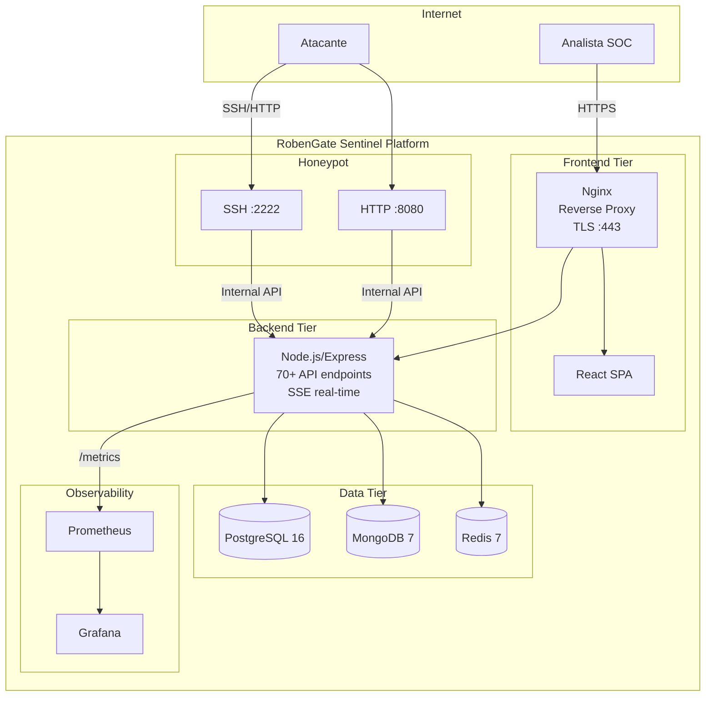
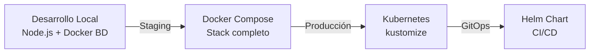

# DOCUMENTACIÓN MAESTRA — RobenGate Sentinel

**Versión:** 2.0.0  
**Fecha:** Junio 2026  
**Clasificación:** Público  
**Repositorio:** [github.com/Robensonl/robengate-sentinel](https://github.com/Robensonl/robengate-sentinel)

---

> **RobenGate Sentinel** es una plataforma enterprise de ciberseguridad de código abierto que integra SIEM, SOC, Honeypot, SOAR, Threat Intelligence y análisis de IA en una solución cohesionada, desplegable desde un VPS hasta Kubernetes.

---

## Tabla de Contenidos

1. [Resumen del Proyecto](#1-resumen-del-proyecto)
2. [Stack Tecnológico](#2-stack-tecnológico)
3. [Arquitectura del Sistema](#3-arquitectura-del-sistema)
4. [Módulos y Funcionalidades](#4-módulos-y-funcionalidades)
5. [API Reference](#5-api-reference)
6. [Base de Datos](#6-base-de-datos)
7. [Infraestructura y Despliegue](#7-infraestructura-y-despliegue)
8. [Seguridad](#8-seguridad)
9. [Monitorización y Observabilidad](#9-monitorización-y-observabilidad)
10. [Operaciones](#10-operaciones)
11. [Roadmap de Negocio](#11-roadmap-de-negocio)
12. [Índice de Documentación](#12-índice-de-documentación)

---

## 1. Resumen del Proyecto

### ¿Qué es RobenGate Sentinel?

RobenGate Sentinel es una **plataforma de ciberseguridad enterprise de código abierto** que combina:

| Capacidad | Descripción |
|---|---|
| **SIEM** | Correlación de eventos de seguridad en tiempo real |
| **SOC** | Dashboard completo para operaciones de seguridad |
| **Honeypot** | Trampa SSH + HTTP para capturar atacantes |
| **SOAR** | Automatización de respuesta con playbooks |
| **Threat Intelligence** | Gestión de IOCs y feeds de amenazas |
| **Risk Engine** | Evaluación adaptativa de riesgo con 10+ señales |
| **AI Correlation** | Análisis heurístico de patrones de ataque |
| **Audit Trail** | Registro completo de auditoría con MongoDB |

### Características Técnicas Destacadas

```
✅ Autenticación: JWT (15min) + Refresh (7d) + WebAuthn/FIDO2 + TOTP/MFA
✅ RBAC: 4 roles (admin > analyst > responder > viewer)
✅ Security Score: 85/100 OWASP SAMM Level 4
✅ APIs: 70+ endpoints RESTful documentados
✅ Tiempo real: Server-Sent Events (SSE)
✅ BD: PostgreSQL + MongoDB + Redis (polyglot persistence)
✅ Infra: Docker Compose + Kubernetes + Helm
✅ Monitoring: Prometheus + Grafana + Alertmanager
✅ Honeypot: SSH :2222 + HTTP :8080
✅ Zero-Trust: Pending token para MFA, IP ban automático
```

### Estado del Proyecto (Junio 2026)

| Módulo | Estado |
|---|---|
| Autenticación completa | ✅ Producción |
| RBAC 4 roles | ✅ Producción |
| SIEM + Correlación | ✅ Producción |
| Risk Engine | ✅ Producción |
| Honeypot SSH + HTTP | ✅ Producción |
| SOAR + Playbooks | ✅ Producción |
| Threat Intelligence | ✅ Producción |
| Multi-tenancy | ✅ Producción |
| AI Correlation | ⚠️ Heurístico (ML real en roadmap) |
| Dashboard métricas | ⚠️ Parcialmente simulado |
| Agentes EDR | ⚠️ Implementación básica |
| SMS MFA | ⚠️ Parcial (Twilio no configurado en dev) |

---

## 2. Stack Tecnológico

### Backend
```
Runtime:     Node.js 20 LTS
Framework:   Express.js 4.x
Seguridad:   Helmet, CORS, HPP, bcrypt(12), JWT HS256
Auth:        @simplewebauthn/server, jsonwebtoken, otp
BD:          pg (PostgreSQL 16), Mongoose (MongoDB 7), ioredis (Redis 7)
Monitoring:  prom-client (Prometheus metrics)
Logs:        Winston (structured logging)
Email:       Nodemailer (MFA OTP)
Búsqueda:    Elasticsearch client (opcional)
```

### Frontend
```
Framework:   React 19 + Vite 5
Estilos:     Tailwind CSS 4
Estado:      Zustand 5, React Context
Routing:     React Router DOM 7
Forms:       React Hook Form 7 + Zod 4
Charts:      Recharts 3
Maps:        react-simple-maps + D3-Geo (Attack Map)
Auth:        @simplewebauthn/browser
HTTP:        Axios 1.x (interceptors JWT)
Notif:       Sonner (toast), custom SSE handler
```

### Infraestructura
```
Containers:  Docker 24, Docker Compose 2.x
Orquestación: Kubernetes 1.29+, Helm 3.x
Proxy:       Nginx 1.25 (TLS 1.2/1.3, HSTS)
BD Relacional: PostgreSQL 16 (13 migraciones)
BD Documental: MongoDB 7 (TTL indexes, auth)
Caché:       Redis 7 (AOF persistence)
Monitoring:  Prometheus + Grafana + Alertmanager
```

---

## 3. Arquitectura del Sistema

### Diagrama de Alto Nivel



### Capas de Seguridad (Defense in Depth)

```
Capa 1: Red — TLS 1.2/1.3, HSTS, CORS estricto
Capa 2: Rate Limiting — Redis sliding window, auto-ban
Capa 3: Autenticación — JWT + MFA + WebAuthn + bcrypt(12)
Capa 4: Autorización — RBAC 4 roles, readOnly() middleware
Capa 5: Sanitización — HPP, NoSQL injection, null-byte
Capa 6: Detección — Risk Engine + Detection + Correlation + AI
Capa 7: Auditoría — MongoDB audit trail + SSE alerts
```

---

## 4. Módulos y Funcionalidades

### Módulos del Backend (22 archivos de rutas/controladores)

| Módulo | Ruta | Estado | Descripción |
|---|---|---|---|
| Autenticación | `/api/auth` | ✅ | Login, MFA, WebAuthn, refresh |
| Usuarios | `/api/users` | ✅ | CRUD usuarios, perfil |
| RBAC | Middleware | ✅ | 4 roles, readOnly() |
| Security Logs | `/api/logs` | ✅ | SIEM, filtros avanzados |
| Alertas | `/api/alerts` | ✅ | Gestión de alertas |
| Incidentes | `/api/incidents` | ✅ | Gestión + escalado |
| Vulnerabilidades | `/api/vulnerabilities` | ✅ | CVE inventory |
| Threat Intel | `/api/threats` | ✅ | IOCs, indicadores |
| Honeypot | `/api/honeypot` | ✅ | Eventos SSH/HTTP |
| AI Analysis | `/api/ai` | ✅ | Correlación heurística |
| Attack Map | `/api/attack-map` | ✅ | Geolocalización ataques |
| Playbooks SOAR | `/api/playbooks` | ✅ | Automatización respuesta |
| Organizations | `/api/organizations` | ✅ | Multi-tenancy |
| Agents EDR | `/api/agents` | ⚠️ | Gestión agentes endpoint |
| Ingestion | `/api/ingest` | ✅ | Pipeline de eventos |
| Search | `/api/search` | ✅ | Elasticsearch full-text |
| Audit | `/api/audit` | ✅ | Audit trail completo |
| Stats | `/api/stats` | ⚠️ | Métricas dashboard |
| Sessions | `/api/sessions` | ✅ | Gestión sesiones activas |
| Devices | `/api/devices` | ✅ | Dispositivos confiables |
| Metrics | `/metrics` | ✅ | Prometheus endpoint |
| Health | `/health`, `/ready` | ✅ | Health checks |

### Módulos del Frontend (11 feature modules)

| Módulo | Páginas | Acceso Mínimo |
|---|---|---|
| `auth/` | Login, Register, MFA, WebAuthn, ForgotPassword | Público |
| `dashboard/` | Dashboard SOC | viewer |
| `security/` | Logs, Audit, Honeypot, ThreatIntel, ThreatHunting | viewer/analyst |
| `alerts/` | Gestión de alertas | viewer |
| `incidents/` | Gestión de incidentes | viewer |
| `attackmap/` | Mapa de ataques geolocalizados | viewer |
| `ai/` | AI Analysis | viewer |
| `vulnerabilities/` | CVE inventory | viewer |
| `users/` | Usuarios, Dispositivos, Sesiones | viewer/analyst |
| `landing/` | Landing page pública | Público |
| `marketing/` | Arquitectura, DB diagrams, Business card | Público |

### Servicios del Backend (22 servicios)

| Servicio | Descripción | Estado |
|---|---|---|
| `authService` | JWT, bcrypt, MFA, sesiones | ✅ Real |
| `webAuthnService` | FIDO2/WebAuthn complete | ✅ Real |
| `riskEngine` | 10+ señales comportamentales | ✅ Real |
| `detectionEngine` | Detección patrones en tiempo real | ✅ Real |
| `correlationEngine` | Correlación ventana temporal | ✅ Real |
| `aiCorrelationEngine` | Heurística IA, anomalías | ✅ Real (heurístico) |
| `soarEngine` | Playbooks automatizados | ✅ Real |
| `auditService` | MongoDB write + SSE emit | ✅ Real |
| `banService` | Auto-ban PostgreSQL + Redis | ✅ Real |
| `honeypotService` | Procesamiento eventos honeypot | ✅ Real |
| `geoService` | Geolocalización MaxMind | ✅ Real |
| `elasticsearchService` | Full-text search | ✅ Real |
| `ingestion/pipeline` | Pipeline normalización + enriquecimiento | ✅ Real |
| `metricsService` | prom-client Prometheus | ✅ Real |
| `endpointAgentService` | Agentes EDR básico | ⚠️ Parcial |

---

## 5. API Reference

### Convenciones

```
Base URL:          https://api.dominio.com
Auth:              Authorization: Bearer <access_token>
Content-Type:      application/json
Respuesta éxito:   {"success": true, "data": {...}}
Respuesta error:   {"success": false, "error": "mensaje"}
```

### Grupos de Endpoints (102 endpoints totales)

| Grupo | Prefijo | Endpoints | Auth Mínima |
|---|---|---|---|
| Autenticación | `/api/auth` | 12 | Público / JWT |
| WebAuthn | `/api/auth/webauthn` | 4 | Público / JWT |
| Usuarios | `/api/users` | 8 | analyst |
| Dispositivos | `/api/devices` | 4 | viewer |
| Sesiones | `/api/sessions` | 3 | viewer |
| Logs | `/api/logs` | 3 | viewer |
| Alertas | `/api/alerts` | 6 | viewer |
| Incidentes | `/api/incidents` | 8 | viewer |
| Vulnerabilidades | `/api/vulnerabilities` | 6 | viewer |
| Estadísticas | `/api/stats` | 4 | viewer |
| Threat Intel | `/api/threats` | 6 | analyst |
| Auditoría | `/api/audit` | 3 | analyst |
| Honeypot | `/api/honeypot` | 3 | analyst |
| Organizaciones | `/api/organizations` | 5 | admin |
| Playbooks | `/api/playbooks` | 6 | analyst |
| Búsqueda | `/api/search` | 2 | analyst |
| Agentes EDR | `/api/agents` | 5 | analyst |
| Ingesta | `/api/ingest` | 2 | internalAuth |
| Attack Map | `/api/attack-map` | 3 | viewer |
| AI | `/api/ai` | 4 | analyst |
| Métricas/Salud | `/metrics`, `/health`, `/ready` | 3 | Público |
| SSE | `/api/events` | 1 | viewer |
| Internal | `/internal` | 1 | X-Internal-Secret |

📄 **Referencia completa:** [docs-es/project-inventory/api-inventory.md](project-inventory/api-inventory.md)

---

## 6. Base de Datos

### Arquitectura Polyglot Persistence

| BD | Versión | Rol | Datos |
|---|---|---|---|
| PostgreSQL | 16 | Principal relacional | Usuarios, sesiones, incidentes, logs |
| MongoDB | 7 | Documental | Audit trail, threat indicators, eventos |
| Redis | 7 | Caché / Sesiones | JWT blacklist, MFA OTPs, rate limiting |

### Tablas PostgreSQL (13 migraciones aplicadas)

| Tabla | Registros esperados | Descripción |
|---|---|---|
| `users` | 5-500 | Usuarios del sistema |
| `devices` | Varios por user | Dispositivos registrados |
| `sessions` | Activas actualmente | Sesiones activas |
| `refresh_tokens` | Activos + revocados | Historial de tokens |
| `mfa_codes` | TTL corto | Códigos OTP temporales |
| `security_logs` | Millones | Logs de seguridad |
| `incidents` | Decenas-miles | Incidentes de seguridad |
| `vulnerabilities` | Cientos-miles | CVE inventory |
| `banned_ips` | Variable | IPs baneadas |
| `organizations` | 1-100+ | Organizaciones (multi-tenancy) |
| `playbooks` | Decenas | Playbooks SOAR |
| `audit_logs` | Millones | Audit trail |

### Colecciones MongoDB

| Colección | TTL | Descripción |
|---|---|---|
| `security_logs` | 90 días | Eventos de seguridad (alta frecuencia) |
| `threat_indicators` | Configurable | IOCs, indicadores de amenaza |
| `audit_events` | Configurable | Eventos de auditoría HIGH/CRITICAL |

### Claves Redis

| Patrón | TTL | Propósito |
|---|---|---|
| `jwt:blacklist:<jti>` | Token expiry | Tokens invalidados |
| `mfa:<userId>` | 5 min | Códigos MFA |
| `ban:<ip>` | Configurable | IPs baneadas |
| `ratelimit:<ip>:<route>` | 1 min | Rate limiting |

📄 **Esquema completo:** [docs-es/project-inventory/database-inventory.md](project-inventory/database-inventory.md)

---

## 7. Infraestructura y Despliegue

### Modos de Despliegue



### Inicio Rápido — Desarrollo

```bash
# 1. Clonar
git clone https://github.com/Robensonl/robengate-sentinel.git
cd robengate-sentinel

# 2. Iniciar infraestructura Docker
.\dev-start.ps1   # Windows
# o
docker compose -f infra/docker/docker-compose.yml \
               -f infra/docker/docker-compose.dev.yml \
               --env-file infra/docker/.env.dev \
               up postgres mongodb redis -d

# 3. Configurar y arrancar backend
cd backend && cp .env.example .env && npm install && npm run dev

# 4. Configurar y arrancar frontend
cd ../frontend && npm install && npm run dev

# ✅ Frontend: http://localhost:5173
# ✅ Backend:  http://localhost:5000
# ✅ Health:   http://localhost:5000/health
```

### Despliegue Producción — Docker Compose

```bash
# 1. Generar secretos reales
JWT_SECRET=$(openssl rand -base64 64)
# ... (ver docs-es/operations/03-deployment-guide.md)

# 2. Configurar TLS
# Certificados en: infra/nginx/ssl/

# 3. Desplegar
./infra/scripts/deploy.sh production

# 4. Verificar
curl https://tudominio.com/health
```

### Kubernetes / Helm

```bash
# Kustomize
kubectl apply -k k8s/overlays/prod/

# Helm
helm install robengate-sentinel ./helm/robengate-sentinel \
  --namespace robengate-sentinel --create-namespace
```

📄 **Guía completa:** [docs-es/operations/03-deployment-guide.md](operations/03-deployment-guide.md)  
📄 **Kubernetes:** [docs-es/infrastructure/kubernetes.md](infrastructure/kubernetes.md)

### Variables de Entorno Críticas

| Variable | Descripción |
|---|---|
| `JWT_SECRET` | Secreto access tokens (256+ bits) |
| `JWT_REFRESH_SECRET` | Secreto refresh tokens (256+ bits) |
| `INTERNAL_API_SECRET` | Comunicación interna honeypot→backend |
| `DB_PASSWORD` | PostgreSQL password |
| `MONGO_ROOT_PASSWORD` | MongoDB password |
| `REDIS_PASSWORD` | Redis password |
| `CLIENT_URL` | URL frontend (CORS whitelist) |

📄 **Referencia completa:** [docs-es/infrastructure/environment-variables.md](infrastructure/environment-variables.md)

---

## 8. Seguridad

### Score de Seguridad (Post-Auditoría Mayo 2026)

| Dimensión | Score |
|---|---|
| Autenticación | 91/100 |
| Backend API | 91/100 |
| Frontend | 87/100 |
| Infraestructura | 82/100 |
| Secretos | 83/100 |
| Logging/Auditoría | 78/100 |
| **Score Global** | **85/100** |

**Estándar:** OWASP SAMM 2.0 Level 4

### Características de Seguridad Clave

```
Autenticación:
  ✅ bcrypt work factor 12
  ✅ JWT access (15min) + refresh (7d) con rotación
  ✅ JWT blacklist por JTI en Redis
  ✅ WebAuthn/FIDO2 passkeys
  ✅ TOTP (Google Authenticator)
  ✅ MFA por email con OTP Redis TTL 5min
  ✅ Tokens en memoria (NO localStorage)
  ✅ Zero-Trust MFA (pending token)

Red y Headers:
  ✅ TLS 1.2/1.3 (Mozilla Modern Profile)
  ✅ HSTS 2 años, includeSubDomains, preload
  ✅ Content-Security-Policy estricta
  ✅ X-Frame-Options: DENY
  ✅ CORS con whitelist estricta

Protección de Ataques:
  ✅ Rate limiting (Redis sliding window)
  ✅ IP auto-ban (50+ fallos/15min)
  ✅ HPP (HTTP Parameter Pollution)
  ✅ NoSQL injection prevention
  ✅ Attack detection middleware
  ✅ /internal/ bloqueado desde internet
```

📄 **Auditoría completa:** [docs/SECURITY_AUDIT_REPORT.md](../docs/SECURITY_AUDIT_REPORT.md)  
📄 **Inventario seguridad:** [docs-es/project-inventory/security-inventory.md](project-inventory/security-inventory.md)

---

## 9. Monitorización y Observabilidad

### Stack de Observabilidad

| Herramienta | Puerto | Propósito |
|---|---|---|
| Prometheus | 9090 | Recolección y almacenamiento de métricas |
| Grafana | 3000 | Dashboards y visualización |
| Alertmanager | 9093 | Gestión y routing de alertas |

### Iniciar Monitorización

```bash
docker compose -f monitoring/docker-compose.monitoring.yml up -d

# Acceso:
# Prometheus:   http://localhost:9090
# Grafana:      http://localhost:3000  (admin/admin)
# Alertmanager: http://localhost:9093
```

### Métricas Clave Expuestas

```promql
# Disponibilidad API
up{job="robengate-backend"}

# Error rate
rate(http_requests_total{status=~"5.."}[5m]) / rate(http_requests_total[5m])

# Latencia P95
histogram_quantile(0.95, rate(http_request_duration_seconds_bucket[5m]))

# Intentos de login fallidos
rate(login_attempts_total{status="failed"}[5m])

# IPs baneadas
banned_ips_total
```

📄 **Guía completa:** [docs-es/operations/06-monitoring-guide.md](operations/06-monitoring-guide.md)  
📄 **Stack detallado:** [docs-es/infrastructure/monitoring-stack.md](infrastructure/monitoring-stack.md)

---

## 10. Operaciones

### Documentación Operacional

| Guía | Documento | Descripción |
|---|---|---|
| Instalación | [01-installation-guide.md](operations/01-installation-guide.md) | Setup completo paso a paso |
| Desarrollo | [02-development-guide.md](operations/02-development-guide.md) | Flujo de trabajo dev |
| Despliegue | [03-deployment-guide.md](operations/03-deployment-guide.md) | Docker/K8s/Helm |
| Producción | [04-production-guide.md](operations/04-production-guide.md) | Operaciones diarias |
| Troubleshooting | [05-troubleshooting-guide.md](operations/05-troubleshooting-guide.md) | Problemas comunes |
| Monitorización | [06-monitoring-guide.md](operations/06-monitoring-guide.md) | Prometheus + Grafana |
| Backup | [07-backup-guide.md](operations/07-backup-guide.md) | Estrategia de backups |
| Recuperación | [08-recovery-guide.md](operations/08-recovery-guide.md) | Disaster recovery |
| Actualización | [09-upgrade-guide.md](operations/09-upgrade-guide.md) | Procedimiento upgrade |

### Comandos de Gestión Rápida

```bash
# Ver estado de servicios
docker compose ps

# Logs en tiempo real
docker compose logs -f backend

# Backup de emergencia
./infra/scripts/backup.sh ./backups/

# Crear admin
docker compose exec backend node scripts/manage-admins.js create \
  --email admin@empresa.com --name "Admin" --password "pass"

# Health check
curl http://localhost:5000/health
curl http://localhost:5000/ready
```

---

## 11. Roadmap de Negocio

### Estado Actual (v2.0 — Junio 2026)
- **Production-ready demo** con security score 85/100
- Todas las funcionalidades core implementadas
- Documentación enterprise-grade completa
- Kubernetes + Helm + Prometheus disponibles

### Próximas Versiones

| Versión | Trimestre | Highlights |
|---|---|---|
| v2.1 | Q3 2026 | Tests completos, CI/CD GitHub Actions |
| v2.5 | Q4 2026 | VirusTotal, LDAP/AD, Webhooks SOAR |
| v3.0 | Q1 2027 | ML real, API pública, Mobile app |
| v3.5 | Q2 2027 | SaaS multi-tenant, Marketplace reglas |

### Visión de Producto
> Democratizar la seguridad enterprise para organizaciones de cualquier tamaño, ofreciendo capacidades SIEM/SOC de nivel Fortune 500 a un costo 90% menor.

📄 **Visión completa:** [docs-es/business/vision-producto.md](business/vision-producto.md)  
📄 **Estrategia SaaS:** [docs-es/business/estrategia-saas.md](business/estrategia-saas.md)

---

## 12. Índice de Documentación

### `docs-es/` — Documentación Española (Principal)

#### Auditoría de Documentación
- [01-existing-documentation.md](documentation-audit/01-existing-documentation.md)
- [02-missing-documentation.md](documentation-audit/02-missing-documentation.md)
- [03-duplicate-documentation.md](documentation-audit/03-duplicate-documentation.md)
- [04-outdated-documentation.md](documentation-audit/04-outdated-documentation.md)
- [05-documentation-roadmap.md](documentation-audit/05-documentation-roadmap.md)

#### Inventario del Proyecto
- [system-overview.md](project-inventory/system-overview.md) — Visión general completa
- [backend-inventory.md](project-inventory/backend-inventory.md) — Rutas, servicios, middleware
- [frontend-inventory.md](project-inventory/frontend-inventory.md) — Módulos, componentes, hooks
- [database-inventory.md](project-inventory/database-inventory.md) — Esquemas, colecciones, Redis
- [api-inventory.md](project-inventory/api-inventory.md) — Todos los endpoints (102)
- [security-inventory.md](project-inventory/security-inventory.md) — Modelo de seguridad completo
- [infrastructure-inventory.md](project-inventory/infrastructure-inventory.md) — Docker, K8s, Helm
- [deployment-inventory.md](project-inventory/deployment-inventory.md) — Guías por modo de despliegue

#### Arquitectura
- [arquitectura-sistema.md](architecture/arquitectura-sistema.md) — Arquitectura de alto nivel
- [flujo-autenticacion.md](architecture/flujo-autenticacion.md) — JWT, MFA, WebAuthn (sequence diagrams)
- [flujo-rbac.md](architecture/flujo-rbac.md) — Sistema de roles y permisos

#### Infraestructura
- [environment-variables.md](infrastructure/environment-variables.md) — Todas las variables de entorno
- [kubernetes.md](infrastructure/kubernetes.md) — Manifests K8s + Helm completo
- [monitoring-stack.md](infrastructure/monitoring-stack.md) — Prometheus + Grafana + Alertmanager

#### Operaciones
- [01-installation-guide.md](operations/01-installation-guide.md)
- [03-deployment-guide.md](operations/03-deployment-guide.md)
- [05-troubleshooting-guide.md](operations/05-troubleshooting-guide.md)
- [06-monitoring-guide.md](operations/06-monitoring-guide.md)

#### Negocio
- [vision-producto.md](business/vision-producto.md)
- [estrategia-saas.md](business/estrategia-saas.md)

#### Módulos Específicos (existentes)
- [siem/resumen.md](siem/resumen.md)
- [honeypot/resumen.md](honeypot/resumen.md)
- [rbac/resumen.md](rbac/resumen.md)
- [ai-analysis/resumen.md](ai-analysis/resumen.md)
- [threat-intelligence/resumen.md](threat-intelligence/resumen.md)

### `docs/` — Documentación Inglesa

| Documento | Descripción |
|---|---|
| [SECURITY_AUDIT_REPORT.md](../docs/SECURITY_AUDIT_REPORT.md) | Auditoría OWASP completa (85/100) |
| [AUTHENTICATION_INTERNALS.md](../docs/AUTHENTICATION_INTERNALS.md) | JWT, MFA, WebAuthn internals |
| [SECURITY_HARDENING.md](../docs/SECURITY_HARDENING.md) | Guía de hardening |
| [DISASTER_RECOVERY_RUNBOOK.md](../docs/DISASTER_RECOVERY_RUNBOOK.md) | Runbook operacional |
| [ROBENGATE_SENTINEL_PLAN.md](../docs/ROBENGATE_SENTINEL_PLAN.md) | Plan original del proyecto |
| [final-audit/](../docs/final-audit/) | Auditoría final multi-dimensional |

---

## Contribución

Este proyecto sigue las guías de contribución en [CONTRIBUTING.md](../CONTRIBUTING.md).

```bash
# Setup para contribuir
git clone https://github.com/Robensonl/robengate-sentinel.git
git checkout -b feature/mi-feature develop
# ... hacer cambios ...
git push origin feature/mi-feature
# Abrir Pull Request hacia develop
```

## Licencia

Ver [LICENSE](../LICENSE).

---

*Documentación generada como parte del Sprint DOC-0 de la Auditoría de Documentación — Junio 2026.*  
*Para preguntas o correcciones, abrir un issue en el repositorio.*
