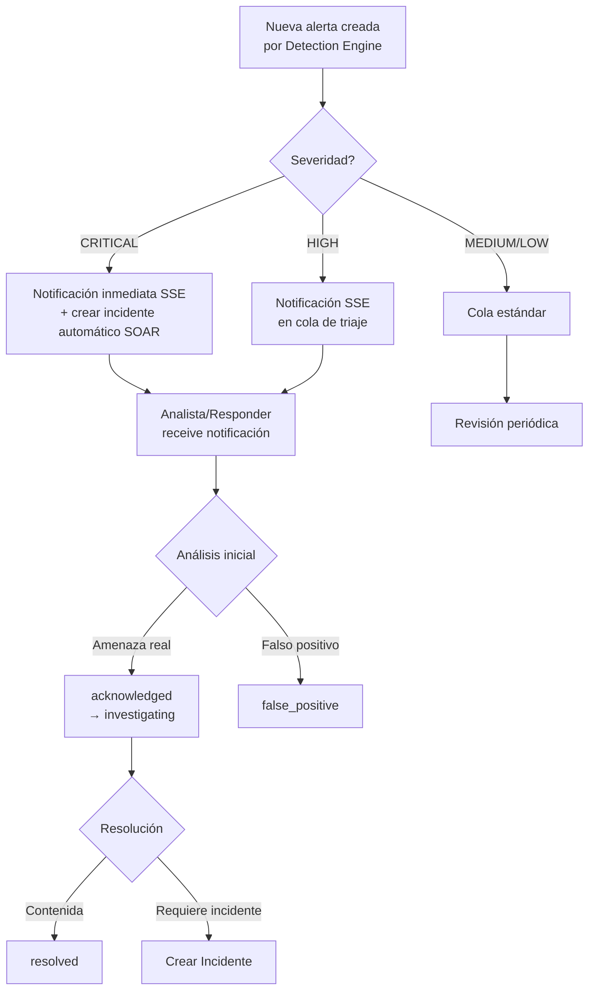

# Guía de Administrador — Gestión de Alertas

**Rol requerido:** `responder+` (actualización) / `viewer` (lectura)  

---

## Flujo de Triaje de Alertas


---

## Panel de Alertas

**Acceso:** Dashboard → Security → Alerts  

### Filtros Disponibles

| Filtro | Opciones |
|---|---|
| Severidad | critical / high / medium / low / info |
| Estado | new / acknowledged / investigating / resolved / false_positive |
| Rango de fechas | Desde - Hasta |
| IP origen | Texto libre |

### Columnas del Listado

- **ID** — Identificador único del log
- **Tipo** — event_type (BRUTE_FORCE_DETECTED, SQL_INJECTION_ATTEMPT, etc.)
- **Severidad** — Badge de color
- **IP** — Origen del ataque + bandera del país
- **Estado** — Estado de triaje actual
- **Fecha** — Timestamp del evento

---

## Proceso de Triaje (Paso a Paso)

### Paso 1: Identificar alertas críticas no atendidas

Filtrar por: `severity=critical` + `status=new`

### Paso 2: Analizar el contexto de la alerta

Revisar:
- **IP source** → ¿Está en la lista de IOCs? → Búsqueda `/api/search/ioc/<ip>`
- **Tipo de evento** → ¿Qué patrón de ataque?
- **Metadata** → Payload, endpoint objetivo, user-agent
- **País** → ¿Acceso esperado desde ese país?
- **Frecuencia** → ¿Cuántos eventos de esa IP en las últimas horas?

### Paso 3: Cambiar estado a acknowledged

```bash
PATCH /api/alerts/58432/status
{"status": "acknowledged"}
```

Esto confirma que la alerta fue vista y está bajo revisión.

### Paso 4: Investigar activamente

Buscar eventos relacionados en Security Logs:
```
GET /api/logs?ip=185.220.101.44&severity=high&from=<2h_ago>
```

Verificar si la IP tiene historial:
```
GET /api/search/ioc/185.220.101.44
```

```bash
PATCH /api/alerts/58432/status
{"status": "investigating"}
```

### Paso 5: Resolución

**Si es una amenaza real:**
1. Banear IP si no está baneada (ver guía de configuración)
2. Crear incidente si hay múltiples vectores o es de alto impacto
3. Marcar como `resolved`

**Si es un falso positivo:**
1. Documentar razón en el incidente o en notas
2. Considerar whitelist de IP si es un sistema legítimo
3. Marcar como `false_positive`

---

## Gestión Masiva de Alertas

### Bulk acknowledge (CLI/API)

Para gestionar grandes volúmenes de alertas del mismo tipo:

```bash
# Ejemplo: Marcar todas las alertas de IP conocida como false_positive
# (requiere script personalizado que llame al endpoint individualmente)
for id in $(curl -s "/api/logs?ip=8.8.8.8" | jq '.[].id'); do
  curl -X PATCH "/api/alerts/$id/status" \
    -d '{"status": "false_positive"}'
done
```

---

## Alertas por Tipo — Guía de Respuesta Rápida

### BRUTE_FORCE_DETECTED

**Severidad:** high  
**Respuesta:**
1. Verificar si la IP ya fue baneada (auto-ban se activa a 50+ intentos/15min)
2. Si no fue baneada, banear manualmente: `POST /internal/ban`
3. Verificar si alguna cuenta fue comprometida (revisar LOGIN_SUCCESS desde esa IP)
4. Si hay cuentas comprometidas → crear incidente

### SQL_INJECTION_ATTEMPT

**Severidad:** critical  
**Respuesta:**
1. Verificar el endpoint objetivo y el payload
2. Verificar si la inyección tuvo éxito (status_code = 200)
3. Banear IP inmediatamente
4. Reportar IOC: `POST /api/threats/report`
5. Crear incidente (siempre para SQLi)

### CREDENTIAL_STUFFING

**Severidad:** high  
**Respuesta:**
1. Identificar cuentas afectadas (LOGIN_SUCCESS de la IP atacante)
2. Bloquear cuentas comprometidas inmediatamente
3. Notificar a usuarios afectados
4. Banear IP
5. Crear incidente

### SUSPICIOUS_LOGIN

**Severidad:** medium  
**Respuesta:**
1. Verificar si el usuario reconoce el acceso
2. Si no reconoce → bloquear cuenta y contactar usuario
3. Si reconoce (viaje, VPN) → marcar como false_positive

### HONEYPOT_SSH_AUTH

**Severidad:** medium  
**Respuesta:**
1. Verificar si la IP ya está en IOCs
2. Si hitCount > 10 en el honeypot → reportar IOC
3. Si hitCount > 50 → banear IP
4. No es necesario crear incidente (actividad normal del honeypot)

---

## Configurar Notificaciones de Alertas

### Webhooks Salientes (por organización)

```bash
curl -X PATCH "/api/organizations/1" \
  -H "Authorization: Bearer ADMIN_TOKEN" \
  -H "Content-Type: application/json" \
  -d '{
    "webhook_url": "https://hooks.slack.com/services/xxx/yyy/zzz",
    "webhook_secret": "whsec_abc123"
  }'
```

El backend enviará una notificación HTTP POST firmada con HMAC cuando se genere una alerta crítica.

### Playbook SOAR para Auto-respuesta

Configurar un playbook para respuesta automática:

```json
{
  "name": "Auto-ban Critical Threats",
  "trigger_type": "threshold",
  "trigger_config": {
    "event_type": "BRUTE_FORCE_DETECTED",
    "threshold": 1
  },
  "actions": [
    {"type": "ban_ip", "duration_hours": 24},
    {"type": "create_incident", "severity": "high"},
    {"type": "notify_webhook", "url": "https://hooks.slack.com/..."}
  ]
}
```
