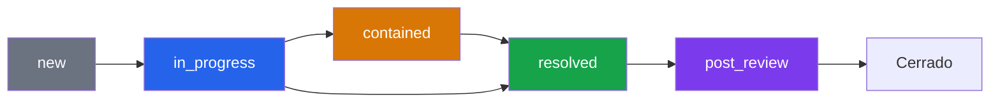

# Guía de Administrador — Gestión de Incidentes

**Rol requerido:** `analyst` (crear) / `responder` (actualizar)  

---

## Ciclo de Vida de un Incidente



---

## Crear un Incidente

**Cuándo crear un incidente:**
- Múltiples alertas relacionadas apuntan al mismo atacante/campaña
- Una alerta crítica requiere coordinación de equipo
- Un evento de seguridad afecta datos o servicios
- El SOAR Engine lo crea automáticamente via playbook

**Via UI:** Security → Incidents → "New Incident"

**Via API:**
```bash
curl -X POST "https://api.tudominio.com/api/incidents" \
  -H "Authorization: Bearer TOKEN" \
  -H "Content-Type: application/json" \
  -d '{
    "title": "DDoS Attack on Authentication Service",
    "summary": "Coordinated DDoS targeting /api/auth/login from multiple IPs. Rate limiting not sufficient.",
    "severity": "critical",
    "assignee": "Ana García",
    "tags": ["DDoS", "Authentication", "Service Disruption"],
    "tlp": "RED"
  }'
```

---

## Clasificación TLP — Cuándo Usar Cada Nivel

| TLP | Color | Cuándo Usar | Distribución |
|---|---|---|---|
| WHITE | ⚪ | Incidentes públicos, post-mortems publicables | Sin restricciones |
| GREEN | 🟢 | Información compartible con sector/comunidad | Sector específico |
| AMBER | 🟡 | Incidentes internos, no para terceros | Solo organización |
| RED | 🔴 | Incidentes críticos, información muy sensible | Solo equipo directo |

---

## Gestionar Timeline del Incidente

Cada actualización crea automáticamente una entrada en `incident_events`.

**Buenas prácticas para el timeline:**
- Actualizar el `summary` con cada avance significativo
- Documentar decisiones clave ("Se decidió no escalar porque...")
- Registrar acciones tomadas ("IP bloqueada en firewall externo")
- Anotar hora real de cada acción

**Actualizar incidente:**
```bash
curl -X PATCH "https://api.tudominio.com/api/incidents/1" \
  -H "Authorization: Bearer TOKEN" \
  -H "Content-Type: application/json" \
  -d '{
    "status": "contained",
    "summary": "Updated: DDoS traffic reduced to 5% of peak. Cloudflare Magic Transit engaged. Monitoring 30 more minutes before declaring resolved.",
    "assignee": "Ana García"
  }'
```

---

## Plantillas de Incidentes

### Template: DDoS

```json
{
  "title": "DDoS Attack — [Servicio Afectado]",
  "summary": "Volumetric DDoS targeting [endpoint]. Peak: [Xk req/s]. Started: [hora]. Source: [IPs/países].",
  "severity": "critical",
  "tags": ["DDoS", "Service Disruption"],
  "tlp": "RED"
}
```

### Template: Brute Force / Credential Stuffing

```json
{
  "title": "Credential Attack — [Servicio/Cuentas Afectadas]",
  "summary": "[N] login attempts from [IP/IPs]. [N] accounts compromised. Attack vector: [descripción].",
  "severity": "high",
  "tags": ["Brute Force", "Authentication"],
  "tlp": "AMBER"
}
```

### Template: SQL Injection

```json
{
  "title": "SQL Injection Attempt — [Endpoint]",
  "summary": "SQLi detected on [endpoint]. Payload: [payload]. Success: [yes/no]. Source IP: [IP].",
  "severity": "critical",
  "tags": ["SQLi", "Data Exfiltration Risk"],
  "tlp": "RED"
}
```

### Template: Malware / Ransomware

```json
{
  "title": "Malware Detected — [Host/Endpoint]",
  "summary": "Malware/C2 communication detected from [host]. IOC: [hash/IP]. Endpoint isolated: [yes/no].",
  "severity": "critical",
  "tags": ["Malware", "Endpoint"],
  "tlp": "RED"
}
```

---

## Escalado de Incidentes

### Cuándo Escalar

| Situación | Acción |
|---|---|
| Datos de usuarios comprometidos | Escalar a DPO + Legal + CISO |
| Servicio de producción caído > 1h | Escalar a CTO + Management |
| Posible ransomware | Aislar endpoint, escalar a CISO + Management |
| Incidente que afecta a otras organizaciones | Escalar a CERT/CSIRT nacional |
| Regulatorio (GDPR breach) | Notificar a AEPD en 72h |

### Notificación Regulatoria — GDPR

Si hay brecha de datos personales:
1. **Identificar** qué datos, cuántos afectados
2. **Contener** — revocar accesos, aislar sistemas
3. **Notificar** — AEPD en máximo 72h desde detección
4. **Documentar** — todo el timeline en el incidente (TLP AMBER/RED)

---

## Post-Incident Review

Una vez resuelto el incidente, moverlo a `post_review`:

```bash
PATCH /api/incidents/1
{"status": "post_review"}
```

**Checklist post-review:**
- [ ] Root cause identificada y documentada
- [ ] Lecciones aprendidas documentadas en el summary
- [ ] Playbooks actualizados si aplica
- [ ] Firewall/WAF rules añadidas
- [ ] IOCs reportados en Threat Intelligence
- [ ] Usuarios notificados si sus datos fueron afectados
- [ ] Reporte ejecutivo preparado (si aplica)

---

## Ver Incidentes por Severidad y Estado (Dashboard)

```bash
# Incidentes críticos activos
GET /api/incidents?severity=critical&status=in_progress

# Incidentes pendientes de revisión post-incidente
GET /api/incidents?status=post_review

# Todos los incidentes de esta semana
GET /api/incidents?from=2026-06-01T00:00:00Z
```
