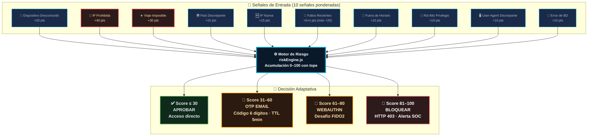
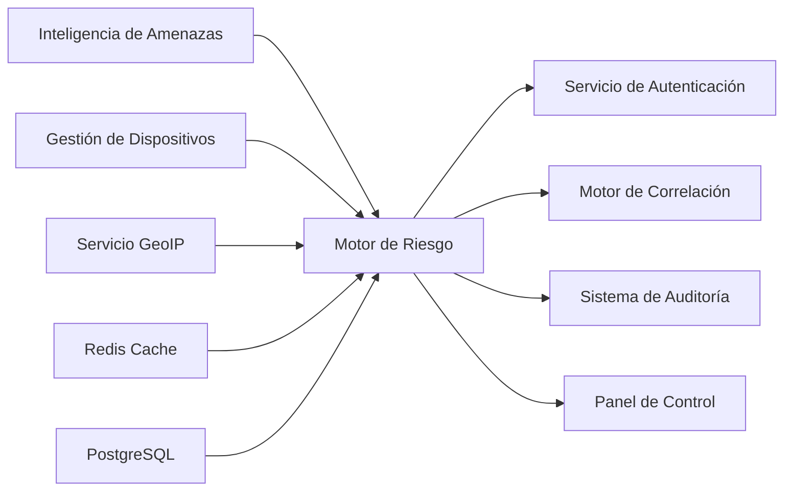

# Análisis de Inteligencia Artificial — RobenGate Sentinel

> **Clasificación:** INTERNO | **Capacidad:** Inteligencia de Riesgo y Análisis Conductual

---

## Resumen Ejecutivo

El módulo de Análisis de IA de RobenGate Sentinel proporciona **puntuación de riesgo interpretable, detección de anomalías en tiempo real y reconocimiento de patrones de ataque** sin depender de modelos de aprendizaje automático de caja negra. Cada puntuación de riesgo es **explicable y auditable**, lo que lo hace ideal para entornos SOC que requieren transparencia en las decisiones automatizadas.

A diferencia de las soluciones SIEM comerciales que usan ML opaco, RobenGate Sentinel emplea un **Motor de Riesgo basado en señales** donde cada señal tiene un peso definido, un umbral claro y una justificación auditable. Esto permite a los analistas SOC comprender exactamente por qué se bloqueó o escaló un intento de acceso.

---

## 1. Visión General

El módulo de Análisis de IA agrega telemetría de seguridad para proporcionar **inteligencia de riesgo, análisis conductual y reconocimiento de patrones de amenazas**. En lugar de modelos de ML de caja negra, RobenGate Sentinel utiliza **análisis de riesgo interpretable basado en señales** — cada puntuación de riesgo es explicable y auditable.

---

## 2. Arquitectura del Motor de Riesgo

El núcleo de la capacidad de Análisis de IA es el **Motor de Riesgo** (`riskEngine.js`), que calcula una puntuación de riesgo (0-100) para cada intento de autenticación y evento de acceso:



---

## Descripción Técnica

### 3. Señales de Riesgo

#### 3.1 Definición de Señales

| Señal | Puntuación | Lógica de Detección |
|-------|-----------|---------------------|
| **Dispositivo Desconocido** | +20 | Huella digital del dispositivo no está en la tabla `devices` para este usuario |
| **IP Prohibida** | +40 | La IP existe en la tabla `banned_ips` (sin expirar) |
| **Viaje Imposible** | +30 | País del último login ≠ país actual Y último login < 2 horas atrás |
| **País Discrepante** | +15 | País de la IP ≠ país registrado/habitual del usuario |
| **IP Nueva** | +15 | IP nunca vista antes para este usuario |
| **Fallos Recientes** | +5×n | N intentos fallidos de login desde esta IP en los últimos 15 min (máximo 4, +20 máx.) |
| **Acceso Fuera de Horario** | +10 | Login fuera de 06:00–22:00 UTC (configurable) |
| **Rol de Alto Privilegio** | +10 | El rol del usuario es `admin` |
| **Agente de Usuario Discrepante** | +10 | UA actual ≠ último UA registrado para este usuario |
| **Error de BD** | +10 | Imposible completar la búsqueda de riesgo (fallo seguro: añade riesgo ante la incertidumbre) |

#### 3.2 Matriz de Decisión de Riesgo

| Rango de Puntuación | Decisión | Acción |
|--------------------|---------|--------|
| 0–30 | `APROBAR` | Conceder acceso normalmente |
| 31–60 | `OTP_EMAIL` | Requerir OTP basado en email |
| 61–80 | `WEBAUTHN_REQUERIDO` | Requerir desafío FIDO2/Passkey |
| 81–100 | `BLOQUEAR` | Denegar acceso, registrar evento, alertar SOC |

#### 3.3 Registro de Auditoría de Puntuación de Riesgo

Cada evaluación de riesgo se almacena en la tabla PostgreSQL `risk_events`:

```sql
CREATE TABLE risk_events (
  id          SERIAL PRIMARY KEY,
  user_id     INTEGER REFERENCES users(id),
  ip_address  INET,
  risk_score  INTEGER,
  signals     JSONB,    -- Qué señales se activaron y sus puntuaciones
  decision    VARCHAR(30),
  created_at  TIMESTAMPTZ DEFAULT NOW()
);
```

Esto permite análisis forense: "¿Por qué fue bloqueado este usuario en este intento de login?"

---

## Arquitectura

### 4. Puntuación de Anomalía (Nivel de Amenaza en Vivo)

La **Puntuación de Anomalía** es una métrica compuesta normalizada (0-100) que representa el nivel de amenaza actual contra la plataforma:

```javascript
puntuacionAnomalía = normalizar(
  sumaPonderada([
    tasaAtaques   × 0.35,   // Ataques por minuto, últimos 5 min
    riesgoPromedio × 0.25,  // Puntuación de riesgo promedio de los últimos 50 intentos de auth
    tasaFallos    × 0.20,   // Tasa de fallos de login, últimos 15 min
    hitsHoneypot  × 0.10,   // Tasa de eventos de honeypot
    IPsBloqueadas × 0.10    // Recuento de IPs prohibidas activas
  ])
)
```

Esta puntuación se transmite al frontend vía SSE (`rt:anomaly`) cada 30 segundos, y activa:
- Indicador de riesgo en el panel de control
- Ajuste del umbral de severidad de alertas
- Modo de monitorización reforzada automática

---

## 5. Panel de Análisis de IA (`AIAnalysis.jsx`)

### 5.1 Disposición del Panel

```
┌─────────────────────────────────────────────────────────────────┐
│  INTELIGENCIA DE RIESGO                      Últimas 24h ▼      │
├──────────────┬──────────────┬──────────────┬───────────────────┤
│ Puntuación   │ Nivel de     │ Amenazas     │ IPs Bloqueadas    │
│ de Riesgo    │ Anomalía     │              │                   │
│   72 / 100   │   ALTO ⚠️   │   1.247      │     23 activas    │
├──────────────┴──────────────┴──────────────┴───────────────────┤
│ ANÁLISIS DE PATRONES DE ATAQUE       │ DISTRIBUCIÓN DE SEVERIDAD│
│ ░░░░░░░░░ Gráfico de área           │ ▒▒▒▒▒▒▒▒ Gráfico circular│
│ ataques a lo largo del tiempo       │ por nivel de severidad   │
│                                     │                          │
├─────────────────────────────────────┴──────────────────────────┤
│ PRINCIPALES ACTORES DE AMENAZA      │ MAPA GEOGRÁFICO DE RIESGO│
│ IP            País   Hits  Sev      │ [Mapa de calor mundial]  │
│ 185.220.101.42  RU   142  CRÍTICO  │                          │
│ 203.0.113.42    CN    89  ALTO     │                          │
│ 45.33.32.156    KP    23  CRÍTICO  │                          │
├─────────────────────────────────────┴──────────────────────────┤
│ PATRONES CONDUCTUALES                                           │
│ • Horas pico de ataque: 02:00-04:00 UTC (fuera de horario: +10)│
│ • Endpoint más atacado: /api/auth/login (61% de los ataques)  │
│ • Tipo de ataque dominante: Fuerza Bruta (29%), XSS (18%)     │
│ • Nombres de usuario más probados: root, admin, administrator  │
└─────────────────────────────────────────────────────────────────┘
```

### 5.2 Fuentes de Datos

Todos los datos de Análisis de IA provienen de datos de eventos de seguridad existentes — sin servicios externos de ML:

| Widget | Fuente de Datos | Endpoint API |
|--------|----------------|-------------|
| Puntuación de Riesgo | Promedio de la tabla risk_events | `GET /api/stats` |
| Nivel de Anomalía | Flujo SSE en vivo | Evento SSE `rt:anomaly` |
| Gráfico de Patrones de Ataque | Conteo de security_logs por hora | `GET /api/stats/timeline` |
| Principales Actores de Amenaza | security_logs GROUP BY ip | `GET /api/stats/top-attackers` |
| Distribución de Severidad | COUNT de security_logs por severidad | `GET /api/stats/severity` |
| Patrones Conductuales | Analíticas agregadas de security_logs | `GET /api/stats/patterns` |

---

## Flujo Operacional

### 6. Reconocimiento de Patrones

#### 6.1 Detección de Patrón de Fuerza Bruta

```
Entradas: eventos de fallo de login por IP por ventana temporal
Patrón: IP → alto conteo de fallos, objetivo de usuario único
Confianza: 90% cuando ≥10 fallos en 5 minutos
Salida: incidente FUERZA_BRUTA + decisión de riesgo BLOQUEAR para la IP
```

#### 6.2 Patrón de Rociado de Credenciales

```
Entradas: eventos de fallo de login en múltiples cuentas de usuario
Patrón: IP → múltiples cuentas → conteo moderado de fallos por cuenta
Confianza: 95% cuando ≥10 fallos en ≥5 usuarios distintos
Salida: incidente ROCIADO_CREDENCIALES + prohibición automática
```

#### 6.3 Patrón de Reconocimiento

```
Entradas: eventos HTTP de honeypot
Patrón: IP → múltiples rutas trampa en ventana corta
Confianza: 85% cuando ≥5 hits en rutas trampa en 10 minutos
Salida: incidente BARRIDO_HONEYPOT + creación de IOC
```

#### 6.4 Viaje Imposible

```
Entradas: coordenadas geográficas del último login, coordenadas actuales, delta temporal
Patrón: Distancia geográfica > (velocidad máxima de vuelo × delta temporal)
Umbral: > 1000km en < 2 horas → imposible (vuelo comercial promedio: 900km/h)
Confianza: 99% — imposibilidad física
Salida: señal de riesgo VIAJE_IMPOSIBLE (+30), MFA de paso adicional requerida
```

---

## Casos de Uso

### Caso 1: Detección de Compromiso de Cuenta

Un analista de seguridad recibe una alerta de alto riesgo (puntuación: 75) para un intento de login. El Motor de Riesgo indica señales activadas: Viaje Imposible (+30), Dispositivo Desconocido (+20), Acceso Fuera de Horario (+10), País Discrepante (+15). El sistema automáticamente requiere WebAuthn antes de conceder acceso, registra el evento en `risk_events`, y crea un incidente de viaje imposible.

### Caso 2: Campaña de Fuerza Bruta

Una IP rusa intenta 47 logins en 8 minutos. El Motor de Riesgo acumula: IP Nueva (+15), 4×Fallos Recientes (+20) = puntuación 35 en el primer fallo, escalando hasta BLOQUEAR después de 5 fallos. El Motor de Correlación crea automáticamente un incidente de Fuerza Bruta a los 5 fallos, la IP es prohibida y el evento se transmite a todos los analistas conectados vía SSE.

### Caso 3: Acceso de Administrador Fuera de Horario

Un administrador intenta acceder a las 03:15 UTC desde una IP no vista anteriormente. El Motor de Riesgo puntúa: IP Nueva (+15), Acceso Fuera de Horario (+10), Rol de Alto Privilegio (+10) = 35 → OTP_EMAIL. Se envía un código OTP al email del administrador. El intento se registra con todos los detalles de señales para auditoría posterior.

---

## Beneficios para una Empresa

| Beneficio | Descripción | Valor de Negocio |
|-----------|-------------|-----------------|
| **Reducción de Falsos Positivos** | Señales ponderadas reducen alertas de baja fidelidad | Menos tiempo de analista desperdiciado |
| **Cumplimiento Normativo** | Cada decisión es auditable y explicable | Cumple SOC 2, ISO 27001, GDPR |
| **Respuesta Adaptativa** | La MFA escalonada protege sin friccionar usuarios legítimos | Equilibra seguridad y UX |
| **Detección de Amenazas Internas** | Señales conductuales detectan abuso de privilegios | Protege contra amenazas internas |
| **Visibilidad en Tiempo Real** | Panel de puntuación de anomalía en vivo | Conciencia situacional del SOC |

---

## Integraciones

El módulo de Análisis de IA se integra directamente con:

- **Motor de Correlación** (`correlationEngine.js`) — Los eventos de riesgo alto activan reglas de correlación
- **Sistema de Auditoría** — Todas las evaluaciones de riesgo se almacenan en la tabla `risk_events`
- **Panel de Control** — La puntuación de anomalía se transmite vía SSE en tiempo real
- **Gestión de Incidentes** — Las decisiones BLOQUEAR generan incidentes automáticamente
- **Inteligencia de Amenazas** — Las señales de IP utilizan la base de datos de IOC para IPs prohibidas

---

## Relación con Otros Módulos



---

## 7. API de Estadísticas

La API de estadísticas proporciona todos los datos brutos para las visualizaciones de Análisis de IA:

```http
GET /api/stats
Authorization: Bearer {token}

Respuesta:
{
  "totalEvents24h": 4721,
  "criticalEvents1h": 12,
  "avgRiskScore": 38,
  "anomalyScore": 72,
  "activeIncidents": 3,
  "topAttackers": [
    { "ip": "185.220.101.42", "count": 142, "country": "RU", "severity": "CRITICAL" }
  ],
  "severityDistribution": {
    "CRITICAL": 23, "HIGH": 142, "MEDIUM": 891, "LOW": 2847, "INFO": 818
  },
  "attackTypeDistribution": {
    "XSS_BLOCKED": 234, "LOGIN_FAILURE": 1891, "HONEYPOT_SSH_AUTH": 421, ...
  },
  "hourlyTimeline": [
    { "hour": "00:00", "count": 124 },
    { "hour": "01:00", "count": 89 }
  ]
}
```

---

## Seguridad

### Consideraciones de Seguridad del Motor de Riesgo

1. **Fallo Seguro**: La señal de Error de BD (+10) añade riesgo ante la incertidumbre — preferimos falsos positivos sobre falsos negativos
2. **Resistente a Manipulación**: Las señales se calculan en el servidor, nunca se confía en datos del cliente
3. **Inmutabilidad de Registros**: Los eventos de riesgo son de solo inserción — no se pueden modificar ni eliminar
4. **Contexto Mínimo**: Solo se almacenan los campos de señal necesarios, sin datos de sesión completos
5. **Protección de IP**: Las señales basadas en IP utilizan la dirección de socket (nunca X-Forwarded-For) para evitar suplantación

---

## Escalabilidad

| Componente | Estrategia de Escalado | Capacidad |
|-----------|----------------------|-----------|
| Motor de Riesgo | Sin estado — escala horizontalmente | >10.000 evaluaciones/seg |
| Tabla risk_events | Particionamiento por fecha | Millones de filas |
| Puntuación de Anomalía | Calculada en Redis con contadores | Latencia <10ms |
| Panel de IA | Datos en caché con TTL de 30s | Sin carga de BD por consulta |

---

## Roadmap

### 8. Capacidades de IA Futuras

El motor de riesgo actual basado en señales proporciona una base para integrar ML avanzado:

| Capacidad | Método | Estado |
|-----------|--------|--------|
| **Línea base conductual** | Perfilado de comportamiento del usuario (horarios, patrones geo) | Planificado |
| **Detección de anomalías** | Isolation Forest sobre características de security_logs | Planificado |
| **Agrupación de ataques** | Clustering K-means de perfiles de IP atacante | Planificado |
| **Análisis NLP de logs** | Reconocimiento de entidades nombradas en payloads de log | Futuro |
| **Atribución de actores** | Huella digital TTP contra MITRE ATT&CK | Futuro |
| **Bloqueo predictivo** | Entrenar clasificador con datos históricos de prohibiciones | Futuro |

---

*Ver también: [../security/resumen.md](../security/resumen.md) | [../siem/resumen.md](../siem/resumen.md) | [../threat-hunting/resumen.md](../threat-hunting/resumen.md)*
