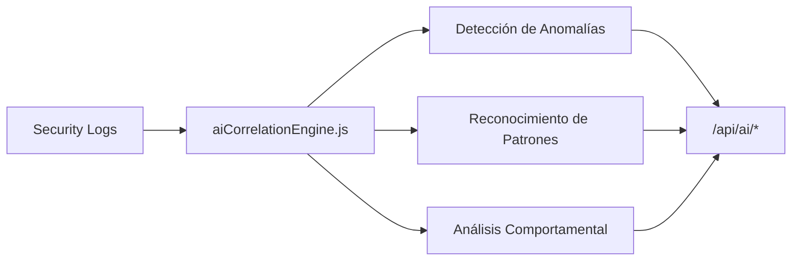
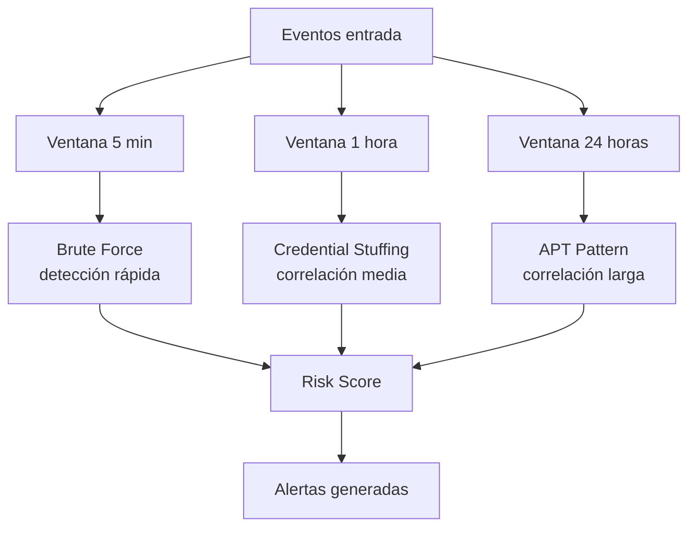

# API — AI Analysis

**Base URL:** `/api/ai`  
**Auth mínima:** `analyst`  
**Estado del módulo:** ✅ Real (heurístico) — ML real en roadmap v3.0  

---

## Descripción General

El módulo de AI Analysis proporciona análisis de comportamiento y detección de anomalías basado en algoritmos heurísticos. El motor de correlación IA (`aiCorrelationEngine.js`) analiza patrones temporales de eventos para identificar comportamientos sospechosos.

> **Nota de implementación:** El motor actual usa heurísticas avanzadas (análisis de ventanas temporales, correlación de eventos, scoring de anomalías). El ML supervisado con modelos entrenados está planificado para v3.0.



---

## Endpoints

### GET /api/ai/overview

**Descripción:** Resumen del análisis IA — score de riesgo, anomalías detectadas, estado del motor.  
**Auth:** `analyst+`

#### Respuesta 200

```json
{
  "success": true,
  "data": {
    "risk_score": 72,
    "risk_level": "HIGH",
    "anomalies_detected": 14,
    "anomalies_24h": 3,
    "attack_patterns": [
      {
        "name": "Credential Stuffing",
        "confidence": 89,
        "events_involved": 2341,
        "mitre_technique": "T1110.004"
      },
      {
        "name": "SQL Injection Campaign",
        "confidence": 95,
        "events_involved": 47,
        "mitre_technique": "T1190"
      }
    ],
    "threat_actors": 3,
    "engine_status": "active",
    "last_analysis": "2026-06-01T14:00:00Z"
  }
}
```

---

### GET /api/ai/anomaly-stream

**Descripción:** Lista de anomalías detectadas ordenadas por timestamp reciente.  
**Auth:** `analyst+`  
**Estado:** Real (heurístico)

#### Query Parameters

| Parámetro | Tipo | Descripción |
|---|---|---|
| `limit` | number | Máximo de anomalías (default: 20) |
| `severity` | string | `LOW\|MEDIUM\|HIGH\|CRITICAL` |

#### Respuesta 200

```json
{
  "success": true,
  "data": {
    "anomalies": [
      {
        "id": "anom-001",
        "type": "UNUSUAL_LOGIN_PATTERN",
        "description": "User logged in from 3 different countries in 2 hours",
        "severity": "HIGH",
        "confidence": 87,
        "affected_entity": "user:42",
        "events_count": 3,
        "timeline": [
          {"event_id": 58100, "ip": "91.189.122.10", "country": "ES", "time": "2026-06-01T12:00:00Z"},
          {"event_id": 58200, "ip": "185.220.101.44", "country": "RU", "time": "2026-06-01T12:45:00Z"},
          {"event_id": 58300, "ip": "1.2.3.4", "country": "CN", "time": "2026-06-01T13:55:00Z"}
        ],
        "detected_at": "2026-06-01T14:00:00Z",
        "mitre_technique": "T1078"
      }
    ]
  }
}
```

---

### GET /api/ai/user-behavior

**Descripción:** Análisis de comportamiento de usuarios — baseline vs comportamiento actual.  
**Auth:** `analyst+`  
**Estado:** ⚠️ Parcialmente simulado — baseline heurístico

#### Respuesta 200

```json
{
  "success": true,
  "data": {
    "users": [
      {
        "user_id": 42,
        "email": "ana@empresa.com",
        "risk_score": 35,
        "risk_level": "LOW",
        "baseline": {
          "typical_login_hours": "08:00-18:00",
          "typical_countries": ["ES"],
          "avg_requests_per_day": 450
        },
        "current_behavior": {
          "login_outside_hours": false,
          "new_country": false,
          "requests_today": 380
        },
        "anomalies": []
      },
      {
        "user_id": 15,
        "email": "suspect@empresa.com",
        "risk_score": 87,
        "risk_level": "HIGH",
        "anomalies": [
          {
            "type": "OFF_HOURS_ACCESS",
            "description": "Login at 03:00 UTC from new IP",
            "confidence": 91
          }
        ]
      }
    ]
  }
}
```

---

### GET /api/ai/recommendations

**Descripción:** Recomendaciones de seguridad basadas en el análisis IA.  
**Auth:** `analyst+`

#### Respuesta 200

```json
{
  "success": true,
  "data": {
    "recommendations": [
      {
        "priority": "CRITICAL",
        "category": "Authentication",
        "title": "Enable MFA for all admin accounts",
        "description": "3 admin accounts without MFA detected. Brute force risk is HIGH.",
        "action": "Navigate to Users > Admin accounts > Enable MFA",
        "affected_accounts": 3
      },
      {
        "priority": "HIGH",
        "category": "Network",
        "title": "Block Tor exit node range",
        "description": "47% of failed login attempts originate from known Tor exit nodes.",
        "action": "Add Tor exit node CIDR to firewall blocklist",
        "potential_reduction": "47%"
      },
      {
        "priority": "MEDIUM",
        "category": "Threat Intelligence",
        "title": "Review 23 active HIGH IOCs",
        "description": "23 high-severity IOCs have not been reviewed in 7+ days.",
        "action": "Review in Threat Intelligence module"
      }
    ]
  }
}
```

---

### GET /api/ai/radar

**Descripción:** Datos para el gráfico de radar de amenazas (pentágono de riesgo por categorías).  
**Auth:** `analyst+`

#### Respuesta 200

```json
{
  "success": true,
  "data": {
    "radar": [
      {"category": "Authentication", "score": 72, "max": 100},
      {"category": "Network", "score": 45, "max": 100},
      {"category": "Endpoint", "score": 30, "max": 100},
      {"category": "Data", "score": 55, "max": 100},
      {"category": "Application", "score": 68, "max": 100}
    ],
    "overall_risk": 54,
    "generated_at": "2026-06-01T14:00:00Z"
  }
}
```

---

## Motor de Correlación IA

### Algoritmo Heurístico

El `aiCorrelationEngine.js` analiza ventanas temporales de eventos para detectar:



### Señales Analizadas (10+)

1. Velocidad de requests por IP
2. Geolocalización inconsistente por usuario
3. User-agent de herramientas de ataque conocidas
4. Patrones de payload (SQLi, XSS, etc.)
5. Horarios de acceso fuera de baseline
6. Nuevos países de acceso
7. Número de cuentas probadas por IP
8. Correlación con IOCs conocidos
9. Comportamiento post-autenticación
10. Patrones de enumeración de recursos

### Scoring de Riesgo

```
Risk Score = Σ(señal_i × peso_i × confianza_i) / total_señales

Rango:
0-25:  LOW     🟢
26-50: MEDIUM  🟡
51-75: HIGH    🟠
76-100: CRITICAL 🔴
```

---

## Roadmap IA

| Versión | Feature |
|---|---|
| v2.0 (actual) | Heurísticas + correlación temporal |
| v3.0 (Q1 2027) | Modelos ML supervisados (Isolation Forest, LSTM) |
| v3.5 (Q2 2027) | NLP para análisis de logs, LLM threat summaries |
