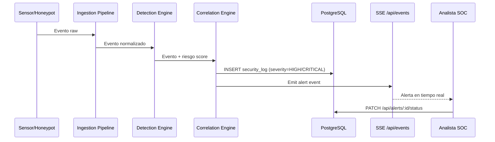
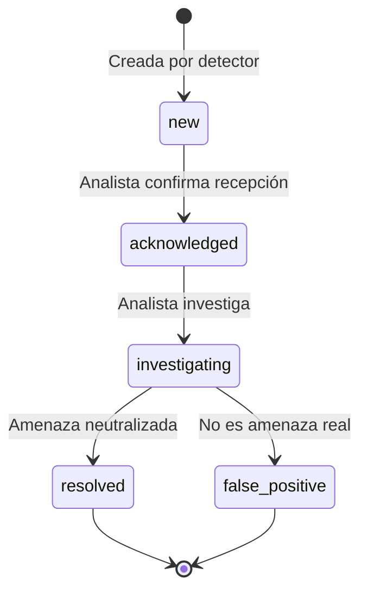

# API — Alertas

**Base URL:** `/api/alerts`  
**Auth mínima:** `viewer` (lectura) / `responder` (actualización)  

---

## Descripción General

Las alertas son creadas automáticamente por el motor de correlación y detección de RobenGate Sentinel cuando se detectan eventos de seguridad que superan umbrales de riesgo configurados.

> **Arquitectura:** Las alertas no son entidades independientes sino una vista sobre la tabla `security_logs` con un overlay de estado en `alert_statuses`. Los logs permanecen inmutables; solo el estado de la alerta (asignado en `alert_statuses`) es mutable.



---

## Endpoints

### GET /api/alerts

**Descripción:** Lista las alertas del sistema (eventos de seguridad de alta severidad).  
**Auth:** `viewer+`

#### Query Parameters

| Parámetro | Tipo | Descripción |
|---|---|---|
| `page` | number | Página (default: 1) |
| `limit` | number | Registros por página (default: 25, max: 100) |
| `severity` | string | `critical\|high\|medium\|low\|info` |
| `status` | string | `new\|acknowledged\|investigating\|resolved\|false_positive` |
| `from` | ISO8601 | Filtrar desde fecha |
| `to` | ISO8601 | Filtrar hasta fecha |
| `ip` | string | Filtrar por IP de origen |

#### Respuesta 200

```json
{
  "success": true,
  "data": {
    "alerts": [
      {
        "id": 58432,
        "event_type": "BRUTE_FORCE_DETECTED",
        "severity": "high",
        "ip_address": "185.220.101.44",
        "country_code": "RU",
        "status": "new",
        "metadata": {
          "attempts": 127,
          "window_minutes": 5,
          "targeted_user": "admin@empresa.com",
          "mitre_technique": "T1110.001"
        },
        "created_at": "2026-06-01T14:23:00Z"
      },
      {
        "id": 58401,
        "event_type": "SQL_INJECTION_ATTEMPT",
        "severity": "critical",
        "ip_address": "45.148.10.22",
        "country_code": "NL",
        "status": "investigating",
        "metadata": {
          "endpoint": "/api/users",
          "payload": "' OR 1=1--",
          "mitre_technique": "T1190"
        },
        "created_at": "2026-06-01T13:15:00Z"
      }
    ],
    "pagination": {
      "page": 1,
      "limit": 25,
      "total": 1847,
      "pages": 74
    },
    "summary": {
      "critical": 12,
      "high": 45,
      "unresolved": 234
    }
  }
}
```

---

### PATCH /api/alerts/:id/status

**Descripción:** Actualiza el estado de una alerta.  
**Auth:** `responder+`  

> **Nota técnica:** Este endpoint escribe en la tabla `alert_statuses` (overlay), no modifica el `security_log` original (que es inmutable).

#### Request

```json
{
  "status": "investigating"
}
```

**Estados válidos y flujo:**



| Estado | Descripción | Quién puede asignar |
|---|---|---|
| `new` | Recién creada, no vista | Sistema (automático) |
| `acknowledged` | Analista ha visto la alerta | responder+ |
| `investigating` | Investigación activa | responder+ |
| `resolved` | Amenaza resuelta | responder+ |
| `false_positive` | Falso positivo identificado | responder+ |

#### Respuesta 200

```json
{
  "success": true,
  "data": {
    "id": 58432,
    "status": "investigating",
    "updated_at": "2026-06-01T14:30:00Z",
    "updated_by": "ana@empresa.com"
  }
}
```

#### Errores

| Código | Error | Descripción |
|---|---|---|
| 400 | `INVALID_STATUS` | Estado no válido |
| 403 | `FORBIDDEN` | Requiere responder+ |
| 404 | `ALERT_NOT_FOUND` | Alerta no existe |

---

## Tipos de Alertas

Los tipos de alertas generados por el motor de detección:

| `event_type` | Severidad | Descripción | MITRE |
|---|---|---|---|
| `BRUTE_FORCE_DETECTED` | high | 50+ intentos de login fallidos | T1110 |
| `SQL_INJECTION_ATTEMPT` | critical | Payload SQLi detectado | T1190 |
| `XSS_ATTEMPT` | high | Payload XSS detectado | T1059.007 |
| `CREDENTIAL_STUFFING` | high | Login con credenciales conocidas filtradas | T1110.004 |
| `SUSPICIOUS_LOGIN` | medium | Login desde nueva IP/país | T1078 |
| `HONEYPOT_SSH_AUTH` | medium | Intento de auth en honeypot SSH | T1110 |
| `HONEYPOT_HTTP_PROBE` | low | Sondeo HTTP honeypot | T1595 |
| `IP_AUTO_BANNED` | high | IP baneada por comportamiento | T1071 |
| `ACCOUNT_LOCKED` | medium | Cuenta bloqueada por fallos | T1110 |
| `ANOMALOUS_BEHAVIOR` | high | Comportamiento anómalo detectado por IA | T1020 |
| `CORRELATION_ALERT` | critical | Múltiples eventos correlacionados | T1021 |
| `PORT_SCAN_DETECTED` | medium | Escaneo de puertos detectado | T1046 |

---

## Alertas en Tiempo Real (SSE)

Las alertas nuevas se emiten en tiempo real via Server-Sent Events:

```javascript
// Frontend — conexión SSE
const eventSource = new EventSource('/api/events', {
  headers: { Authorization: `Bearer ${token}` }
});

eventSource.addEventListener('alert', (event) => {
  const alert = JSON.parse(event.data);
  console.log('Nueva alerta:', alert.event_type, alert.severity);
});
```

**Evento SSE:**

```json
{
  "type": "alert",
  "data": {
    "id": 58500,
    "event_type": "BRUTE_FORCE_DETECTED",
    "severity": "high",
    "ip_address": "192.168.1.100",
    "created_at": "2026-06-01T15:00:00Z"
  }
}
```

---

## Ejemplo cURL

```bash
# Listar alertas críticas sin resolver
curl -X GET "https://api.tudominio.com/api/alerts?severity=critical&status=new" \
  -H "Authorization: Bearer TOKEN"

# Marcar alerta como investigando
curl -X PATCH "https://api.tudominio.com/api/alerts/58432/status" \
  -H "Authorization: Bearer TOKEN" \
  -H "Content-Type: application/json" \
  -d '{"status": "investigating"}'

# Marcar como falso positivo
curl -X PATCH "https://api.tudominio.com/api/alerts/58432/status" \
  -H "Authorization: Bearer TOKEN" \
  -H "Content-Type: application/json" \
  -d '{"status": "false_positive"}'
```
