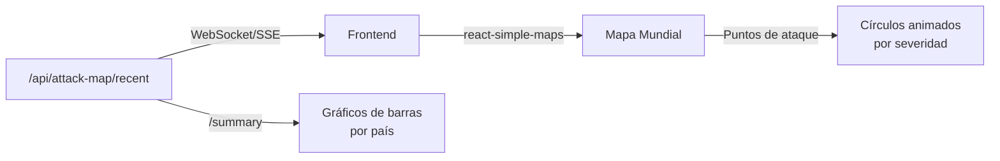

# API — Attack Map

**Base URL:** `/api/attack-map`  
**Auth mínima:** `viewer`  

---

## Descripción General

El módulo Attack Map proporciona visualización geográfica de los ataques detectados en tiempo real. Los datos combinan eventos reales del honeypot y del motor de detección con geolocalización via MaxMind GeoLite2.

> **Estado:** Real (datos de geoIP) con fallback a simulación cuando el honeypot no está activo.

---

## Endpoints

### GET /api/attack-map/recent

**Descripción:** Eventos de ataque recientes con coordenadas geográficas.  
**Auth:** `viewer+`

#### Query Parameters

| Parámetro | Tipo | Descripción |
|---|---|---|
| `limit` | number | Máximo de eventos (default: 100) |
| `minutes` | number | Ventana temporal en minutos (default: 60) |

#### Respuesta 200

```json
{
  "success": true,
  "data": {
    "attacks": [
      {
        "id": 58432,
        "type": "BRUTE_FORCE",
        "severity": "high",
        "source": {
          "ip": "185.220.101.44",
          "country": "RO",
          "city": "Bucharest",
          "lat": 44.4268,
          "lng": 26.1025,
          "asn": "AS200350",
          "is_tor": true
        },
        "target": {
          "service": "auth",
          "endpoint": "/api/auth/login"
        },
        "created_at": "2026-06-01T14:00:00Z"
      }
    ],
    "total": 127
  }
}
```

---

### GET /api/attack-map/summary

**Descripción:** Resumen estadístico para el mapa — ataques por país, intensidad.  
**Auth:** `viewer+`

#### Respuesta 200

```json
{
  "success": true,
  "data": {
    "by_country": [
      {"country": "RU", "code": "RU", "lat": 61.52, "lng": 105.32, "count": 2341, "severity_max": "critical"},
      {"country": "China", "code": "CN", "lat": 35.86, "lng": 104.20, "count": 1892, "severity_max": "high"},
      {"country": "Netherlands", "code": "NL", "lat": 52.13, "lng": 5.29, "count": 892, "severity_max": "high"}
    ],
    "total_attacks": 15823,
    "unique_sources": 1247,
    "active_now": 23
  }
}
```

---

### GET /api/attack-map/stats

**Descripción:** Estadísticas detalladas del attack map.  
**Auth:** `viewer+`

#### Respuesta 200

```json
{
  "success": true,
  "data": {
    "attacks_24h": 892,
    "attacks_7d": 5234,
    "top_attack_types": [
      {"type": "BRUTE_FORCE", "count": 4521},
      {"type": "SQL_INJECTION", "count": 234},
      {"type": "PORT_SCAN", "count": 892}
    ],
    "top_countries": [
      {"country": "RU", "percentage": 28.5},
      {"country": "CN", "percentage": 22.1}
    ],
    "peak_hour": "14:00 UTC",
    "most_targeted_service": "auth"
  }
}
```

---

## Visualización Frontend

El mapa de ataques usa `react-simple-maps` + `D3-Geo` para renderizar el mapa mundial y `recharts` para estadísticas.



**Colores por severidad:**
- 🔴 Rojo: critical
- 🟠 Naranja: high  
- 🟡 Amarillo: medium
- 🟢 Verde: low/info

---

## Datos en Tiempo Real

El Attack Map se actualiza automáticamente mediante SSE:

```javascript
// SSE event para attack map
eventSource.addEventListener('attack', (event) => {
  const attack = JSON.parse(event.data);
  // Añadir punto animado en el mapa
  addAttackMarker(attack.source.lat, attack.source.lng, attack.severity);
});
```

> **Fallback Demo:** Si el honeypot no está activo, el frontend usa `attackSimulator.js` para generar eventos de ataque simulados visualmente. Esto es **solo para demostración** y se identifica con el badge `[DEMO]` en la UI.
