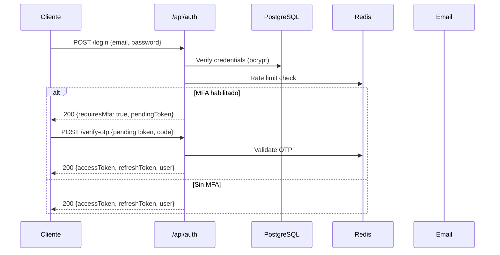
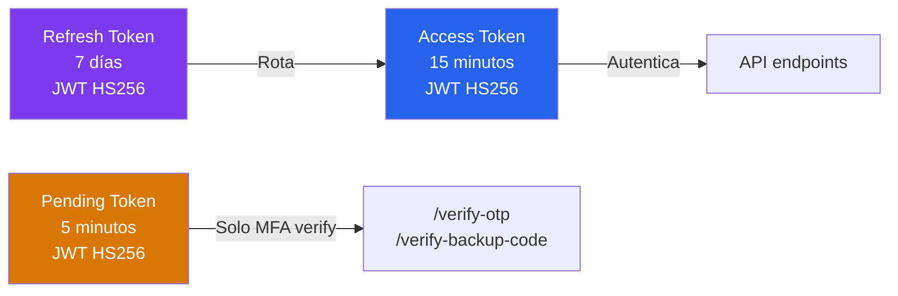

# API — Autenticación

**Base URL:** `/api/auth`  
**Versión:** 2.0.0  

---

## Descripción General

El módulo de autenticación implementa un sistema multi-factor completo:

- **JWT** (Access 15 min + Refresh 7 días con rotación)
- **Email OTP** (código de 6 dígitos, TTL 5 min en Redis)
- **TOTP** (Google Authenticator / Authy)
- **WebAuthn/FIDO2** (passkeys, biometría)
- **Códigos de backup** (bcrypt, uso único)



---

## Rate Limiting

| Endpoint | Límite | Ventana |
|---|---|---|
| `POST /login` | 10 req | 15 min |
| `POST /register` | 5 req | 1 hora |
| `POST /verify-otp` | 5 req | 5 min |
| `POST /send-otp` | 3 req | 5 min |

---

## Endpoints

### POST /api/auth/register

**Descripción:** Registra un nuevo usuario en el sistema.  
**Auth:** Pública  
**Rate limit:** `authLimiter`

#### Request

```json
{
  "name": "Ana García",
  "email": "ana@empresa.com",
  "password": "SecurePass123!"
}
```

#### Validaciones

| Campo | Regla |
|---|---|
| `name` | String, 2-100 chars |
| `email` | Email válido, único |
| `password` | Min 8 chars |

#### Respuesta 201

```json
{
  "success": true,
  "message": "Usuario registrado correctamente",
  "data": {
    "user": {
      "id": 42,
      "name": "Ana García",
      "email": "ana@empresa.com",
      "role": "viewer",
      "mfa_enabled": false,
      "created_at": "2026-06-01T10:00:00Z"
    }
  }
}
```

#### Errores

| Código | Error | Descripción |
|---|---|---|
| 400 | `VALIDATION_ERROR` | Campos inválidos |
| 409 | `EMAIL_EXISTS` | Email ya registrado |
| 429 | `RATE_LIMIT` | Demasiados registros |

---

### POST /api/auth/login

**Descripción:** Autentica al usuario. Si MFA está habilitado, devuelve `pendingToken` en lugar de tokens definitivos.  
**Auth:** Pública  
**Rate limit:** `authLimiter`

#### Request

```json
{
  "email": "ana@empresa.com",
  "password": "SecurePass123!"
}
```

#### Respuesta 200 — Sin MFA

```json
{
  "success": true,
  "data": {
    "accessToken": "eyJhbGciOiJIUzI1NiJ9...",
    "refreshToken": "eyJhbGciOiJIUzI1NiJ9...",
    "user": {
      "id": 42,
      "name": "Ana García",
      "email": "ana@empresa.com",
      "role": "analyst",
      "mfa_enabled": false
    }
  }
}
```

#### Respuesta 200 — Con MFA

```json
{
  "success": true,
  "requiresMfa": true,
  "mfaType": "email",
  "data": {
    "pendingToken": "eyJhbGciOiJIUzI1NiJ9..."
  }
}
```

> **Nota:** `pendingToken` es un JWT de corta duración (5 min) que autoriza únicamente las rutas de verificación MFA. No concede acceso a la API.

#### Errores

| Código | Error | Descripción |
|---|---|---|
| 400 | `VALIDATION_ERROR` | Campos inválidos |
| 401 | `INVALID_CREDENTIALS` | Email/contraseña incorrectos |
| 403 | `ACCOUNT_LOCKED` | Cuenta bloqueada por fallos |
| 403 | `IP_BANNED` | IP baneada automáticamente |
| 429 | `RATE_LIMIT` | Demasiados intentos |

---

### POST /api/auth/verify-otp

**Descripción:** Verifica el código OTP de email para completar login MFA.  
**Auth:** `pendingToken` (header `Authorization: Bearer <pendingToken>`)  
**Rate limit:** `mfaLimiter`

#### Request

```json
{
  "code": "483921"
}
```

#### Respuesta 200

```json
{
  "success": true,
  "data": {
    "accessToken": "eyJhbGciOiJIUzI1NiJ9...",
    "refreshToken": "eyJhbGciOiJIUzI1NiJ9...",
    "user": {
      "id": 42,
      "name": "Ana García",
      "role": "analyst"
    }
  }
}
```

#### Errores

| Código | Error | Descripción |
|---|---|---|
| 401 | `INVALID_OTP` | Código incorrecto o expirado |
| 401 | `INVALID_PENDING_TOKEN` | pendingToken inválido/expirado |
| 429 | `RATE_LIMIT` | Demasiados intentos |

---

### POST /api/auth/send-otp

**Descripción:** Reenvía el código OTP al email del usuario.  
**Auth:** `pendingToken`  
**Rate limit:** `mfaLimiter`

#### Respuesta 200

```json
{
  "success": true,
  "message": "OTP enviado al email registrado"
}
```

---

### POST /api/auth/verify-backup-code

**Descripción:** Verifica un código de backup MFA (uso único).  
**Auth:** `pendingToken`  
**Rate limit:** `mfaLimiter`

#### Request

```json
{
  "code": "BACKUP-ABC123"
}
```

#### Respuesta 200

```json
{
  "success": true,
  "data": {
    "accessToken": "...",
    "refreshToken": "...",
    "codesRemaining": 7
  }
}
```

---

### POST /api/auth/refresh

**Descripción:** Rota el refresh token y emite nuevos access + refresh tokens.  
**Auth:** `refreshToken` en body  
**Rate limit:** `authLimiter`

#### Request

```json
{
  "refreshToken": "eyJhbGciOiJIUzI1NiJ9..."
}
```

#### Respuesta 200

```json
{
  "success": true,
  "data": {
    "accessToken": "eyJhbGciOiJIUzI1NiJ9...",
    "refreshToken": "eyJhbGciOiJIUzI1NiJ9..."
  }
}
```

> **Nota de seguridad:** La rotación de refresh tokens invalida el token anterior. Un reuse del refresh token revocado invalida **todos** los tokens de la sesión (detección de robo).

---

### POST /api/auth/logout

**Descripción:** Invalida el access token actual (JTI en Redis) y revoca el refresh token.  
**Auth:** `Bearer <accessToken>`

#### Respuesta 200

```json
{
  "success": true,
  "message": "Sesión cerrada correctamente"
}
```

---

### GET /api/auth/me

**Descripción:** Devuelve el perfil del usuario autenticado.  
**Auth:** `Bearer <accessToken>`

#### Respuesta 200

```json
{
  "success": true,
  "data": {
    "id": 42,
    "name": "Ana García",
    "email": "ana@empresa.com",
    "role": "analyst",
    "mfa_enabled": true,
    "mfa_type": "totp",
    "active": true,
    "last_login_at": "2026-06-01T09:00:00Z",
    "created_at": "2026-01-15T08:00:00Z",
    "organization_id": 1
  }
}
```

---

### PATCH /api/auth/profile

**Descripción:** Actualiza nombre y/o empresa del perfil del usuario.  
**Auth:** `Bearer <accessToken>`

#### Request

```json
{
  "name": "Ana García López",
  "company": "Empresa S.L."
}
```

#### Respuesta 200

```json
{
  "success": true,
  "data": {
    "id": 42,
    "name": "Ana García López",
    "company": "Empresa S.L."
  }
}
```

---

### PUT /api/auth/change-password

**Descripción:** Cambia la contraseña del usuario autenticado.  
**Auth:** `Bearer <accessToken>`

#### Request

```json
{
  "currentPassword": "OldPass123!",
  "newPassword": "NewSecurePass456!"
}
```

#### Respuesta 200

```json
{
  "success": true,
  "message": "Contraseña actualizada correctamente"
}
```

#### Errores

| Código | Error | Descripción |
|---|---|---|
| 401 | `WRONG_CURRENT_PASSWORD` | Contraseña actual incorrecta |
| 400 | `SAME_PASSWORD` | Nueva igual a la anterior |

---

### POST /api/auth/forgot-password

**Descripción:** Envía email con enlace de restablecimiento de contraseña.  
**Auth:** Pública

#### Request

```json
{
  "email": "ana@empresa.com"
}
```

#### Respuesta 200

```json
{
  "success": true,
  "message": "Si el email existe, recibirás un enlace de restablecimiento"
}
```

> **Nota de seguridad:** La respuesta es idéntica tanto si el email existe como si no (prevención de enumeración de usuarios).

---

### POST /api/auth/reset-password

**Descripción:** Restablece la contraseña usando el token del email.  
**Auth:** Pública (token en body)

#### Request

```json
{
  "token": "secure-reset-token-from-email",
  "newPassword": "NewSecurePass456!"
}
```

#### Respuesta 200

```json
{
  "success": true,
  "message": "Contraseña restablecida correctamente"
}
```

---

### POST /api/auth/backup-codes/generate

**Descripción:** Genera 10 nuevos códigos de backup MFA. Invalida los anteriores.  
**Auth:** `Bearer <accessToken>`

#### Respuesta 200

```json
{
  "success": true,
  "data": {
    "codes": [
      "BKUP-A1B2C3",
      "BKUP-D4E5F6",
      "..."
    ],
    "message": "Guarda estos códigos en un lugar seguro. Solo se muestran una vez."
  }
}
```

---

### GET /api/auth/backup-codes/count

**Descripción:** Devuelve el número de códigos de backup disponibles (sin revelar los códigos).  
**Auth:** `Bearer <accessToken>`

#### Respuesta 200

```json
{
  "success": true,
  "data": {
    "count": 8
  }
}
```

---

### POST /api/auth/totp/setup

**Descripción:** Inicia la configuración de TOTP. Devuelve secreto y QR code URI.  
**Auth:** `Bearer <accessToken>`

#### Respuesta 200

```json
{
  "success": true,
  "data": {
    "secret": "JBSWY3DPEHPK3PXP",
    "otpAuthUrl": "otpauth://totp/RobenGate%20Sentinel:ana@empresa.com?secret=JBSWY3DPEHPK3PXP&issuer=RobenGate%20Sentinel",
    "qrCodeDataUrl": "data:image/png;base64,..."
  }
}
```

---

### POST /api/auth/totp/confirm

**Descripción:** Confirma el TOTP con el primer código generado por la app.  
**Auth:** `Bearer <accessToken>`

#### Request

```json
{
  "code": "123456"
}
```

#### Respuesta 200

```json
{
  "success": true,
  "message": "TOTP configurado correctamente",
  "data": {
    "mfa_type": "totp"
  }
}
```

---

## WebAuthn / FIDO2

Ver documento: [webauthn.md](webauthn.md) *(incluido en autenticacion)*

### GET /api/auth/webauthn/registration-options

**Descripción:** Obtiene las opciones para registrar una nueva passkey/clave de seguridad.  
**Auth:** `Bearer <accessToken>`

#### Respuesta 200

```json
{
  "success": true,
  "data": {
    "challenge": "base64url-challenge",
    "rp": {"name": "RobenGate Sentinel", "id": "tudominio.com"},
    "user": {"id": "base64url-user-id", "name": "ana@empresa.com", "displayName": "Ana García"},
    "pubKeyCredParams": [{"type": "public-key", "alg": -7}],
    "timeout": 60000,
    "attestation": "none"
  }
}
```

### POST /api/auth/webauthn/registration-verify

**Descripción:** Verifica y almacena la credencial WebAuthn registrada.  
**Auth:** `Bearer <accessToken>`

### GET /api/auth/webauthn/login-options

**Descripción:** Obtiene opciones de autenticación WebAuthn para login.  
**Auth:** Pública

### POST /api/auth/webauthn/login-verify

**Descripción:** Verifica la aserción WebAuthn y emite tokens de sesión.  
**Auth:** Pública (con WebAuthn challenge)

### GET /api/auth/webauthn/credentials

**Descripción:** Lista las credenciales WebAuthn registradas del usuario.  
**Auth:** `Bearer <accessToken>`

#### Respuesta 200

```json
{
  "success": true,
  "data": [
    {
      "id": 1,
      "device_name": "MacBook Touch ID",
      "transport": ["internal"],
      "created_at": "2026-05-01T10:00:00Z",
      "last_used_at": "2026-06-01T09:00:00Z"
    }
  ]
}
```

### DELETE /api/auth/webauthn/credentials/:id

**Descripción:** Revoca una credencial WebAuthn.  
**Auth:** `Bearer <accessToken>`

---

## Modelos de Seguridad de Tokens



| Token | Duración | Propósito | Almacenamiento |
|---|---|---|---|
| Access Token | 15 minutos | Autenticar requests API | Memoria (no localStorage) |
| Refresh Token | 7 días | Renovar access token | httpOnly cookie (recomendado) |
| Pending Token | 5 minutos | Completar flujo MFA | Memoria temporal |

> **⚠️ Nota de Implementación:** Los tokens se almacenan en memoria del cliente (NO localStorage) para mitigar ataques XSS. Ver `frontend/src/shared/services/tokenManager.js`.
