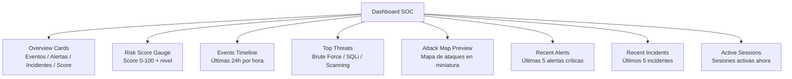

# API — Dashboard y Estadísticas

**Base URL:** `/api/stats`  
**Auth mínima:** `viewer`  
**Estado:** ⚠️ Parcialmente simulado — métricas estáticas en demo  

---

## Descripción General

El endpoint de estadísticas provee los datos para el dashboard SOC principal. En producción con datos reales, las métricas se calculan sobre las tablas de PostgreSQL y MongoDB. En modo demo, algunas métricas son estáticas.

---

## Endpoints

### GET /api/stats

**Descripción:** Estadísticas globales del sistema para el dashboard.  
**Auth:** `viewer+`

#### Respuesta 200

```json
{
  "success": true,
  "data": {
    "overview": {
      "total_events_24h": 15847,
      "critical_alerts": 23,
      "open_incidents": 8,
      "banned_ips": 147,
      "active_sessions": 34,
      "honeypot_captures_24h": 892
    },
    "risk_score": {
      "current": 72,
      "level": "HIGH",
      "trend": "increasing",
      "change_24h": +5
    },
    "security_score": {
      "overall": 85,
      "authentication": 91,
      "network": 82,
      "data": 87,
      "infrastructure": 82
    },
    "events_by_severity": {
      "critical": 23,
      "high": 156,
      "medium": 892,
      "low": 4521,
      "info": 10255
    },
    "top_threats": [
      {
        "type": "Brute Force",
        "count": 4521,
        "trend": "stable",
        "mitre": "T1110"
      },
      {
        "type": "SQL Injection",
        "count": 47,
        "trend": "increasing",
        "mitre": "T1190"
      }
    ],
    "incidents_summary": {
      "open": 8,
      "in_progress": 3,
      "resolved_today": 5
    },
    "vulnerabilities_summary": {
      "critical": 2,
      "high": 5,
      "open": 14,
      "patched_this_week": 3
    }
  }
}
```

---

## Dashboard Principal — Componentes

El dashboard SOC está compuesto por los siguientes widgets:



---

## SSE — Server-Sent Events

### GET /api/events

**Descripción:** Stream de eventos en tiempo real via SSE.  
**Auth:** `viewer+`  
**Content-Type:** `text/event-stream`

```javascript
// Conectar al stream SSE
const eventSource = new EventSource('/api/events', {
  headers: { Authorization: `Bearer ${accessToken}` }
});

// Tipos de eventos disponibles
eventSource.addEventListener('alert', handler);       // Nueva alerta
eventSource.addEventListener('incident', handler);    // Nuevo incidente
eventSource.addEventListener('attack', handler);      // Ataque en tiempo real
eventSource.addEventListener('ban', handler);         // IP baneada
eventSource.addEventListener('honeypot', handler);    // Evento honeypot
eventSource.addEventListener('heartbeat', handler);   // Keepalive (30s)
```

**Payload de ejemplo:**

```
event: alert
data: {"id":58432,"event_type":"BRUTE_FORCE_DETECTED","severity":"high","ip":"185.220.101.44","created_at":"2026-06-01T14:00:00Z"}

event: heartbeat
data: {"timestamp":"2026-06-01T14:00:30Z","connected_clients":34}
```

---

## Métricas Prometheus

### GET /metrics

**Descripción:** Endpoint de métricas Prometheus.  
**Auth:** Pública (proteger en producción con IP allowlist)

```promql
# Métricas disponibles

# Estado del servicio
up{job="robengate-backend"}

# HTTP requests por ruta y status
http_requests_total{method="POST",route="/api/auth/login",status="200"}

# Latencia por ruta (histograma)
http_request_duration_seconds_bucket{route="/api/logs",le="0.1"}

# Intentos de login fallidos
login_attempts_total{status="failed"}

# IPs baneadas activas
banned_ips_total

# Alertas por severidad
security_alerts_total{severity="critical"}

# Eventos del honeypot
honeypot_events_total{type="ssh"}

# Risk score actual
risk_score_current
```

### Configuración de Seguridad para /metrics

En producción, proteger el endpoint de métricas:

```nginx
# infra/nginx/nginx.conf
location /metrics {
    allow 10.0.0.0/8;   # Solo red interna
    deny all;
    proxy_pass http://backend;
}
```

---

## Health Checks

### GET /health

**Descripción:** Estado general del servicio (componentes).  
**Auth:** Pública

#### Respuesta 200

```json
{
  "status": "healthy",
  "version": "2.0.0",
  "timestamp": "2026-06-01T15:00:00Z",
  "services": {
    "database": "healthy",
    "mongodb": "healthy",
    "redis": "healthy",
    "elasticsearch": "optional (not connected)"
  }
}
```

### GET /ready

**Descripción:** Readiness probe para Kubernetes.  
**Auth:** Pública

```json
{
  "ready": true,
  "database": true,
  "cache": true
}
```

### GET /live

**Descripción:** Liveness probe para Kubernetes.  
**Auth:** Pública

```json
{
  "alive": true
}
```
