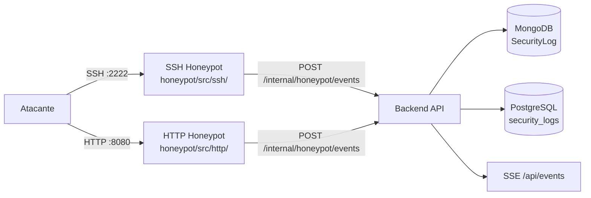
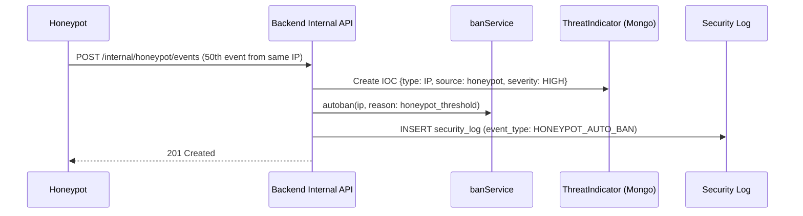

# API — Honeypot

**Base URL:** `/api/honeypot`  
**Auth mínima:** `analyst`  
**Servicio:** Puerto SSH :2222 + Puerto HTTP :8080  

---

## Descripción General

El honeypot de RobenGate Sentinel opera como un sistema de trampa activo con dos servicios:

1. **SSH Honeypot** (puerto 2222) — captura intentos de autenticación SSH, comandos ejecutados y credenciales probadas
2. **HTTP Honeypot** (puerto 8080) — captura sondeos HTTP, intentos de path traversal, scanning de vulnerabilidades

Los eventos del honeypot se envían al backend via `/internal/honeypot/events` (autenticado con `X-Internal-Secret`) y se almacenan en la base de datos para análisis.



---

## Endpoints

### GET /api/honeypot/events

**Descripción:** Lista los eventos capturados por el honeypot.  
**Auth:** `analyst+`

#### Query Parameters

| Parámetro | Tipo | Descripción |
|---|---|---|
| `page` | number | Página (default: 1) |
| `limit` | number | Por página (default: 50) |
| `type` | string | `ssh\|http` |
| `ip` | string | Filtrar por IP atacante |
| `from` | ISO8601 | Desde fecha |
| `to` | ISO8601 | Hasta fecha |

#### Respuesta 200

```json
{
  "success": true,
  "data": {
    "events": [
      {
        "id": 892341,
        "type": "ssh",
        "ip_address": "185.220.101.44",
        "country_code": "RU",
        "username_attempted": "root",
        "password_attempted": "admin123",
        "commands": ["whoami", "cat /etc/passwd"],
        "session_duration": 23,
        "created_at": "2026-06-01T14:00:00Z",
        "metadata": {
          "client_version": "SSH-2.0-libssh_0.9.6",
          "kex_algorithm": "diffie-hellman-group14-sha256"
        }
      },
      {
        "id": 892340,
        "type": "http",
        "ip_address": "45.148.10.22",
        "country_code": "NL",
        "method": "GET",
        "path": "/../../../etc/passwd",
        "user_agent": "Nuclei - Open-source project (github.com/projectdiscovery/nuclei)",
        "status_code": 200,
        "created_at": "2026-06-01T13:55:00Z"
      }
    ],
    "pagination": {
      "page": 1,
      "limit": 50,
      "total": 15823
    }
  }
}
```

---

### GET /api/honeypot/stats

**Descripción:** Estadísticas del honeypot.  
**Auth:** `analyst+`

#### Respuesta 200

```json
{
  "success": true,
  "data": {
    "total_events": 15823,
    "events_24h": 892,
    "unique_ips_24h": 234,
    "by_type": {
      "ssh": 8923,
      "http": 6900
    },
    "top_attackers": [
      {
        "ip": "185.220.101.44",
        "country": "RU",
        "events": 890,
        "last_seen": "2026-06-01T14:00:00Z"
      }
    ],
    "top_credentials": [
      {"username": "root", "count": 2341},
      {"username": "admin", "count": 1892},
      {"username": "ubuntu", "count": 456}
    ],
    "top_http_paths": [
      {"path": "/admin", "count": 892},
      {"path": "/.env", "count": 567},
      {"path": "/wp-admin", "count": 445}
    ]
  }
}
```

---

### GET /api/honeypot/attackers

**Descripción:** Lista de los atacantes más activos detectados por el honeypot.  
**Auth:** `analyst+`

#### Respuesta 200

```json
{
  "success": true,
  "data": {
    "attackers": [
      {
        "ip": "185.220.101.44",
        "country": "RO",
        "asn": "AS200350",
        "total_events": 890,
        "ssh_events": 567,
        "http_events": 323,
        "first_seen": "2026-05-20T08:00:00Z",
        "last_seen": "2026-06-01T14:00:00Z",
        "is_tor_exit": true,
        "ioc_match": true,
        "auto_banned": true
      }
    ],
    "total": 1247
  }
}
```

---

## Endpoint Interno — Recepción de Eventos

### POST /internal/honeypot/events

**Auth:** `X-Internal-Secret: <INTERNAL_API_SECRET>`  
**Llamado por:** honeypot service (NO por clientes externos)

#### Request

```json
{
  "type": "ssh",
  "ip_address": "185.220.101.44",
  "username": "root",
  "password": "password123",
  "commands": ["id", "uname -a"],
  "metadata": {
    "session_id": "hp-session-abc123",
    "client_version": "SSH-2.0-libssh"
  }
}
```

> ⚠️ **Seguridad:** El endpoint `/internal/*` está bloqueado desde internet. Solo accesible desde la red interna Docker/K8s. Nunca exponer en Nginx.

---

## Configuración del Honeypot

### Variables de Entorno (honeypot service)

| Variable | Descripción | Ejemplo |
|---|---|---|
| `BACKEND_URL` | URL del backend | `http://backend:5000` |
| `INTERNAL_API_SECRET` | Secreto compartido | `32+ chars random` |
| `SSH_PORT` | Puerto SSH honeypot | `2222` |
| `HTTP_PORT` | Puerto HTTP honeypot | `8080` |

### Docker Compose

```yaml
# Extraído de infra/docker/docker-compose.yml
honeypot:
  build:
    context: ./honeypot
  ports:
    - "2222:2222"  # SSH honeypot
    - "8080:8080"  # HTTP honeypot
  environment:
    - BACKEND_URL=http://backend:5000
    - INTERNAL_API_SECRET=${INTERNAL_API_SECRET}
  depends_on:
    - backend
```

---

## Integración con Threat Intelligence

Cuando el honeypot detecta una IP que supera el umbral de eventos (configurable), la IP se:

1. **Reporta automáticamente** como IOC en MongoDB `ThreatIndicator`
2. **Banea automáticamente** via `POST /internal/ban`
3. **Genera alerta** de severidad HIGH en `security_logs`


