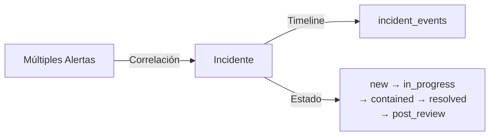
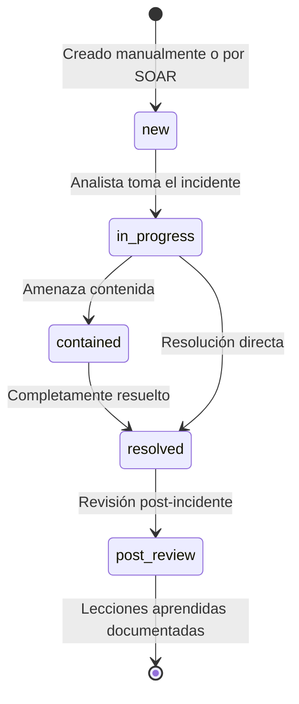

# API — Incidentes

**Base URL:** `/api/incidents`  
**Auth mínima:** `viewer` (lectura) / `analyst` (creación) / `responder` (actualización)  

---

## Descripción General

Los incidentes son el nivel de gestión superior al de las alertas. Un incidente agrupa múltiples alertas o eventos relacionados bajo una sola entidad gestionable con timeline, assignee, severidad y etiquetas TLP.



---

## Endpoints

### GET /api/incidents

**Descripción:** Lista los incidentes del sistema.  
**Auth:** `viewer+`  
**Multi-tenancy:** Filtra por `organization_id`.

#### Query Parameters

| Parámetro | Tipo | Descripción |
|---|---|---|
| `page` | number | Página (default: 1) |
| `limit` | number | Por página (default: 20) |
| `severity` | string | `info\|low\|medium\|high\|critical` |
| `status` | string | `new\|in_progress\|contained\|resolved\|post_review` |
| `assignee` | string | Filtrar por nombre del responsable |
| `from` | ISO8601 | Desde fecha |
| `to` | ISO8601 | Hasta fecha |

#### Respuesta 200

```json
{
  "success": true,
  "data": {
    "incidents": [
      {
        "id": 1,
        "title": "Coordinated DDoS on API Gateway",
        "summary": "Sustained volumetric DDoS targeting /api/* endpoints. Peak traffic: 480k req/s.",
        "severity": "critical",
        "status": "in_progress",
        "assignee": "Alex Chen",
        "tags": ["DDoS", "API Gateway", "Volumetric"],
        "tlp": "RED",
        "created_at": "2026-06-01T08:00:00Z",
        "updated_at": "2026-06-01T09:45:00Z",
        "organization_id": 1,
        "events_count": 4
      }
    ],
    "pagination": {
      "page": 1,
      "limit": 20,
      "total": 23,
      "pages": 2
    }
  }
}
```

---

### POST /api/incidents

**Descripción:** Crea un nuevo incidente.  
**Auth:** `analyst+`

#### Request

```json
{
  "title": "Credential Stuffing Attack - Auth Service",
  "summary": "Automated credential stuffing attack detected against /api/auth/login. 2,300 attempts in 10 minutes using known leaked credentials.",
  "severity": "high",
  "assignee": "Ana García",
  "tags": ["Brute Force", "Credential Stuffing", "Auth"],
  "tlp": "AMBER"
}
```

#### Campos del Request

| Campo | Tipo | Requerido | Descripción |
|---|---|---|---|
| `title` | string | ✅ | Título descriptivo del incidente |
| `summary` | string | ❌ | Descripción detallada |
| `severity` | string | ✅ | `info\|low\|medium\|high\|critical` |
| `assignee` | string | ❌ | Nombre del analista asignado |
| `tags` | string[] | ❌ | Etiquetas para clasificación |
| `tlp` | string | ❌ | Traffic Light Protocol: `WHITE\|GREEN\|AMBER\|RED` |

#### Respuesta 201

```json
{
  "success": true,
  "data": {
    "id": 24,
    "title": "Credential Stuffing Attack - Auth Service",
    "severity": "high",
    "status": "new",
    "tlp": "AMBER",
    "created_at": "2026-06-01T15:00:00Z"
  }
}
```

---

### PATCH /api/incidents/:id

**Descripción:** Actualiza un incidente existente (estado, asignado, notas).  
**Auth:** `responder+`

#### Request

```json
{
  "status": "in_progress",
  "assignee": "David Kim",
  "summary": "Updated: Source IP blocked at firewall. Continuing investigation.",
  "tags": ["Brute Force", "Credential Stuffing", "Auth", "Contained"]
}
```

**Campos actualizables:**

| Campo | Tipo | Descripción |
|---|---|---|
| `status` | string | Nuevo estado del incidente |
| `assignee` | string | Reasignar a otro analista |
| `summary` | string | Actualizar descripción |
| `tags` | string[] | Actualizar etiquetas |
| `tlp` | string | Cambiar clasificación TLP |

#### Respuesta 200

```json
{
  "success": true,
  "data": {
    "id": 1,
    "status": "in_progress",
    "assignee": "David Kim",
    "updated_at": "2026-06-01T15:30:00Z"
  }
}
```

---

## Estados del Ciclo de Vida



| Estado | Significado | Quién Asigna |
|---|---|---|
| `new` | Recién creado, no asignado | Sistema/analyst |
| `in_progress` | Investigación activa | responder+ |
| `contained` | Amenaza contenida, sigue activa | responder+ |
| `resolved` | Incidente completamente resuelto | responder+ |
| `post_review` | En revisión post-incidente (lecciones) | analyst+ |

---

## Clasificación TLP

| TLP | Color | Significado | Distribución |
|---|---|---|---|
| `WHITE` | ⚪ Blanco | Información pública | Sin restricciones |
| `GREEN` | 🟢 Verde | Comunidad | Dentro del sector |
| `AMBER` | 🟡 Ámbar | Organizacional | Solo organización |
| `RED` | 🔴 Rojo | Confidencial | Solo equipo directo |

---

## Timeline de Incidentes

Cada actualización de un incidente genera automáticamente un evento en `incident_events` para trazabilidad completa:

```json
{
  "incident_id": 1,
  "events": [
    {
      "id": 1,
      "actor": "SIEM",
      "action": "Incident auto-created from DDoS alert threshold",
      "created_at": "2026-06-01T08:00:00Z"
    },
    {
      "id": 2,
      "actor": "Alex Chen",
      "action": "Incident accepted and assigned",
      "created_at": "2026-06-01T08:05:00Z"
    },
    {
      "id": 3,
      "actor": "Alex Chen",
      "action": "Escalated to Tier 2. Cloudflare Magic Transit engaged",
      "created_at": "2026-06-01T08:15:00Z"
    }
  ]
}
```

---

## Incidentes Pre-cargados (Demo)

El sistema incluye 4 incidentes de demostración en el seed de la base de datos:

| ID | Título | Severidad | Estado |
|---|---|---|---|
| 1 | Coordinated DDoS on API Gateway | critical | in_progress |
| 2 | Active SQL Injection on Users Endpoint | critical | contained |
| 3 | Credential Stuffing Campaign — Auth Service | high | resolved |
| 4 | Stored XSS in User Profile Component | high | post_review |

> **⚠️ Nota:** Estos incidentes son datos de demostración. En producción se generan a partir de alertas reales o manualmente por analistas.

---

## Ejemplo cURL

```bash
# Listar incidentes activos críticos
curl -X GET "https://api.tudominio.com/api/incidents?severity=critical&status=in_progress" \
  -H "Authorization: Bearer TOKEN"

# Crear nuevo incidente
curl -X POST "https://api.tudominio.com/api/incidents" \
  -H "Authorization: Bearer TOKEN" \
  -H "Content-Type: application/json" \
  -d '{
    "title": "Ransomware C2 Communication Detected",
    "summary": "Outbound traffic to known ransomware C2 server detected from endpoint 192.168.1.55",
    "severity": "critical",
    "tags": ["Ransomware", "C2", "Endpoint"],
    "tlp": "RED"
  }'

# Actualizar estado a contenido
curl -X PATCH "https://api.tudominio.com/api/incidents/24" \
  -H "Authorization: Bearer TOKEN" \
  -H "Content-Type: application/json" \
  -d '{"status": "contained", "assignee": "Ana García"}'
```
