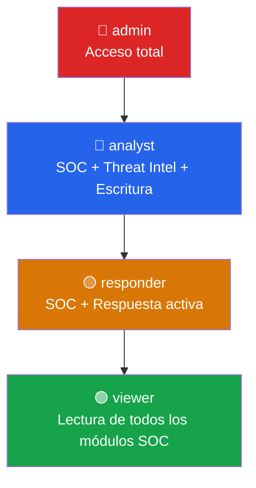

# API — Roles y RBAC

**Implementación:** `backend/src/middleware/authorize.js`  
**Config frontend:** `frontend/src/shared/config/permissions.js`  

---

## Descripción del Sistema RBAC

RobenGate Sentinel implementa un sistema **Role-Based Access Control (RBAC)** jerárquico con 4 roles. El sistema usa el patrón `minRole` — un usuario con rol superior automáticamente satisface los requisitos de roles inferiores.



---

## Definición de Roles

### viewer (rol base)

El rol mínimo de acceso. Tiene acceso de **solo lectura** a todos los módulos SOC.

**Capacidades:**
- Ver dashboard y estadísticas
- Ver logs de seguridad
- Ver alertas (no puede cambiar estado)
- Ver incidentes (no puede crear ni modificar)
- Ver mapa de ataques
- Ver análisis IA
- Ver vulnerabilidades (no puede crear/modificar)
- Ver dispositivos propios
- Ver sesiones propias
- Ver threat intelligence

**Restricción especial:** El middleware `readOnly()` bloquea automáticamente POST/PUT/PATCH/DELETE para viewers, mostrando badge "View Only" en el frontend.

---

### responder

Hereda todos los permisos de `viewer` y añade:

**Capacidades adicionales:**
- Cambiar estado de alertas (acknowledge, investigate, resolve)
- Actualizar estado de incidentes
- Asignar incidentes

---

### analyst

Hereda todos los permisos de `responder` y añade:

**Capacidades adicionales:**
- Gestión completa de usuarios (listar, ver detalle)
- Crear y actualizar vulnerabilidades
- Gestión de Threat Intelligence (reportar IOCs)
- Búsqueda Elasticsearch y análisis
- Gestión de agentes EDR
- Exportar audit logs
- Gestión de playbooks SOAR
- Ver estadísticas de ingesta

---

### admin

Hereda todos los permisos de `analyst` y añade:

**Capacidades adicionales:**
- Cambiar roles de usuarios
- Bloquear/desbloquear cuentas
- Eliminar usuarios
- Gestionar organizaciones
- Crear/modificar/eliminar playbooks
- Banear/desbanear IPs manualmente
- Ver IPs baneadas
- Configuración de la plataforma

---

## Middleware de Autorización

### `minRole(role)` — Backend

El middleware verifica que el usuario tenga al menos el rol especificado.

```javascript
// Ejemplo de uso en rutas
router.get('/api/logs', authenticate, minRole('viewer'), logController.getLogs);
router.post('/api/threats/report', authenticate, minRole('analyst'), threatController.report);
router.patch('/api/users/:id/role', authenticate, minRole('admin'), userController.updateRole);
```

**Jerarquía de roles:**
```javascript
const ROLE_HIERARCHY = {
  viewer:    1,
  responder: 2,
  analyst:   3,
  admin:     4
};
```

### `readOnly()` — Backend

Bloquea métodos HTTP mutantes (POST/PUT/PATCH/DELETE) para usuarios con rol `viewer`.

```javascript
// Aplicado globalmente en app.js
app.use(readOnly()); // Bloquea escritura para viewers
```

---

## Permisos por Endpoint

### Módulo Auth

| Endpoint | Método | Auth Requerida |
|---|---|---|
| `/api/auth/register` | POST | Pública |
| `/api/auth/login` | POST | Pública |
| `/api/auth/refresh` | POST | Pública |
| `/api/auth/verify-otp` | POST | pendingToken |
| `/api/auth/send-otp` | POST | pendingToken |
| `/api/auth/logout` | POST | JWT viewer+ |
| `/api/auth/me` | GET | JWT viewer+ |
| `/api/auth/profile` | PATCH | JWT viewer+ |
| `/api/auth/change-password` | PUT | JWT viewer+ |
| `/api/auth/backup-codes/generate` | POST | JWT viewer+ |
| `/api/auth/totp/setup` | POST | JWT viewer+ |

### Módulo SOC (Operaciones)

| Endpoint | Método | Rol Mínimo |
|---|---|---|
| `/api/logs` | GET | viewer |
| `/api/logs/stats` | GET | viewer |
| `/api/alerts` | GET | viewer |
| `/api/alerts/:id/status` | PATCH | responder |
| `/api/incidents` | GET | viewer |
| `/api/incidents` | POST | analyst |
| `/api/incidents/:id` | PATCH | responder |
| `/api/vulnerabilities` | GET | viewer |
| `/api/vulnerabilities` | POST | analyst |
| `/api/vulnerabilities/:id` | PATCH | analyst |
| `/api/attack-map/recent` | GET | viewer |
| `/api/attack-map/summary` | GET | viewer |

### Módulo Threat Intelligence

| Endpoint | Método | Rol Mínimo |
|---|---|---|
| `/api/threats/indicators` | GET | viewer |
| `/api/threats/stats` | GET | viewer |
| `/api/threats/feeds` | GET | viewer |
| `/api/threats/heatmap` | GET | viewer |
| `/api/threats/report` | POST | analyst |

### Módulo AI & Search

| Endpoint | Método | Rol Mínimo |
|---|---|---|
| `/api/ai/overview` | GET | analyst |
| `/api/ai/anomaly-stream` | GET | analyst |
| `/api/ai/user-behavior` | GET | analyst |
| `/api/ai/recommendations` | GET | analyst |
| `/api/search/logs` | GET | analyst |
| `/api/search/analytics` | GET | analyst |
| `/api/search/ioc/:ip` | GET | analyst |

### Módulo Administración

| Endpoint | Método | Rol Mínimo |
|---|---|---|
| `/api/users` | GET | analyst |
| `/api/users/:id/role` | PATCH | admin |
| `/api/users/:id/lock` | PATCH | admin |
| `/api/users/:id` | DELETE | admin |
| `/api/organizations/me` | GET | viewer |
| `/api/organizations/:id` | PATCH | admin |
| `/api/playbooks` | GET | analyst |
| `/api/playbooks` | POST | admin |
| `/api/agents` | GET | analyst |
| `/api/agents/register` | POST | admin |

### Módulo Audit

| Endpoint | Método | Rol Mínimo |
|---|---|---|
| `/api/audit` | GET | analyst |
| `/api/audit/stats` | GET | analyst |
| `/api/audit/export` | GET | analyst |

### Módulo Honeypot

| Endpoint | Método | Rol Mínimo |
|---|---|---|
| `/api/honeypot/events` | GET | analyst |
| `/api/honeypot/stats` | GET | analyst |
| `/api/honeypot/attackers` | GET | analyst |

### Endpoints Internos

| Endpoint | Método | Auth |
|---|---|---|
| `/internal/honeypot/events` | POST | X-Internal-Secret |
| `/internal/ban` | POST | X-Internal-Secret |
| `/internal/ban/:ip` | DELETE | X-Internal-Secret |
| `/internal/banned-ips` | GET | X-Internal-Secret |

### Endpoints Públicos

| Endpoint | Método | Auth |
|---|---|---|
| `/health` | GET | Ninguna |
| `/ready` | GET | Ninguna |
| `/metrics` | GET | Ninguna (proteger en prod) |
| `/api/auth/register` | POST | Ninguna |
| `/api/auth/login` | POST | Ninguna |

---

## Implementación Frontend

### `permissions.js` — Configuración Centralizada

```javascript
// frontend/src/shared/config/permissions.js
export const ROUTE_MIN_ROLE = {
  '/dashboard':         'viewer',
  '/security-logs':     'viewer',
  '/alerts':            'viewer',
  '/incidents':         'viewer',
  '/attack-map':        'viewer',
  '/ai-analysis':       'viewer',
  '/vulnerabilities':   'viewer',
  '/threat-intelligence': 'viewer',
  '/threat-hunting':    'analyst',
  '/users':             'analyst',
  '/audit':             'analyst',
  '/honeypot':          'analyst',
  '/playbooks':         'analyst',
  '/settings':          'admin',
};
```

### `usePermission()` Hook

```javascript
// Uso en componentes
const { can, canRead, isAdmin, isAtLeast } = usePermission();

// Verificaciones de acceso
can('manage_users')     // true si analyst+
canRead('logs')         // true si viewer+
isAdmin                 // true si admin
isAtLeast('analyst')    // true si analyst+
```

### `PermissionGate` Componente

```jsx
// Muestra el contenido solo si el usuario tiene el permiso
<PermissionGate minRole="analyst">
  <CreateIncidentButton />
</PermissionGate>

// Muestra fallback si no tiene permiso
<PermissionGate minRole="responder" fallback={<ViewOnlyBadge />}>
  <StatusChangeButton />
</PermissionGate>
```

### `ReadOnlyBadge` — Indicador Visual

Los usuarios con rol `viewer` ven un badge "View Only" en el header que indica su modo de acceso de lectura. Los botones de acción se deshabilitan automáticamente mediante `PermissionGate`.

---

## Respuestas de Error de Autorización

### 401 Unauthorized — Sin autenticar

```json
{
  "success": false,
  "error": "Token de acceso requerido"
}
```

### 403 Forbidden — Rol insuficiente

```json
{
  "success": false,
  "error": "Acceso denegado: se requiere rol analyst o superior",
  "code": "INSUFFICIENT_ROLE",
  "required": "analyst",
  "current": "viewer"
}
```

### 403 Forbidden — ReadOnly bloqueado

```json
{
  "success": false,
  "error": "Acceso de solo lectura: los viewers no pueden realizar modificaciones",
  "code": "READ_ONLY_ACCESS"
}
```
