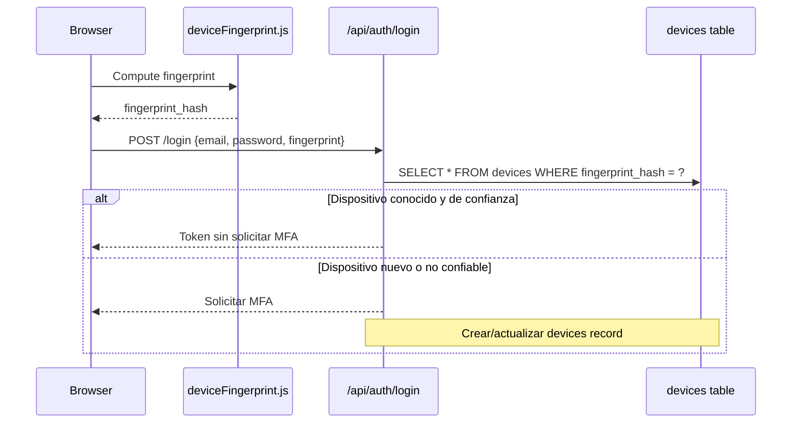

# API — Sesiones y Dispositivos

**Sesiones Base URL:** `/api/sessions`  
**Dispositivos Base URL:** `/api/devices`  
**Auth mínima:** `viewer`  

---

## Módulo Sesiones

Las sesiones rastrean el historial de accesos activos del usuario. Cada login exitoso crea una sesión en PostgreSQL con información del dispositivo, IP y user-agent.

### GET /api/sessions

**Descripción:** Lista las sesiones activas del usuario autenticado.  
**Auth:** `viewer+`

#### Respuesta 200

```json
{
  "success": true,
  "data": {
    "sessions": [
      {
        "id": "550e8400-e29b-41d4-a716-446655440000",
        "device_type": "desktop",
        "user_agent": "Mozilla/5.0 (Macintosh; Intel Mac OS X 10_15_7) AppleWebKit/537.36",
        "ip_address": "91.189.122.10",
        "last_active": "2026-06-01T15:00:00Z",
        "created_at": "2026-06-01T09:00:00Z",
        "is_current": true
      },
      {
        "id": "550e8400-e29b-41d4-a716-446655440001",
        "device_type": "mobile",
        "user_agent": "Mozilla/5.0 (iPhone; CPU iPhone OS 17_0)",
        "ip_address": "192.168.1.100",
        "last_active": "2026-05-31T18:00:00Z",
        "created_at": "2026-05-31T08:00:00Z",
        "is_current": false
      }
    ],
    "total": 2
  }
}
```

---

### DELETE /api/sessions/all

**Descripción:** Revoca todas las sesiones del usuario excepto la actual (logout global).  
**Auth:** `viewer+`

#### Respuesta 200

```json
{
  "success": true,
  "message": "Todas las demás sesiones han sido cerradas",
  "revoked_count": 3
}
```

> **Uso de seguridad:** Usar cuando se detecta acceso no autorizado en otras sesiones.

---

### DELETE /api/sessions/:id

**Descripción:** Revoca una sesión específica.  
**Auth:** `viewer+`

#### Respuesta 200

```json
{
  "success": true,
  "message": "Sesión cerrada correctamente"
}
```

#### Errores

| Código | Error | Descripción |
|---|---|---|
| 403 | `CANNOT_REVOKE_OTHER_SESSION` | Solo puedes revocar tus propias sesiones |
| 404 | `SESSION_NOT_FOUND` | Sesión no encontrada |

---

## Módulo Dispositivos

Los dispositivos son identificados mediante fingerprinting del navegador/cliente. Los dispositivos de confianza reducen fricciones de MFA en logins subsiguientes.

### GET /api/devices

**Descripción:** Lista todos los dispositivos registrados para el usuario autenticado.  
**Auth:** `viewer+`

#### Respuesta 200

```json
{
  "success": true,
  "data": {
    "devices": [
      {
        "id": 1,
        "name": "MacBook Pro (Chrome)",
        "trusted": true,
        "last_seen_at": "2026-06-01T15:00:00Z",
        "created_at": "2026-01-15T08:00:00Z"
      },
      {
        "id": 2,
        "name": "iPhone (Safari)",
        "trusted": false,
        "last_seen_at": "2026-05-20T10:00:00Z",
        "created_at": "2026-05-01T00:00:00Z"
      }
    ]
  }
}
```

---

### GET /api/devices/mine

**Descripción:** Igual que GET /api/devices — dispositivos del usuario autenticado.  
**Auth:** `viewer+`

---

### PATCH /api/devices/:id/trust

**Descripción:** Marca o desmarca un dispositivo como de confianza.  
**Auth:** `viewer+`

#### Request

```json
{
  "trusted": true
}
```

#### Respuesta 200

```json
{
  "success": true,
  "data": {
    "id": 2,
    "trusted": true,
    "name": "iPhone (Safari)"
  }
}
```

> **Nota:** Un dispositivo de confianza reduce la frecuencia de solicitudes MFA para ese usuario en ese dispositivo.

---

### DELETE /api/devices/:id

**Descripción:** Elimina un dispositivo registrado.  
**Auth:** `viewer+`

#### Respuesta 200

```json
{
  "success": true,
  "message": "Dispositivo eliminado correctamente"
}
```

---

## Device Fingerprinting

El sistema usa `frontend/src/shared/utils/deviceFingerprint.js` para generar un fingerprint único del dispositivo basado en:

- User-agent
- Resolución de pantalla
- Zona horaria
- Idioma del navegador
- Canvas fingerprint
- WebGL fingerprint

El fingerprint se hashea (SHA-256) antes de almacenarse en `devices.fingerprint_hash`.



---

## Tabla de Datos — PostgreSQL

### `sessions`

| Campo | Tipo | Descripción |
|---|---|---|
| `id` | UUID | Identificador único de sesión |
| `user_id` | INT | FK → users.id |
| `session_token` | TEXT | Token de sesión (hashed) |
| `device_type` | VARCHAR(32) | desktop/mobile/tablet |
| `user_agent` | TEXT | User-agent completo |
| `ip_address` | INET | IP del cliente |
| `last_active` | TIMESTAMPTZ | Última actividad |
| `created_at` | TIMESTAMPTZ | Inicio de sesión |
| `revoked` | BOOLEAN | Sesión revocada |
| `revoked_at` | TIMESTAMPTZ | Momento de revocación |

### `devices`

| Campo | Tipo | Descripción |
|---|---|---|
| `id` | SERIAL | Identificador |
| `user_id` | INT | FK → users.id |
| `fingerprint_hash` | TEXT | Hash SHA-256 del fingerprint |
| `name` | VARCHAR(255) | Nombre identificador |
| `trusted` | BOOLEAN | Dispositivo de confianza |
| `last_seen_at` | TIMESTAMPTZ | Última vez visto |
| `created_at` | TIMESTAMPTZ | Primera vez registrado |
