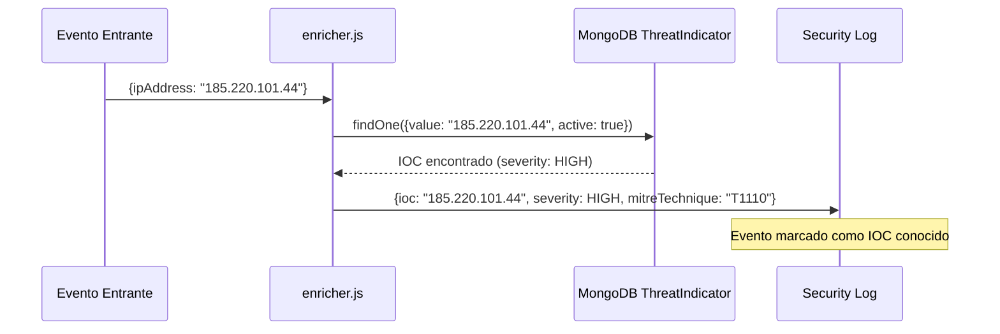

# API — Threat Intelligence

**Base URL:** `/api/threats`  
**Auth mínima:** `viewer` (lectura) / `analyst` (escritura)  

---

## Descripción General

El módulo de Threat Intelligence gestiona Indicadores de Compromiso (IOCs) y proporciona contexto sobre amenazas activas. Los IOCs se almacenan en MongoDB y se correlacionan automáticamente con eventos entrantes.

```mermaid
graph LR
    Manual[Analista] -->|POST /report| TI[Threat\nIntelligence DB]
    Honeypot[Honeypot] -->|Auto-enrich| TI
    VirusTotal[VirusTotal\nFeed - Roadmap] -->|Import| TI
    TI -->|Correlación| Events[Eventos entrantes]
    TI -->|Lookup| Search[/api/search/ioc/:ip]
```

---

## Endpoints

### GET /api/threats/indicators

**Descripción:** Lista los indicadores de compromiso (IOCs).  
**Auth:** `viewer+`

#### Query Parameters

| Parámetro | Tipo | Descripción |
|---|---|---|
| `type` | string | `IP\|DOMAIN\|HASH_MD5\|HASH_SHA256\|URL\|EMAIL\|CVE\|USER_AGENT` |
| `severity` | string | `LOW\|MEDIUM\|HIGH\|CRITICAL` |
| `active` | boolean | Solo activos (default: true) |
| `page` | number | Página |
| `limit` | number | Por página (default: 50) |
| `search` | string | Buscar por valor |

#### Respuesta 200

```json
{
  "success": true,
  "data": {
    "indicators": [
      {
        "_id": "60d5f5b8c9e4a12345678901",
        "type": "IP",
        "value": "185.220.101.44",
        "confidence": 95,
        "severity": "HIGH",
        "source": "honeypot",
        "description": "Known Tor exit node used in brute force campaigns",
        "tags": ["Tor", "Brute Force", "Scanning"],
        "firstSeen": "2026-05-15T10:00:00Z",
        "lastSeen": "2026-06-01T14:00:00Z",
        "hitCount": 890,
        "active": true,
        "mitreTactic": "TA0006",
        "mitreTechnique": "T1110",
        "country": "RO",
        "asn": "AS200350"
      }
    ],
    "pagination": {
      "page": 1,
      "limit": 50,
      "total": 347
    }
  }
}
```

---

### GET /api/threats/stats

**Descripción:** Estadísticas del módulo de Threat Intelligence.  
**Auth:** `viewer+`

#### Respuesta 200

```json
{
  "success": true,
  "data": {
    "total_indicators": 347,
    "active_indicators": 312,
    "by_type": {
      "IP": 189,
      "DOMAIN": 67,
      "HASH_MD5": 45,
      "CVE": 28,
      "URL": 18
    },
    "by_severity": {
      "CRITICAL": 23,
      "HIGH": 89,
      "MEDIUM": 156,
      "LOW": 79
    },
    "recently_added": 12,
    "avg_confidence": 78,
    "top_sources": [
      {"source": "honeypot", "count": 189},
      {"source": "manual", "count": 123},
      {"source": "internal", "count": 35}
    ]
  }
}
```

---

### GET /api/threats/feeds

**Descripción:** Lista los feeds de threat intelligence configurados.  
**Auth:** `viewer+`

#### Respuesta 200

```json
{
  "success": true,
  "data": {
    "feeds": [
      {
        "name": "RobenGate Honeypot Feed",
        "type": "internal",
        "status": "active",
        "indicators_count": 189,
        "last_updated": "2026-06-01T14:00:00Z"
      },
      {
        "name": "VirusTotal Integration",
        "type": "external",
        "status": "planned",
        "note": "Roadmap v2.5 — requiere API key"
      }
    ]
  }
}
```

---

### GET /api/threats/heatmap

**Descripción:** Datos para el mapa de calor de amenazas por país.  
**Auth:** `viewer+`

#### Respuesta 200

```json
{
  "success": true,
  "data": {
    "countries": [
      {"country": "RU", "count": 2341, "severity_max": "CRITICAL"},
      {"country": "CN", "count": 1892, "severity_max": "HIGH"},
      {"country": "NL", "count": 892, "severity_max": "HIGH"},
      {"country": "US", "count": 453, "severity_max": "MEDIUM"}
    ]
  }
}
```

---

### POST /api/threats/report

**Descripción:** Reporta un nuevo indicador de compromiso.  
**Auth:** `analyst+`

#### Request

```json
{
  "type": "IP",
  "value": "45.148.10.22",
  "confidence": 85,
  "severity": "HIGH",
  "description": "IP involved in SQL injection campaign against /api/users",
  "tags": ["SQLi", "API Abuse"],
  "mitreTactic": "TA0001",
  "mitreTechnique": "T1190",
  "country": "NL",
  "asn": "AS174"
}
```

#### Campos Requeridos

| Campo | Tipo | Requerido | Descripción |
|---|---|---|---|
| `type` | string | ✅ | Tipo de IOC |
| `value` | string | ✅ | El valor del indicador |
| `severity` | string | ✅ | Severidad |
| `confidence` | number | ❌ | 0-100 (default: 50) |
| `description` | string | ❌ | Descripción del indicador |
| `tags` | string[] | ❌ | Etiquetas |
| `mitreTactic` | string | ❌ | Táctica MITRE ATT&CK |
| `mitreTechnique` | string | ❌ | Técnica MITRE ATT&CK |

#### Respuesta 201

```json
{
  "success": true,
  "data": {
    "_id": "60d5f5b8c9e4a12345678902",
    "type": "IP",
    "value": "45.148.10.22",
    "severity": "HIGH",
    "active": true,
    "addedBy": "ana@empresa.com",
    "createdAt": "2026-06-01T15:00:00Z"
  }
}
```

#### Errores

| Código | Error | Descripción |
|---|---|---|
| 400 | `INVALID_IOC_TYPE` | Tipo de IOC no válido |
| 400 | `VALIDATION_ERROR` | Campos inválidos |
| 409 | `IOC_EXISTS` | Este indicador ya existe (value + type único) |
| 403 | `FORBIDDEN` | Requiere rol analyst+ |

---

## Tipos de IOC

| Tipo | Ejemplo | Descripción |
|---|---|---|
| `IP` | `185.220.101.44` | Dirección IP maliciosa |
| `DOMAIN` | `malware-c2.evil.com` | Dominio de C2 o distribución |
| `HASH_MD5` | `d41d8cd98f00b204e9800998ecf8427e` | Hash MD5 de malware |
| `HASH_SHA256` | `e3b0c44298fc1c149afb...` | Hash SHA-256 de malware |
| `URL` | `http://evil.com/payload.exe` | URL de distribución |
| `EMAIL` | `phishing@attacker.com` | Email de phishing |
| `CVE` | `CVE-2024-3400` | Vulnerabilidad CVE |
| `USER_AGENT` | `python-requests/2.31.0` | User-agent de tool de ataque |

---

## Correlación Automática

Cuando un evento entra por el pipeline de ingesta, el enriquecedor verifica automáticamente si la IP fuente, dominio o hash están en la base de IOCs:



---

## MITRE ATT&CK Integration

Los IOCs se mapean a tácticas y técnicas MITRE ATT&CK:

| Táctica | ID | Descripción |
|---|---|---|
| Reconocimiento | TA0043 | Gathering de información |
| Acceso inicial | TA0001 | Vectores de entrada |
| Persistencia | TA0003 | Mantenimiento de acceso |
| Evasión de defensas | TA0005 | Evitar detección |
| Acceso a credenciales | TA0006 | Robo de credenciales |
| Movimiento lateral | TA0008 | Expansión en la red |
| Exfiltración | TA0010 | Robo de datos |
| Impacto | TA0040 | Manipulación/destrucción |

Ver: [https://attack.mitre.org/tactics/enterprise/](https://attack.mitre.org/tactics/enterprise/)

---

## Ejemplo cURL

```bash
# Buscar IOCs de tipo IP de alta severidad
curl -X GET "https://api.tudominio.com/api/threats/indicators?type=IP&severity=HIGH&active=true" \
  -H "Authorization: Bearer TOKEN"

# Reportar nueva IP maliciosa
curl -X POST "https://api.tudominio.com/api/threats/report" \
  -H "Authorization: Bearer TOKEN" \
  -H "Content-Type: application/json" \
  -d '{
    "type": "IP",
    "value": "203.0.113.0",
    "severity": "HIGH",
    "confidence": 90,
    "description": "Scanning our honeypot SSH port",
    "tags": ["Scanning", "Honeypot"],
    "mitreTechnique": "T1046"
  }'
```
