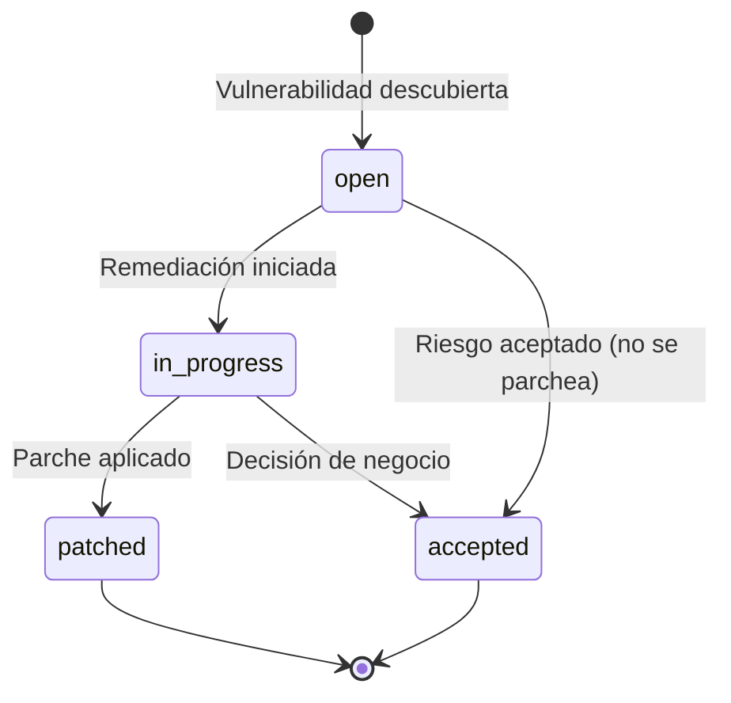

# API — Vulnerabilidades

**Base URL:** `/api/vulnerabilities`  
**Auth mínima:** `viewer` (lectura) / `analyst` (escritura)  

---

## Descripción General

El módulo de vulnerabilidades gestiona el inventario CVE de la organización. Permite trackear el estado de parcheo de vulnerabilidades conocidas, sus puntuaciones CVSS y componentes afectados.

---

## Endpoints

### GET /api/vulnerabilities

**Descripción:** Lista el inventario de vulnerabilidades.  
**Auth:** `viewer+`

#### Query Parameters

| Parámetro | Tipo | Descripción |
|---|---|---|
| `page` | number | Página (default: 1) |
| `limit` | number | Por página (default: 25) |
| `severity` | string | `info\|low\|medium\|high\|critical` |
| `status` | string | `open\|in_progress\|patched\|accepted` |
| `component` | string | Filtrar por componente |
| `search` | string | Buscar en CVE ID y título |

#### Respuesta 200

```json
{
  "success": true,
  "data": {
    "vulnerabilities": [
      {
        "id": 1,
        "cve_id": "CVE-2024-4040",
        "title": "CrushFTP Server-Side Template Injection",
        "description": "Unauthenticated SSTI allows remote code execution as root.",
        "severity": "critical",
        "cvss": 9.8,
        "status": "open",
        "component": "CrushFTP",
        "affected_versions": "< 11.1.0",
        "fixed_version": "11.1.0",
        "published": "2024-04-22",
        "tags": ["RCE", "Authentication Bypass"],
        "refs": ["https://nvd.nist.gov/vuln/detail/CVE-2024-4040"],
        "created_at": "2026-01-15T00:00:00Z",
        "updated_at": "2026-06-01T00:00:00Z",
        "organization_id": 1
      }
    ],
    "pagination": {
      "page": 1,
      "limit": 25,
      "total": 87
    },
    "summary": {
      "critical": 4,
      "high": 12,
      "medium": 31,
      "open": 45,
      "patched": 32
    }
  }
}
```

---

### POST /api/vulnerabilities

**Descripción:** Crea una nueva entrada de vulnerabilidad.  
**Auth:** `analyst+`

#### Request

```json
{
  "cve_id": "CVE-2024-1234",
  "title": "Remote Code Execution in Custom Component",
  "description": "Deserialization vulnerability in the custom data processor allows RCE.",
  "severity": "critical",
  "cvss": 9.0,
  "component": "data-processor",
  "affected_versions": "< 2.1.0",
  "fixed_version": "2.1.0",
  "published": "2024-06-01",
  "tags": ["RCE", "Deserialization"],
  "refs": ["https://nvd.nist.gov/vuln/detail/CVE-2024-1234"]
}
```

#### Campos

| Campo | Tipo | Requerido | Descripción |
|---|---|---|---|
| `title` | string | ✅ | Título descriptivo |
| `severity` | string | ✅ | Severidad CVSS |
| `cve_id` | string | ❌ | ID CVE (ej: CVE-2024-1234) |
| `description` | string | ❌ | Descripción detallada |
| `cvss` | number | ❌ | Puntuación CVSS (0.0-10.0) |
| `status` | string | ❌ | Estado (default: open) |
| `component` | string | ❌ | Componente afectado |
| `affected_versions` | string | ❌ | Versiones afectadas |
| `fixed_version` | string | ❌ | Versión con el fix |
| `published` | date | ❌ | Fecha de publicación |
| `tags` | string[] | ❌ | Etiquetas de clasificación |
| `refs` | string[] | ❌ | URLs de referencia |

#### Respuesta 201

```json
{
  "success": true,
  "data": {
    "id": 88,
    "cve_id": "CVE-2024-1234",
    "title": "Remote Code Execution in Custom Component",
    "severity": "critical",
    "status": "open",
    "created_at": "2026-06-01T15:00:00Z"
  }
}
```

---

### PATCH /api/vulnerabilities/:id

**Descripción:** Actualiza el estado y detalles de una vulnerabilidad.  
**Auth:** `analyst+`

#### Request

```json
{
  "status": "patched",
  "fixed_version": "2.1.1",
  "description": "Updated: Patch deployed to all production instances on 2026-06-01"
}
```

#### Respuesta 200

```json
{
  "success": true,
  "data": {
    "id": 88,
    "status": "patched",
    "updated_at": "2026-06-01T16:00:00Z"
  }
}
```

---

## Estados del Ciclo de Vida



| Estado | Descripción |
|---|---|
| `open` | Vulnerabilidad activa, pendiente de remediación |
| `in_progress` | Remediación en curso |
| `patched` | Parche aplicado y verificado |
| `accepted` | Riesgo aceptado por decisión de negocio |

---

## Puntuación CVSS

| Rango | Severidad | Color |
|---|---|---|
| 0.1 - 3.9 | LOW | 🟢 |
| 4.0 - 6.9 | MEDIUM | 🟡 |
| 7.0 - 8.9 | HIGH | 🟠 |
| 9.0 - 10.0 | CRITICAL | 🔴 |

---

## Vulnerabilidades Pre-cargadas (Demo)

| CVE | Título | CVSS | Estado |
|---|---|---|---|
| CVE-2024-4040 | CrushFTP SSTI | 9.8 | open |
| CVE-2024-3400 | PAN-OS Command Injection | 10.0 | in_progress |
| CVE-2024-21413 | Outlook NTLM Hash Leak | 9.8 | patched |
| CVE-2024-27198 | JetBrains TeamCity Auth Bypass | 9.8 | patched |
| CVE-2024-1708 | ConnectWise Path Traversal | 8.4 | in_progress |
| CVE-2024-0519 | Chromium V8 OOB | 8.8 | patched |
| CVE-2023-46604 | Apache ActiveMQ RCE | 9.8 | patched |

---

## Ejemplo cURL

```bash
# Listar vulnerabilidades críticas abiertas
curl -X GET "https://api.tudominio.com/api/vulnerabilities?severity=critical&status=open" \
  -H "Authorization: Bearer TOKEN"

# Marcar CVE como parchado
curl -X PATCH "https://api.tudominio.com/api/vulnerabilities/1" \
  -H "Authorization: Bearer TOKEN" \
  -H "Content-Type: application/json" \
  -d '{"status": "patched", "fixed_version": "11.1.0"}'
```
