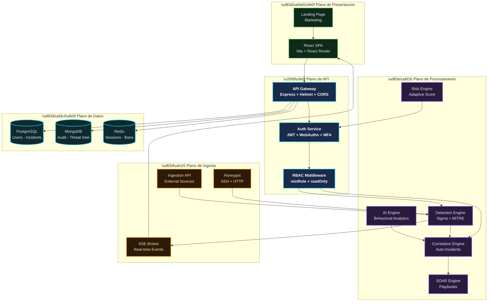
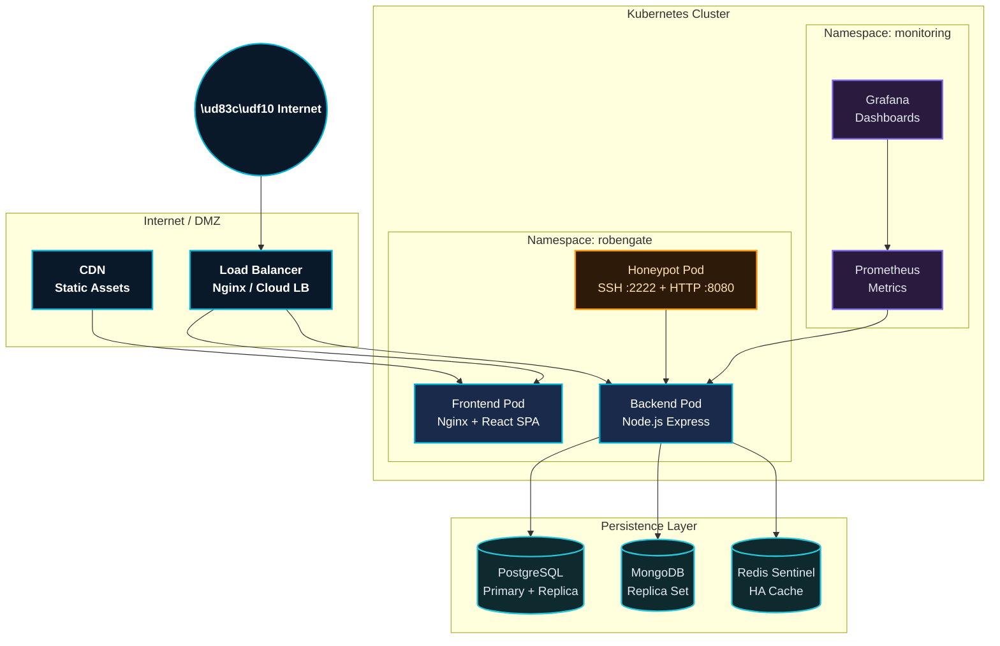
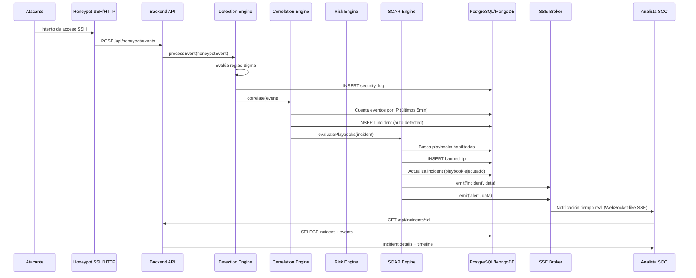
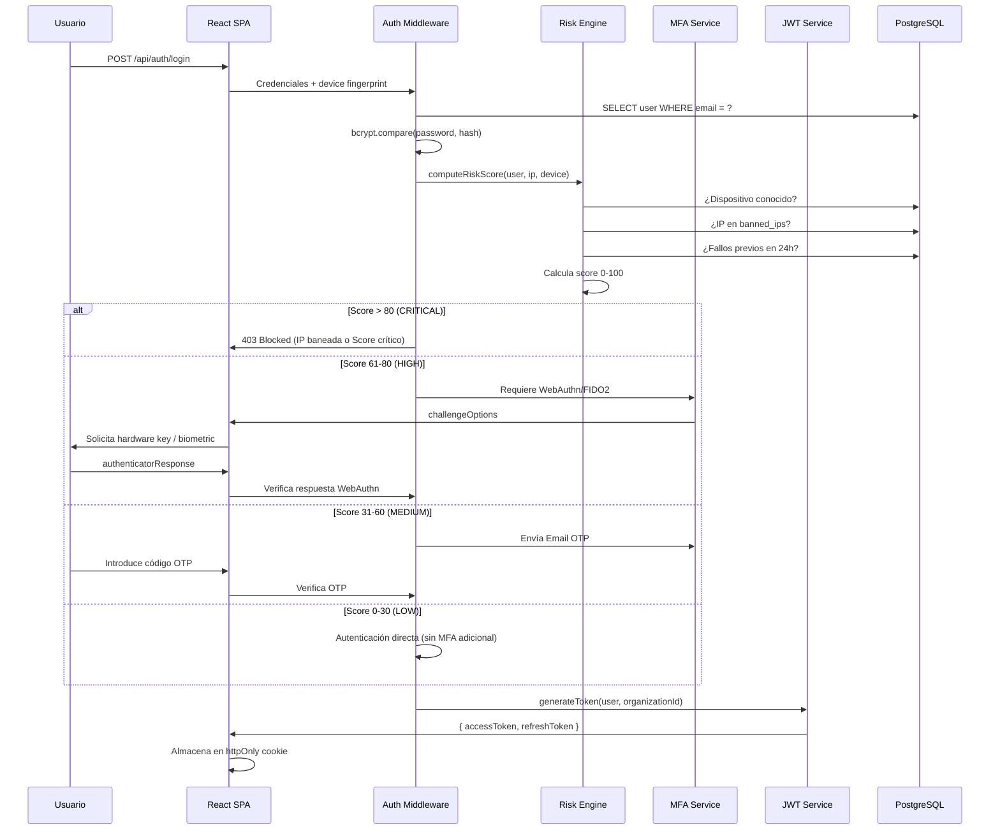
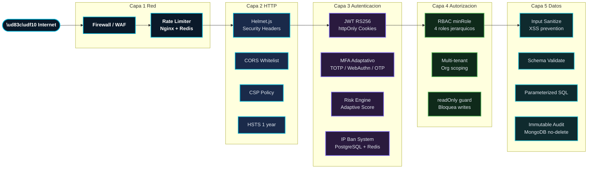
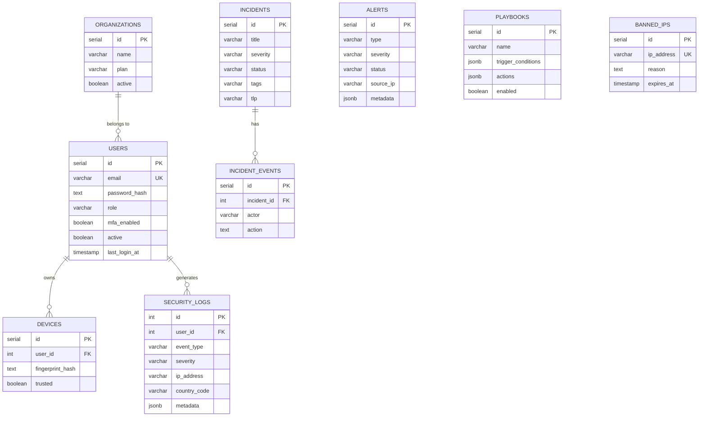
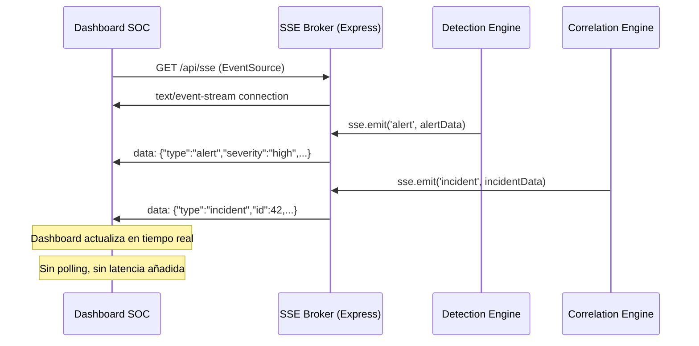
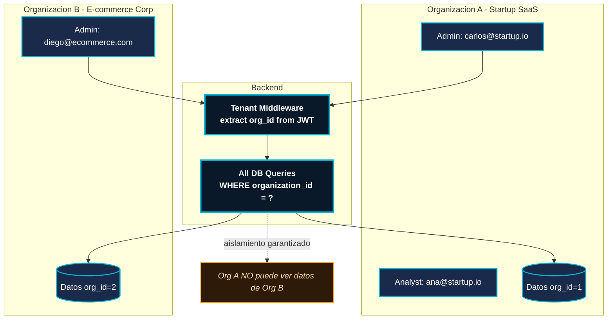

# Arquitectura Empresarial — RobenGate Sentinel

**Autor:** Principal Cybersecurity Architect  
**Versión:** 2.0.0  
**Fecha:** Junio 2026  
**Estado:** Producción

---

## 1. Arquitectura Lógica

### Descripción General

RobenGate Sentinel sigue una arquitectura de microservicios ligeros monorepo con separación clara de responsabilidades entre el plano de datos, el plano de control y el plano de presentación.



---

## 2. Arquitectura Física

### Deployment Stack



### Requerimientos de Infraestructura

| Tier | CPU | RAM | Almacenamiento | Descripción |
|---|---|---|---|---|
| Development | 2 cores | 4 GB | 20 GB | Docker Compose local |
| Small (< 100 usuarios) | 4 cores | 8 GB | 100 GB | Single node Kubernetes |
| Medium (100-500 usuarios) | 8 cores | 16 GB | 500 GB | HA Kubernetes (3 nodos) |
| Large (500+ usuarios) | 16+ cores | 32+ GB | 2+ TB | Multi-region Kubernetes |

---

## 3. Arquitectura de Aplicación

### Estructura del Backend

```
backend/
├── app.js                    # Entry point, middleware stack
├── src/
│   ├── config/
│   │   ├── database.js       # PostgreSQL connection pool
│   │   ├── security.js       # Security configuration constants
│   │   └── redis.js          # Redis client configuration
│   ├── middleware/
│   │   ├── authenticate.js   # JWT verification + user hydration
│   │   ├── authorize.js      # RBAC: authorize() + minRole() + readOnly()
│   │   ├── rateLimiter.js    # Rate limiting (api, auth, ingestion tiers)
│   │   ├── sanitize.js       # Input sanitization (XSS prevention)
│   │   ├── autoban.js        # Redis-backed IP ban check
│   │   ├── attackDetection.js # Real-time attack pattern detection
│   │   ├── tenant.js         # Multi-tenancy organization scoping
│   │   ├── validate.js       # Request validation schemas
│   │   ├── internalAuth.js   # Internal service-to-service auth
│   │   └── errorHandler.js   # Centralized error handling
│   ├── routes/               # 22 route files (91+ endpoints)
│   ├── controllers/          # Business logic layer
│   ├── services/             # Core processing engines
│   │   ├── detectionEngine.js     # Sigma rules + MITRE ATT&CK
│   │   ├── correlationEngine.js   # Incident auto-creation
│   │   ├── aiCorrelationEngine.js # Behavioral analytics
│   │   ├── riskEngine.js          # Adaptive risk scoring
│   │   ├── soarEngine.js          # Playbook automation
│   │   ├── auditService.js        # Immutable audit trail
│   │   ├── authService.js         # Auth orchestration
│   │   ├── geoService.js          # IP geolocation
│   │   ├── elasticsearchService.js # Search integration
│   │   └── honeypotService.js     # Honeypot event processing
│   ├── models/               # MongoDB models
│   └── lib/
│       ├── sse.js            # Server-Sent Events broker
│       ├── logger.js         # Structured logging (Winston)
│       ├── mongodb.js        # MongoDB connection
│       └── redis.js          # Redis client
```

### Estructura del Frontend

```
frontend/src/
├── app/
│   ├── App.jsx               # Root component
│   └── routes.jsx            # React Router v6 configuration
├── features/
│   ├── auth/                 # Login, MFA, WebAuthn, Register
│   ├── dashboard/            # Main SOC dashboard + metrics
│   ├── alerts/               # Alert management + triage
│   ├── incidents/            # Incident lifecycle management
│   ├── attackmap/            # Real-time geospatial attack visualization
│   ├── ai/                   # AI analysis + behavioral analytics
│   ├── security/             # Security logs + threat hunting
│   ├── users/                # User + device + session management
│   ├── vulnerabilities/      # Vulnerability management
│   ├── landing/              # Marketing landing page
│   └── marketing/            # SaaS marketing materials
├── shared/
│   ├── config/permissions.js # Centralized RBAC permissions map
│   ├── hooks/usePermission.js # usePermission() React hook
│   ├── components/PermissionGate.jsx # Conditional rendering by role
│   └── components/PageLayout.jsx    # Layout with role-aware sidebar
└── styles/                   # Global CSS + design system
```

---

## 4. Arquitectura de Flujo de Datos

### Flujo Crítico: Evento de Seguridad → Respuesta Automatizada



### Flujo de Autenticación con Risk Engine



---

## 5. Arquitectura de Seguridad

### Capas de Defensa



### Modelo de Seguridad: Defense in Depth

| Capa | Mecanismo | Protege Contra |
|---|---|---|
| Red | Rate limiting, IP banning | DoS, brute force, scanning |
| HTTP | Helmet.js headers, HSTS, CSP, no-cache | XSS, clickjacking, MITM, sniffing |
| Autenticación | JWT RS256, MFA obligatorio para roles altos, WebAuthn | Credential theft, session hijacking |
| Autorización | RBAC con jerarquía de roles + readOnly() | Escalada de privilegios, acceso no autorizado |
| Input | Sanitización + validación + parameterized queries | XSS, SQLi, injection |
| Datos | Audit trail inmutable en MongoDB | Tampering de evidencia forense |
| Detección | Detection Engine + Correlation Engine | Ataques en curso no detectados |
| Respuesta | SOAR + auto-ban | Tiempos de respuesta lentos |

---

## 6. Arquitectura de Base de Datos

### Modelo Relacional (PostgreSQL)



### Modelo de Documentos (MongoDB)

#### Colección: audit_logs
```json
{
  "_id": "ObjectId",
  "timestamp": "ISODate",
  "actor_id": 42,
  "actor_email": "admin@company.com",
  "actor_role": "admin",
  "action": "USER_CREATED",
  "resource": "users",
  "resource_id": "123",
  "ip_address": "192.168.1.1",
  "user_agent": "Mozilla/5.0...",
  "organization_id": 1,
  "metadata": { "target_email": "new@company.com" }
}
```

#### Colección: threat_indicators
```json
{
  "_id": "ObjectId",
  "type": "ip",
  "value": "185.220.101.45",
  "severity": "critical",
  "confidence": 95,
  "tags": ["tor-exit-node", "scanner", "brute-force"],
  "source": "honeypot",
  "first_seen": "ISODate",
  "last_seen": "ISODate",
  "organization_id": 1,
  "ttl_expires": "ISODate"
}
```

---

## 7. Arquitectura de Tiempo Real (SSE)

### Server-Sent Events vs. WebSockets

| Criterio | SSE (elegido) | WebSockets |
|---|---|---|
| Dirección del flujo | Server → Client (unidireccional) | Bidireccional |
| Reconexión automática | ✅ Nativa en el browser | ❌ Requiere implementación manual |
| Compatibilidad con proxies | ✅ HTTP estándar | ⚠️ Puede requerir configuración |
| Escalabilidad | ✅ Simple sin estado de conexión WS | ✅ Similar |
| Caso de uso de RobenGate | Server envía eventos al SOC | El SOC no necesita enviar streams |

### Flujo SSE



---

## 8. Arquitectura Multi-Tenant

### Modelo de Aislamiento de Datos



### Implementación del Tenant Middleware

El middleware `tenant.js` extrae el `organization_id` del JWT y lo inyecta en `req.organizationId`. Todos los queries de base de datos aplican este filtro automáticamente, garantizando el aislamiento de datos entre tenants.

---

## 9. Arquitectura de Observabilidad

### Stack de Monitorización

| Componente | Herramienta | Datos Recopilados |
|---|---|---|
| Métricas de aplicación | Prometheus + /metrics endpoint | Requests/s, latencia, errores HTTP |
| Logs estructurados | Winston → stdout → Fluent Bit | Todos los eventos de aplicación |
| Dashboard de métricas | Grafana | Visualización de Prometheus |
| Health checks | /api/health endpoint | Estado de DB, Redis, Mongo, ES |
| Tracing (roadmap) | OpenTelemetry | Distributed traces |

### Health Check Response
```json
{
  "status": "healthy",
  "timestamp": "2026-06-08T10:00:00.000Z",
  "version": "2.0.0",
  "checks": {
    "postgresql": { "status": "ok", "latency_ms": 2 },
    "mongodb":    { "status": "ok", "latency_ms": 3 },
    "redis":      { "status": "ok", "latency_ms": 1 },
    "elasticsearch": { "status": "ok", "latency_ms": 8 }
  }
}
```

---

## 10. Decisiones de Arquitectura (Architecture Decision Records)

### ADR-001: PostgreSQL + MongoDB (Dual Database)

**Contexto:** Los logs de seguridad necesitan ser inmutables (evidencia forense) y al mismo tiempo consultables con joins relacionales.

**Decisión:** PostgreSQL para datos transaccionales relacionales, MongoDB para audit logs inmutables y threat indicators con schema flexible.

**Consecuencias positivas:** Inmutabilidad garantizada a nivel de aplicación en MongoDB. Joins eficientes en PostgreSQL. Flexibilidad de schema para metadata variable de eventos.

**Consecuencias negativas:** Mayor complejidad operacional. Dos sistemas de base de datos que mantener.

---

### ADR-002: SSE en lugar de WebSockets

**Contexto:** El dashboard SOC necesita actualizaciones en tiempo real de alertas, incidentes y métricas.

**Decisión:** Server-Sent Events (SSE) sobre WebSockets.

**Razón:** El flujo de datos es unidireccional (servidor → cliente). SSE tiene reconexión automática nativa, es HTTP estándar, y tiene menor complejidad de implementación.

---

### ADR-003: RBAC jerárquico con `minRole()` en lugar de permisos atómicos

**Contexto:** 4 roles con jerarquía clara (admin > analyst > responder > viewer). 91+ endpoints con diferentes niveles de acceso.

**Decisión:** Middleware `minRole(roleName)` que compara posiciones en array de jerarquía.

**Razón:** Simple, predecible, sin tablas de permisos complejas para una jerarquía lineal. El 95% de los endpoints se protege correctamente con este modelo. El 5% restante (permisos por recurso) se maneja con `organization_id` scoping.

---

### ADR-004: JWT en httpOnly cookies, no localStorage

**Contexto:** Almacenamiento seguro de tokens de autenticación en el frontend.

**Decisión:** JWT almacenado en cookies httpOnly + SameSite=Strict, no en localStorage.

**Razón:** localStorage es accesible por JavaScript y vulnerable a XSS. Las cookies httpOnly son inaccesibles para JavaScript. La combinación con CSP estricto hace el token inasequible para scripts maliciosos.

---

*Documento generado por: Principal Cybersecurity Architect*  
*RobenGate Sentinel v2.0.0 — Junio 2026*
