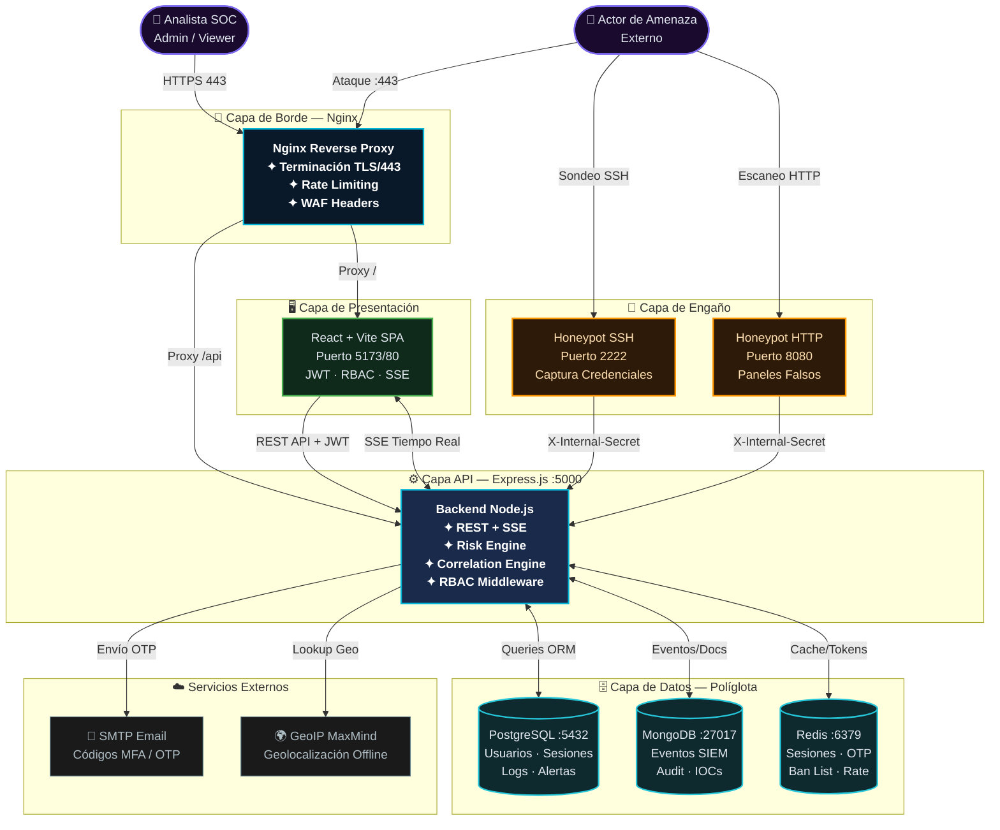
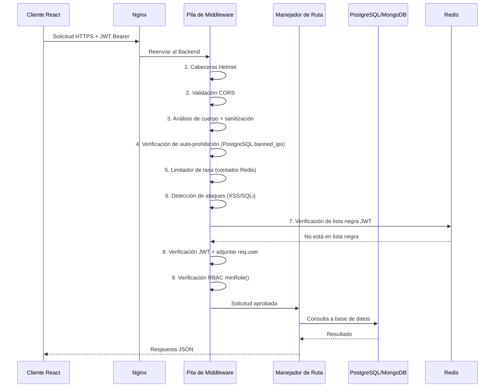
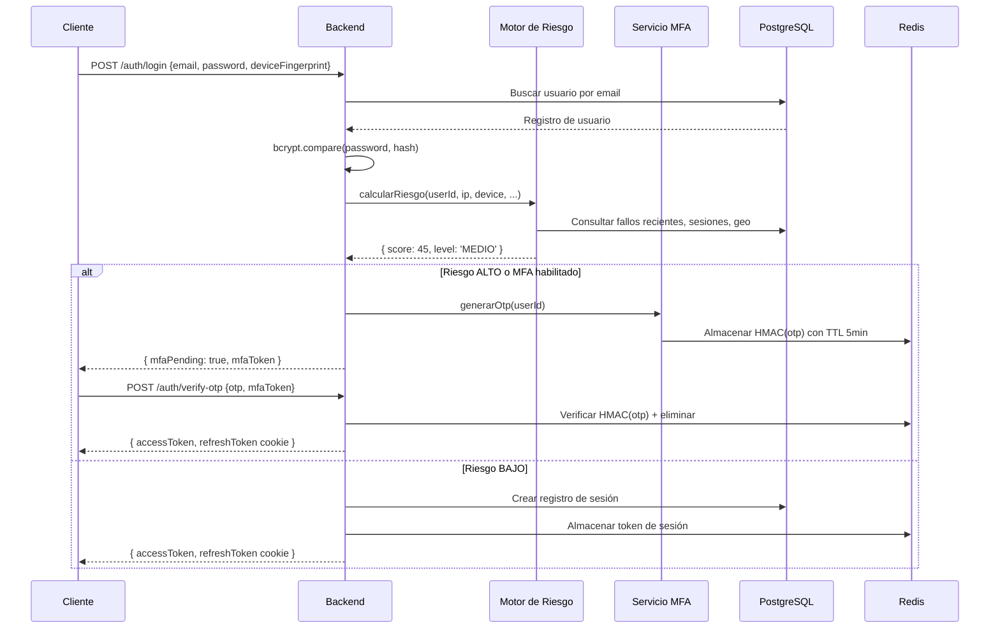
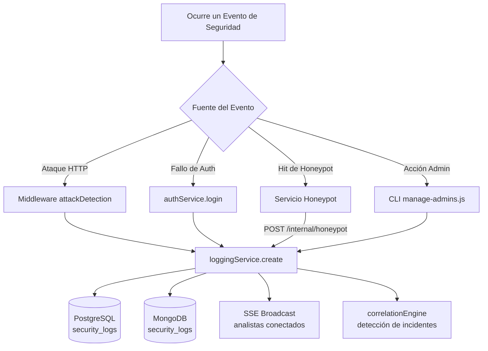

# Arquitectura del Sistema — RobenGate Sentinel

> **Clasificación:** INTERNO | **Versión:** 1.0.0

---

## Resumen Ejecutivo

RobenGate Sentinel está diseñado como una **plataforma SOC empresarial** que combina la cohesión de un monolito con la capacidad de despliegue independiente de los microservicios. La arquitectura implementa tres principios fundamentales de seguridad empresarial: **Confianza Cero** (Zero-Trust), **Defensa en Profundidad** (Defense-in-Depth) y **Arquitectura Orientada a Eventos**, garantizando que ningún fallo aislado comprometa la seguridad global de la plataforma.

---

## 1. Filosofía de Arquitectura

RobenGate Sentinel está diseñado como un **monolito adyacente a microservicios** — una plataforma cohesionada cuyos componentes son desplegables de forma independiente, se comunican mediante APIs internas bien definidas y pueden escalar horizontalmente en cada nivel. El diseño sigue:

- **Seguridad de Confianza Cero** — Cada solicitud es autenticada y autorizada independientemente del origen
- **Defensa en Profundidad** — Múltiples capas de seguridad superpuestas previenen fallos de punto único
- **Núcleo Orientado a Eventos** — Los eventos de seguridad fluyen a través de un pipeline centralizado para correlación
- **Degradación Elegante** — Los fallos de componentes individuales (Redis, MongoDB) no colapsan la plataforma

---

## 2. Topología del Sistema



---

## Descripción Técnica

### 3. Topología de Servicios

| Servicio | Puerto | Protocolo | Descripción |
|----------|--------|-----------|-------------|
| **Nginx** | 80/443 | HTTP/HTTPS | Terminación TLS, proxy inverso, archivos estáticos |
| **Frontend** | 5173 (dev) / 80 (prod) | HTTP | SPA React servida por Nginx |
| **API Backend** | 5000 | HTTP + SSE | API REST Express.js y flujo de eventos en tiempo real |
| **PostgreSQL** | 5432 | TCP | Base de datos relacional principal |
| **MongoDB** | 27017 | TCP | Almacén de documentos para eventos e inteligencia de amenazas |
| **Redis** | 6379 | TCP | Lista negra de tokens, caché OTP, limitación de tasa |
| **Honeypot SSH** | 2222 | SSH | Servidor SSH falso para capturar ataques de rociado de credenciales |
| **Honeypot HTTP** | 8080 | HTTP | Paneles de administración falsos para capturar escaneos y exploits |

---

## Flujo Operacional

### 4. Arquitectura de Flujo de Solicitudes

#### 4.1 Flujo de Solicitud API Autenticada



#### 4.2 Flujo de Autenticación



---

## 5. Pila de Middleware (Ordenada)

El backend procesa cada solicitud a través de una cadena de middleware determinista:

```
1. Helmet.js           → Cabeceras de seguridad (CSP, HSTS, XFO, etc.)
2. Middleware CORS      → Validación de origen, política de credenciales
3. Analizador JSON      → Análisis de cuerpo (límite 256kb)
4. Analizador Cookies   → Acceso a cookies HttpOnly
5. Confianza en Proxy   → Extracción precisa de IP detrás de Nginx
6. Sanitización Entrada → HPP, inyección NoSQL, eliminación de bytes nulos
7. Verificación Auto-Prohibición → Consulta PostgreSQL banned_ips
8. Limitador de Tasa Global → 200 req/15min por IP (respaldado por Redis)
9. Detección de Ataques → Coincidencia de patrones XSS/SQLi → transmisión SSE
10. authenticate()      → Verificación JWT + lista negra Redis
11. minRole()/authorize() → Aplicación RBAC + registro de denegación de acceso
12. Manejador de Ruta  → Lógica de negocio
13. Manejador de Errores → Respuestas de error normalizadas (enmascara 5xx en producción)
```

---

## 6. Arquitectura del Flujo de Datos

### 6.1 Pipeline de Eventos de Seguridad



---

## Casos de Uso

| Caso de Uso | Componentes Involucrados | Resultado |
|-------------|-------------------------|-----------|
| **Login con Riesgo Alto** | Motor de Riesgo → MFA → JWT | Acceso con step-up MFA |
| **Ataque XSS Bloqueado** | Middleware → SSE → Correlación | Alerta + posible prohibición de IP |
| **Sondeo de Honeypot** | Honeypot → API Interna → SIEM | IOC creado + incidente de reconocimiento |
| **Análisis Forense** | Logs MongoDB → Caza de Amenazas | Reconstrucción de timeline |

---

## Seguridad

### Controles de Seguridad por Capa

| Capa | Controles Implementados |
|------|------------------------|
| **Borde (Nginx)** | TLS 1.3, HSTS, limitación de tasa, bloqueo de /internal/* |
| **API (Express)** | Helmet CSP, CORS, sanitización de entradas, detección de ataques |
| **Autenticación** | bcrypt-12, JWT de doble token, lista negra Redis, MFA |
| **Autorización** | RBAC de 4 niveles, auditoría de denegaciones, acceso de solo lectura |
| **Datos (PostgreSQL)** | Consultas parametrizadas, principio de mínimo privilegio |
| **Datos (MongoDB)** | Logs de solo inserción (inmutabilidad), TTL 365 días |
| **Servicios** | Secreto interno de API con comparación en tiempo constante |

---

## Integraciones

La arquitectura se integra con los siguientes sistemas externos e internos:

- **MaxMind GeoLite2** — Geolocalización de IP para señales de riesgo
- **Twilio** — Entrega de SMS para MFA
- **SMTP** — Entrega de email para OTP y notificaciones
- **WebAuthn/FIDO2** — Autenticación sin contraseña mediante llaves de paso

---

## Escalabilidad

| Componente | Estrategia de Escalado |
|-----------|----------------------|
| Backend Express | Sin estado → múltiples instancias detrás de balanceador de carga |
| PostgreSQL | Réplicas de lectura para consultas analíticas |
| MongoDB | Fragmentación para colecciones de security_logs de alto volumen |
| Redis | Sentinel para alta disponibilidad + clúster para escala |
| Frontend | CDN + activos estáticos en Nginx |

---

## Roadmap

| Capacidad | Descripción | Estado |
|-----------|-------------|--------|
| **Multi-tenancy** | Aislamiento de organización a nivel de base de datos | Planificado |
| **Agentes EDR** | Telemetría de endpoints hacia la plataforma | Planificado |
| **Módulo SOAR** | Playbooks de respuesta automatizada | Planificado |
| **Federación SIEM** | Ingesta de logs de Splunk/Elastic/QRadar | Futuro |
| **IA/ML avanzado** | Detección de anomalías con Isolation Forest | Futuro |

---

*Ver también: [../security/resumen.md](../security/resumen.md) | [../siem/resumen.md](../siem/resumen.md) | [../infrastructure/resumen.md](../infrastructure/resumen.md)*
