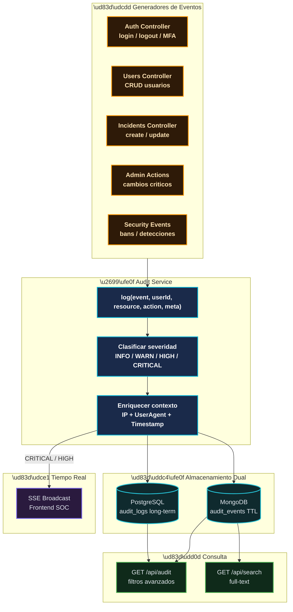
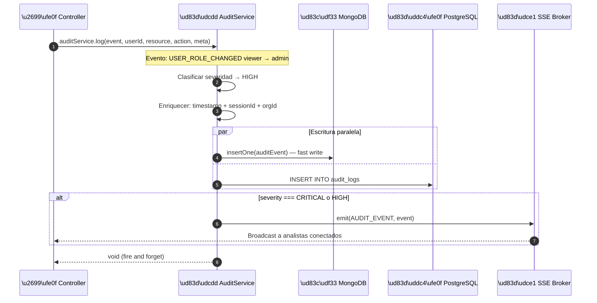

# Flujo del Sistema de Auditoría — RobenGate Sentinel

**Módulo:** `backend/src/services/auditService.js`  
**Versión:** 2.0 | **Fecha:** Junio 2026

---

## Descripción General

El sistema de auditoría registra **todas las acciones relevantes** del sistema con contexto completo (quién, qué, cuándo, desde dónde). El trail de auditoría es inmutable e inalterable por usuarios normales, cumpliendo requisitos de ISO 27001, SOC 2 y GDPR.

---

## Arquitectura del Audit Trail



---

## Eventos de Auditoría Registrados

### Categoría: Autenticación

| Evento | Severidad | Disparador |
|---|---|---|
| `AUTH_LOGIN_SUCCESS` | INFO | Login exitoso |
| `AUTH_LOGIN_FAILURE` | WARN | Credenciales incorrectas |
| `AUTH_LOGIN_BLOCKED` | HIGH | IP baneada o score riesgo crítico |
| `AUTH_LOGOUT` | INFO | Logout voluntario |
| `AUTH_MFA_REQUIRED` | INFO | Risk score medio → MFA activado |
| `AUTH_MFA_SUCCESS` | INFO | MFA verificado correctamente |
| `AUTH_MFA_FAILURE` | WARN | Código MFA incorrecto |
| `AUTH_TOKEN_REFRESH` | INFO | Token renovado |
| `AUTH_TOKEN_REVOKED` | WARN | Token invalidado manualmente |
| `AUTH_WEBAUTHN_REGISTERED` | INFO | Passkey registrada |
| `AUTH_WEBAUTHN_AUTH` | INFO | Autenticación WebAuthn |

### Categoría: Gestión de Usuarios

| Evento | Severidad | Disparador |
|---|---|---|
| `USER_CREATED` | INFO | Nuevo usuario creado |
| `USER_UPDATED` | INFO | Perfil actualizado |
| `USER_DELETED` | HIGH | Usuario eliminado |
| `USER_ROLE_CHANGED` | HIGH | Cambio de rol (ej: viewer → admin) |
| `USER_PASSWORD_CHANGED` | WARN | Contraseña cambiada |
| `USER_MFA_ENABLED` | INFO | MFA activado |
| `USER_MFA_DISABLED` | HIGH | MFA desactivado (acción de riesgo) |

### Categoría: Incidentes y Seguridad

| Evento | Severidad | Disparador |
|---|---|---|
| `INCIDENT_CREATED` | HIGH | Nuevo incidente de seguridad |
| `INCIDENT_ESCALATED` | CRITICAL | Incidente escalado |
| `INCIDENT_RESOLVED` | INFO | Incidente cerrado |
| `ALERT_TRIGGERED` | HIGH | Alerta de detección activada |
| `IP_BANNED` | HIGH | IP baneada automáticamente |
| `IP_UNBANNED` | INFO | IP desbaneada manualmente |
| `PLAYBOOK_EXECUTED` | HIGH | Playbook SOAR ejecutado |
| `HONEYPOT_ATTACK` | HIGH | Ataque capturado en honeypot |

### Categoría: Administración

| Evento | Severidad | Disparador |
|---|---|---|
| `ORG_CREATED` | INFO | Nueva organización |
| `ORG_SETTINGS_CHANGED` | HIGH | Configuración cambiada |
| `ADMIN_BULK_DELETE` | CRITICAL | Eliminación masiva de datos |
| `SYSTEM_CONFIG_CHANGED` | CRITICAL | Cambio de configuración del sistema |

---

## Flujo de Escritura de Audit Log



---

## Estructura del Documento de Auditoría

```json
{
  "_id": "ObjectId('...')",
  "eventId": "550e8400-e29b-41d4-a716-446655440000",
  "event": "USER_ROLE_CHANGED",
  "severity": "high",
  "category": "user_management",
  "timestamp": "2026-06-15T10:30:00.000Z",
  
  "actor": {
    "userId": "admin-uuid",
    "email": "admin@empresa.com",
    "role": "admin",
    "ip": "192.168.1.100",
    "userAgent": "Mozilla/5.0..."
  },
  
  "target": {
    "resource": "user",
    "resourceId": "user-uuid",
    "email": "analista@empresa.com"
  },
  
  "changes": {
    "role": { "from": "viewer", "to": "analyst" }
  },
  
  "organization": {
    "id": "org-uuid",
    "name": "Empresa SL"
  },
  
  "sessionId": "session-uuid",
  "requestId": "req-uuid",
  
  "result": "success",
  "metadata": { "reason": "Promoted to analyst role" }
}
```

---

## Consulta del Audit Trail

### Via API REST

```bash
# Eventos de los últimos 7 días
curl -H "Authorization: Bearer $TOKEN" \
  "https://tudominio.com/api/audit?from=2026-06-08T00:00:00Z"

# Eventos críticos de un usuario específico
curl -H "Authorization: Bearer $TOKEN" \
  "https://tudominio.com/api/audit?userId=uuid&severity=critical"

# Eventos de autenticación fallida
curl -H "Authorization: Bearer $TOKEN" \
  "https://tudominio.com/api/audit?category=auth&event=AUTH_LOGIN_FAILURE"
```

### Via MongoDB Directo

```javascript
// Últimos 100 eventos críticos
db.audit_events.find(
  { severity: { $in: ['critical', 'high'] } }
).sort({ timestamp: -1 }).limit(100)

// Actividad de un usuario en una fecha
db.audit_events.find({
  'actor.userId': 'uuid-del-usuario',
  timestamp: {
    $gte: new Date('2026-06-15T00:00:00Z'),
    $lt:  new Date('2026-06-16T00:00:00Z')
  }
})
```

---

## Retención y Cumplimiento

| Tipo de Evento | Retención MongoDB | Retención PostgreSQL |
|---|---|---|
| INFO | 30 días (TTL) | 90 días |
| WARN | 90 días (TTL) | 1 año |
| HIGH | 6 meses (TTL) | 2 años |
| CRITICAL | Sin TTL (manual) | Indefinido |

**Nota para cumplimiento:** Los eventos CRITICAL nunca se eliminan automáticamente y están protegidos contra modificación. Solo un DBA con acceso directo puede eliminarlos, lo cual también queda registrado.
