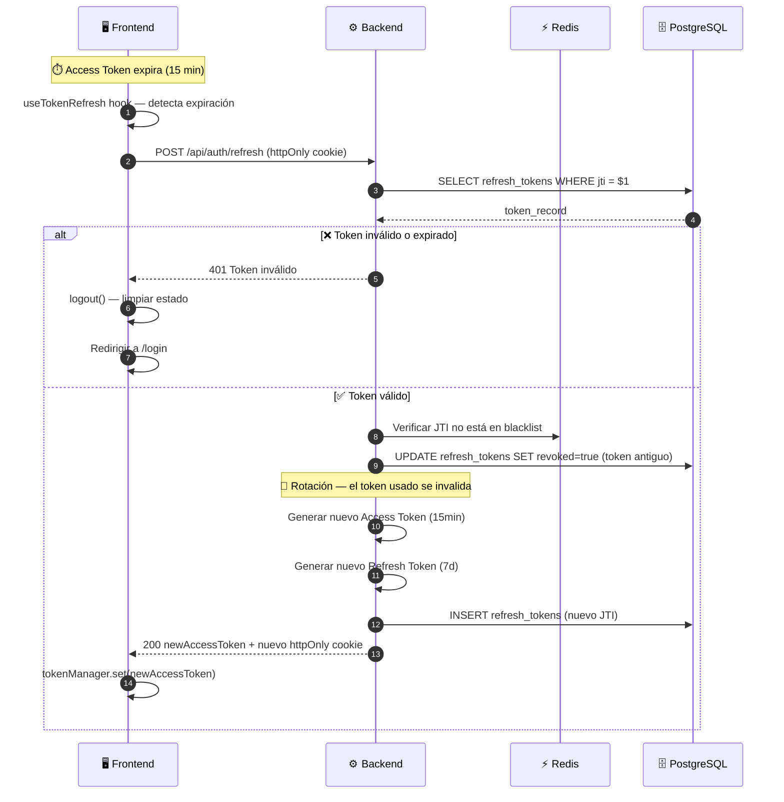
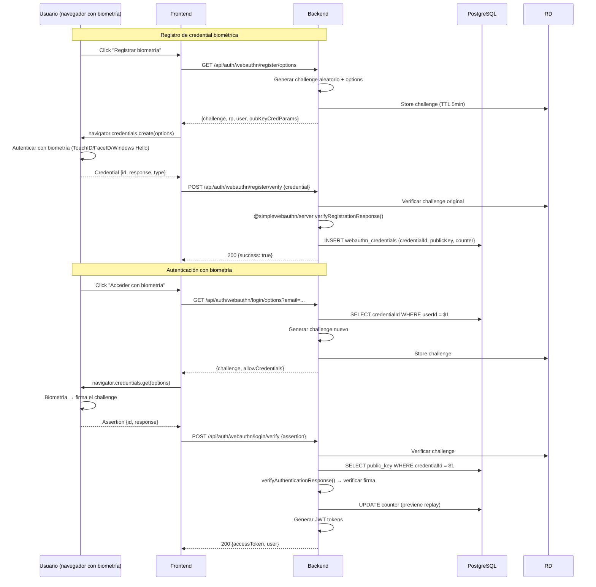
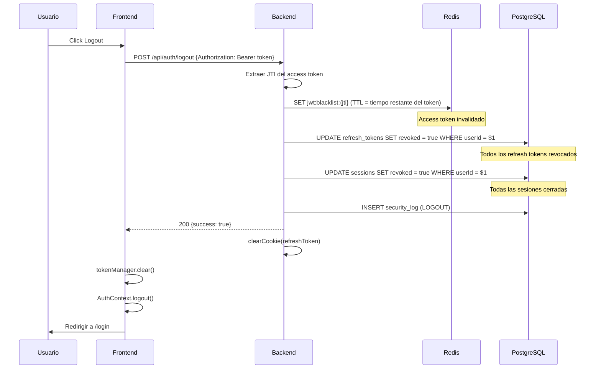

# Flujo de Autenticación — RobenGate Sentinel

**Versión:** 2.0 | **Fecha:** Junio 2026

---

## Diagrama de Secuencia — Login Completo

```mermaid
sequenceDiagram
    autonumber
    actor U as 👤 Usuario
    participant FE as 🖥️ Frontend React
    participant BE as ⚙️ Backend Express
    participant RE as 🤖 Risk Engine
    participant DB as 🗄️ PostgreSQL
    participant RD as ⚡ Redis
    participant EM as 📧 SMTP Email

    U->>FE: Introduce email + contraseña
    FE->>FE: Validación Zod (client-side)
    FE->>BE: POST /api/auth/login

    rect rgb(10, 25, 41)
        Note over BE: 🔒 Middleware Pipeline
        BE->>BE: Sanitizar HPP + NoSQL injection
        BE->>RD: Auto-ban check (IP en lista negra?)
        BE->>BE: Rate limit — 5 intentos / 15 min
        BE->>BE: Attack pattern detection
    end

    BE->>DB: SELECT usuario WHERE email = $1
    DB-->>BE: user_record + password_hash

    alt ❌ Usuario no existe
        BE-->>FE: 401 Credenciales inválidas
        BE->>DB: INSERT security_log LOGIN_FAILED
    else ✅ Usuario existe
        BE->>BE: bcrypt.compare(password, hash)

        alt ❌ Contraseña incorrecta
            BE->>RD: INCR fail_count:{ip}
            BE-->>FE: 401 Credenciales inválidas
            BE->>DB: INSERT security_log LOGIN_FAILED

            alt ⚠️ ≥ 5 fallos consecutivos
                BE->>DB: INSERT banned_ips
                BE->>RD: SET ban:{ip} TTL=86400
                BE->>DB: INSERT security_log IP_BANNED
                BE-->>FE: 429 IP bloqueada
            end

        else ✅ Contraseña correcta
            BE->>RE: evaluar 10 señales de riesgo
            Note over RE: IP nueva · País · Dispositivo<br/>Horario · Viaje imposible · Rol
            RE-->>BE: risk_score (0–100)

            alt 🔴 Score ≥ 81 (CRÍTICO)
                BE->>DB: INSERT banned_ips
                BE-->>FE: 403 Acceso bloqueado

            else 🟡 Score 31–60 — OTP Email
                BE->>RD: SET mfa:{userId} = OTP (TTL 5min)
                BE->>EM: Enviar código OTP 6 dígitos
                BE-->>FE: 200 requiresMfa: true · pendingToken

                FE->>U: Pantalla MFA — introducir código
                U->>FE: Código OTP 6 dígitos
                FE->>BE: POST /api/auth/mfa/verify {code, pendingToken}

                BE->>RD: GET mfa:{userId}
                alt ❌ Código incorrecto
                    BE-->>FE: 401 Código inválido
                else ✅ Código correcto
                    BE->>RD: DEL mfa:{userId}
                    BE->>DB: INSERT refresh_tokens (JTI · 7d)
                    BE->>DB: INSERT sessions (device · IP · UA)
                    BE->>DB: INSERT security_log LOGIN_SUCCESS
                    BE-->>FE: 200 accessToken (15min) + httpOnly cookie
                end

            else 🟢 Score ≤ 30 — Acceso Directo
                BE->>DB: INSERT refresh_tokens (JTI · 7d)
                BE->>DB: INSERT sessions
                BE->>DB: INSERT security_log LOGIN_SUCCESS
                BE-->>FE: 200 accessToken (15min) + httpOnly cookie
            end

            FE->>FE: tokenManager.set(accessToken) — EN MEMORIA
            FE->>FE: AuthContext.setUser(user)
            FE->>U: ✅ Redirigir a /dashboard
        end
    end
```



---

## Diagrama de Secuencia — Renovación de Token



---

## Diagrama — Autenticación WebAuthn/FIDO2



---

## Diagrama — Logout y Revocación



---

## Modelo Zero-Trust para MFA

El modelo de autenticación implementa Zero-Trust en la fase MFA:

```
Estado 1: No autenticado
  → Sin acceso a recursos

Estado 2: Contraseña verificada + MFA pendiente  
  → pendingToken: acceso SOLO a POST /api/auth/mfa/verify
  → Cualquier otro endpoint devuelve 401

Estado 3: MFA verificado
  → accessToken: acceso completo según rol RBAC
  → Expira en 15 minutos

Estado 4: Access Token expirado
  → refreshToken (httpOnly cookie): permite renovación silenciosa
  → Rotación automática en cada uso
  → Expira en 7 días
```
