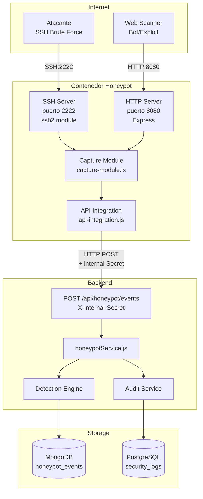
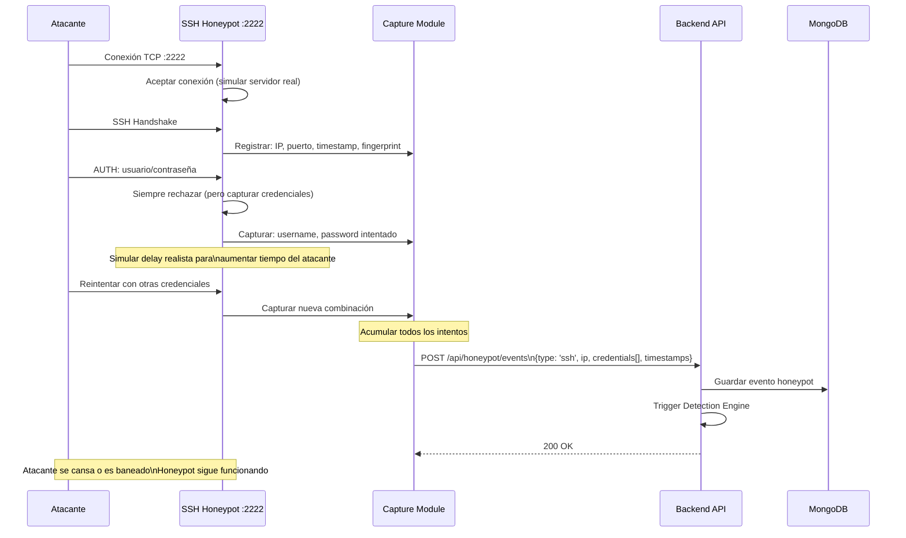
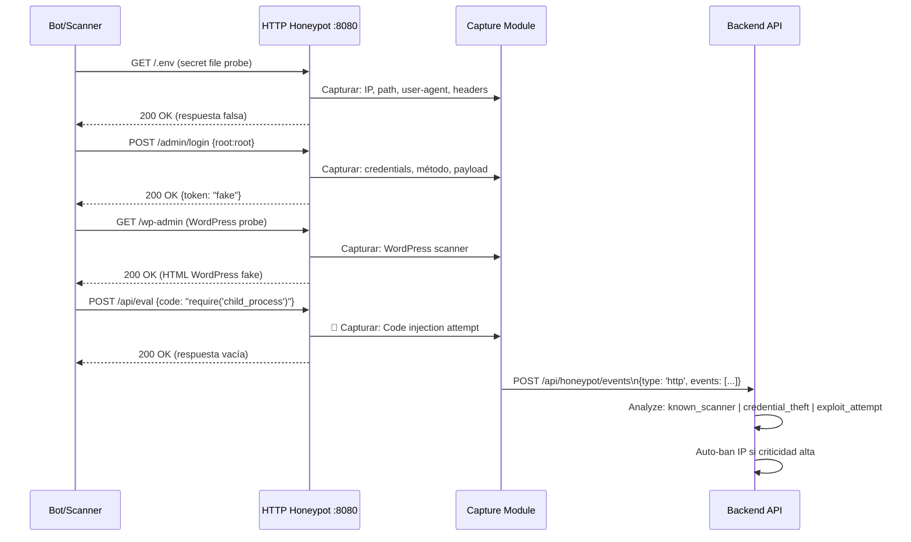
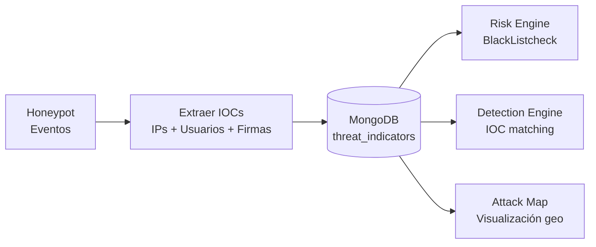

# Flujo del Honeypot — RobenGate Sentinel

**Módulo:** `honeypot/`  
**Versión:** 2.0 | **Fecha:** Junio 2026

---

## Descripción General

El honeypot de RobenGate Sentinel es una trampa de dos vectores que captura y analiza ataques reales:

| Servicio | Puerto | Protocolo | Propósito |
|---|---|---|---|
| SSH Honeypot | 2222 | TCP/SSH | Capturar credential stuffing, brute force |
| HTTP Honeypot | 8080 | HTTP | Capturar web scanners, bots, exploits |

---

## Arquitectura del Honeypot



---

## Flujo SSH Honeypot



---

## Flujo HTTP Honeypot



---

## Datos Capturados

### Evento SSH Capturado

```json
{
  "type": "ssh",
  "ip": "185.220.101.45",
  "port": 2222,
  "timestamp": "2026-06-15T03:22:11Z",
  "credentials": [
    { "username": "root", "password": "root", "attempt": 1 },
    { "username": "root", "password": "123456", "attempt": 2 },
    { "username": "admin", "password": "admin", "attempt": 3 },
    { "username": "ubuntu", "password": "ubuntu", "attempt": 4 }
  ],
  "connectionDuration": 45,
  "clientVersion": "OpenSSH_8.1",
  "geoLocation": {
    "country": "RU",
    "city": "Moscow",
    "lat": 55.7558,
    "lon": 37.6173
  },
  "asn": {
    "number": 12345,
    "name": "Some-Hosting-AS",
    "type": "datacenter"
  }
}
```

### Evento HTTP Capturado

```json
{
  "type": "http",
  "ip": "45.33.32.156",
  "timestamp": "2026-06-15T03:25:00Z",
  "requests": [
    {
      "method": "GET",
      "path": "/.env",
      "userAgent": "Masscan/1.3",
      "category": "secret_file_probe"
    },
    {
      "method": "POST",
      "path": "/admin",
      "body": { "username": "admin", "password": "password123" },
      "category": "credential_stuffing"
    }
  ],
  "classification": "automated_scanner",
  "severity": "medium"
}
```

---

## Clasificación de Ataques

| Categoría | Descripción | Severidad | Acción Automática |
|---|---|---|---|
| `brute_force_ssh` | >10 intentos credenciales SSH | HIGH | Auto-ban 24h |
| `credential_stuffing` | Lista de credenciales conocidas | HIGH | Auto-ban 1h |
| `secret_file_probe` | GET /.env, /.git, etc. | MEDIUM | Log + alerta |
| `automated_scanner` | Patrones de scanner conocido | LOW | Log |
| `exploit_attempt` | Injection, RCE, SSRF | CRITICAL | Auto-ban permanente |
| `wordpress_scanner` | Probes de WordPress | LOW | Log |
| `vulnerability_scan` | Nikto, OpenVAS patterns | MEDIUM | Log + alerta |

---

## Configuración

### Variables de Entorno (`honeypot/.env`)

```bash
# Puerto de escucha SSH
SSH_PORT=2222

# Puerto de escucha HTTP  
HTTP_PORT=8080

# Backend API para enviar eventos
BACKEND_URL=http://backend:5000

# Secreto compartido con backend (CRÍTICO: no exponer)
INTERNAL_API_SECRET=secreto-interno-muy-seguro

# Delay máximo de simulación SSH (ms)
SSH_DELAY_MAX=3000

# Máximo de credenciales a capturar por sesión
MAX_CREDENTIALS_PER_SESSION=50
```

### Despliegue

```yaml
# docker-compose.yml (fragmento)
honeypot:
  build:
    context: ./honeypot
    dockerfile: Dockerfile
  ports:
    - "2222:2222"   # SSH honeypot (EXPUESTO al exterior)
    - "8080:8080"   # HTTP honeypot (EXPUESTO al exterior)
  environment:
    - BACKEND_URL=http://backend:5000
    - INTERNAL_API_SECRET=${INTERNAL_API_SECRET}
  networks:
    - sentinel_network
    - public_network  # Red separada para aislar el honeypot
```

**Nota de Seguridad:** El honeypot está en una red Docker separada (`public_network`) del resto de servicios. La comunicación hacia el backend usa la red interna (`sentinel_network`) con el `INTERNAL_API_SECRET` para autenticación.

---

## Análisis de Threat Intelligence desde Honeypot

Los datos capturados por el honeypot alimentan automáticamente la base de datos de **Threat Intelligence**:


