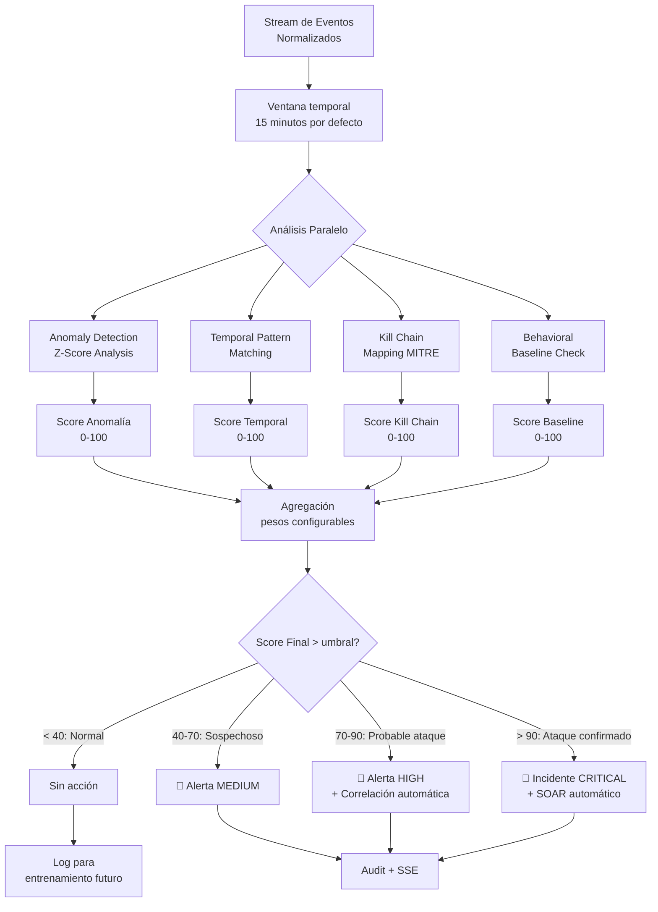
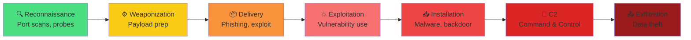

# Motor de IA y Correlación — RobenGate Sentinel

**Módulo:** `backend/src/services/aiCorrelationEngine.js`  
**Versión:** 2.0 | **Fecha:** Junio 2026

---

> **Estado:** Implementado como motor heurístico (reglas + estadísticas). ML/Deep Learning planificado para v3.0.

---

## Descripción General

El motor de IA de RobenGate Sentinel analiza patrones complejos de ataque que las reglas simples de detección no pueden capturar. Combina cuatro técnicas:

1. **Anomaly Detection** — Detección estadística de desviaciones
2. **Temporal Pattern Matching** — Secuencias temporales sospechosas
3. **Kill Chain Mapping** — Mapeo a fases MITRE ATT&CK
4. **Behavioral Baseline** — Comparación contra línea base de usuario/IP

---

## Flujo del Motor de IA



---

## Técnica 1: Anomaly Detection (Z-Score)

Detecta desviaciones estadísticas significativas respecto al comportamiento histórico.

```javascript
// Implementación conceptual en aiCorrelationEngine.js

function calculateZScore(current, mean, stdDev) {
  if (stdDev === 0) return 0;
  return Math.abs((current - mean) / stdDev);
}

// Métricas analizadas:
const metrics = {
  loginRate: {          // Frecuencia de logins por hora
    current: getLoginRate(userId, '1h'),
    baseline: getHistoricalAvg(userId, 'loginRate', '30d')
  },
  dataAccessVolume: {   // Volumen de datos accedidos
    current: getDataAccess(userId, '1h'),
    baseline: getHistoricalAvg(userId, 'dataAccess', '30d')
  },
  apiCallRate: {        // Frecuencia de llamadas API
    current: getApiCalls(userId, '1h'),
    baseline: getHistoricalAvg(userId, 'apiCalls', '30d')
  },
  geoVariance: {        // Variación geográfica
    current: getGeoEntropy(userId, '24h'),
    baseline: getHistoricalAvg(userId, 'geoEntropy', '30d')
  }
};

// Z-Score > 3 = anomalía significativa (estadística 3-sigma)
const anomalyScores = Object.values(metrics).map(m => 
  calculateZScore(m.current, m.baseline.mean, m.baseline.stdDev)
);
```

---

## Técnica 2: Temporal Pattern Matching

Identifica secuencias sospechosas de eventos con timing específico.

```javascript
// Patrones definidos (reglas heurísticas)
const suspiciousPatterns = [
  {
    name: 'RECONNAISSANCE_THEN_EXPLOIT',
    description: 'Escaneo seguido de intento de explotación',
    sequence: [
      { type: 'port_scan', maxDelay: 300 },      // 5 minutos
      { type: 'vulnerability_probe', maxDelay: 600 }, // 10 minutos
      { type: 'exploit_attempt' }
    ],
    score: 85
  },
  {
    name: 'CREDENTIAL_DUMP_THEN_LATERAL',
    description: 'Volcado de credenciales + movimiento lateral',
    sequence: [
      { type: 'auth_failure_burst', threshold: 10 },
      { type: 'new_user_auth', fromSameIP: true }
    ],
    score: 90
  },
  {
    name: 'DATA_STAGING',
    description: 'Acceso masivo antes de exfiltración',
    sequence: [
      { type: 'bulk_data_access', records: 100 },
      { type: 'export_request' }
    ],
    score: 75
  }
];
```

---

## Técnica 3: Kill Chain Mapping (MITRE ATT&CK)

Mapea eventos a las 7 fases del Cyber Kill Chain:



El motor asigna cada evento detectado a una fase del Kill Chain. Cuando detecta eventos en fases consecutivas del mismo origen (IP/usuario), aumenta el score de riesgo exponencialmente:

| Fases consecutivas detectadas | Multiplicador de score |
|---|---|
| 1 fase | ×1.0 |
| 2 fases | ×1.5 |
| 3 fases | ×2.5 |
| 4+ fases | ×4.0 (Incident CRITICAL) |

---

## Técnica 4: Behavioral Baseline

Construye y mantiene perfiles de comportamiento normal para usuarios e IPs:

```javascript
// Perfil de usuario actualizado diariamente
const userProfile = {
  userId: "uuid",
  updatedAt: "2026-06-15",
  
  typicalHours: [9, 10, 11, 14, 15, 16, 17],  // Horas habituales de trabajo
  typicalCountries: ["ES", "PT"],              // Países habituales
  typicalIPs: ["1.2.3.0/24"],                  // Rango de IP habitual
  
  avgLoginFrequency: 2.3,    // Logins por día
  avgSessionDuration: 240,   // Minutos de sesión promedio
  avgDataAccess: 450,        // Registros accedidos por sesión
  
  devices: ["uuid1", "uuid2"],  // Dispositivos conocidos
  
  riskHistory: {
    avgRiskScore: 12,         // Score promedio histórico
    maxRiskScore: 35,         // Máximo histórico
    incidentCount: 0          // Sin incidentes previos
  }
};
```

Una desviación significativa de este perfil (Z-Score > 2.5) contribuye al score de IA.

---

## Endpoint de IA

```
GET  /api/ai/analysis     → Análisis IA de un período
GET  /api/ai/anomalies    → Anomalías detectadas
GET  /api/ai/patterns     → Patrones identificados
POST /api/ai/analyze/:id  → Analizar incidente específico
```

### Ejemplo de Respuesta

```json
{
  "analysisId": "uuid",
  "timestamp": "2026-06-15T10:30:00Z",
  "subject": { "type": "ip", "value": "45.33.32.156" },
  "scores": {
    "anomaly": 72,
    "temporal": 85,
    "killChain": 78,
    "baseline": 65,
    "aggregate": 76
  },
  "verdict": "PROBABLE_ATTACK",
  "confidence": 0.81,
  "killChainPhases": ["reconnaissance", "delivery"],
  "patterns": ["RECONNAISSANCE_THEN_EXPLOIT"],
  "recommendation": "Escalar a incidente HIGH + ejecutar playbook",
  "evidence": [
    "Port scan detectado a las 10:15",
    "8 intentos de login fallidos a las 10:22",
    "Prueba de vulnerabilidad /admin a las 10:28"
  ]
}
```

---

## Limitaciones Actuales y Roadmap

### Estado Actual (v2.0) — Heurístico
- ✅ Reglas y umbrales configurados manualmente
- ✅ Estadísticas Z-Score con historial de 30 días
- ✅ Kill Chain mapping con 7 fases
- ✅ Behavioral baseline básico
- ⚠️ Alta tasa de falsos positivos en entornos nuevos (primeros 30 días)
- ⚠️ No aprende automáticamente de correcciones del analista

### Roadmap v3.0 — ML Real
- 🔜 Modelo de anomaly detection: Isolation Forest o Autoencoder
- 🔜 NLP para análisis de logs en texto libre
- 🔜 Aprendizaje de feedback del analista (False Positive → model correction)
- 🔜 Integración con MITRE ATT&CK Navigator completo
- 🔜 Detección de amenazas zero-day por comportamiento anómalo puro
