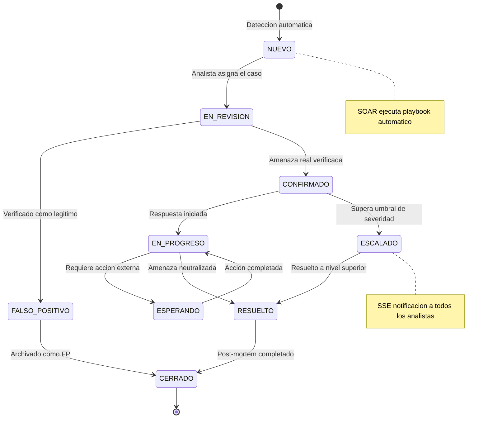
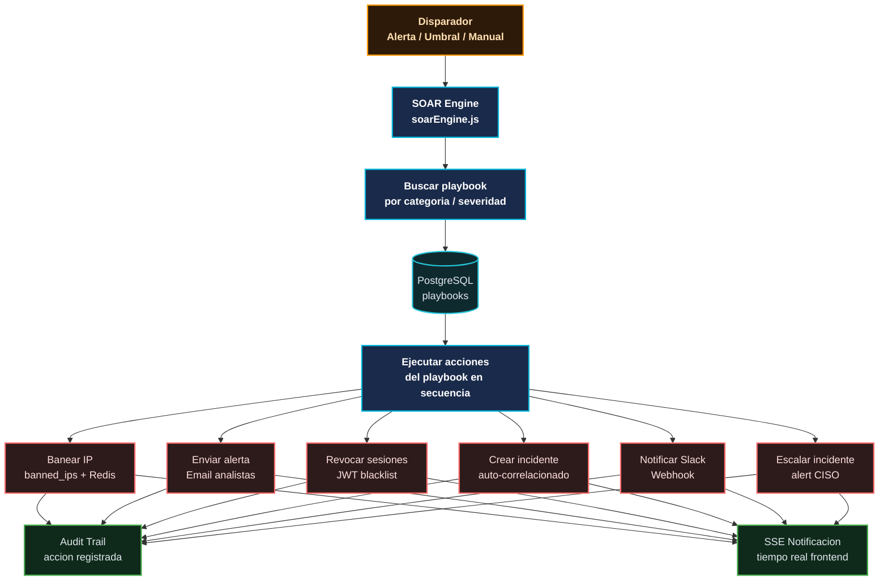
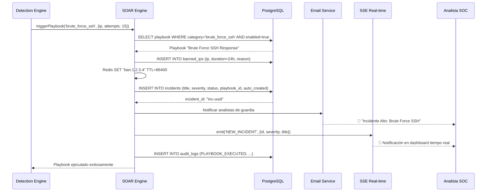

# Flujo de Gestión de Incidentes y SOAR

**Módulo:** `backend/src/services/soarEngine.js`, `backend/src/controllers/incidentsController.js`  
**Versión:** 2.0 | **Fecha:** Junio 2026

---

## Ciclo de Vida de un Incidente



---

## Arquitectura SOAR



---

## Playbooks SOAR

### Estructura de un Playbook

```json
{
  "id": "uuid",
  "name": "Respuesta a Brute Force SSH",
  "description": "Automáticamente banea y notifica en ataque SSH masivo",
  "trigger": {
    "category": "brute_force_ssh",
    "severity": "high",
    "threshold": 10
  },
  "actions": [
    {
      "type": "ban_ip",
      "duration_hours": 24,
      "reason": "Brute force SSH detectado"
    },
    {
      "type": "create_incident",
      "severity": "high",
      "title": "Brute Force SSH desde {{ip}}",
      "auto_assign": "on_call_analyst"
    },
    {
      "type": "send_alert",
      "channels": ["email", "sse"],
      "message": "Ataque SSH detectado desde {{ip}} - {{attempts}} intentos"
    }
  ],
  "enabled": true,
  "organization_id": "org-uuid"
}
```

### Playbooks Pre-configurados

| Playbook | Disparador | Acciones |
|---|---|---|
| **Brute Force SSH** | >10 intentos SSH/min | Ban 24h + Incidente + Email |
| **Credential Stuffing** | >5 logins fallidos/IP/5min | Ban 1h + Alerta SOC |
| **IOC Match** | IP/dominio en blacklist | Ban permanente + Incidente CRITICAL |
| **Impossible Travel** | Risk engine viaje imposible | Revocar sesiones + Forzar MFA |
| **Privilege Escalation** | Cambio de rol crítico | Auditoría + Notificar CISO |
| **Code Injection** | SQL/NoSQL/OS injection | Ban IP + Incidente CRITICAL |
| **Data Exfiltration** | Descarga masiva >100 registros | Revocar sesión + Alerta |

---

## Flujo de Creación de Incidente



---

## Gestión de Incidentes — API

| Endpoint | Método | Acción | Rol Mínimo |
|---|---|---|---|
| `/api/incidents` | GET | Listar incidentes | viewer |
| `/api/incidents/:id` | GET | Detalle incidente | viewer |
| `/api/incidents` | POST | Crear incidente | analyst |
| `/api/incidents/:id` | PATCH | Actualizar estado | analyst |
| `/api/incidents/:id/escalate` | POST | Escalar incidente | analyst |
| `/api/incidents/:id/assign` | POST | Asignar a analista | analyst |
| `/api/incidents/:id/close` | POST | Cerrar incidente | analyst |
| `/api/incidents/:id/timeline` | GET | Timeline del incidente | viewer |

---

## Métricas de Incidentes (KPIs SOC)

| Métrica | Descripción | Objetivo |
|---|---|---|
| **MTTD** | Mean Time to Detect | < 1 hora |
| **MTTA** | Mean Time to Acknowledge | < 30 min |
| **MTTR** | Mean Time to Respond | < 4 horas |
| **MTTC** | Mean Time to Contain | < 8 horas |
| **False Positive Rate** | % alertas que son FP | < 15% |
| **Playbook Success Rate** | % playbooks ejecutados exitosamente | > 95% |

Las métricas son visibles en el Dashboard SOC (`/dashboard`) y expuestas via Prometheus:

```promql
# MTTD promedio (últimas 24h)
avg(sentinel_incident_mttd_seconds)

# Incidentes por severidad
count by (severity) (sentinel_incidents_total)

# Playbooks ejecutados hoy
increase(sentinel_playbook_executions_total[24h])
```
