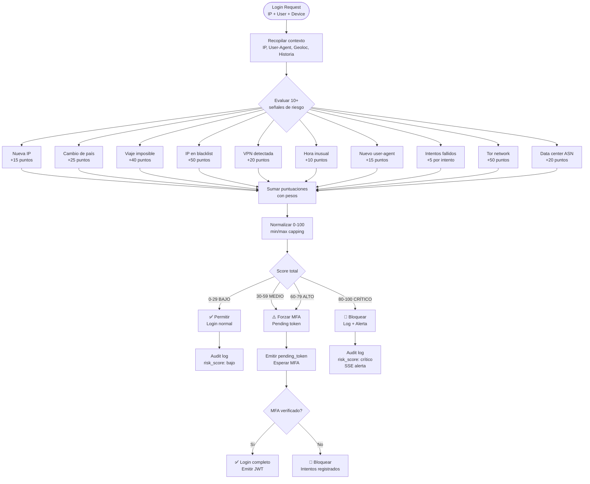
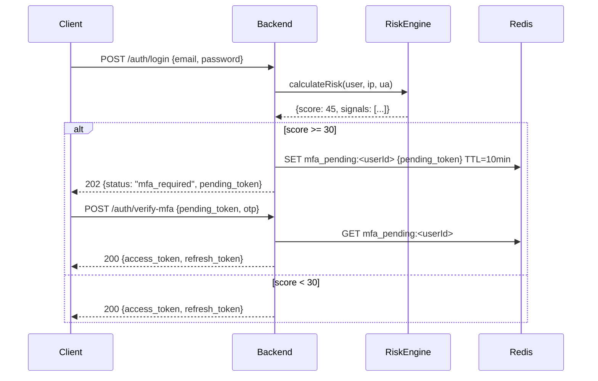

# Flujo del Motor de Riesgo — RobenGate Sentinel

**Módulo:** `backend/src/services/riskEngine.js`  
**Versión:** 2.0 | **Fecha:** Junio 2026

---

## Descripción General

El **Risk Engine** es el núcleo analítico de la autenticación. Calcula un **puntaje de riesgo de 0 a 100** para cada intento de login evaluando 10+ señales de comportamiento simultáneamente. Un puntaje alto puede bloquear el acceso o forzar MFA adicional.

---

## Flujo Principal



---

## Señales de Riesgo Detalladas

### Señal 1: Nueva IP Address (+15)
- **Condición:** IP no vista en las últimas 30 sesiones del usuario
- **Fuente:** Tabla `sessions` PostgreSQL
- **Justificación:** Dispositivo/red desconocida

### Señal 2: Cambio de País (+25)
- **Condición:** País de la IP actual ≠ país de las últimas 3 sesiones
- **Fuente:** MaxMind GeoIP2 → `geoService.js`
- **Justificación:** Acceso desde geografía diferente a la habitual

### Señal 3: Viaje Imposible (+40)
- **Condición:** Distancia entre sesiones / tiempo transcurrido > velocidad máxima realista (1000 km/h)
- **Fuente:** Cálculo geodésico entre coordenadas GPS de IPs
- **Justificación:** Físicamente imposible haber viajado tan rápido
- **Ejemplo:** Sesión en Madrid hace 2h, login desde Tokio ahora

### Señal 4: IP en Blacklist (+50)
- **Condición:** IP presente en tabla `banned_ips` o feeds de threat intelligence
- **Fuente:** PostgreSQL `banned_ips` + MongoDB `threat_indicators`
- **Justificación:** IP conocida como maliciosa

### Señal 5: VPN Detectada (+20)
- **Condición:** ASN corresponde a proveedor VPN conocido (lista curada)
- **Fuente:** Lookup ASN en base datos local
- **Justificación:** Evasión de controles geográficos

### Señal 6: Hora Inusual (+10)
- **Condición:** Login fuera del horario histórico del usuario (±2 horas del patrón)
- **Fuente:** Historial de sesiones en PostgreSQL
- **Justificación:** Comportamiento fuera del patrón normal

### Señal 7: Nuevo User-Agent (+15)
- **Condición:** User-Agent string no visto en historial del usuario
- **Fuente:** Tabla `devices` PostgreSQL
- **Justificación:** Nuevo dispositivo/navegador

### Señal 8: Intentos de Login Fallidos (+5 × intentos)
- **Condición:** > 2 intentos fallidos en última hora
- **Fuente:** Redis contadores de rate limiting
- **Justificación:** Posible brute force

### Señal 9: Red Tor (+50)
- **Condición:** IP pertenece a nodo Tor conocido (lista actualizada)
- **Fuente:** Lista pública de nodos Tor
- **Justificación:** Anonimización intencional

### Señal 10: ASN de Data Center (+20)
- **Condición:** IP no pertenece a ISP residencial/corporativo (es de AWS, GCP, Azure, etc.)
- **Fuente:** Lookup ASN
- **Justificación:** Automatización/scripting probable

---

## Thresholds y Acciones

| Rango de Score | Nivel | Acción | Logging |
|---|---|---|---|
| 0-29 | BAJO | Login normal, emitir JWT | INFO |
| 30-59 | MEDIO | Forzar MFA si no habitual | WARN |
| 60-79 | ALTO | Forzar MFA siempre | WARN |
| 80-100 | CRÍTICO | Bloquear login + alerta SOC | ERROR + SSE |

---

## Integración con MFA Zero-Trust



---

## Ejemplo de Respuesta del Risk Engine

```json
{
  "score": 65,
  "level": "HIGH",
  "signals": [
    { "name": "new_ip", "score": 15, "detail": "IP 1.2.3.4 not seen before" },
    { "name": "country_change", "score": 25, "detail": "ES → RU" },
    { "name": "new_user_agent", "score": 15, "detail": "Mozilla/5.0 (new device)" }
  ],
  "action": "require_mfa",
  "timestamp": "2026-06-15T09:30:00Z"
}
```

---

## Código Fuente

**Ubicación:** `backend/src/services/riskEngine.js`

El motor está implementado como una función pura que recibe el contexto del usuario (IP, historial, user-agent) y retorna el score calculado con todas las señales activadas. Es invocado desde `authController.js` → `login()`.
