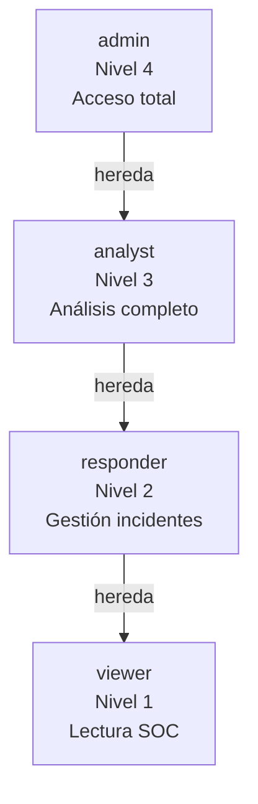
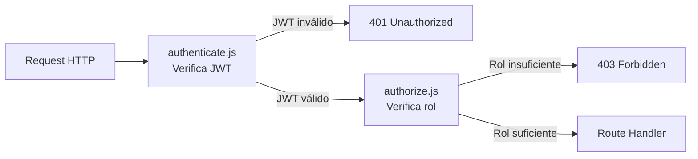
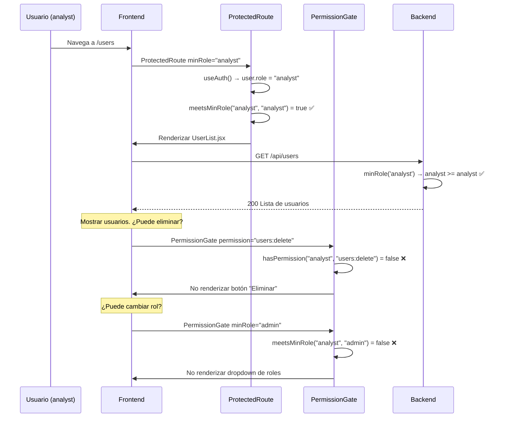

# Flujo RBAC — Control de Acceso Basado en Roles

**Versión:** 2.0 | **Fecha:** Junio 2026

---

## Modelo de Roles



| Rol | Nivel | Casos de Uso |
|---|---|---|
| `admin` | 4 | Gestión de usuarios, organizaciones, configuración global |
| `analyst` | 3 | Análisis de amenazas, threat hunting, gestión de alertas |
| `responder` | 2 | Respuesta a incidentes, cierre de alertas |
| `viewer` | 1 | Monitorización pasiva del SOC, informes |

---

## Arquitectura RBAC — Dos Capas

### Capa 1: Backend (autorización real)



**`authorize.js` — Implementación:**
```javascript
const ROLES = { admin: 4, analyst: 3, responder: 2, viewer: 1 }

// minRole('analyst') — requiere analyst o superior
function minRole(requiredRole) {
  return (req, res, next) => {
    if (ROLES[req.user.role] >= ROLES[requiredRole]) next()
    else res.status(403).json({ error: 'Insufficient permissions' })
  }
}

// readOnly() — permite GET para viewer, bloquea escritura
function readOnly() {
  return (req, res, next) => {
    if (req.method === 'GET') return next()
    if (req.user.role === 'viewer') {
      return res.status(403).json({ error: 'Read-only access' })
    }
    next()
  }
}
```

### Capa 2: Frontend (UX, no seguridad)

La capa frontend de RBAC solo controla la **experiencia de usuario** — qué botones se muestran, qué páginas son accesibles. La seguridad real está en el backend.

```mermaid
flowchart TD
    ROUTE[Navegación a ruta] --> PR[ProtectedRoute\nJWT válido?]
    PR --> |No JWT| LOGIN[Redirect /login]
    PR --> |JWT válido| ROLE_CHECK[meetsMinRole(minRole)]
    ROLE_CHECK --> |Rol insuficiente| DENIED[AccessDenied /403]
    ROLE_CHECK --> |Rol suficiente| PAGE[Renderizar página]
    PAGE --> PG[PermissionGate\npor elemento UI]
    PG --> |Sin permiso| READONLY[ReadOnlyBadge o null]
    PG --> |Con permiso| ELEMENT[Renderizar elemento]
```

---

## Mapa Completo de Permisos

### Por Módulo

| Módulo / Ruta | viewer | responder | analyst | admin |
|---|---|---|---|---|
| `GET /dashboard` | ✅ | ✅ | ✅ | ✅ |
| `GET /api/stats` | ✅ | ✅ | ✅ | ✅ |
| `GET /api/logs` | ✅ | ✅ | ✅ | ✅ |
| `GET /api/alerts` | ✅ | ✅ | ✅ | ✅ |
| `PATCH /api/alerts/:id/status` | ❌ | ❌ | ✅ | ✅ |
| `GET /api/incidents` | ✅ | ✅ | ✅ | ✅ |
| `POST /api/incidents` | ❌ | ✅ | ✅ | ✅ |
| `PATCH /api/incidents/:id/status` | ❌ | ✅ | ✅ | ✅ |
| `GET /api/vulnerabilities` | ✅ | ✅ | ✅ | ✅ |
| `POST /api/vulnerabilities` | ❌ | ❌ | ✅ | ✅ |
| `GET /api/devices` | ✅ | ✅ | ✅ | ✅ |
| `DELETE /api/devices/:id` | ✅ (propio) | ✅ | ✅ | ✅ |
| `GET /api/sessions` | ✅ | ✅ | ✅ | ✅ |
| `GET /api/threats` | ❌ | ❌ | ✅ | ✅ |
| `POST /api/threats` | ❌ | ❌ | ✅ | ✅ |
| `GET /api/honeypot/events` | ❌ | ❌ | ✅ | ✅ |
| `GET /api/audit` | ❌ | ❌ | ✅ | ✅ |
| `GET /api/users` | ❌ | ❌ | ✅ | ✅ |
| `POST /api/users` | ❌ | ❌ | ❌ | ✅ |
| `PATCH /api/users/:id/role` | ❌ | ❌ | ❌ | ✅ |
| `GET /api/organizations` | ❌ | ❌ | ❌ | ✅ |
| `POST /api/organizations` | ❌ | ❌ | ❌ | ✅ |
| `GET /api/playbooks` | ❌ | ❌ | ✅ | ✅ |
| `POST /api/playbooks` | ❌ | ❌ | ✅ | ✅ |
| `GET /api/attack-map` | ✅ | ✅ | ✅ | ✅ |
| `GET /api/ai/analysis` | ✅ | ✅ | ✅ | ✅ |

---

## Flujo de Verificación de Permisos — Frontend



---

## Viewer "Read-Only" Mode

Un `viewer` tiene acceso completo de **lectura** al SOC pero no puede escribir:

### En el Backend
```javascript
// routes/logs.js
router.get('/', authenticate, minRole('viewer'), logController.getAll)
// viewer puede leer logs ✅

// routes/incidents.js
router.post('/', authenticate, readOnly(), incidentController.create)
// viewer recibe 403 en POST ❌
```

### En el Frontend
```jsx
// El viewer ve el botón pero con badge "Solo lectura"
<PermissionGate permission="incidents:write" fallback={<ReadOnlyBadge />}>
  <button onClick={closeIncident}>Cerrar Incidente</button>
</PermissionGate>

// El viewer no ve el botón en absoluto
<PermissionGate minRole="admin">
  <button onClick={deleteUser}>Eliminar Usuario</button>
</PermissionGate>
```

### Indicadores Visuales para Viewers
- Badge "View Only" en el header de la navegación
- `ReadOnlyBadge` en elementos de UI no accesibles
- Tooltips explicativos en elementos deshabilitados
