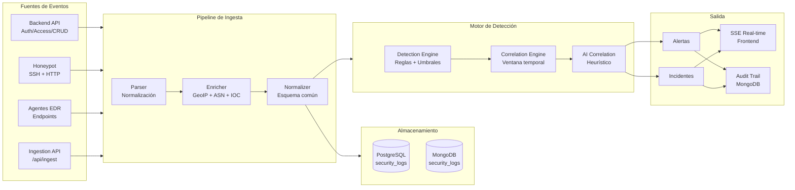
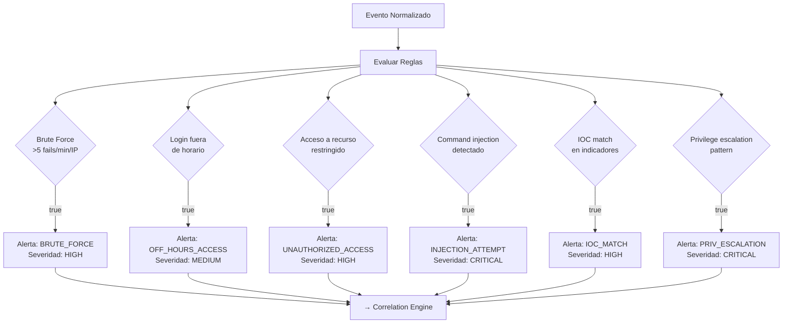
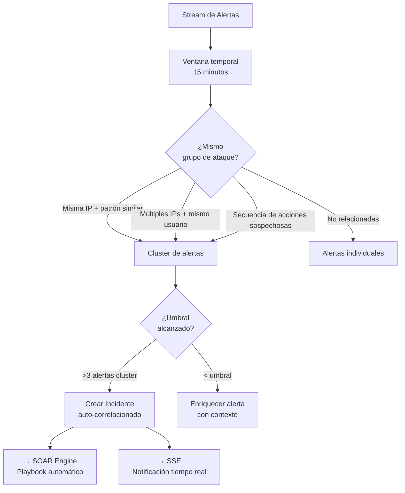
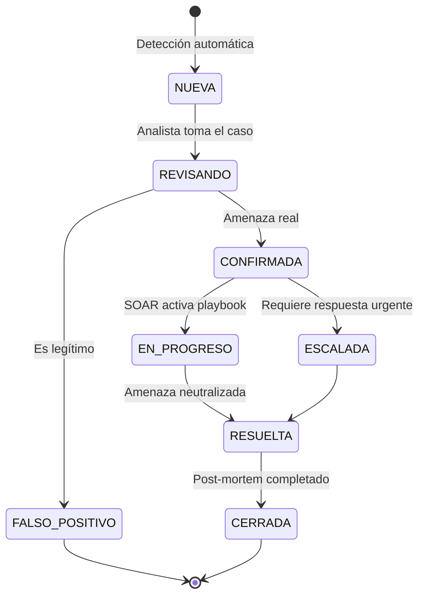

# Flujo del Pipeline SIEM — RobenGate Sentinel

**Módulos:** Detection Engine, Correlation Engine, AI Correlation  
**Versión:** 2.0 | **Fecha:** Junio 2026

---

## Arquitectura del Pipeline SIEM



---

## 1. Pipeline de Ingesta

### 1.1 Parser — Normalización

**Archivo:** `backend/src/ingestion/parser.js`

```
Input:  Evento raw de cualquier fuente
Output: Evento con esquema normalizado

Esquema normalizado:
{
  eventId: UUID,
  timestamp: ISO8601,
  source: 'backend|honeypot|agent|external',
  type: 'login|access|command|file|network',
  severity: 'info|low|medium|high|critical',
  ip: '1.2.3.4',
  userId: 'uuid|null',
  action: 'string',
  result: 'success|failure|blocked',
  metadata: { ... }
}
```

### 1.2 Enricher — Enriquecimiento

**Archivo:** `backend/src/ingestion/enricher.js`

```
Añade a cada evento:
  - geoLocation: { country, city, lat, lon }  → MaxMind GeoIP2
  - asn: { number, name, type }               → ASN lookup
  - iocMatch: { matched: bool, indicator }    → MongoDB threat_indicators
  - userHistory: { sessionCount, riskLevel }  → PostgreSQL
  - deviceInfo: { trusted: bool, platform }   → PostgreSQL devices
```

### 1.3 Normalizer — Schema Final

**Archivo:** `backend/src/ingestion/normalizer.js`

Aplica transformaciones finales y almacena en:
- **PostgreSQL** `security_logs` — para queries relacionales
- **MongoDB** `security_logs` — para búsqueda full-text + TTL

---

## 2. Motor de Detección

### 2.1 Detection Engine

**Archivo:** `backend/src/services/detectionEngine.js`

El Detection Engine evalúa **reglas de detección** contra cada evento normalizado:



### 2.2 Correlation Engine

**Archivo:** `backend/src/services/correlationEngine.js`

El Correlation Engine agrupa alertas relacionadas dentro de una **ventana temporal** (por defecto 15 minutos) para identificar ataques coordinados:



### 2.3 AI Correlation Engine

**Archivo:** `backend/src/services/aiCorrelationEngine.js`

Motor heurístico que detecta patrones de ataque complejos:

```
Algoritmos implementados:
  1. Anomaly detection por Z-score
     → Desviaciones estadísticas de comportamiento normal
  
  2. Temporal pattern matching
     → Secuencias de eventos con timing sospechoso
  
  3. Kill chain mapping
     → Mapeo de eventos a fases MITRE ATT&CK:
        Reconnaissance → Weaponization → Delivery → Exploitation
        → Installation → C2 → Exfiltration
  
  4. Behavioral baseline
     → Baseline por usuario/IP (30 días de historia)
     → Alertar cuando se desvía significativamente
```

---

## 3. Flujo de Alertas e Incidentes



---

## 4. SSE Real-Time

Los eventos críticos se emiten en tiempo real al frontend vía Server-Sent Events:

**Endpoint:** `GET /api/events`  
**Auth:** Bearer JWT

```
Tipos de eventos SSE:
  - NEW_ALERT          → Nueva alerta detectada
  - NEW_INCIDENT       → Incidente creado/escalado
  - HONEYPOT_ATTACK    → Ataque capturado en honeypot
  - RISK_SCORE_HIGH    → Usuario con score de riesgo alto
  - BAN_APPLIED        → IP baneada automáticamente
  - SYSTEM_HEALTH      → Métricas de salud
```

```javascript
// Frontend: uso del SSE
const es = new EventSource('/api/events', {
  headers: { Authorization: `Bearer ${accessToken}` }
});
es.addEventListener('NEW_ALERT', (e) => {
  const alert = JSON.parse(e.data);
  showToastNotification(alert);
  updateDashboardMetrics();
});
```
