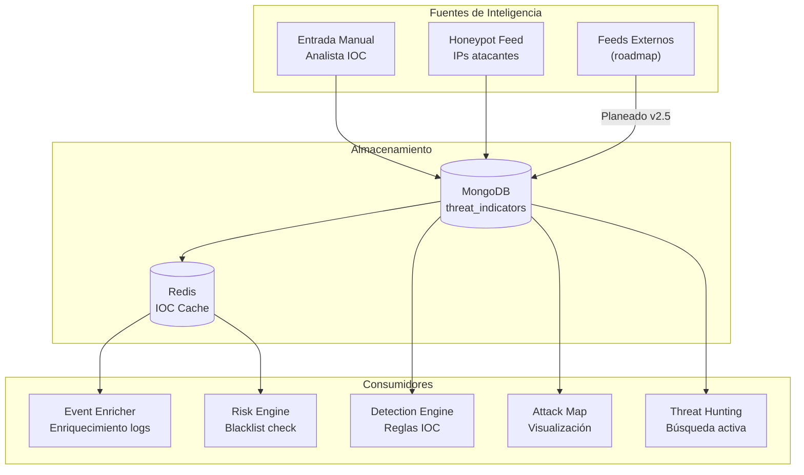
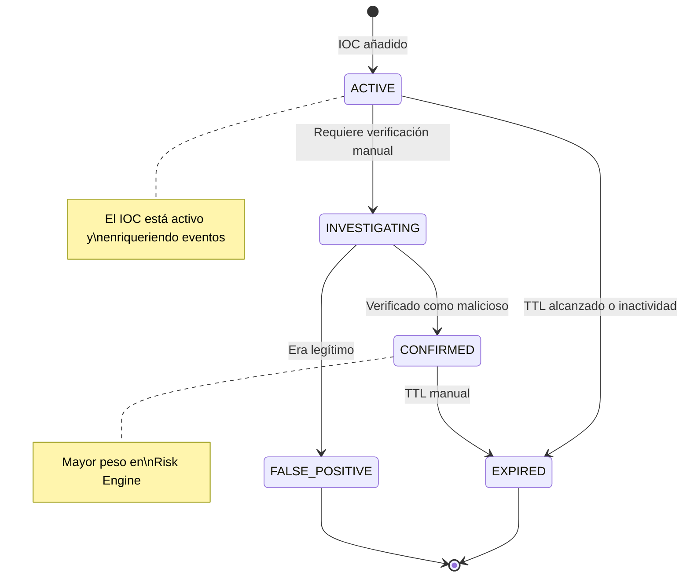
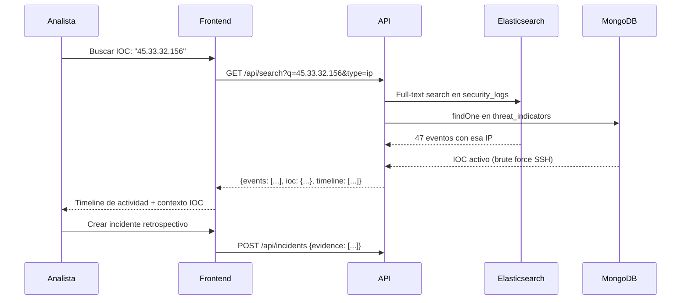

# Flujo de Threat Intelligence — RobenGate Sentinel

**Módulo:** `backend/src/routes/threats.js`, `backend/src/services/`  
**Versión:** 2.0 | **Fecha:** Junio 2026

---

## Descripción General

El módulo de **Threat Intelligence** gestiona Indicadores de Compromiso (IOCs) y feeds de amenazas para enriquecer la detección con contexto de amenazas conocidas.

---

## Arquitectura de Threat Intelligence



---

## Tipos de Indicadores (IOCs)

| Tipo | Descripción | Ejemplo |
|---|---|---|
| `ip` | Dirección IPv4/IPv6 maliciosa | `45.33.32.156` |
| `ip_range` | Rango CIDR malicioso | `185.220.0.0/17` |
| `domain` | Dominio malicioso | `malicious.example.com` |
| `url` | URL de C2 o phishing | `http://evil.com/payload` |
| `hash_md5` | Hash de malware | `d8e8fca2dc0f896fd7cb4cb0031ba249` |
| `hash_sha256` | Hash de malware SHA-256 | `e3b0c44298fc1c149afb...` |
| `email` | Email de phishing | `attacker@evil.com` |
| `user_agent` | User-Agent de scanner conocido | `Masscan/1.3` |
| `cve` | Vulnerabilidad CVE | `CVE-2024-12345` |

---

## Flujo de Ciclo de Vida de un IOC



---

## Integración con Risk Engine

Cuando el Risk Engine evalúa un login, verifica el IOC cache:

```javascript
// En riskEngine.js
async function checkIOCBlacklist(ip) {
  // 1. Verificar Redis cache (rápido)
  const cached = await redis.get(`ioc:ip:${ip}`);
  if (cached) {
    return { matched: true, indicator: JSON.parse(cached), score: 50 };
  }
  
  // 2. Verificar MongoDB (completo)
  const indicator = await ThreatIndicator.findOne({
    type: 'ip',
    value: ip,
    status: { $in: ['active', 'confirmed'] }
  });
  
  if (indicator) {
    // Cache para próxima vez
    await redis.setex(`ioc:ip:${ip}`, 3600, JSON.stringify(indicator));
    return { matched: true, indicator, score: 50 };
  }
  
  return { matched: false };
}
```

---

## Threat Hunting

El módulo de Threat Hunting (`/security/threat-hunting`) permite a los analistas buscar activamente IOCs en el historial:



---

## Estructura de un Threat Indicator

```json
{
  "_id": "ObjectId('...')",
  "type": "ip",
  "value": "45.33.32.156",
  "severity": "high",
  "confidence": 0.95,
  "status": "confirmed",
  
  "description": "IP asociada a campaña de brute force SSH - Grupo APT-X",
  "tags": ["brute_force", "ssh", "tor_exit"],
  
  "source": {
    "type": "honeypot",
    "name": "RobenGate Honeypot",
    "firstSeen": "2026-06-01T00:00:00Z"
  },
  
  "geo": {
    "country": "RU",
    "city": "Moscow",
    "lat": 55.7558,
    "lon": 37.6173
  },
  
  "stats": {
    "matchCount": 47,
    "lastMatched": "2026-06-15T03:22:11Z",
    "firstSeen": "2026-06-01T00:00:00Z"
  },
  
  "tlp": "white",
  "ttl": "2026-09-15T00:00:00Z",
  
  "createdBy": "admin-uuid",
  "organization_id": "org-uuid"
}
```

---

## API de Threat Intelligence

| Endpoint | Método | Descripción | Rol |
|---|---|---|---|
| `/api/threats` | GET | Listar indicadores | analyst |
| `/api/threats/:id` | GET | Detalle indicador | analyst |
| `/api/threats` | POST | Añadir indicador | analyst |
| `/api/threats/:id` | PATCH | Actualizar indicador | analyst |
| `/api/threats/:id` | DELETE | Eliminar indicador | admin |
| `/api/threats/bulk` | POST | Importar múltiples IOCs | analyst |

### Importación Masiva de IOCs

```bash
# Formato JSON para importación bulk
curl -X POST https://tudominio.com/api/threats/bulk \
  -H "Authorization: Bearer $ANALYST_TOKEN" \
  -H "Content-Type: application/json" \
  -d '{
    "indicators": [
      {"type": "ip", "value": "1.2.3.4", "severity": "high"},
      {"type": "domain", "value": "evil.com", "severity": "critical"},
      {"type": "hash_sha256", "value": "e3b0c44...", "severity": "critical"}
    ],
    "source": "external_feed",
    "tags": ["campaign-2026-q2"]
  }'
```

---

## Integración con Feeds Externos (Roadmap v2.5)

| Feed | Tipo | Datos |
|---|---|---|
| **VirusTotal** | API comercial/free | Hash lookup, URL scan |
| **AbuseIPDB** | API gratuita | IP reputation |
| **Shodan** | API comercial | Context de IPs, open ports |
| **MITRE ATT&CK** | Público | Tácticas, técnicas, grupos |
| **AlienVault OTX** | API gratuita | IOCs comunitarios |
| **Emerging Threats** | Público | Reglas de firewall/SIEM |
