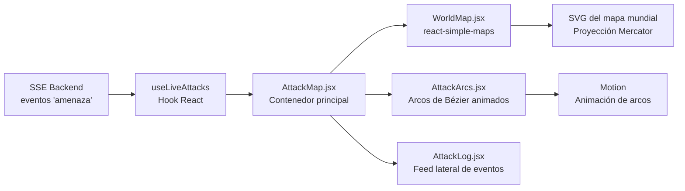
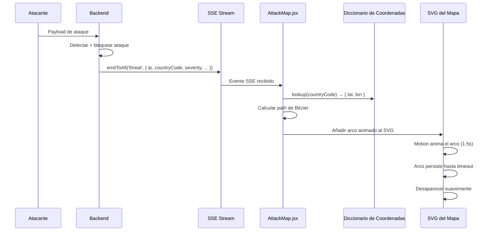

# Mapa Global de Ataques — RobenGate Sentinel

> **Clasificación:** INTERNO | **Tecnología:** react-simple-maps + Motion

---

## Resumen Ejecutivo

El Mapa Global de Ataques es una **visualización geoespacial en tiempo real** que muestra el origen y destino de los ataques detectados por RobenGate Sentinel en un mapa mundial interactivo. Los ataques se representan como arcos de Bézier animados que vuelan desde la ubicación del atacante hasta el centro de datos objetivo, con codificación de colores según la severidad del ataque.

Esta visualización transforma los datos abstractos de logs de seguridad en una **narrativa visual comprensible** — ideal para presentaciones ejecutivas, demostraciones a clientes y monitorización SOC en pantallas de gran formato.

---

## 1. Visión General

El Mapa de Ataques proporciona:

- **Visualización en tiempo real** de ataques activos via SSE
- **Arcos de Bézier animados** que muestran el trayecto atacante → objetivo
- **Codificación de colores** por severidad del ataque
- **Historial de ataques** de los últimos N eventos
- **Selección de región objetivo** configurable (us_east, us_west, eu_west, eu_central)

---

## 2. Arquitectura del Componente



---

## Descripción Técnica

### 3. Geolocalización y Coordenadas

#### 3.1 Resolución de IP a Coordenadas

Para cada ataque entrante via SSE:
1. El backend ya incluye `countryCode` en el payload del evento
2. El frontend mapea `countryCode → coordenadas { lat, lon }` usando un diccionario interno
3. Las coordenadas se usan como punto de origen del arco de Bézier

```javascript
// Ejemplo de mapeo país → coordenadas
const coordenadasPorPais = {
  'RU': { lat: 55.75, lon: 37.62 },  // Moscú, Rusia
  'CN': { lat: 39.90, lon: 116.40 }, // Beijing, China
  'US': { lat: 37.09, lon: -95.71 }, // Centro EEUU
  'DE': { lat: 51.16, lon: 10.45 },  // Centro Alemania
  'BR': { lat: -14.24, lon: -51.93 }, // Brasil
  // ... 200+ países adicionales
};
```

#### 3.2 Coordenadas de Destino (Centro de Datos)

```javascript
// Destinos predefinidos configurables
const DESTINOS = {
  us_east:    { lat: 39.10, lon: -77.00 },  // Virginia del Norte
  us_west:    { lat: 37.36, lon: -121.97 }, // Silicon Valley
  eu_west:    { lat: 53.34, lon: -6.26 },   // Dublín
  eu_central: { lat: 50.11, lon: 8.68 },    // Frankfurt
};
```

El destino predeterminado es configurable mediante variable de entorno o selección en la UI.

---

### 4. Geometría de Arcos de Bézier

Cada ataque se renderiza como un arco de Bézier cúbico que curva por encima del globo:

```javascript
function calcularArcoAtaque(origen, destino) {
  // Punto de control elevado sobre la línea directa
  const puntoCentral = {
    lat: (origen.lat + destino.lat) / 2,
    lon: (origen.lon + destino.lon) / 2,
  };
  
  // Elevar el punto de control para crear el arco
  const elevacion = Math.sqrt(
    Math.pow(destino.lat - origen.lat, 2) +
    Math.pow(destino.lon - origen.lon, 2)
  ) * 0.3;  // Factor de curvatura: 30% de la distancia
  
  puntoCentral.lat += elevacion;
  
  return `M ${origen.x},${origen.y} 
          Q ${puntoCentral.x},${puntoCentral.y} 
          ${destino.x},${destino.y}`;
}
```

---

### 5. Codificación de Colores por Severidad

| Severidad | Color | Hex | Descripción |
|-----------|-------|-----|-------------|
| **CRITICAL** | 🔴 Rojo | `#ff0040` | Ataques multivector, brechas confirmadas |
| **HIGH** | 🟠 Naranja | `#ff6b35` | Fuerza bruta, barridos de honeypot |
| **MEDIUM** | 🟡 Amarillo | `#ffd700` | Sondeo, rociado de credenciales |
| **LOW** | 🟢 Verde | `#00ff88` | Escaneo, reconocimiento |
| **INFO** | 🩵 Cian | `#4ecdc4` | Eventos informativos |

Los arcos también tienen opacidad variable: los ataques CRITICAL tienen mayor opacidad y duración de animación, mientras que los INFO tienen menor opacidad y desaparecen más rápidamente.

---

### 6. Sistema de Animación

```javascript
// Motion (Framer Motion compatible)
<motion.path
  d={pathDAtaque}
  stroke={colorSeveridad}
  strokeWidth={2}
  fill="none"
  initial={{ pathLength: 0, opacity: 0 }}
  animate={{ pathLength: 1, opacity: 0.8 }}
  exit={{ opacity: 0 }}
  transition={{
    pathLength: { duration: 1.5, ease: "easeInOut" },
    opacity: { duration: 0.3 }
  }}
/>
```

Los arcos:
1. **Aparecen** desde el punto origen con opacidad 0
2. **Se dibujan** progresivamente hacia el destino durante 1.5 segundos
3. **Permanecen** visibles durante la duración de vida del ataque
4. **Desaparecen** suavemente en 0.3 segundos

---

### 7. Gestión de Fuente IP

```javascript
// ⚠️ CORRECTO — usar dirección socket del backend
// El evento SSE incluye la IP real del socket, no XFF

// Los ataques llegan con ip: "185.220.101.42" (IP verificada)
// El frontend NO confía en cabeceras X-Forwarded-For
```

El backend siempre pasa la dirección socket real en el payload del evento. El frontend no tiene acceso a las cabeceras HTTP originales — solo recibe el payload JSON del evento SSE.

---

## Flujo Operacional

### 8. Flujo de Visualización en Tiempo Real



---

## Casos de Uso

### Caso 1: Pantalla SOC en Tiempo Real

El mapa de ataques se muestra en una pantalla grande en el centro SOC. Los analistas pueden ver en tiempo real desde qué países están llegando ataques, identificar campañas coordinadas (múltiples arcos simultáneos desde la misma región) y escaladas de severidad (cambio de arcos verdes a rojos).

### Caso 2: Presentación Ejecutiva

El CISO muestra el mapa durante una reunión de directivos para demostrar que la empresa está siendo atacada activamente y que el sistema está defendiéndose. Los arcos animados hacen que la amenaza sea tangible y la defensa visible.

### Caso 3: Demo para Clientes Potenciales

El mapa en modo de simulación mock genera ataques realistas sin necesidad de conexión al backend. Ideal para demostraciones de venta donde no se quiere exponer datos de producción reales.

---

## Beneficios para una Empresa

| Beneficio | Descripción |
|-----------|-------------|
| **Comprensión Ejecutiva** | Transforma logs técnicos en narrativa visual |
| **Detección de Patrones** | Campañas coordinadas visibles visualmente |
| **Tiempo Real** | Sin latencia — arcos aparecen en <1 segundo tras el ataque |
| **Demo Ready** | Modo mock para presentaciones sin backend |
| **Codificación de Severidad** | Priorización visual inmediata de amenazas críticas |

---

## Seguridad

- **IP verificada**: Solo se usan IPs de socket, no XFF suplantadas
- **Control de acceso**: Solo viewer+ puede acceder al mapa
- **Sin datos PII en mapa**: Solo country codes y tipos de ataque en la visualización
- **SSE autenticado**: La conexión requiere JWT válido

---

## Roadmap

| Capacidad | Estado |
|-----------|--------|
| **Zoom a país** con detalle de ataques | Planificado |
| **Filtro por tipo de ataque** (XSS, SQLi, BF) | Planificado |
| **Heatmap** de densidad de ataques por región | Planificado |
| **Línea de tiempo** de ataques históricos | Futuro |

---

*Ver también: [../realtime/sistema-eventos.md](../realtime/sistema-eventos.md) | [../siem/resumen.md](../siem/resumen.md) | [../threat-intelligence/resumen.md](../threat-intelligence/resumen.md)*
