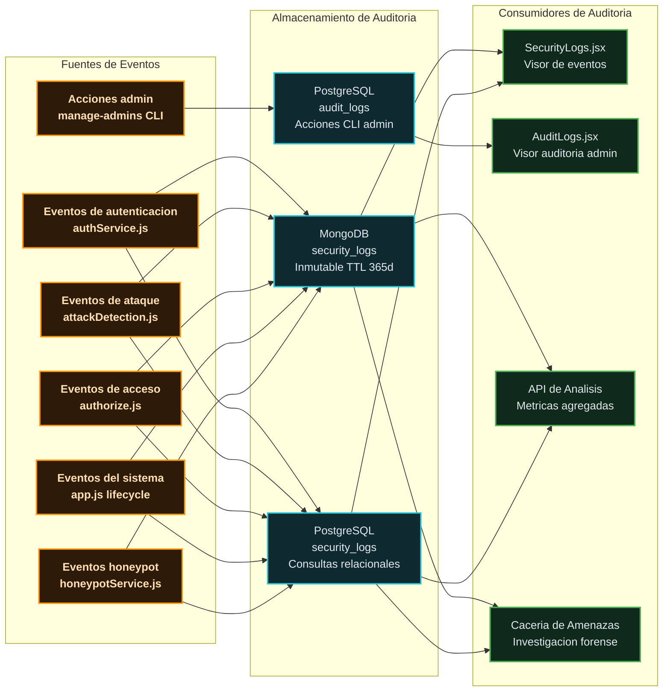
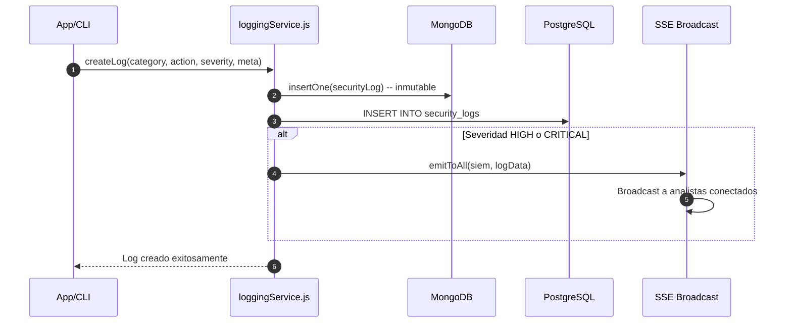

# Sistema de Auditoría — RobenGate Sentinel

> **Clasificación:** INTERNO | **Estándar:** Registro de Auditoría Inmutable y a Prueba de Manipulaciones

---

## Resumen Ejecutivo

El Sistema de Auditoría de RobenGate Sentinel implementa un **registro de auditoría multicapa inmutable** que garantiza que cada acción relevante para la seguridad sea registrada y preservada. El sistema está diseñado para satisfacer los requisitos de evidencia de auditoría de **SOC 2 Tipo II**, **ISO 27001**, **GDPR** y marcos de ciberseguridad como **NIST CSF**.

La arquitectura de doble almacenamiento (MongoDB para logs de seguridad, PostgreSQL para acciones administrativas) proporciona tanto el volumen de almacenamiento de alta frecuencia necesario para logs de eventos como la capacidad de consulta relacional requerida para reportes de auditoría. La inmutabilidad se aplica a nivel de aplicación mediante hooks de Mongoose que previenen cualquier modificación de logs existentes.

---

## 1. Visión General

RobenGate Sentinel mantiene un **sistema de auditoría multicapa** que garantiza que cada acción relevante para la seguridad sea registrada y preservada. El sistema de auditoría sirve tres propósitos:

1. **Investigación forense** — Reconstruir la secuencia exacta de eventos durante un incidente de seguridad
2. **Evidencia de cumplimiento** — Demostrar controles a auditores (SOC 2, ISO 27001, GDPR)
3. **No repudio** — Probar quién hizo qué, cuándo y desde dónde — de forma incontrovertible

---

## 2. Arquitectura del Sistema de Auditoría



---

## Descripción Técnica

### 3. Capa de Inmutabilidad (MongoDB)

#### 3.1 Principio de Diseño

Los `security_logs` de MongoDB son **solo de inserción** — una vez creados, los registros no pueden modificarse ni eliminarse (excepto por expiración TTL tras 365 días). Esto se aplica a nivel de aplicación mediante un hook pre-save de Mongoose.

#### 3.2 Aplicación de Inmutabilidad

```javascript
// SecurityLog.js (modelo MongoDB)
SecurityLogSchema.pre('save', function (next) {
  if (!this.isNew) {
    next(new Error('Los logs de seguridad son inmutables. Crea un nuevo log en su lugar.'));
    return;
  }
  next();
});
```

Cualquier intento de llamar `.save()` sobre un documento de log existente lanza inmediatamente, previniendo:
- Manipulación de logs por atacantes
- Modificación accidental de datos
- Intentos de modificación por amenazas internas

#### 3.3 TTL (Tiempo de Vida)

```javascript
// Índice TTL: auto-eliminar documentos tras 365 días
SecurityLogSchema.index({ createdAt: 1 }, { expireAfterSeconds: 31536000 });
```

Esto garantiza el cumplimiento de los principios de minimización de datos (Artículo 5 del GDPR) manteniendo una ventana forense de 12 meses.

---

### 4. Esquema de Log de Seguridad MongoDB

```javascript
{
  // Campos del evento principal
  category:     'AUTH' | 'ACCESS' | 'THREAT' | 'HONEYPOT' | 'ADMIN' | 'DATA' | 'SYSTEM',
  action:       String,           // ej., 'LOGIN_SUCCESS', 'XSS_BLOCKED'
  severity:     'INFO' | 'LOW' | 'MEDIUM' | 'HIGH' | 'CRITICAL',
  
  // Campos del actor
  userId:       String,           // ID de usuario (null para no autenticados)
  userEmail:    String,           // Email del usuario para legibilidad
  ipAddress:    String,           // IP de origen (siempre dirección socket, nunca XFF falsificado)
  userAgent:    String,           // User-Agent HTTP
  countryCode:  String,           // ISO 3166-1 alfa-2
  
  // Contexto de solicitud
  endpoint:     String,           // Ruta HTTP
  method:       String,           // Método HTTP
  statusCode:   Number,           // Código de respuesta HTTP
  
  // Campos de inteligencia de amenazas  
  mitreTactic:     String,        // Nombre de táctica MITRE ATT&CK
  mitreTechnique:  String,        // ID de técnica MITRE ATT&CK
  ioc:             String,        // Indicador de Compromiso extraído
  
  // Metadatos flexibles
  metadata:     Mixed,            // Objeto BSON con datos específicos del ataque
  
  createdAt:    Date              // Timestamp inmutable
}
```

#### 4.1 Descripciones de Categorías

| Categoría | Contenido | Volumen |
|-----------|---------|--------|
| `AUTH` | Login exitoso/fallido, eventos MFA, operaciones de token | Alto |
| `ACCESS` | Denegaciones RBAC, límites de tasa, bloqueos IP | Medio |
| `THREAT` | XSS bloqueado, SQLi bloqueado, patrones sospechosos | Bajo-Medio |
| `HONEYPOT` | Intentos de autenticación SSH, activaciones de trampa HTTP | Variable |
| `ADMIN` | Cambios de rol, bloqueo/desbloqueo de usuarios, prohibición/desprohibición de IP | Muy Bajo |
| `DATA` | Operaciones de exportación, consultas masivas | Muy Bajo |
| `SYSTEM` | Ciclo de vida del servidor, eventos de conexión a BD | Muy Bajo |

---

### 5. Log de Auditoría PostgreSQL (CLI Admin)

Las acciones administrativas realizadas mediante el script CLI de gestión se registran en la tabla `audit_logs`:

```sql
CREATE TABLE audit_logs (
  id          SERIAL PRIMARY KEY,
  admin_email VARCHAR(255) NOT NULL,
  action      VARCHAR(100) NOT NULL,
  target      VARCHAR(255),         -- usuario o recurso afectado
  details     JSONB,
  ip_address  INET,
  created_at  TIMESTAMPTZ DEFAULT NOW()
);
```

#### 5.1 Acciones Admin Registradas

| Acción | Disparador | Campos Registrados |
|--------|-----------|-------------------|
| `USER_CREATED` | `manage-admins.js create` | email, rol, created_by |
| `USER_ROLE_CHANGED` | `manage-admins.js promote` | target_email, old_role, new_role |
| `USER_DEACTIVATED` | `manage-admins.js deactivate` | target_email |
| `USER_DELETED` | `manage-admins.js delete` | target_email |
| `IP_BANNED` | Comando de prohibición admin | ip_address, duration |
| `IP_UNBANNED` | Comando de desprohibición admin | ip_address |
| `PASSWORD_RESET_FORCED` | Comando de restablecimiento admin | target_email |

---

## Flujo Operacional

### 6. Flujo de Registro de Auditoría



---

### 7. Visor de Logs de Auditoría

El frontend proporciona dos visores de logs de auditoría separados:

#### 7.1 Visor de Eventos de Seguridad (`SecurityLogs.jsx`)

Para navegar los security_logs de MongoDB:

- **Filtrar por categoría:** AUTH, THREAT, HONEYPOT, etc.
- **Filtrar por severidad:** INFO → CRITICAL
- **Filtrar por rango temporal:** 1h, 4h, 24h, 7d, 30d, personalizado
- **Filtrar por dirección IP:** Coincidencia exacta
- **Buscar por endpoint:** Búsqueda de prefijo de ruta
- **Exportar:** Exportación CSV de resultados filtrados (solo analyst+)

```
Timestamp              Categoría  Acción          Severidad  IP              País
2026-05-28 12:34:56   THREAT     XSS_BLOCKED     HIGH       185.220.101.42  🇷🇺 RU
2026-05-28 12:34:55   AUTH       LOGIN_FAILURE   MEDIUM     203.0.113.42    🇨🇳 CN
2026-05-28 12:34:54   HONEYPOT   SSH_AUTH_ATTEMPT HIGH      45.33.32.156    🇺🇸 US
```

#### 7.2 Log de Auditoría Admin (`AuditLogs.jsx`)

Para navegar los audit_logs de PostgreSQL (requiere acceso admin):

- Muestra acciones administrativas de CLI y API
- Quién realizó la acción, sobre qué objetivo, en qué momento
- Registro inmutable (acceso solo por INSERT)

---

## Casos de Uso

### Caso 1: Investigación Forense de Brecha

Tras detectar acceso no autorizado, el analista forense usa el visor de logs para:
1. Filtrar eventos de la IP atacante en los últimos 7 días
2. Reconstruir el timeline: reconocimiento → prueba de credenciales → login exitoso
3. Identificar qué recursos fueron accedidos con la cuenta comprometida
4. Exportar evidencia en CSV para el informe de incidente

### Caso 2: Auditoría de Cumplimiento SOC 2

Durante una auditoría SOC 2, el auditor requiere evidencia de acceso privilegiado. El equipo proporciona:
- Log de auditoría admin: todas las acciones de gestión de usuarios en los últimos 6 meses
- Security logs: todos los eventos de cambio de rol con contexto completo
- TTL de 365 días garantiza retención de datos suficiente

### Caso 3: Investigación de Amenaza Interna

Se sospecha que un analista ha exportado datos sensibles. Los security_logs de auditoría muestran todos los eventos `DATA_EXPORT_PERFORMED` del usuario, incluyendo timestamp, IP, y tamaño de exportación. La evidencia inmutable (no modificable) puede usarse en procedimientos disciplinarios.

---

## Beneficios para una Empresa

| Beneficio | Descripción |
|-----------|-------------|
| **Cumplimiento Normativo** | Logs inmutables satisfacen SOC 2, ISO 27001, GDPR |
| **Capacidad Forense** | Timeline completo para cualquier incidente |
| **No Repudio** | Evidencia incontrovertible de acciones de usuarios |
| **Detección de Amenazas Internas** | Auditoría completa de acciones privilegiadas |
| **Preparación para Auditorías** | Evidencia lista para exportar en cualquier momento |

---

## Seguridad

- **Inmutabilidad**: Los logs MongoDB no pueden modificarse tras inserción
- **Retención controlada**: TTL de 365 días cumple GDPR (minimización de datos)
- **Sin DELETE**: No hay operaciones DELETE expuestas para security_logs
- **Control de acceso**: Solo Analyst+ puede exportar logs

---

## Integraciones

- **Todos los módulos del sistema** → Generan eventos de auditoría via `loggingService.create()`
- **Motor de Correlación** → Consulta logs de auditoría para detección de patrones
- **Cacería de Amenazas** → Los logs forman la base de datos de investigación
- **Panel SIEM** → Muestra logs de auditoría en tiempo real via SSE

---

## Roadmap

| Capacidad | Estado |
|-----------|--------|
| **Exportación en formato SYSLOG** | Planificado |
| **Integración con SIEM externo** (Splunk, Elastic) | Planificado |
| **Alertas de anomalía en patrones de auditoría** | Futuro |
| **Firma criptográfica de logs** (integridad verificable) | Futuro |

---

*Ver también: [../siem/resumen.md](../siem/resumen.md) | [../security/resumen.md](../security/resumen.md) | [../rbac/resumen.md](../rbac/resumen.md)*
