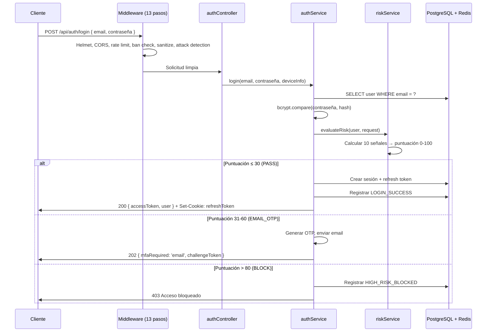

# Módulo Backend — RobenGate Sentinel

> **Clasificación:** INTERNO | **Stack:** Node.js 20 LTS + Express.js

---

## Resumen Ejecutivo

El backend de RobenGate Sentinel es una **API REST Express.js** de alto rendimiento que implementa una arquitectura monolítica modular con separación de responsabilidades por capas. El punto de entrada `app.js` orquesta una **cadena de 13 middlewares** que procesa cada solicitud HTTP a través de capas progresivas de seguridad, autenticación y enrutamiento antes de llegar a los controladores de negocio.

Esta arquitectura garantiza que las amenazas de seguridad sean interceptadas en las capas más tempranas posibles — los ataques DDoS y de escaneo se bloquean en el middleware de rate limiting antes de llegar a la lógica de autenticación, y los intentos de inyección se bloquean en el middleware de sanitización antes de llegar a las consultas de base de datos.

---

## 1. Visión General

El backend de RobenGate Sentinel es una **aplicación Express.js** que sirve como núcleo central de toda la plataforma. Gestiona autenticación, autorización, detección de ataques, correlación de amenazas, gestión de incidentes y comunicación en tiempo real.

---

## 2. Cadena de Middleware (13 Pasos)

Cada solicitud HTTP atraviesa los siguientes middlewares en orden:

```
Solicitud Entrante (HTTP)
    │
    ▼
 1. Helmet              → 14 cabeceras de seguridad HTTP
    │                     (CSP, HSTS, X-Frame-Options, etc.)
    ▼
 2. Morgan              → Logging de solicitudes HTTP
    │                     (Formato: combinado en prod, dev en desarrollo)
    ▼
 3. express.json        → Parseo de cuerpo JSON
    │                     (Límite: 10mb)
    ▼
 4. express.urlencoded  → Parseo de formularios URL-encoded
    │
    ▼
 5. cors                → CORS: orígenes permitidos desde ENV
    │                     (Credenciales: true para cookies)
    ▼
 6. rateLimiter.global  → Rate limiting global (IP-based)
    │                     100 req/15min por IP predeterminado
    ▼
 7. bannedIpCheck       → Verificar si IP está prohibida
    │                     Redis lookup < 1ms, PG fallback
    ▼
 8. requestSanitizer    → Sanitizar body/query/params
    │                     Eliminar caracteres de control maliciosos
    ▼
 9. attackDetection     → Detectar XSS/SQLi/Path Traversal
    │                     Bloquear + registrar + emitir SSE threat
    ▼
10. authenticate        → Verificar JWT Bearer token
    │                     Opcional (rutas públicas pasan)
    ▼
11. Enrutadores         → Rutas API (/auth, /users, /incidents...)
    │
    ▼
12. errorHandler        → Manejo centralizado de errores
    │                     Sin stack traces en producción
    ▼
13. 404 Handler         → Rutas desconocidas → 404 JSON
```

---

## Descripción Técnica

### 3. Mapa de Rutas Completo

#### 3.1 Rutas de Autenticación (`/api/auth`)

| Método | Ruta | Descripción | Auth |
|--------|------|-------------|------|
| `POST` | `/api/auth/register` | Registro de nuevo usuario | Público |
| `POST` | `/api/auth/login` | Login con email/contraseña | Público |
| `POST` | `/api/auth/logout` | Logout (revocar tokens) | JWT |
| `POST` | `/api/auth/refresh` | Renovar access token | Cookie |
| `POST` | `/api/auth/mfa/verify` | Verificar código MFA | Parcial |
| `POST` | `/api/auth/mfa/setup/totp` | Configurar TOTP | JWT |
| `POST` | `/api/auth/mfa/setup/email` | Configurar MFA por email | JWT |
| `POST` | `/api/auth/mfa/setup/sms` | Configurar MFA por SMS | JWT |
| `GET` | `/api/auth/me` | Obtener perfil del usuario actual | JWT |
| `POST` | `/api/auth/change-password` | Cambiar contraseña | JWT |

#### 3.2 Rutas de Usuarios (`/api/users`) — Solo Admin

| Método | Ruta | Descripción | Rol |
|--------|------|-------------|-----|
| `GET` | `/api/users` | Listar todos los usuarios | admin |
| `GET` | `/api/users/:id` | Obtener usuario por ID | admin |
| `PATCH` | `/api/users/:id/role` | Cambiar rol de usuario | admin |
| `PATCH` | `/api/users/:id/lock` | Bloquear/desbloquear cuenta | admin |
| `DELETE` | `/api/users/:id` | Eliminar usuario | admin |

#### 3.3 Rutas de Logs (`/api/logs`)

| Método | Ruta | Descripción | Rol |
|--------|------|-------------|-----|
| `GET` | `/api/logs/security` | Logs de seguridad MongoDB | viewer+ |
| `GET` | `/api/logs/audit` | Logs de auditoría PostgreSQL | viewer+ |
| `GET` | `/api/logs/security/export` | Exportar logs a CSV | analyst+ |
| `GET` | `/api/logs/stats` | Estadísticas agregadas | viewer+ |

#### 3.4 Rutas de Incidentes (`/api/incidents`)

| Método | Ruta | Descripción | Rol |
|--------|------|-------------|-----|
| `GET` | `/api/incidents` | Listar incidentes | viewer+ |
| `GET` | `/api/incidents/:id` | Obtener incidente con timeline | viewer+ |
| `POST` | `/api/incidents` | Crear incidente | responder+ |
| `PATCH` | `/api/incidents/:id` | Actualizar incidente | responder+ |
| `DELETE` | `/api/incidents/:id` | Eliminar incidente | admin |

#### 3.5 Rutas de Threat Intelligence (`/api/threat-indicators`)

| Método | Ruta | Descripción | Rol |
|--------|------|-------------|-----|
| `GET` | `/api/threat-indicators` | Listar IOC | viewer+ |
| `GET` | `/api/threat-indicators/:id` | Obtener IOC | viewer+ |
| `POST` | `/api/threat-indicators` | Reportar nuevo IOC | analyst+ |
| `PATCH` | `/api/threat-indicators/:id` | Actualizar IOC | analyst+ |
| `DELETE` | `/api/threat-indicators/:id` | Eliminar IOC | admin |

#### 3.6 Otras Rutas

| Método | Ruta | Descripción | Rol |
|--------|------|-------------|-----|
| `GET` | `/api/events` | Conexión SSE en tiempo real | analyst+ |
| `GET` | `/api/analytics/risk-score` | Puntuación de anomalía | viewer+ |
| `GET` | `/api/analytics/attack-map` | Datos para mapa de ataques | viewer+ |
| `GET` | `/api/devices` | Dispositivos de sesión | JWT (propio) |
| `POST` | `/api/devices/:id/trust` | Marcar dispositivo confiable | analyst+ |
| `GET` | `/api/sessions` | Sesiones activas del usuario | JWT (propio) |
| `DELETE` | `/api/sessions/:id` | Revocar sesión | JWT (propio/admin) |
| `POST` | `/api/internal/honeypot/events` | Recibir eventos honeypot | X-Internal-Secret |

---

### 4. Servicios del Backend

| Servicio | Archivo | Responsabilidad |
|----------|---------|----------------|
| **authService** | `src/services/authService.js` | Login, registro, tokens, MFA |
| **riskService** | `src/services/riskService.js` | Calcular puntuación de riesgo (0-100) |
| **correlationEngine** | `src/services/correlationEngine.js` | Detectar patrones → crear incidentes |
| **loggingService** | `src/services/loggingService.js` | Registrar en MongoDB + PostgreSQL |
| **banService** | `src/services/banService.js` | Gestionar prohibición de IPs |
| **honeypotService** | `src/services/honeypotService.js` | Procesar eventos del honeypot |
| **geoService** | `src/services/geoService.js` | Resolución IP → país/ciudad |
| **emailService** | `src/services/emailService.js` | Envío de OTPs por email |
| **smsService** | `src/services/smsService.js` | Envío de OTPs por SMS (Twilio) |

---

## 5. Configuración del Entorno

```env
# Servidor
NODE_ENV=production
PORT=5000
FRONTEND_URL=https://tu-dominio.com

# Base de datos
DATABASE_URL=postgresql://usuario:contraseña@db:5432/sentinel
MONGODB_URI=mongodb://mongo:27017/sentinel_logs
REDIS_URL=redis://redis:6379

# JWT
JWT_SECRET=cadena-aleatoria-muy-larga-y-secreta-de-32-chars
JWT_REFRESH_SECRET=otra-cadena-aleatoria-diferente-de-32-chars
JWT_ACCESS_EXPIRES=15m
JWT_REFRESH_EXPIRES=7d

# Email (Nodemailer)
EMAIL_HOST=smtp.gmail.com
EMAIL_PORT=587
EMAIL_USER=tu-email@gmail.com
EMAIL_PASS=tu-contraseña-de-aplicacion

# SMS (Twilio)
TWILIO_ACCOUNT_SID=ACxxxxxxxxxxxxxxxxxxxxxxxxxxxxxxxx
TWILIO_AUTH_TOKEN=xxxxxxxxxxxxxxxxxxxxxxxxxxxxxxxx
TWILIO_PHONE_NUMBER=+15551234567

# Seguridad interna
INTERNAL_SECRET=secreto-compartido-honeypot-backend-32-chars
```

---

## Flujo Operacional

### 6. Flujo de Login Exitoso



---

## Casos de Uso

### Caso 1: Escalabilidad Horizontal

El backend es stateless — el estado de sesión está en Redis, no en memoria de la aplicación. Esto permite desplegar múltiples instancias del backend detrás de un balanceador de carga sin session affinity requerida.

### Caso 2: Degradación Graceful

Si Redis no está disponible, las operaciones de auth caen back a PostgreSQL. Los contadores de rate limiting en Redis son mejores esfuerzo — si Redis cae, el rate limiting se relaja pero el servicio continúa funcionando.

### Caso 3: Detección de Ataques en Middleware

Un atacante envía un payload XSS `<script>alert(1)</script>` como cuerpo JSON. El middleware `attackDetection` (paso 9) detecta el patrón de XSS, bloquea la solicitud con 400, registra el evento en MongoDB y emite un SSE `threat` — todo antes de que la solicitud llegue a ningún controlador de negocio.

---

## Beneficios para una Empresa

| Beneficio | Descripción |
|-----------|-------------|
| **Seguridad por Defecto** | 13 capas de middleware antes del código de negocio |
| **Sin Estado** | Escalabilidad horizontal sin cambios de arquitectura |
| **Logging Completo** | Cada evento registrado para auditoría y forensia |
| **Separación de Responsabilidades** | Controladores, servicios y middlewares independientes |
| **Mantenibilidad** | Módulos pequeños con responsabilidad única |

---

## Seguridad

- **Helmet**: 14 cabeceras de seguridad HTTP automáticas
- **CORS configurado**: Solo orígenes permitidos explícitamente
- **Rate limiting**: Protección contra DDoS y fuerza bruta
- **Ban check en middleware**: Solicitudes de IPs prohibidas bloqueadas <1ms
- **Input sanitization**: Sanitización antes de llegar a la base de datos
- **Attack detection**: XSS/SQLi bloqueado en capa de middleware
- **Sin stack traces en producción**: `NODE_ENV=production` suprime traces

---

## Roadmap

| Capacidad | Estado |
|-----------|--------|
| **API Gateway** con gestión de versiones | Planificado |
| **gRPC** para comunicación inter-servicios | Planificado |
| **Tracing distribuido** (OpenTelemetry) | Futuro |
| **Descomposición en microservicios** | Futuro |

---

*Ver también: [../database/resumen.md](../database/resumen.md) | [../security/resumen.md](../security/resumen.md) | [../realtime/sistema-eventos.md](../realtime/sistema-eventos.md)*
