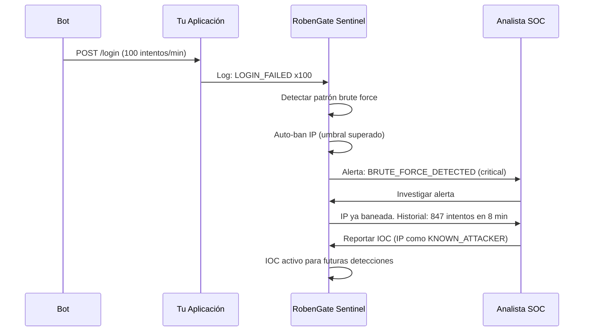
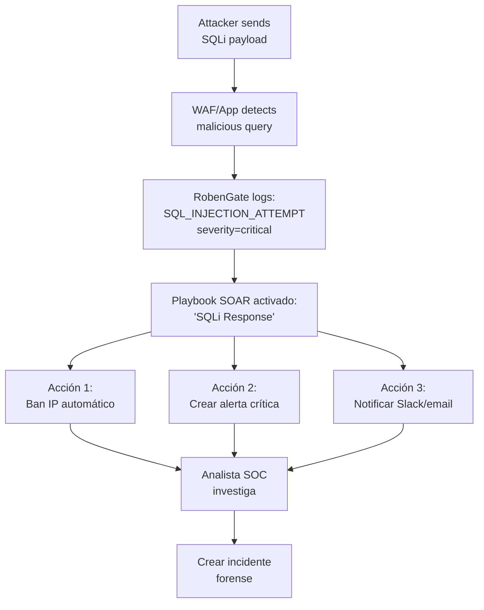

# Casos de Uso — RobenGate Sentinel

**Escenarios de uso real basados en las capacidades implementadas**  

---

## Caso de Uso 1: Detección de Credential Stuffing en Tiempo Real

### Escenario

Un atacante ha comprado una base de datos de 10,000 pares email/contraseña de una brecha conocida. Usa un bot para probar estas credenciales contra tu aplicación.

### Cómo Funciona en RobenGate Sentinel



### Acciones Automáticas

1. **Auto-detección:** Motor de riesgo detecta el patrón en tiempo real
2. **Auto-ban:** IP baneada automáticamente al superar el umbral
3. **Alerta instantánea:** Notificación SSE al dashboard SOC
4. **IOC creado:** IP indexada en MongoDB ThreatIndicator

### Valor para el Cliente

- Sin intervención manual para la contención inicial
- Historial completo del ataque para análisis forense
- IOC reutilizable en futuros ataques

---

## Caso de Uso 2: Respuesta a SQL Injection con SOAR

### Escenario

Un atacante descubre un endpoint vulnerable a SQL injection en tu API. Intenta extraer la tabla de usuarios.

### Flujo Automatizado



### Playbook SOAR Configurado

```json
{
  "name": "SQLi Auto-Response",
  "trigger": "SQL_INJECTION_ATTEMPT",
  "actions": [
    {"type": "BAN_IP", "delay_seconds": 0},
    {"type": "CREATE_ALERT", "severity": "critical"},
    {"type": "NOTIFY_SLACK", "channel": "#soc-alerts"},
    {"type": "ESCALATE_INCIDENT", "if": "status_code == 200"}
  ]
}
```

### Resultado

- **MTTC reducido de horas a segundos** para la contención
- Si el ataque tuvo éxito (status 200) → incidente creado automáticamente
- Historial completo del payload para análisis de la vulnerabilidad

---

## Caso de Uso 3: Honeypot Captura Actor Avanzado

### Escenario

Un atacante sofisticado escanea tu red antes de atacar. El honeypot captura su huella antes de que llegue a sistemas reales.

### Lo que Ocurre

1. Honeypot SSH en puerto 2222 recibe conexiones de `103.41.204.87`
2. El atacante prueba credenciales comunes (admin/admin, root/root, etc.)
3. Honeypot HTTP en puerto 8080 recibe sondeos de rutas: `/.env`, `/admin`, `/.git`

### En RobenGate Sentinel

```bash
# Los eventos se capturan automáticamente
GET /api/honeypot/events?ip=103.41.204.87

# Respuesta: 23 eventos SSH + 47 eventos HTTP en 10 minutos
# El sistema ya baneó la IP y creó un IOC automáticamente

# Ver IOC creado desde honeypot
GET /api/threats/indicators?source=honeypot
# {"type": "IP", "value": "103.41.204.87", "confidence": 90, "severity": "HIGH"}
```

### Valor para el Cliente

- El atacante se expone sin haber llegado a sistemas reales
- IP e IOC registrados para proteger a todos los tenants
- Inteligencia de amenazas real generada internamente

---

## Caso de Uso 4: Cumplimiento SOC 2 — Audit Trail Inmutable

### Escenario

Tu empresa SaaS necesita certificación SOC 2 Type II. Los auditores requieren evidencia de quién accedió a qué, cuándo, desde dónde.

### Evidencia que RobenGate Sentinel Proporciona

```bash
# Todos los accesos de los últimos 365 días
GET /api/audit?from=<1year_ago>&limit=10000

# Acceso a datos sensibles por usuario
GET /api/audit?userId=42&category=DATA

# Cambios de configuración (admin actions)
GET /api/audit?category=ADMIN&from=<90d_ago>

# Intentos de acceso denegados (CC6.6)
GET /api/logs?event_type=UNAUTHORIZED_ACCESS
```

### Garantías de Inmutabilidad

- MongoDB: schema con `{timestamps: false}`, sin operaciones de update/delete
- PostgreSQL audit_logs: sin cláusula de DELETE, TTL solo con expiración larga
- Los logs no se pueden modificar desde la API (solo INSERT)

### Controles SOC 2 Mapeados

| Control | Descripción | Evidencia en RobenGate |
|---|---|---|
| CC6.1 | Acceso lógico con MFA | WebAuthn + TOTP + Email OTP logs |
| CC6.3 | Mínimo privilegio | RBAC logs + denied access logs |
| CC6.6 | Autenticación de usuarios | Auth logs (LOGIN_SUCCESS, LOGIN_FAILED) |
| CC7.2 | Monitorización de seguridad | Alertas + Risk Score dashboard |
| CC7.3 | Respuesta a incidentes | Incidents timeline + post_review status |

---

## Caso de Uso 5: Análisis de Amenazas Multi-Tenant (MSP)

### Escenario

Un proveedor de servicios gestionados (MSP) usa RobenGate Sentinel para monitorizar 20 clientes distintos desde una sola plataforma.

### Arquitectura Multi-Tenant

```bash
# Organización A (Cliente 1)
organization_id=1, plan=professional, seats_limit=50

# Organización B (Cliente 2)
organization_id=2, plan=enterprise, seats_limit=unlimited

# Todos los datos filtrados por organization_id
GET /api/alerts?organization_id=1  # Solo alertas del cliente 1
GET /api/alerts?organization_id=2  # Solo alertas del cliente 2
```

### Beneficios para el MSP

- **Aislamiento total** entre clientes (FK en todos los recursos)
- **API Keys por organización** para integraciones independientes
- **Roles independientes** por organización
- **Facturación diferenciada** por plan por organización
