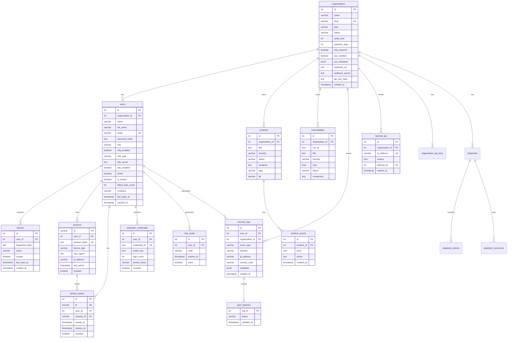

# Base de Datos — Relaciones Entre Entidades

**Diagrama ER completo de RobenGate Sentinel**

---

## Diagrama ER Principal (PostgreSQL)



---

## Relaciones Clave

### Usuario — Organización (Multi-tenancy)

```
organizations (1) ────< users (N)
```

Un usuario pertenece a una organización. La mayoría de entidades tienen `organization_id` para aislamiento de datos entre tenants.

**Aislamiento:** El middleware `tenant.js` extrae `organization_id` del JWT del usuario y filtra todas las queries.

---

### Usuario — Sesiones — Tokens

```
users (1) ────< sessions (N) ────< refresh_tokens (N)
```

- Un usuario puede tener múltiples sesiones activas simultáneas (multi-device)
- Cada sesión tiene su cadena de refresh tokens
- Al revocar una sesión, se revocan todos sus refresh tokens

---

### Security Logs — Alert Statuses (Overlay Pattern)

```
security_logs (1) ────o| alert_statuses (0..1)
```

El patrón overlay preserva la inmutabilidad de los logs:
- `security_logs` **nunca se modifica**
- `alert_statuses` almacena el estado mutable de la alerta
- JOIN al leer para obtener el estado actual

---

### Incidents — Timeline

```
incidents (1) ────< incident_events (N)
```

Cada cambio de estado, asignación o nota crea un evento en `incident_events`, formando el timeline del incidente.

---

### Playbooks SOAR

```
playbooks (1) ────< playbook_actions (N)
playbooks (1) ────< playbook_executions (N)
```

El SOAR Engine evalúa triggers, ejecuta acciones en orden y registra cada ejecución.

---

## Relaciones Cross-Database (PostgreSQL ↔ MongoDB)

No hay relaciones formales entre PostgreSQL y MongoDB. La consistencia se mantiene por:

| Evento | PostgreSQL | MongoDB |
|---|---|---|
| Login fallido | `security_logs.id` = X | `SecurityLog._id` = Y |
| IOC detectado | Referencia en `security_logs.metadata` | `ThreatIndicator.value` |
| Audit action | No almacenado | `SecurityLog` (categoría ADMIN) |

Los IDs no están sincronizados. El `requestId` se puede usar para correlacionar logs entre las dos bases de datos.

---

## Estrategia de Claves Foráneas

| FK Behavior | Cuándo usar | Ejemplo |
|---|---|---|
| `ON DELETE CASCADE` | Datos que no tienen sentido sin el padre | `sessions.user_id` |
| `ON DELETE SET NULL` | Datos históricos que deben preservarse | `security_logs.user_id` |
| `ON DELETE RESTRICT` | Cuando hay integridad crítica | No usado (preferimos CASCADE/SET NULL) |

---

## Redis — Esquemas de Claves

Redis actúa como caché de decisiones de seguridad (no es un almacén de datos persistente).

| Clave | TTL | Propósito | Tipo |
|---|---|---|---|
| `jwt:blacklist:<jti>` | Hasta expiración del token | JWTs invalidados | String |
| `mfa:<userId>` | 5 minutos | Códigos OTP email | String |
| `ban:<ip>` | Configurable (24h default) | IPs baneadas | String |
| `ratelimit:<ip>:<route>` | 1 minuto | Rate limiting sliding window | Sorted Set |
| `session:<sessionId>` | 7 días | Datos de sesión activa | Hash |
| `totp_challenge:<userId>` | 5 minutos | Challenge TOTP pendiente | String |

### Relación Redis ↔ PostgreSQL

- **IP Ban:** `banned_ips` (PostgreSQL) = fuente de verdad; `ban:<ip>` (Redis) = cache rápido
- **MFA Codes:** `mfa_codes` (PostgreSQL) = backup; `mfa:<userId>` (Redis) = primario
- **JWT Blacklist:** Solo en Redis (no en PostgreSQL). Si Redis cae, los tokens revocados temporalmente pueden ser válidos hasta que Redis se recupere → la sesión en PostgreSQL como segunda línea de defensa

---

## Guía de Integridad Referencial

### Eliminar un Usuario

1. `devices` → `ON DELETE CASCADE` → Eliminados automáticamente
2. `sessions` → `ON DELETE CASCADE` → Eliminadas automáticamente
3. `refresh_tokens` → `ON DELETE CASCADE` → Eliminados automáticamente
4. `webauthn_credentials` → `ON DELETE CASCADE` → Eliminadas automáticamente
5. `mfa_codes` → `ON DELETE CASCADE` → Eliminados automáticamente
6. `security_logs.user_id` → `ON DELETE SET NULL` → `user_id = NULL` (log preservado)
7. `banned_ips.banned_by` → `ON DELETE SET NULL` → Preservado, referencia NULL

### Eliminar una Organización

Virtualmente todo se elimina en cascada. Esta operación requiere confirmación explícita de admin.
