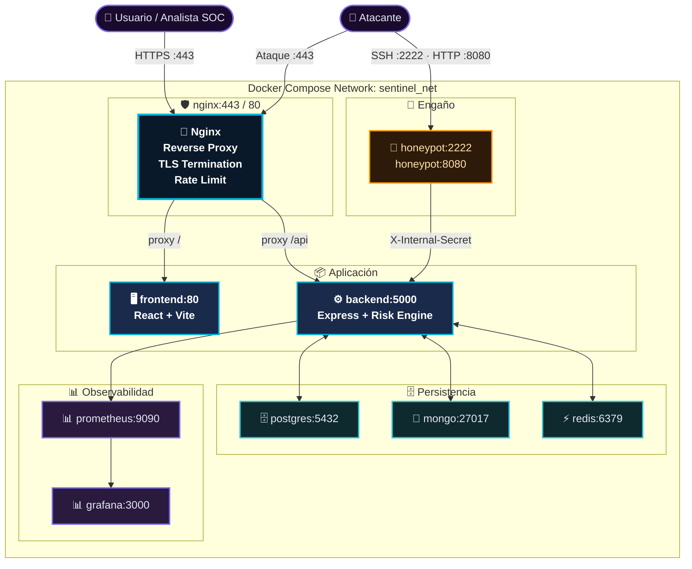

# Guía de Despliegue — RobenGate Sentinel

> **Clasificación:** INTERNO | **Entornos:** Desarrollo · Producción

---

## Resumen Ejecutivo

RobenGate Sentinel se despliega mediante **Docker Compose** con tres configuraciones de entorno. El proceso completo de despliegue desde cero hasta servicio operativo toma menos de 15 minutos. La plataforma incluye scripts de PowerShell para Windows que automatizan el ciclo de vida completo del entorno.

---

## 1. Requisitos Previos

| Herramienta | Versión | Propósito |
|-------------|---------|-----------|
| **Docker** | 24+ | Runtime de contenedores |
| **Docker Compose** | 2.20+ | Orquestación de múltiples servicios |
| **Node.js** | 20 LTS | Desarrollo local (sin Docker) |
| **PowerShell** | 5.1+ | Scripts de gestión (Windows) |
| **openssl** | Cualquiera | Generación de certificados TLS |

---

## 2. Inicio Rápido (Desarrollo)

```powershell
# Clonar repositorio
git clone https://github.com/Robensonl/robengate-sentinel.git
cd robengate-sentinel

# Generar certificados TLS auto-firmados para desarrollo
.\scripts\generate-dev-certs.ps1

# Iniciar todos los servicios
.\dev-start.ps1

# Detener todos los servicios
.\dev-stop.ps1
```

### 2.1 Qué Hace `dev-start.ps1`

1. Verifica que Docker Desktop está corriendo
2. Crea `.env` desde `.env.example` si no existe
3. Ejecuta `docker compose -f infra/docker/docker-compose.dev.yml up -d`
4. Espera a que el health check de PostgreSQL pase
5. Ejecuta migraciones de base de datos: `docker exec backend node scripts/migrate.js`
6. Imprime las URLs de los servicios en la consola

---

## 3. Variables de Entorno

### 3.1 Variables Requeridas

Crear `.env` en la raíz del proyecto:

```env
# ─── Secretos de Seguridad (DEBEN cambiarse en producción) ──────────────
JWT_SECRET=<cadena-aleatoria-mínimo-64-caracteres>
JWT_REFRESH_SECRET=<cadena-aleatoria-diferente-mínimo-64-caracteres>
INTERNAL_API_SECRET=<cadena-aleatoria-mínimo-32-caracteres>

# ─── Contraseñas de Base de Datos ────────────────────────────────────────
POSTGRES_PASSWORD=<contraseña-fuerte-aleatoria>
MONGO_PASSWORD=<contraseña-fuerte-aleatoria>
REDIS_PASSWORD=<contraseña-fuerte-aleatoria>

# ─── Clave SSH del Honeypot ────────────────────────────────────────────
SSH_HOST_KEY_PEM=<clave-privada-RSA-4096-en-base64>

# ─── Email (MFA + Restablecimiento de Contraseña) ──────────────────────
SMTP_HOST=smtp.gmail.com
SMTP_PORT=587
SMTP_USER=tu-app@gmail.com
SMTP_PASS=tu-contraseña-de-aplicacion

# ─── SMS (Opcional — MFA via Twilio) ─────────────────────────────────────
TWILIO_ACCOUNT_SID=AC...
TWILIO_AUTH_TOKEN=...
TWILIO_FROM_PHONE=+1234567890

# ─── Configuración del Frontend ─────────────────────────────────────────
VITE_API_URL=https://localhost:443

# ─── Feature Flags ────────────────────────────────────────────────────────
REDIS_OPTIONAL=false
MONGO_OPTIONAL=false
NODE_ENV=production
```

### 3.2 Generación de Secretos (PowerShell)

```powershell
# Generar JWT_SECRET (64 bytes, codificado en Base64)
[Convert]::ToBase64String((1..64 | ForEach-Object { Get-Random -Maximum 256 } | ForEach-Object { [byte]$_ }))

# Generar clave SSH para el honeypot
ssh-keygen -t rsa -b 4096 -N "" -f ssh_host_key -q
[Convert]::ToBase64String([System.IO.File]::ReadAllBytes("ssh_host_key"))
```

---

## 4. Despliegue en Producción

### 4.1 Pasos de Despliegue

```bash
# 1. Clonar repositorio en el servidor
git clone https://github.com/Robensonl/robengate-sentinel.git
cd robengate-sentinel

# 2. Configurar variables de entorno de producción
cp .env.example .env.production
# Editar .env.production con valores reales de producción

# 3. Configurar certificados TLS (Let's Encrypt)
# Seguir instrucciones en docs/DEPLOYMENT_GUIDE.md para Certbot

# 4. Iniciar con configuración de producción
docker compose -f docker-compose.yml -f docker-compose.prod.yml up -d

# 5. Verificar que todos los servicios están corriendo
docker ps
docker compose logs -f backend
```

### 4.2 Verificaciones Post-Despliegue (Smoke Tests)

```bash
# 1. Health check del backend
curl -k https://tu-dominio.com/api/health
# Respuesta esperada: { "status": "ok", "timestamp": "..." }

# 2. Verificar que el frontend carga
curl -k https://tu-dominio.com/
# Respuesta esperada: HTML del index.html de React

# 3. Verificar que las rutas internas están bloqueadas desde exterior
curl -k https://tu-dominio.com/internal/honeypot/events
# Respuesta esperada: 403 Forbidden

# 4. Verificar conectividad de base de datos
docker exec backend node -e "require('./src/config/database').testConnection()"

# 5. Verificar honeypot SSH (desde cliente externo)
ssh -p 2222 root@tu-dominio.com
# Respuesta esperada: conexión aceptada pero siempre rechazada (sin acceso real)
```

---

## 5. Despliegue Local (Sin Docker)

### 5.1 Backend

```bash
cd backend
npm install
cp .env.example .env
# Editar .env con tus configuraciones locales

# Ejecutar migraciones de PostgreSQL
node scripts/migrate.js

# Iniciar en modo desarrollo (con nodemon)
npm run dev

# O iniciar en modo producción
npm start
```

### 5.2 Frontend

```bash
cd frontend
npm install

# Iniciar servidor de desarrollo Vite
npm run dev

# O construir para producción
npm run build
npm run preview  # Para previsualizar el build
```

### 5.3 Honeypot

```bash
cd honeypot
npm install
cp .env.example .env
npm start
```

---

## 6. Migraciones de Base de Datos

Las migraciones se ejecutan automáticamente en el script `dev-start.ps1`. Para ejecutarlas manualmente:

```bash
# Dentro del contenedor del backend
docker exec backend node scripts/migrate.js

# O localmente
cd backend
node scripts/migrate.js
```

Archivos de migración en `db-sql/migrations/`:

| Archivo | Descripción |
|---------|-------------|
| `001_initial_schema.sql` | Tablas base: users, devices, sessions |
| `002_add_mfa_codes.sql` | Tabla de códigos MFA |
| `003_add_phone_mfa.sql` | Campo de teléfono para MFA SMS |
| `004_add_sessions.sql` | Gestión de sesiones |
| `005_add_webauthn.sql` | Credenciales WebAuthn/FIDO2 |
| `006_backup_codes_and_risk.sql` | Códigos de respaldo y puntuación de riesgo |
| `007_add_audit_logs.sql` | Tabla de logs de auditoría admin |

---

## 7. Gestión del Entorno

```powershell
# Iniciar plataforma completa
.\docker-up.ps1

# Detener plataforma completa
.\docker-down.ps1

# Ver logs de todos los servicios
docker compose logs -f

# Ver logs de un servicio específico
docker compose logs -f backend
docker compose logs -f honeypot

# Reiniciar un servicio específico
docker compose restart backend

# Reconstruir imágenes tras cambios de código
docker compose up -d --build backend
```

---

## 8. Solución de Problemas

### Backend no arranca

```bash
# Ver logs detallados
docker compose logs backend

# Problemas comunes:
# - DATABASE_URL incorrecta → verificar contraseña de PostgreSQL
# - JWT_SECRET muy corto → debe tener al menos 32 caracteres
# - Puerto 5000 ocupado → cambiar en docker-compose.yml
```

### Frontend no carga

```bash
# Verificar build de Vite
docker compose logs frontend

# Problema común: VITE_API_URL incorrecto
# Debe apuntar al mismo origen o al Nginx proxy
```

### Certificados TLS auto-firmados

```bash
# Regenerar certificados
.\scripts\generate-dev-certs.ps1

# Los navegadores mostrarán advertencia de seguridad para certificados auto-firmados
# Hacer click en "Avanzado" → "Continuar" (solo en desarrollo)
```

---

## Beneficios para una Empresa

| Beneficio | Descripción |
|-----------|-------------|
| **Despliegue en 15 min** | Scripts automatizados para inicio rápido |
| **Reproducible** | Docker garantiza mismo entorno en cualquier host |
| **Dev/Prod Parity** | Misma arquitectura en desarrollo y producción |
| **Scripts PowerShell** | Gestión simplificada en Windows |

---

## Diagrama de Infraestructura Docker



---

*Ver también: [../infrastructure/resumen.md](../infrastructure/resumen.md) | [../database/resumen.md](../database/resumen.md)*
