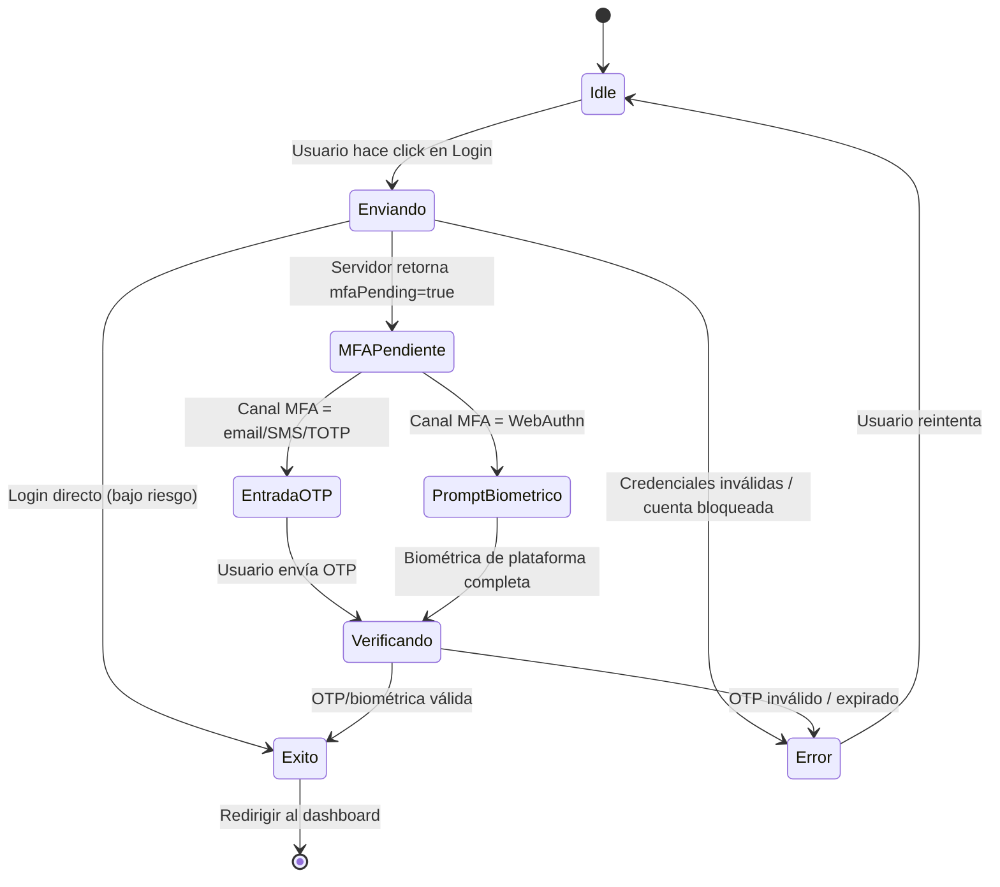
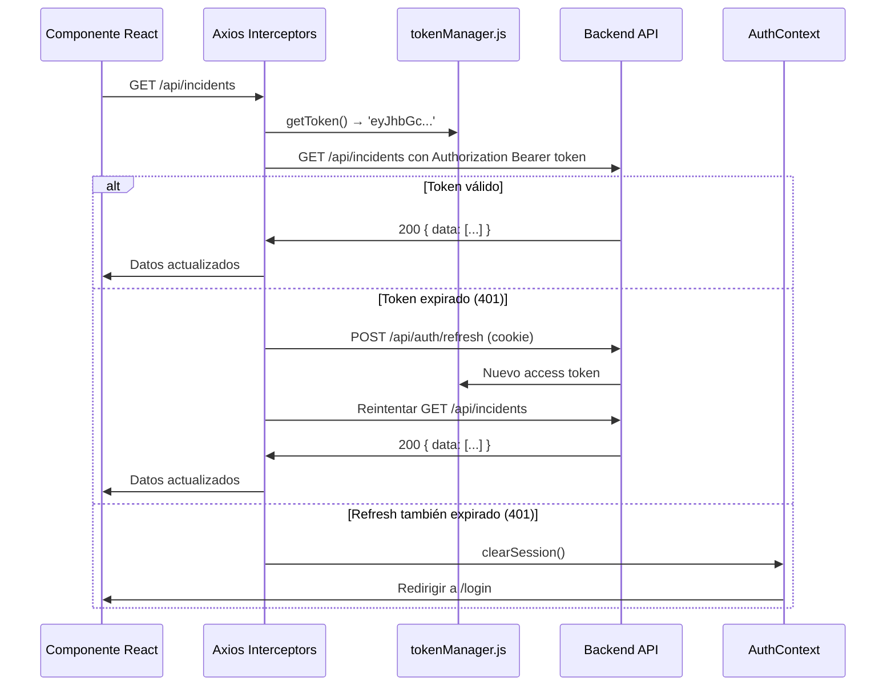

# Módulo Frontend — RobenGate Sentinel

> **Clasificación:** INTERNO | **Stack:** React 19 + Vite + Tailwind CSS

---

## Resumen Ejecutivo

El frontend de RobenGate Sentinel es una **Aplicación de Página Única (SPA)** construida con React 19 y empaquetada con Vite, que ofrece una interfaz SOC (Centro de Operaciones de Seguridad) en tiempo real con temática empresarial, control de acceso granular por roles, flujos de autenticación multifactor y visualización de amenazas en vivo.

La interfaz está diseñada específicamente para **operaciones SOC 24/7**: optimizada para trabajo nocturno con temas oscuros, actualización de datos en tiempo real sin refresco de página, y flujos de trabajo optimizados para la gestión rápida de incidentes.

---

## 1. Visión General

El frontend entrega una **interfaz SOC empresarial completa** que proporciona en tiempo real: visualización de amenazas, análisis de logs de seguridad, gestión de incidentes, cacería de amenazas e inteligencia de amenazas. Toda la interfaz se actualiza automáticamente vía SSE sin necesidad de refresco manual.

---

## 2. Stack Tecnológico

| Categoría | Tecnología | Versión | Propósito |
|-----------|-----------|---------|-----------|
| **Framework** | React | 19.2.3 | Sistema de componentes UI |
| **Router** | React Router DOM | 7.10.1 | Enrutamiento del lado del cliente |
| **Estado** | React Context + Zustand | — / 5.0.13 | Auth, tema, estado global |
| **HTTP** | Axios | 1.6.2 | REST API con interceptores |
| **Formularios** | React Hook Form + Zod | 7.76 / 4.4.3 | Validación tipada de formularios |
| **CSS** | Tailwind CSS | 4.3.0 | Estilos utility-first |
| **Animaciones** | Motion | 12.38.0 | Animaciones compatibles con Framer |
| **Gráficas** | Recharts | 3.8.1 | Visualización de datos basada en D3 |
| **Mapas** | react-simple-maps | 3.0.0 | Renderizado SVG del mapa mundial |
| **Iconos** | Lucide React | 1.16.0 | Set de 1000+ iconos SVG |
| **Notificaciones** | Sonner | 2.0.7 | Toast notifications |
| **WebAuthn** | @simplewebauthn/browser | 13.3.0 | Auth con passkey/biométrica |
| **Build** | Vite | Latest | Servidor dev rápido + bundler |

---

## 2. Arquitectura de Directorios

```
frontend/src/
├── app/
│   ├── App.jsx                 ← Raíz: Proveedores Theme + Auth + Router
│   ├── main.jsx                ← Punto de montaje ReactDOM.createRoot
│   └── routes.jsx              ← Definiciones de rutas con lazy loading
│
├── features/                   ← Módulos por dominio funcional
│   ├── auth/pages/             ← Login, Registro, MFA, Biométrica, Reset Contraseña
│   ├── dashboard/              ← Panel principal SOC
│   ├── security/pages/         ← Terminal SIEM, Logs, Threat Intel, Honeypot
│   ├── alerts/pages/           ← Centro de alertas + motor de workflow
│   ├── incidents/pages/        ← Gestión del ciclo de vida de incidentes
│   ├── vulnerabilities/pages/  ← Seguimiento de CVE
│   ├── ai/pages/               ← Análisis de amenazas por IA
│   ├── attackmap/pages/        ← Mapa global geo de amenazas
│   ├── users/pages/            ← Gestión de usuarios, dispositivos, sesiones
│   ├── landing/pages/          ← Página de marketing
│   └── marketing/pages/        ← Demos de arquitectura, tarjeta de presentación
│
├── shared/
│   ├── contexts/               ← AuthContext, ThemeContext, ToastContext
│   ├── hooks/                  ← usePermission, useRealTimeData, useTokenRefresh
│   ├── services/               ← api.js, tokenManager.js, realTimeService.js
│   ├── config/                 ← permissions.js (Matriz RBAC)
│   ├── utils/                  ← deviceFingerprint.js, mask.js, secureStorage.js
│   └── components/             ← Layout, Navbar, PermissionGate, ThemeSwitcher
│
└── styles/
    ├── global.css              ← Variables CSS, sistema de temas, keyframes
    └── App.css
```

---

## Descripción Técnica

### 3. Arquitectura de Enrutamiento

#### 3.1 Rutas Públicas y Protegidas

```mermaid
flowchart TD
    classDef pub   fill:#0F2A2E,stroke:#26C6DA,stroke-width:2px,color:#E2E8F0
    classDef prot  fill:#1A2A4A,stroke:#00B4D8,stroke-width:2px,color:#FFFFFF
    classDef view  fill:#0F2A1A,stroke:#4CAF50,stroke-width:2px,color:#E2E8F0
    classDef admin fill:#2D1B1B,stroke:#FF6B6B,stroke-width:2px,color:#FFE0E0
    classDef route fill:#2A1A3E,stroke:#7B68EE,stroke-width:2px,color:#E2E8F0

    ROOT["/"]:::route --> LAND["Landing Page"]:::route

    PUB["Rutas Publicas"]:::pub --> LOGIN["/login"]:::pub
    PUB --> REG["/registro"]:::pub
    PUB --> MFA["/mfa-verify"]:::pub
    PUB --> BIO["/biometric"]:::pub
    PUB --> FORGOT["/forgot-password"]:::pub
    PUB --> ARCH["/architecture"]:::pub

    PROT["Rutas Protegidas<br/>Cualquier rol"]:::prot --> DASH["/dashboard"]:::prot
    PROT --> LOGS["/logs"]:::prot
    PROT --> AUDIT["/audit"]:::prot
    PROT --> DEV["/devices"]:::prot
    PROT --> SESS["/sessions"]:::prot

    VIEWER["Viewer+"]:::view --> AMAP["/attack-map"]:::view
    VIEWER --> ALE["/alerts"]:::view
    VIEWER --> INC["/incidents"]:::view
    VIEWER --> AI["/ai-analysis"]:::view
    VIEWER --> THR["/threats"]:::view
    VIEWER --> HP["/honeypot"]:::view
    VIEWER --> TH["/threat-hunting"]:::view

    ADMIN["Solo Admin"]:::admin --> USR["/users"]:::admin
    ADMIN --> SET["/settings"]:::admin
```



#### 3.2 Componente `ProtectedRoute`

`ProtectedRoute.jsx` realiza dos verificaciones:

1. **Autenticación** — Si no hay usuario en `AuthContext`, redirigir a `/login` con `state.from` para redirección post-login
2. **Autorización** — Si `requiredRole` especificado y el rango del usuario es insuficiente, redirigir a `/access-denied`

---

### 4. Flujo de Autenticación del Frontend



### 4.1 Ciclo de Vida de Tokens

| Token | Almacenamiento | Duración | Renovación |
|-------|---------------|----------|-----------|
| **Access Token** | En memoria (`tokenManager.js`) | 15 minutos | Auto cada 14 min |
| **Refresh Token** | Cookie HttpOnly | 7 días | Al expirar el access token |

El access token en memoria (no en localStorage) **previene ataques XSS** — un script malicioso no puede leer el token desde JavaScript.

---

### 5. Gestión de Estado y Contextos

#### 5.1 AuthContext

Proporciona estado de autenticación global a toda la aplicación:

```javascript
const { user, token, isAuthenticated, isAdmin, isAnalyst, isViewer } = useAuth();

// Métodos disponibles:
setUser(userData, tokens)     // Actualización de estado post-login
clearSession()                // Logout + limpieza + invalidación de tokens
getToken()                    // Leer access token en memoria
hasRole(role)                 // Verificación de igualdad de rol
canPerform(resource, action)  // Verificación de permisos via permissions.js
```

#### 5.2 ThemeContext

5 temas oscuros empresariales con inyección de variables CSS:

| ID de Tema | Color Principal | Caso de Uso |
|-----------|----------------|-------------|
| `sentinel-blue` | `#00D4FF` (cian) | Profesional predeterminado |
| `matrix-green` | `#00FF41` | Estética terminal/hacker |
| `red-alert` | `#FF3B5C` | Modo de incidente crítico |
| `purple-neon` | `#a855f7` | Moderno y vibrante |
| `stealth-black` | `#e2e8f0` | Mínimo alto contraste |

Los cambios de tema se persisten en `localStorage` y se aplican inmediatamente via variables CSS en `:root`.

---

### 6. Arquitectura de Datos en Tiempo Real

#### 6.1 Cadena de Prioridad del Servicio

```
realTimeService.js intenta:
  1. SSE del Backend  → GET /api/events?token={JWT}
       ↓ si no disponible (sin backend, error de red)
  2. Simulación Mock → attackSimulator.js genera eventos realistas
       ↓ si deshabilitado
  3. Inactivo → Sin datos fluyendo
```

#### 6.2 Referencia de Hooks en Tiempo Real

| Hook | Canal | Máx Items | Retorna |
|------|-------|-----------|---------|
| `useLiveAttacks(n)` | `ATTACK` | n (por defecto 20) | Array de eventos de ataque |
| `useLiveLogs(n)` | `SIEM` | n (por defecto 100) | Array de entradas de log |
| `useLiveAnomalyScore()` | `ANOMALY` | — | `{ score: 0-100, history: [] }` |
| `useLiveMetrics()` | `METRICS` | — | `{ totalAttacks, blocked, sessions, riskScore }` |
| `useLiveChartData(w)` | `ATTACK` | ventana w | `[{ time, detected, blocked }]` |
| `useLiveBruteForceSessions()` | `BRUTE_FORCE` | 20 | Array de sesiones BF |
| `useLiveXSSEvents()` | `XSS` | 20 | Array de eventos XSS |
| `useConnectionStatus()` | Interno | — | `{ status: 'connected'\|'mock'\|'idle', mode }` |

---

## 7. Componentes de Seguridad UI

### 7.1 `PermissionGate.jsx`

Oculta elementos UI según permisos del usuario:

```jsx
// Ocultar si permisos insuficientes
<PermissionGate resource="incidentes" action="escribir">
  <Button>Crear Incidente</Button>
</PermissionGate>

// Mostrar alternativa para usuarios sin permiso
<PermissionGate
  resource="alertas"
  action="actualizar-estado"
  fallback={<InsigniaLectura />}
>
  <SelectorEstado />
</PermissionGate>
```

### 7.2 `deviceFingerprint.js`

Genera una huella digital del dispositivo a partir de señales del navegador (User-Agent, idioma, zona horaria, resolución de pantalla, plugins disponibles, etc.). Esta huella:
1. Se envía en cada login
2. Se almacena en la tabla `devices` de PostgreSQL
3. Contribuye a la puntuación de riesgo del Motor de Riesgo
4. Permite detectar Viaje Imposible (mismo usuario, diferentes continentes)

### 7.3 `mask.js`

Aplica enmascaramiento de datos para el rol `viewer`:
```javascript
maskIp('185.220.101.42')      → '18X.X.X.42'
maskEmail('alice@corp.io')    → 'aXXXX@XXXX.io'
maskPhone('+15551234567')     → '+1XXXXXXX567'
```

---

## Flujo Operacional

### 8. Ciclo de Vida de Solicitud API



---

## Casos de Uso

### Caso 1: Onboarding de Nuevo Analista SOC

Un nuevo analista se conecta y ve el panel SOC en tiempo real con todos los módulos activos. El sistema detecta su dispositivo como nuevo (no en la BD de dispositivos) y lo presenta como un nuevo dispositivo en la lista de dispositivos del usuario. El analista puede ver todos los datos de seguridad (IPs y emails sin enmascarar).

### Caso 2: Sesión de Monitorización de Ejecutivo

El CFO inicia sesión con su rol `viewer`. El tema visual es idéntico al del analista, pero todos los botones de acción están ocultos por `PermissionGate`. Las IPs y emails aparecen enmascarados. La insignia "Solo Vista" en la cabecera confirma su nivel de acceso.

### Caso 3: Cambio de Tema Durante Incidente Crítico

Durante un incidente activo a las 2am, el analista cambia el tema a `red-alert` para señalar visualmente el estado de emergencia. El cambio se aplica instantáneamente y se persiste para la próxima sesión.

---

## Beneficios para una Empresa

| Beneficio | Descripción |
|-----------|-------------|
| **Tiempo Real** | Sin necesidad de refrescar — SSE actualiza todo automáticamente |
| **RBAC Visual** | La UI oculta opciones no disponibles para el rol del usuario |
| **Seguridad de Tokens** | Access token en memoria previene ataques XSS |
| **Multi-MFA** | Email, SMS, TOTP y WebAuthn soportados en el frontend |
| **Soporte Sin Backend** | Modo mock para demos y presentaciones |
| **5 Temas Oscuros** | UI optimizada para operaciones SOC nocturnas |

---

## Seguridad

- **Tokens en memoria**: Access token no persiste en localStorage/sessionStorage
- **CORS configurado**: Solo comunica con el backend autorizado
- **Sanitización de entradas**: React escapa automáticamente valores interpolados (previene XSS reflejado)
- **Sin eval()**: No se usa eval() en ningún componente
- **CSP**: Las cabeceras CSP del backend restringen fuentes de scripts

---

## Roadmap

| Capacidad | Estado |
|-----------|--------|
| **PWA** (Progressive Web App) con notificaciones push | Planificado |
| **Dashboard personalizable** con widgets drag-and-drop | Planificado |
| **Modo tablet** para operaciones móviles de campo | Planificado |
| **Exportación de informes** PDF para ejecutivos | Futuro |

---

*Ver también: [../backend/resumen.md](../backend/resumen.md) | [../realtime/sistema-eventos.md](../realtime/sistema-eventos.md) | [../rbac/resumen.md](../rbac/resumen.md)*
