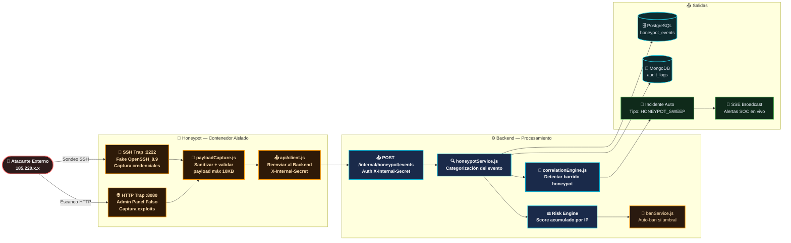
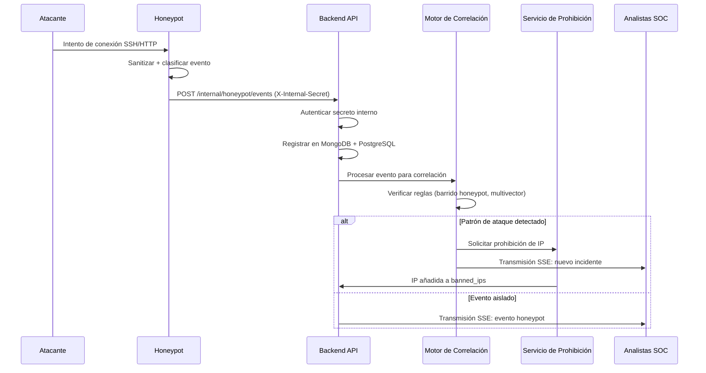

# Módulo Honeypot — RobenGate Sentinel

> **Clasificación:** INTERNO | **Tipo:** Engaño de Doble Canal (SSH + HTTP)

---

## Resumen Ejecutivo

El Módulo Honeypot de RobenGate Sentinel es una **capa de engaño activa** que opera como un servicio Docker aislado con dos trampas concurrentes: un servidor SSH falso (puerto 2222) que captura ataques de rociado de credenciales, y un servidor HTTP falso (puerto 8080) que imita paneles de administración para capturar intentos de escaneo y explotación.

A diferencia de las soluciones honeypot convencionales que requieren infraestructura dedicada, el honeypot de RobenGate Sentinel está completamente integrado con el pipeline SIEM de la plataforma: cada evento capturado activa el motor de correlación, puede prohibir automáticamente IPs atacantes y genera Indicadores de Compromiso (IOC) en tiempo real. Esta integración convierte al honeypot de un sensor pasivo en un **componente activo de detección y respuesta**.

---

## 1. Visión General

El módulo Honeypot es un **servicio de engaño autónomo** que opera como un contenedor Docker aislado, separado del backend principal. Ejecuta dos servidores trampa concurrentes:

- **Honeypot SSH** (puerto 2222) — Servidor OpenSSH falso que captura ataques de rociado de credenciales
- **Honeypot HTTP** (puerto 8080) — Paneles de administración web falsos que capturan intentos de escaneo y explotación

Todos los eventos capturados se reenvían al backend mediante una API interna autenticada, habilitando correlación de amenazas en tiempo real y prohibición automática de IPs atacantes.

---

## 2. Arquitectura



---

## Descripción Técnica

### 3. Honeypot SSH

#### 3.1 Principios de Diseño

El honeypot SSH está diseñado para ser **convincentemente realista** mientras captura inteligencia de atacantes:

1. **Banner falso:** `SSH-2.0-OpenSSH_8.9` — coincide con versión real de OpenSSH para evitar detección
2. **Clave de host persistente:** Almacenada en variable de entorno para prevenir rotación de huellas que alertaría a atacantes sofisticados
3. **Siempre rechaza:** Nunca concede acceso — previene que los atacantes obtengan un punto de apoyo
4. **Captura sin almacenar credenciales:** Las contraseñas se marcan como intentadas (`passwordAttempted: true`) pero el valor real NO se almacena

#### 3.2 Datos de Evento SSH

Para cada intento de conexión, lo siguiente es capturado y reenviado:

```json
{
  "capturedAt": "2026-05-28T12:34:56.789Z",
  "type": "ssh_auth",
  "ip": "185.220.101.42",
  "method": "password",
  "username": "root",
  "passwordAttempted": true
}
```

**Nota:** `username` se captura para inteligencia (los atacantes intentan comúnmente: root, admin, ubuntu, ec2-user, pi, oracle). El valor de la contraseña deliberadamente no se almacena — solo el indicador de intento — por privacidad y cumplimiento legal.

#### 3.3 Comportamiento Típico de los Atacantes

Basado en patrones de telemetría capturada, los hits del honeypot SSH típicamente siguen:
1. **Fase de escaneo de puertos** → Descubrir puerto SSH abierto
2. **Captura de banner** → Confirmar servicio SSH
3. **Rociado de credenciales** → Probar nombres de usuario comunes (root, admin, deploy) × contraseñas comunes
4. **Ataque de diccionario** → Si el rociado identifica nombres de usuario, intentar lista de palabras completa

---

### 4. Honeypot HTTP

#### 4.1 Rutas Trampa

El honeypot HTTP sirve contenido falso en rutas de alto valor:

| Ruta | Respuesta Falsa | Objetivo del Atacante |
|------|-----------------|----------------------|
| `/admin` | 403 Prohibido | Descubrimiento de panel admin |
| `/login` | 403 Prohibido | Enumeración de formulario de login |
| `/wp-admin` | HTML de admin WordPress | Identificación de WordPress |
| `/wp-login.php` | Página de login WordPress completa | Robo de credenciales WordPress |
| `/.env` | 403 Prohibido | Fuga de variables de entorno |
| `/config` | 403 Prohibido | Acceso a archivo de configuración |
| `/phpMyAdmin` | 403 Prohibido | Descubrimiento de admin de BD |
| Rutas con `..` | Marcadas como TRAMPA | Intentos de traversal de rutas |
| Rutas con `%00` | Marcadas como TRAMPA | Inyección de byte nulo |

Cualquier ruta no incluida en la lista trampa se clasifica como `HONEYPOT_HTTP_PROBE` (reconocimiento general). Las rutas trampa generan `HONEYPOT_HTTP_TRAP` (mayor severidad).

#### 4.2 Autenticidad de la Fuente IP

```javascript
// CORRECTO - usar dirección del socket (no se puede falsificar)
const ip = req.socket.remoteAddress;

// INCORRECTO - nunca confiar para honeypot (puede falsificarse para culpar a IPs inocentes)
const ip = req.headers['x-forwarded-for'];
```

El honeypot HTTP deliberadamente ignora las cabeceras `X-Forwarded-For` porque los atacantes pueden establecer valores arbitrarios para:
1. Culpar a direcciones IP inocentes de prohibiciones
2. Evadir bloqueos basados en IP suplantando IPs de confianza

---

## 5. Captura y Sanitización de Payloads

`payloadCapture.js` procesa todas las entradas brutas antes de reenviarlas:

```
Entrada → sanitizarCabeceras() → Eliminar: cookie, authorization, proxy-authorization
        → Truncado de cuerpo → máximo 512 bytes
        → Manejo de contraseñas → Registrar indicador "intentado", NO el valor
        → Añadir timestamp capturedAt
        → Añadir clasificación de tipo de evento
Salida → Payload sanitizado listo para almacenamiento en backend
```

---

## Flujo Operacional

### 6. Flujo de Evento Capturado



---

## Casos de Uso

### Caso 1: Captura de Campaña de Fuerza Bruta SSH

A las 02:10 UTC, una IP rusa comienza a sondear el honeypot SSH con credenciales comunes. En 15 minutos, el honeypot captura 47 intentos con 12 nombres de usuario diferentes. El motor de correlación detecta un patrón BARRIDO_HONEYPOT a los 3 hits en 5 minutos, crea un incidente automáticamente y el analista recibe una alerta en tiempo real. La IP se añade a la BD de IOC como actor malicioso confirmado.

### Caso 2: Identificación de Escáner de Vulnerabilidades

Un bot de escaneo golpea secuencialmente `/wp-admin`, `/.env`, `/config`, `/phpMyAdmin` en 30 segundos. El honeypot HTTP captura el patrón de escaneo, identifica el agente de usuario como `masscan/1.0` y crea un IOC de tipo AGENTE_USUARIO. Los analistas pueden usar este IOC para identificar el mismo escáner en otros logs.

### Caso 3: Detección de Reconocimiento Pre-Ataque

Una IP intenta acceder a `/.env` en el honeypot HTTP, luego 20 minutos después intenta logins fallidos en la aplicación principal. El motor de correlación detecta el patrón ATAQUE_MULTIVECTOR (honeypot + auth), crea un incidente CRÍTICO y el analista puede reconstruir el timeline completo del reconocimiento.

---

## Beneficios para una Empresa

| Beneficio | Descripción |
|-----------|-------------|
| **Detección Temprana** | Los atacantes que sondean el honeypot revelan intenciones antes de atacar la app real |
| **Inteligencia de Atacantes** | Nombres de usuario intentados revelan objetivos e intereses del atacante |
| **Prohibición Proactiva** | IPs que golpean el honeypot se prohiben antes de atacar los servicios reales |
| **Cero Falsos Positivos** | Cualquier tráfico al honeypot es por definición malicioso |
| **Generación Automática de IOC** | El honeypot alimenta la BD de inteligencia de amenazas automáticamente |

---

## Seguridad

- **Aislamiento de contenedor**: El honeypot no puede acceder directamente a bases de datos
- **Principio de mínimo privilegio**: Solo conoce la URL del backend y el secreto interno
- **Sin almacenamiento de contraseñas**: Las contraseñas capturadas nunca se almacenan (cumplimiento GDPR)
- **Sanitización de payloads**: Cabeceras sensibles redactadas antes de reenvío
- **Comparación segura en tiempo**: `crypto.timingSafeEqual` para validación del secreto interno

---

## Integraciones

- **Motor de Correlación** — Los eventos honeypot activan reglas de detección (barrido, multivector)
- **Servicio de Prohibición** — Los eventos honeypot pueden desencadenar prohibición automática de IP
- **Base de Datos IOC** — Los atacantes del honeypot auto-generan IOC de tipo IP
- **SSE** — Los eventos honeypot se transmiten en tiempo real a todos los analistas conectados
- **Sistema de Auditoría** — Todos los eventos honeypot se almacenan en MongoDB (inmutable)

---

## Roadmap

| Capacidad | Estado |
|-----------|--------|
| **Honeypot de base de datos** (MySQL/PostgreSQL falso) | Planificado |
| **Honeypot de API REST** (endpoints de aplicación falsos) | Planificado |
| **Huella digital del atacante** (TLS fingerprinting) | Planificado |
| **Emulación de servicios adicionales** (FTP, RDP, Telnet) | Futuro |
| **Correlación con feeds OSINT externos** | Futuro |

---

*Ver también: [../threat-intelligence/resumen.md](../threat-intelligence/resumen.md) | [../siem/resumen.md](../siem/resumen.md) | [../infrastructure/resumen.md](../infrastructure/resumen.md)*
