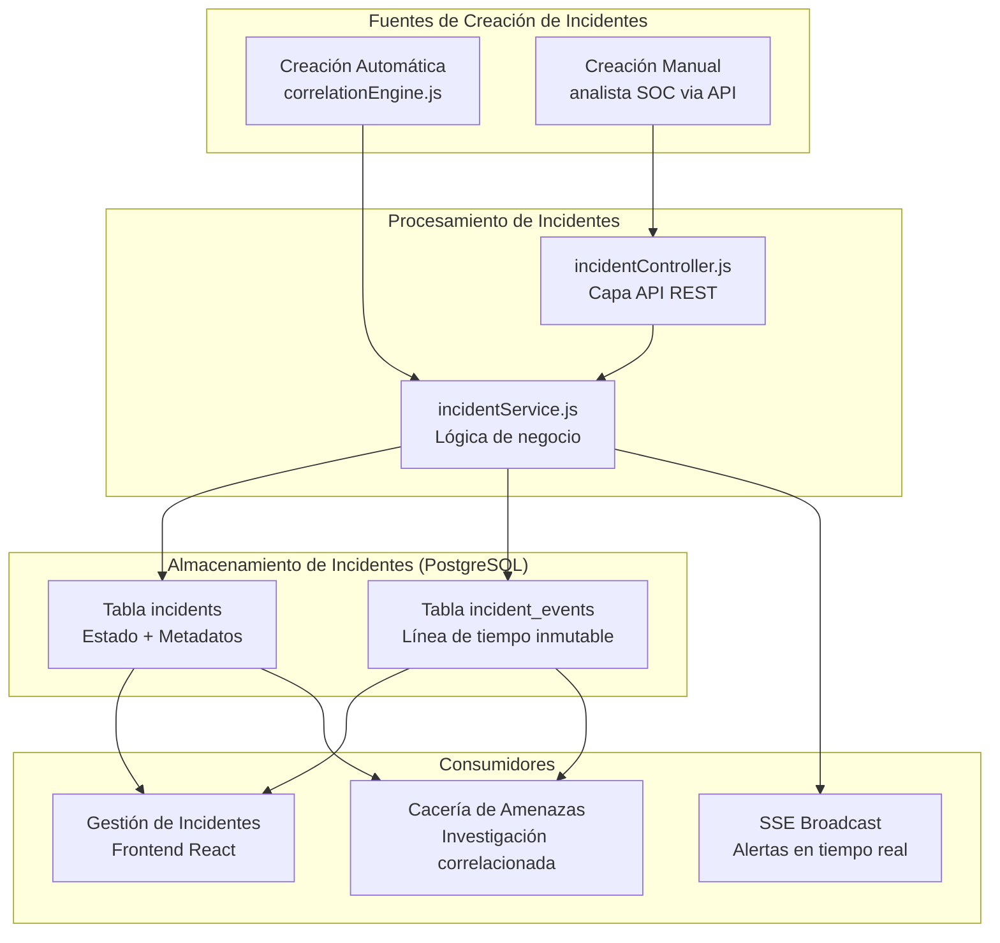
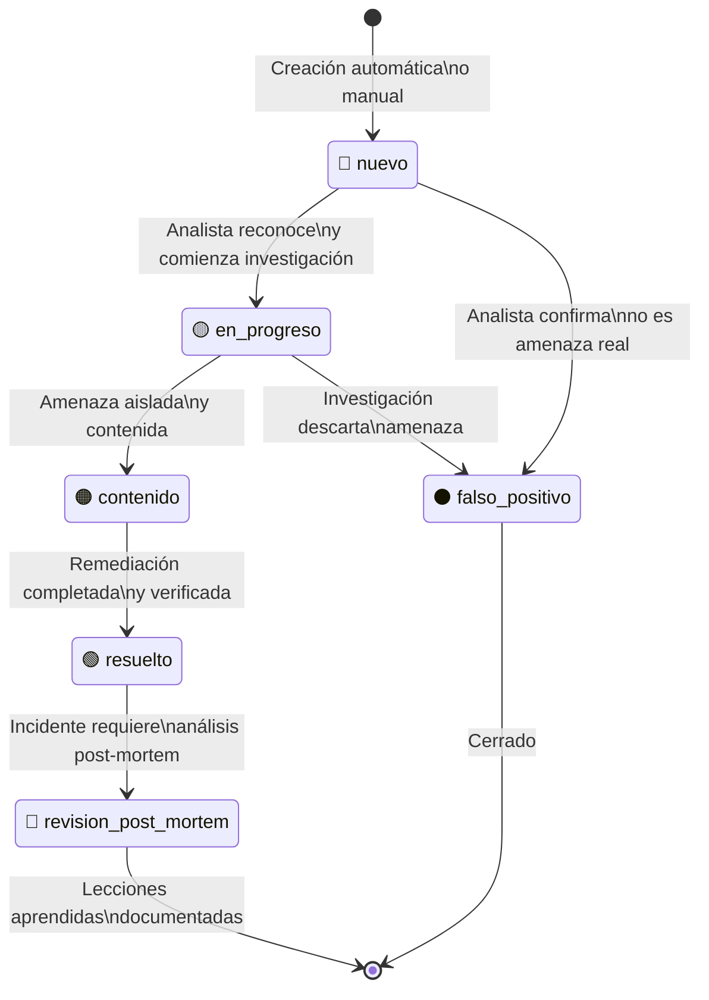
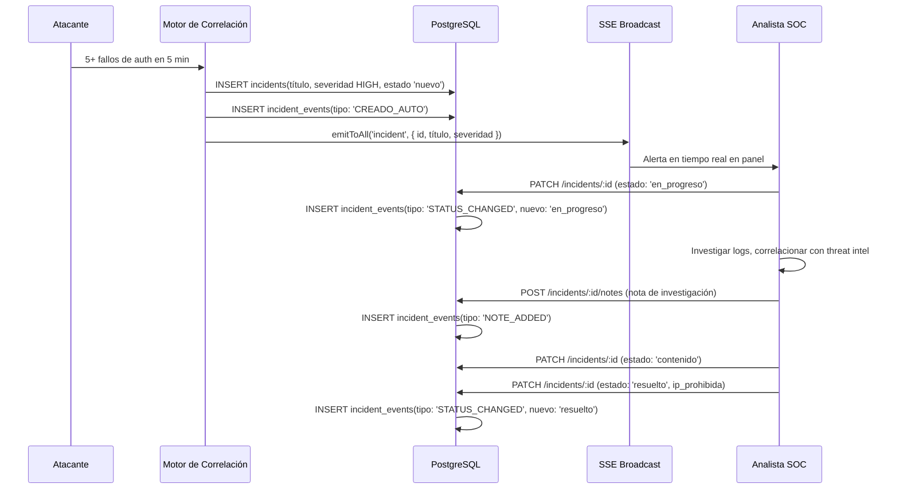

# Gestión de Incidentes — RobenGate Sentinel

> **Clasificación:** INTERNO | **Estándar:** ISO 27035 — Gestión de Incidentes de Seguridad de la Información

---

## Resumen Ejecutivo

El módulo de Gestión de Incidentes de RobenGate Sentinel implementa un **ciclo de vida de incidentes de seguridad alineado con ISO 27035** con trazabilidad completa del estado, marcado de clasificación TLP y generación automática de incidentes por el motor de correlación. Cada incidente incluye una **línea de tiempo de eventos inmutable** que registra todas las transiciones de estado, asignaciones, notas y actividades de respuesta.

El sistema cierra el bucle SOC: desde la detección automática hasta la resolución documentada, proporcionando el registro de auditoría necesario para **post-mortem de incidentes**, **reportes de cumplimiento** y **evidencia forense**.

---

## 1. Visión General

El módulo de Gestión de Incidentes proporciona la **capa de coordinación de respuesta** del sistema SOC. Cuando el motor de correlación detecta un patrón de ataque (ej. múltiples fallos de autenticación desde la misma IP), crea automáticamente un incidente. Los analistas SOC entonces pueden investigar, actualizar, asignar y resolver estos incidentes a través de un ciclo de vida documentado.

---

## 2. Arquitectura del Sistema



---

## Descripción Técnica

### 3. Ciclo de Vida del Incidente



| Estado | Descripción | Quién Actúa |
|--------|-------------|-------------|
| `nuevo` | Incidente detectado, sin asignar | Motor de correlación |
| `en_progreso` | Analista está investigando activamente | Respondedor/Analista |
| `contenido` | Amenaza está aislada, daño limitado | Respondedor/Analista |
| `resuelto` | Incidente completamente remediado | Analista/Admin |
| `revision_post_mortem` | En revisión post-incidente | Analista/Admin |
| `falso_positivo` | Confirmado como no incidente real | Analista/Admin |

---

### 4. Esquema de Base de Datos

#### 4.1 Tabla Principal de Incidentes

```sql
CREATE TABLE incidents (
  id              SERIAL PRIMARY KEY,
  title           VARCHAR(500) NOT NULL,
  description     TEXT,
  severity        VARCHAR(20) CHECK (severity IN ('CRITICAL','HIGH','MEDIUM','LOW','INFO')),
  status          VARCHAR(30) DEFAULT 'nuevo',
  assigned_to     INTEGER REFERENCES users(id),
  
  -- Clasificación TLP
  tlp             VARCHAR(10) DEFAULT 'AMBER',
  
  -- Datos del atacante
  source_ip       INET,
  source_country  VARCHAR(2),
  
  -- Contexto MITRE ATT&CK
  mitre_tactic    VARCHAR(100),
  mitre_technique VARCHAR(20),
  
  -- Etiquetas para filtrado
  tags            TEXT[],
  
  -- Metadatos
  created_by      INTEGER REFERENCES users(id),
  created_at      TIMESTAMPTZ DEFAULT NOW(),
  updated_at      TIMESTAMPTZ DEFAULT NOW(),
  resolved_at     TIMESTAMPTZ
);
```

#### 4.2 Tabla de Línea de Tiempo (Inmutable)

```sql
CREATE TABLE incident_events (
  id            SERIAL PRIMARY KEY,
  incident_id   INTEGER REFERENCES incidents(id),
  event_type    VARCHAR(50),  -- 'STATUS_CHANGED', 'ASSIGNED', 'NOTE_ADDED', 'IOC_LINKED'
  description   TEXT,
  old_value     TEXT,         -- Estado/asignación anterior
  new_value     TEXT,         -- Estado/asignación nuevo
  actor_id      INTEGER REFERENCES users(id),
  actor_email   VARCHAR(255),
  created_at    TIMESTAMPTZ DEFAULT NOW()
);

-- IMPORTANTE: Sin UPDATE ni DELETE — la línea de tiempo es inmutable
```

---

### 5. Clasificación TLP

TLP (Traffic Light Protocol) indica cómo puede compartirse la información del incidente:

| Marcado TLP | Color | Restricción de Distribución |
|-------------|-------|----------------------------|
| `TLP:WHITE` | ⬜ Blanco | Sin restricciones — puede publicarse |
| `TLP:GREEN` | 🟢 Verde | Comunidad — solo entre organizaciones similares |
| `TLP:AMBER` | 🟡 Ámbar | Solo organización — limitado a la empresa |
| `TLP:RED` | 🔴 Rojo | Solo destinatarios nombrados — máximo secreto |

*Predeterminado para nuevos incidentes: `TLP:AMBER`*

---

### 6. Generación Automática de Incidentes

El motor de correlación (`correlationEngine.js`) genera incidentes automáticamente para patrones detectados:

| Patrón | Condición | Severidad del Incidente |
|--------|-----------|------------------------|
| Fuerza Bruta | ≥ 5 fallos auth en 5 min desde misma IP | HIGH |
| Rociado de Credenciales | ≥ 3 fallos auth con múltiples cuentas en 10 min | HIGH |
| Barrido de Honeypot | ≥ 3 hits en honeypot en 5 min | HIGH |
| Ataque Multivector | Honeypot + Auth desde misma IP | CRITICAL |

Formato de título autogenerado:
```
"Ataque de Fuerza Bruta desde 185.220.101.42"
"Rociado de Credenciales desde 203.0.113.42"
"Barrido de Honeypot desde 45.33.32.156"
```

---

## Flujo Operacional

### 7. Flujo Completo de Respuesta a Incidente



---

## API de Incidentes

| Método | Endpoint | Descripción | Rol Mínimo |
|--------|----------|-------------|-----------|
| `GET` | `/api/incidents` | Listar todos los incidentes | viewer |
| `GET` | `/api/incidents/:id` | Obtener incidente con línea de tiempo | viewer |
| `POST` | `/api/incidents` | Crear incidente manual | responder |
| `PATCH` | `/api/incidents/:id` | Actualizar estado, asignación, notas | responder |
| `DELETE` | `/api/incidents/:id` | Eliminar incidente (solo admin) | admin |

---

## Casos de Uso

### Caso 1: Respuesta a Incidente de Fuerza Bruta

A las 03:17 UTC, el motor de correlación detecta un patrón de fuerza bruta desde la IP `185.220.101.42`. Se crea automáticamente un incidente HIGH. El analista de guardia recibe la alerta SSE, cambia el estado a `en_progreso`, investiga los logs de seguridad, confirma que la IP está atacando activamente, la añade al listado de IPs prohibidas, y cierra el incidente como `resuelto` con nota de remediación.

### Caso 2: Investigación de Falso Positivo

Un script de monitorización legítimo activa una alerta de barrido de honeypot. El analista revisa el incidente, identifica el User-Agent como un scanner de seguridad autorizado, añade una nota explicando el hallazgo y cierra el incidente como `falso_positivo`. La línea de tiempo completa del incidente queda preservada para auditoría.

### Caso 3: Post-Mortem de Incidente Crítico

Un incidente CRITICAL por ataque multivector requiere análisis profundo. Tras la resolución, el estado cambia a `revision_post_mortem`. El equipo documenta el timeline, las lecciones aprendidas y las mejoras de detección en el incidente. Este post-mortem queda disponible como referencia para incidentes futuros similares.

---

## Beneficios para una Empresa

| Beneficio | Descripción |
|-----------|-------------|
| **Detección Automática** | Los incidentes se crean sin intervención humana |
| **Línea de Tiempo Inmutable** | Evidencia completa para auditorías y litigios |
| **Cumplimiento ISO 27035** | Proceso alineado con estándar internacional |
| **Clasificación TLP** | Control granular de compartición de información |
| **Métricas de Respuesta** | MTTD y MTTR calculables por timestamps |

---

## Seguridad

- **Línea de tiempo inmutable**: Los eventos del incidente no pueden modificarse tras inserción
- **Control de acceso**: Solo respondedor+ puede modificar estado de incidentes
- **Auditoría completa**: Cada cambio de estado genera un evento de línea de tiempo
- **TLP predeterminado AMBER**: Los nuevos incidentes son confidenciales por defecto

---

## Integraciones

- **Motor de Correlación** → Creación automática de incidentes
- **Base de Datos IOC** → Vincular IOC a incidentes
- **SSE** → Alertas en tiempo real al equipo SOC
- **Cacería de Amenazas** → Iniciar hunt desde contexto de incidente
- **Sistema de Auditoría** → Todos los incidentes generan security_logs

---

## Roadmap

| Capacidad | Estado |
|-----------|--------|
| **Notificaciones email/SMS** para incidentes CRITICAL | Planificado |
| **Playbooks de respuesta** por tipo de incidente | Planificado |
| **Integración con sistemas de tickets** (Jira, ServiceNow) | Futuro |
| **Automatización de respuesta** (SOAR básico) | Futuro |

---

*Ver también: [../siem/resumen.md](../siem/resumen.md) | [../threat-hunting/resumen.md](../threat-hunting/resumen.md) | [../realtime/sistema-eventos.md](../realtime/sistema-eventos.md)*
