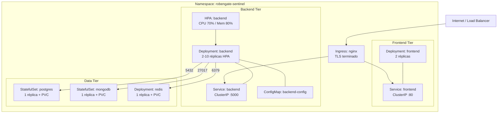

# Kubernetes y Helm — Guía Completa

**Proyecto:** RobenGate Sentinel  
**Versión:** 2.0  
**Fecha:** Junio 2026

---

## Arquitectura Kubernetes



---

## Estructura de Manifests (`k8s/`)

### `k8s/base/namespace.yaml`
```yaml
apiVersion: v1
kind: Namespace
metadata:
  name: robengate-sentinel
  labels:
    app.kubernetes.io/name: robengate-sentinel
    environment: production
```

### `k8s/base/backend/deployment.yaml` — Características Clave

```yaml
spec:
  replicas: 2
  strategy:
    type: RollingUpdate
    rollingUpdate:
      maxSurge: 1
      maxUnavailable: 0    # Zero-downtime deployments
  template:
    spec:
      securityContext:
        runAsNonRoot: true
        runAsUser: 1001      # Usuario no-root
        fsGroup: 1001
      containers:
        - name: backend
          livenessProbe:
            httpGet:
              path: /health
              port: 5000
            initialDelaySeconds: 30
            periodSeconds: 10
          readinessProbe:
            httpGet:
              path: /ready
              port: 5000
            initialDelaySeconds: 10
            periodSeconds: 5
          resources:
            requests:
              cpu: 250m
              memory: 256Mi
            limits:
              cpu: 500m
              memory: 512Mi
          env:
            - name: JWT_SECRET
              valueFrom:
                secretKeyRef:
                  name: robengate-secrets
                  key: JWT_SECRET
```

### `k8s/base/backend/hpa.yaml`
```yaml
apiVersion: autoscaling/v2
kind: HorizontalPodAutoscaler
metadata:
  name: backend
spec:
  scaleTargetRef:
    apiVersion: apps/v1
    kind: Deployment
    name: backend
  minReplicas: 2
  maxReplicas: 10
  metrics:
    - type: Resource
      resource:
        name: cpu
        target:
          type: Utilization
          averageUtilization: 70
    - type: Resource
      resource:
        name: memory
        target:
          type: Utilization
          averageUtilization: 80
```

### `k8s/base/ingress/ingress.yaml`
```yaml
apiVersion: networking.k8s.io/v1
kind: Ingress
metadata:
  name: robengate-ingress
  annotations:
    nginx.ingress.kubernetes.io/ssl-redirect: "true"
    nginx.ingress.kubernetes.io/hsts: "true"
    nginx.ingress.kubernetes.io/hsts-max-age: "63072000"
    nginx.ingress.kubernetes.io/limit-rpm: "100"
spec:
  ingressClassName: nginx
  tls:
    - hosts:
        - app.tudominio.com
      secretName: robengate-tls
  rules:
    - host: app.tudominio.com
      http:
        paths:
          - path: /api
            pathType: Prefix
            backend:
              service:
                name: backend
                port:
                  number: 5000
          - path: /
            pathType: Prefix
            backend:
              service:
                name: frontend
                port:
                  number: 80
```

---

## Gestión de Secretos en Kubernetes

### Crear todos los secretos necesarios
```bash
# 1. Secretos de la aplicación
kubectl create secret generic robengate-secrets \
  --namespace robengate-sentinel \
  --from-literal=JWT_SECRET="$(openssl rand -base64 64)" \
  --from-literal=JWT_REFRESH_SECRET="$(openssl rand -base64 64)" \
  --from-literal=INTERNAL_API_SECRET="$(openssl rand -hex 32)" \
  --from-literal=OTP_HMAC_KEY="$(openssl rand -base64 48)"

# 2. Secretos de base de datos
kubectl create secret generic db-credentials \
  --namespace robengate-sentinel \
  --from-literal=DB_PASSWORD="$(openssl rand -base64 32)" \
  --from-literal=MONGO_ROOT_PASSWORD="$(openssl rand -base64 32)" \
  --from-literal=REDIS_PASSWORD="$(openssl rand -base64 32)"

# 3. Secreto TLS para Ingress (cert-manager o manual)
kubectl create secret tls robengate-tls \
  --namespace robengate-sentinel \
  --cert=fullchain.pem \
  --key=privkey.pem
```

### Con cert-manager (automático Let's Encrypt)
```bash
# Instalar cert-manager
kubectl apply -f https://github.com/cert-manager/cert-manager/releases/download/v1.14.0/cert-manager.yaml

# Crear ClusterIssuer
kubectl apply -f - <<EOF
apiVersion: cert-manager.io/v1
kind: ClusterIssuer
metadata:
  name: letsencrypt-prod
spec:
  acme:
    server: https://acme-v02.api.letsencrypt.org/directory
    email: admin@tudominio.com
    privateKeySecretRef:
      name: letsencrypt-prod-key
    solvers:
      - http01:
          ingress:
            class: nginx
EOF
```

---

## Comandos kubectl Útiles

### Despliegue y Estado
```bash
# Desplegar con Kustomize
kubectl apply -k k8s/base/
kubectl apply -k k8s/overlays/prod/

# Ver estado de pods
kubectl get pods -n robengate-sentinel -w

# Ver todos los recursos
kubectl get all -n robengate-sentinel

# Describir un deployment
kubectl describe deployment backend -n robengate-sentinel
```

### Logs y Debugging
```bash
# Logs del backend (streaming)
kubectl logs -f deployment/backend -n robengate-sentinel

# Logs de un pod específico
kubectl logs <pod-name> -n robengate-sentinel

# Logs de contenedor anterior (crash)
kubectl logs <pod-name> --previous -n robengate-sentinel

# Shell en un pod
kubectl exec -it deployment/backend -n robengate-sentinel -- sh
```

### Escalado
```bash
# Escalar manualmente
kubectl scale deployment backend --replicas=4 -n robengate-sentinel

# Ver HPA en acción
kubectl get hpa -n robengate-sentinel -w
```

### Actualizaciones
```bash
# Rolling update de imagen
kubectl set image deployment/backend backend=ghcr.io/robensonl/robengate-sentinel/backend:v2.1.0 \
  -n robengate-sentinel

# Ver estado del rollout
kubectl rollout status deployment/backend -n robengate-sentinel

# Rollback
kubectl rollout undo deployment/backend -n robengate-sentinel
kubectl rollout undo deployment/backend --to-revision=2 -n robengate-sentinel
```

---

## Helm Chart — Guía Completa

### Estructura del Chart
```
helm/robengate-sentinel/
├── Chart.yaml           ← Metadata
├── values.yaml          ← Valores por defecto (customizables)
├── values-prod.yaml     ← Override para producción
└── templates/
    ├── _helpers.tpl     ← Funciones helper
    ├── deployment.yaml
    ├── service.yaml
    ├── ingress.yaml
    ├── configmap.yaml
    ├── secret.yaml
    ├── hpa.yaml
    ├── serviceaccount.yaml
    └── NOTES.txt        ← Instrucciones post-instalación
```

### Instalación
```bash
# Instalar con valores por defecto
helm install robengate-sentinel ./helm/robengate-sentinel \
  --namespace robengate-sentinel \
  --create-namespace

# Instalar con override de valores
helm install robengate-sentinel ./helm/robengate-sentinel \
  --namespace robengate-sentinel \
  --create-namespace \
  -f ./helm/robengate-sentinel/values-prod.yaml \
  --set backend.image.tag=2.0.0 \
  --set ingress.hosts[0].host=app.tudominio.com
```

### Actualización (Upgrade)
```bash
helm upgrade robengate-sentinel ./helm/robengate-sentinel \
  --namespace robengate-sentinel \
  --set backend.image.tag=2.1.0 \
  --wait --timeout 5m
```

### Rollback
```bash
# Ver historial
helm history robengate-sentinel -n robengate-sentinel

# Rollback a revisión anterior
helm rollback robengate-sentinel 1 -n robengate-sentinel
```

### Desinstalación
```bash
helm uninstall robengate-sentinel -n robengate-sentinel
# Los PVCs no se eliminan automáticamente — los datos persisten
```

### values.yaml — Referencia Completa
```yaml
# ─── Backend ──────────────────────────────────────────────
backend:
  replicaCount: 2
  image:
    repository: ghcr.io/robensonl/robengate-sentinel/backend
    pullPolicy: Always
    tag: "latest"
  service:
    type: ClusterIP
    port: 5000
  resources:
    requests:
      cpu: 250m
      memory: 256Mi
    limits:
      cpu: 500m
      memory: 512Mi
  autoscaling:
    enabled: true
    minReplicas: 2
    maxReplicas: 10
    targetCPUUtilizationPercentage: 70
  env:
    NODE_ENV: production
    PORT: "5000"

# ─── Frontend ─────────────────────────────────────────────
frontend:
  replicaCount: 2
  image:
    repository: ghcr.io/robensonl/robengate-sentinel/frontend
    tag: "latest"
  resources:
    limits:
      cpu: 200m
      memory: 128Mi

# ─── Ingress ──────────────────────────────────────────────
ingress:
  enabled: true
  className: nginx
  annotations:
    nginx.ingress.kubernetes.io/ssl-redirect: "true"
  hosts:
    - host: sentinel.ejemplo.com
      paths:
        - path: /
          pathType: Prefix
  tls:
    - secretName: sentinel-tls
      hosts:
        - sentinel.ejemplo.com

# ─── Secrets (nunca en valores por defecto) ───────────────
secrets:
  jwtSecret: ""         # OBLIGATORIO: --set secrets.jwtSecret="..."
  dbPassword: ""        # OBLIGATORIO
  # ... otros secretos
```

---

## Monitorización en Kubernetes

### Service Monitor (Prometheus Operator)
```yaml
apiVersion: monitoring.coreos.com/v1
kind: ServiceMonitor
metadata:
  name: robengate-backend
  namespace: robengate-sentinel
spec:
  selector:
    matchLabels:
      app: backend
  endpoints:
    - port: http
      path: /metrics
      interval: 15s
```

### Pod Disruption Budget
```yaml
apiVersion: policy/v1
kind: PodDisruptionBudget
metadata:
  name: backend-pdb
  namespace: robengate-sentinel
spec:
  minAvailable: 1
  selector:
    matchLabels:
      app: backend
```
