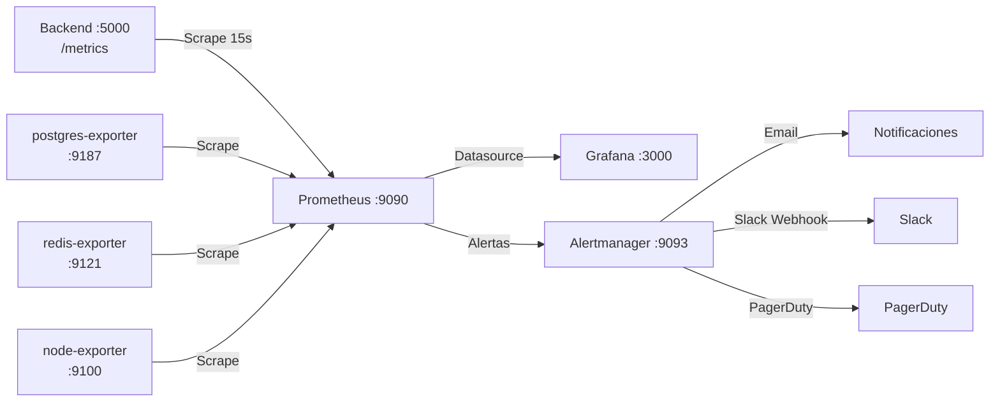

# Stack de Monitorización — Prometheus + Grafana + Alertmanager

**Proyecto:** RobenGate Sentinel  
**Versión:** 2.0  
**Fecha:** Junio 2026

---

## Arquitectura de Observabilidad



---

## 1. Prometheus

### Configuración (`monitoring/prometheus/prometheus.yml`)
```yaml
global:
  scrape_interval: 15s
  evaluation_interval: 15s

rule_files:
  - "rules/*.yml"

alerting:
  alertmanagers:
    - static_configs:
        - targets: ['alertmanager:9093']

scrape_configs:
  - job_name: 'robengate-backend'
    static_configs:
      - targets: ['backend:5000']
    metrics_path: '/metrics'

  - job_name: 'postgres'
    static_configs:
      - targets: ['postgres-exporter:9187']

  - job_name: 'redis'
    static_configs:
      - targets: ['redis-exporter:9121']

  - job_name: 'node'
    static_configs:
      - targets: ['node-exporter:9100']
```

### Métricas del Backend Expuestas

El backend expone métricas vía `prom-client` en `/metrics`:

| Métrica | Tipo | Descripción |
|---|---|---|
| `http_requests_total` | Counter | Total de requests HTTP |
| `http_request_duration_seconds` | Histogram | Latencia de requests |
| `http_requests_in_flight` | Gauge | Requests activos |
| `security_events_total` | Counter | Eventos de seguridad por tipo y severidad |
| `login_attempts_total` | Counter | Intentos de login (success/failed) |
| `banned_ips_total` | Gauge | IPs actualmente baneadas |
| `active_sessions` | Gauge | Sesiones activas |
| `mfa_verifications_total` | Counter | Verificaciones MFA |
| `honeypot_events_total` | Counter | Eventos del honeypot |
| `risk_scores` | Histogram | Distribución de risk scores |
| `db_query_duration_seconds` | Histogram | Latencia de consultas BD |
| `nodejs_heap_used_bytes` | Gauge | Uso de heap Node.js |
| `process_cpu_seconds_total` | Counter | CPU del proceso |

---

## 2. Grafana

### Acceso
```
URL:  http://localhost:3000  (dev)
User: admin
Pass: admin  (cambiar en primer acceso)
```

### Dashboards Disponibles

#### Dashboard 1: Sistema General
- CPU, Memoria, Red del servidor
- Uptime de servicios
- Conexiones de red activas

#### Dashboard 2: Backend API
- **Requests por segundo** (RPS)
- **Latencia P50/P95/P99** por endpoint
- **Tasa de errores** (4xx, 5xx)
- **Requests en vuelo** simultáneos
- **Top 10 endpoints** más lentos

#### Dashboard 3: Seguridad SOC
- **Intentos de login** (éxito vs fallo) en el tiempo
- **IPs baneadas** actualmente
- **Eventos por severidad** (crítico / alto / medio)
- **Actividad del honeypot** (ataques SSH/HTTP)
- **Risk scores** — distribución histograma
- **Alertas activas** por tipo

#### Dashboard 4: Base de Datos
- **PostgreSQL:** conexiones activas, queries por segundo, tiempo de query
- **MongoDB:** operaciones, conexiones, tamaño de colecciones
- **Redis:** hits/misses de caché, memoria usada, comandos/segundo

### Alertas de Grafana (Alertmanager)

| Alerta | Condición | Severidad |
|---|---|---|
| Alto número de logins fallidos | > 50 en 5min | 🟠 Warning |
| IP baneada automáticamente | Nuevo ban | 🟡 Info |
| Tasa de error API > 5% | Sostenido 2min | 🔴 Critical |
| Latencia P95 > 2s | Sostenido 2min | 🟠 Warning |
| Backend sin responder | /health falla 3x | 🔴 Critical |
| BD desconectada | /ready falla | 🔴 Critical |
| Memoria > 80% | Sostenido 5min | 🟠 Warning |
| Incidente crítico creado | Nuevo incidente CRITICAL | 🔴 Critical |
| Actividad honeypot masiva | > 100 eventos/min | 🟠 Warning |

---

## 3. Alertmanager

### Configuración (`monitoring/alertmanager/alertmanager.yml`)
```yaml
global:
  smtp_smarthost: 'smtp.gmail.com:587'
  smtp_from: 'alerts@tudominio.com'
  smtp_auth_username: 'alerts@tudominio.com'
  smtp_auth_password: '<smtp-password>'

route:
  group_by: ['alertname', 'severity']
  group_wait: 10s
  group_interval: 5m
  repeat_interval: 12h
  receiver: 'default'
  routes:
    - match:
        severity: critical
      receiver: 'critical-channel'
      group_wait: 0s     # Sin espera para críticos
    - match:
        severity: warning
      receiver: 'warning-channel'

receivers:
  - name: 'default'
    email_configs:
      - to: 'soc-team@tudominio.com'
        subject: '[RobenGate] {{ .GroupLabels.alertname }}'
        body: '{{ range .Alerts }}{{ .Annotations.description }}{{ end }}'

  - name: 'critical-channel'
    email_configs:
      - to: 'soc-critical@tudominio.com'
    slack_configs:
      - api_url: '<slack-webhook-url>'
        channel: '#security-critical'
        title: '🔴 CRÍTICO: {{ .GroupLabels.alertname }}'
        text: '{{ range .Alerts }}{{ .Annotations.description }}{{ end }}'
    pagerduty_configs:
      - routing_key: '<pagerduty-key>'

  - name: 'warning-channel'
    slack_configs:
      - api_url: '<slack-webhook-url>'
        channel: '#security-alerts'
        title: '🟠 WARNING: {{ .GroupLabels.alertname }}'

inhibit_rules:
  - source_match:
      severity: critical
    target_match:
      severity: warning
    equal: ['alertname', 'instance']
```

---

## 4. Reglas de Alerta Prometheus

### `monitoring/prometheus/rules/security.yml`
```yaml
groups:
  - name: security
    rules:
      - alert: HighLoginFailureRate
        expr: |
          rate(login_attempts_total{status="failed"}[5m]) > 10
        for: 2m
        labels:
          severity: warning
        annotations:
          summary: "Alta tasa de fallos de login"
          description: "Más de 10 intentos de login fallidos por segundo en los últimos 5 minutos."

      - alert: APIHighErrorRate
        expr: |
          rate(http_requests_total{status=~"5.."}[5m]) /
          rate(http_requests_total[5m]) > 0.05
        for: 2m
        labels:
          severity: critical
        annotations:
          summary: "Tasa de error API superior al 5%"
          description: "La API está devolviendo errores 5xx en más del 5% de las peticiones."

      - alert: BackendDown
        expr: up{job="robengate-backend"} == 0
        for: 30s
        labels:
          severity: critical
        annotations:
          summary: "Backend no disponible"
          description: "El backend de RobenGate Sentinel no responde."

      - alert: DatabaseConnectionHigh
        expr: pg_stat_activity_count > 18
        for: 5m
        labels:
          severity: warning
        annotations:
          summary: "Alta utilización del pool de BD"
          description: "El pool de conexiones PostgreSQL está al 90%+ de capacidad."

      - alert: HoneypotAttackStorm
        expr: rate(honeypot_events_total[1m]) > 100
        for: 1m
        labels:
          severity: warning
        annotations:
          summary: "Tormenta de ataques en honeypot"
          description: "Más de 100 eventos por segundo en el honeypot."
```

---

## 5. Iniciar el Stack de Monitorización

### Con Docker Compose
```bash
# Iniciar solo monitoring
docker compose -f monitoring/docker-compose.monitoring.yml up -d

# Ver logs
docker compose -f monitoring/docker-compose.monitoring.yml logs -f
```

### Verificar que Prometheus scrape correctamente
```bash
# Prometheus UI: Status → Targets
http://localhost:9090/targets

# Todos los targets deben estar UP
```

### Consultas PromQL Útiles
```promql
# Tasa de requests por segundo
rate(http_requests_total[5m])

# Latencia P95
histogram_quantile(0.95, rate(http_request_duration_seconds_bucket[5m]))

# Tasa de errores 5xx
rate(http_requests_total{status=~"5.."}[5m]) / rate(http_requests_total[5m])

# Intentos de login fallidos en 15min
sum(increase(login_attempts_total{status="failed"}[15m]))

# IPs actualmente baneadas
banned_ips_total

# Memoria heap Node.js en MB
nodejs_heap_used_bytes / 1024 / 1024
```

---

## 6. SLOs (Service Level Objectives)

| Servicio | SLO | Métrica |
|---|---|---|
| Backend API Disponibilidad | 99.9% uptime/mes | `up{job="robengate-backend"}` |
| Latencia P95 login | < 500ms | `http_request_duration{route="/api/auth/login"}` |
| Latencia P95 general | < 1000ms | `http_request_duration_seconds_bucket` |
| Tasa de error API | < 0.5% | `rate(http_requests_total{status=~"5.."})` |
| BD disponibilidad | 99.95% | postgres healthcheck |
| Honeypot disponibilidad | 99.5% | honeypot service health |
