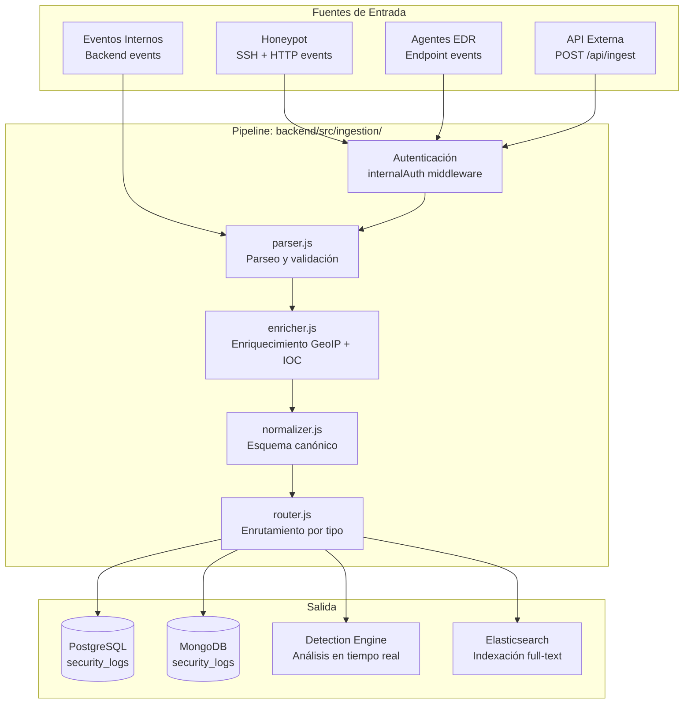

# Pipeline de Ingesta de Eventos — RobenGate Sentinel

**Módulo:** `backend/src/ingestion/`  
**Versión:** 2.0 | **Fecha:** Junio 2026

---

## Descripción General

El pipeline de ingesta es el punto de entrada para todos los eventos de seguridad externos. Normaliza, enriquece y enruta eventos desde múltiples fuentes hacia el sistema de detección y almacenamiento.

---

## Arquitectura del Pipeline



---

## Servicios del Pipeline

### `parser.js` — Validación y Parseo

```javascript
// Responsabilidades:
// 1. Validar estructura del evento entrante
// 2. Parsear campos de fecha/IP/strings
// 3. Rechazar eventos malformados
// 4. Asignar eventId UUID único

// Esquema de entrada mínima:
{
  source: 'honeypot|agent|external|backend',
  type: 'string',        // Tipo de evento
  timestamp: 'ISO8601',  // Opcional (se usa now() si ausente)
  ip: 'IPv4|IPv6',       // Opcional
  data: { }              // Payload específico del tipo
}
```

### `enricher.js` — Enriquecimiento

```javascript
// Enriquecimiento que añade a cada evento:

async function enrichEvent(event) {
  const enriched = { ...event };
  
  // 1. Geolocalización IP (MaxMind GeoIP2)
  if (event.ip) {
    enriched.geo = await geoService.lookup(event.ip);
    // { country: 'ES', city: 'Madrid', lat: 40.41, lon: -3.70 }
  }
  
  // 2. ASN lookup
  if (event.ip) {
    enriched.asn = await asnService.lookup(event.ip);
    // { number: 12345, name: 'Movistar', type: 'isp' }
  }
  
  // 3. IOC matching (Redis cache first)
  if (event.ip) {
    enriched.ioc = await threatService.checkIOC(event.ip);
    // { matched: true, severity: 'high', description: '...' }
  }
  
  // 4. User context (si hay userId)
  if (event.userId) {
    enriched.userContext = await userService.getRiskProfile(event.userId);
    // { avgRiskScore: 12, sessionCount: 150, lastSeen: '...' }
  }
  
  return enriched;
}
```

### `normalizer.js` — Esquema Canónico

Transforma el evento enriquecido al **esquema canónico** de RobenGate Sentinel para consistencia entre todas las fuentes:

```json
{
  "eventId": "uuid-v4",
  "source": "honeypot",
  "type": "ssh_brute_force",
  "severity": "high",
  "timestamp": "2026-06-15T03:22:11.000Z",
  
  "network": {
    "ip": "45.33.32.156",
    "port": 2222,
    "protocol": "ssh",
    "geo": { "country": "RU", "city": "Moscow" },
    "asn": { "number": 12345, "type": "datacenter" }
  },
  
  "actor": {
    "type": "external",
    "userId": null,
    "authenticated": false
  },
  
  "target": {
    "service": "ssh_honeypot",
    "host": "sentinel-honeypot"
  },
  
  "ioc": {
    "matched": false,
    "indicators": []
  },
  
  "risk": {
    "score": 75,
    "factors": ["datacenter_asn", "repeated_failures"]
  },
  
  "raw": { /* datos originales */ },
  
  "organizationId": "org-uuid",
  "processed": true
}
```

---

## Autenticación del Pipeline (Honeypot → Backend)

Los eventos del honeypot usan el `INTERNAL_API_SECRET` para autenticación:

```javascript
// middleware/internalAuth.js
function internalAuth(req, res, next) {
  const secret = req.headers['x-internal-secret'];
  if (!secret || secret !== process.env.INTERNAL_API_SECRET) {
    return res.status(403).json({ error: 'Forbidden: invalid internal secret' });
  }
  next();
}

// Uso en rutas internas
router.post('/api/ingest', internalAuth, ingestController.receive);
router.post('/api/honeypot/events', internalAuth, honeypotController.receive);
```

**Nota de Seguridad:** El endpoint `/internal` y `/api/ingest` están bloqueados desde Internet por Nginx. Solo accesibles desde la red Docker interna.

---

## Throughput y Rendimiento

| Métrica | Valor Esperado | Nota |
|---|---|---|
| Eventos por segundo | ~1000 EPS | Sin Elasticsearch |
| Con Elasticsearch | ~500 EPS | Indexación adicional |
| Latencia por evento | < 10ms | Pipeline sin ES |
| Latencia con ES | < 50ms | |
| Buffer en memoria | 10,000 eventos | Antes de flush a BD |

Para volúmenes mayores, el pipeline soporta **batching** (agrupar múltiples eventos en un solo INSERT):

```javascript
// Configuración de batch (environment)
INGESTION_BATCH_SIZE=100    # Número de eventos por batch
INGESTION_BATCH_TIMEOUT=500 # Milisegundos máximos de espera
```
