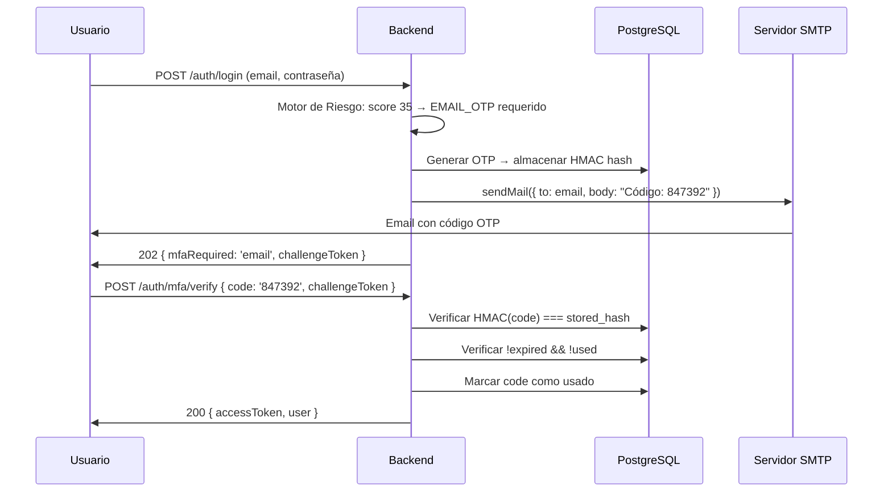

# Integraciones Externas — RobenGate Sentinel

> **Clasificación:** INTERNO | **Patrón:** API Interna + Servicios Externos

---

## Resumen Ejecutivo

RobenGate Sentinel integra **cuatro servicios externos** (Nodemailer SMTP, Twilio SMS, MaxMind GeoIP y WebAuthn FIDO2) y un **canal de API interna** para comunicación segura entre el honeypot y el backend. Cada integración sigue el principio de **fallo seguro**: si un servicio externo no está disponible, el sistema continúa operando (MFA por email es el canal de respaldo si SMS falla; GeoIP muestra "desconocido" si la base de datos no está disponible).

---

## 1. Mapa de Integraciones

```mermaid
graph TB
    subgraph "RobenGate Sentinel Backend"
        AUTH[authService.js\nAutenticación + MFA]
        GEO[geoService.js\nGeolocalización IP]
        LOG[loggingService.js\nRegistro de Eventos]
        HP[honeypotService.js\nProcesamiento de Eventos]
    end

    subgraph "API Interna"
        INT[POST /internal/honeypot/events\nX-Internal-Secret]
        HONEY[Servicio Honeypot\nContenedor Docker aislado]
    end

    subgraph "Servicios Externos"
        EMAIL[📧 Nodemailer\nSMTP (Gmail, Outlook, etc.)]
        SMS[📱 Twilio\nSMS REST API]
        GEO_DB[🗺️ MaxMind GeoLite2\nBase de datos offline]
        WA[🔑 WebAuthn\nFIDO2 / Passkeys]
    end

    AUTH -->|OTP 6 dígitos TTL 5min| EMAIL
    AUTH -->|OTP 6 dígitos E.164| SMS
    GEO -->|IP → País/Ciudad| GEO_DB
    AUTH -->|Registro + Verificación| WA
    
    HONEY -->|eventos capturados| INT
    INT --> HP
```

---

## 2. Integraciones por Servicio

### 2.1 Nodemailer (Email OTP)

**Propósito:** Enviar códigos OTP de 6 dígitos para MFA por email y notificaciones de seguridad.

**Configuración:**

```javascript
// emailService.js
const transporter = nodemailer.createTransport({
  host: process.env.EMAIL_HOST,     // smtp.gmail.com
  port: process.env.EMAIL_PORT,     // 587
  secure: false,                    // STARTTLS en puerto 587
  auth: {
    user: process.env.EMAIL_USER,
    pass: process.env.EMAIL_PASS    // Contraseña de aplicación (no la contraseña real)
  }
});
```

**Flujo de envío de OTP:**

```
Solicitud de MFA por email
    │
    ├── Generar OTP: crypto.randomInt(100000, 999999) → "847 392"
    ├── Calcular hash: HMAC-SHA256(otp, EMAIL_SECRET) → almacenar hash
    ├── Almacenar: INSERT mfa_codes(code_hash, expires_at: +5min)
    └── Enviar: nodemailer.sendMail({ to: user.email, subject: 'Código OTP', html: template })
```

**Seguridad del OTP:**
- El código OTP en texto claro **nunca se almacena** en la base de datos
- Solo el hash HMAC-SHA256 del código se almacena en `mfa_codes.code_hash`
- TTL: 5 minutos (expiración automática)
- Uso único: `mfa_codes.used = true` después de verificación exitosa

**Variables de entorno requeridas:**
```env
EMAIL_HOST=smtp.gmail.com
EMAIL_PORT=587
EMAIL_USER=tu-email@gmail.com
EMAIL_PASS=contraseña-de-aplicacion-gmail  # No la contraseña real de Gmail
EMAIL_SECRET=clave-hmac-para-hash-otp     # Para HMAC-SHA256 del OTP
```

---

### 2.2 Twilio SMS

**Propósito:** Enviar códigos OTP de 6 dígitos via SMS para MFA por teléfono.

**Configuración:**

```javascript
// smsService.js
const client = twilio(
  process.env.TWILIO_ACCOUNT_SID,
  process.env.TWILIO_AUTH_TOKEN
);

async function sendOTP(phoneNumber, otp) {
  await client.messages.create({
    body: `Tu código de verificación de RobenGate Sentinel: ${otp}. Válido por 5 minutos.`,
    from: process.env.TWILIO_PHONE_NUMBER,  // Número Twilio verificado
    to: phoneNumber                          // E.164: +15551234567
  });
}
```

**Formato de teléfono (E.164):**
- Formato requerido: `+15551234567` (código país + número sin espacios)
- Se valida en el formulario de configuración de SMS MFA
- Se almacena en `users.phone`

**Variables de entorno requeridas:**
```env
TWILIO_ACCOUNT_SID=ACxxxxxxxxxxxxxxxxxxxxxxxxxxxxxxxx
TWILIO_AUTH_TOKEN=xxxxxxxxxxxxxxxxxxxxxxxxxxxxxxxx
TWILIO_PHONE_NUMBER=+15551234567
```

---

### 2.3 MaxMind GeoLite2 (Geolocalización IP)

**Propósito:** Resolver dirección IP → código de país y ciudad para:
- Registro de contexto geográfico en security_logs
- Señal del Motor de Riesgo (geolocalización inusual)
- Visualización en el Mapa Global de Ataques

**Configuración:**

```javascript
// geoService.js
const reader = await maxmind.open('/data/GeoLite2-City.mmdb');

function lookupIP(ip) {
  const result = reader.get(ip);
  return {
    countryCode: result?.country?.iso_code || 'XX',  // 'ES', 'RU', 'CN', etc.
    city: result?.city?.names?.en || 'Unknown',
    latitude: result?.location?.latitude,
    longitude: result?.location?.longitude
  };
}
```

**Características:**
- **Base de datos offline**: MaxMind GeoLite2 se descarga y almacena localmente — sin dependencia de API externa en tiempo real
- **Caché Redis**: Resultados de geolocalización cacheados 24h para reducir lookups repetidos
- **Fallo seguro**: Si la BD no está disponible, retorna `{ countryCode: 'XX', city: 'Unknown' }`

**Actualización de la base de datos:**
La base de datos GeoLite2 se actualiza mensualmente. Para actualizar:
```bash
./scripts/update-geoip-db.sh
# O manualmente: descargar GeoLite2-City.mmdb de maxmind.com
# y colocar en /data/GeoLite2-City.mmdb
```

---

### 2.4 WebAuthn FIDO2 (Passkeys/Biométrica)

**Propósito:** MFA de segundo factor sin contraseña usando dispositivos FIDO2 (Windows Hello, Touch ID, llaves de seguridad hardware).

**Configuración:**

```javascript
// webauthnService.js
import { generateRegistrationOptions, verifyRegistrationResponse,
         generateAuthenticationOptions, verifyAuthenticationResponse } from '@simplewebauthn/server';

const rpConfig = {
  rpName: 'RobenGate Sentinel',
  rpID: process.env.FRONTEND_DOMAIN,  // 'localhost' o 'tu-dominio.com'
  origin: process.env.FRONTEND_URL    // 'https://localhost' o 'https://tu-dominio.com'
};
```

**Flujo de registro:**

```
1. Usuario solicita registrar passkey
2. Backend genera opciones de registro (challenge aleatorio)
3. Browser invoca navigator.credentials.create()
4. Plataforma solicita biométrica (Windows Hello / Touch ID)
5. Browser retorna respuesta del autenticador
6. Backend verifica respuesta y almacena:
   - credential_id (ID único del autenticador)
   - public_key (clave pública del dispositivo)
   - counter (contador anti-replay)
```

**Flujo de autenticación:**

```
1. Usuario inicia login
2. Motor de Riesgo requiere MFA WebAuthn (puntuación 61-80)
3. Backend genera opciones de autenticación (nuevo challenge)
4. Browser invoca navigator.credentials.get()
5. Plataforma verifica biométrica del usuario
6. Browser retorna aserción firmada
7. Backend verifica firma contra clave pública almacenada
8. Backend verifica que counter > counter_almacenado (anti-replay)
9. Login aprobado
```

**Almacenamiento:**
```sql
-- PostgreSQL
CREATE TABLE webauthn_credentials (
  credential_id BYTEA UNIQUE NOT NULL,  -- ID del autenticador
  public_key    BYTEA NOT NULL,         -- Clave pública (verificación de firma)
  counter       BIGINT DEFAULT 0,       -- Anti-replay
  user_id       INTEGER REFERENCES users(id)
);
```

---

### 2.5 API Interna (Honeypot → Backend)

**Propósito:** Canal de comunicación seguro entre el servicio honeypot (contenedor aislado) y el backend principal.

**Diseño de seguridad:**

```javascript
// Honeypot envía:
headers: {
  'X-Internal-Secret': process.env.INTERNAL_SECRET,  // Secreto compartido
  'Content-Type': 'application/json'
}

// Backend verifica con comparación en tiempo constante (anti-timing-attack):
const secretBuffer = Buffer.from(process.env.INTERNAL_SECRET);
const incomingBuffer = Buffer.from(req.headers['x-internal-secret'] || '');

if (incomingBuffer.length !== secretBuffer.length ||
    !crypto.timingSafeEqual(secretBuffer, incomingBuffer)) {
  return res.status(401).json({ error: 'Unauthorized' });
}
```

**Por qué `timingSafeEqual`:**
Una comparación de string normal (`===`) termina en el primer carácter diferente — esto permite a un atacante medir el tiempo de respuesta para adivinar el secreto carácter por carácter. `crypto.timingSafeEqual` siempre compara todos los bytes, eliminando el canal lateral de timing.

**Bloqueo en Nginx:**
```nginx
location /internal/ {
    deny all;
    return 403;
}
```
El honeypot accede directamente al backend via red Docker interna. Esta ruta nunca es accesible desde Internet.

---

## Flujo Operacional

### 3. Flujo Completo de MFA Email



---

## Casos de Uso

### Caso 1: Autenticación con Windows Hello

Un usuario registra su huella dactilar en la plataforma. La próxima vez que el Motor de Riesgo requiere MFA (score 61-80), en lugar de esperar un email, el navegador muestra el diálogo de Windows Hello. El usuario toca el lector de huellas — la autenticación WebAuthn completa en <2 segundos, sin código que recordar.

### Caso 2: Detección de Viaje Imposible

Un login desde España (GeoLite2 → código `ES`) desde un usuario que normalmente inicia sesión desde México (código `MX`). La señal de geolocalización inusual aumenta la puntuación de riesgo en +20. Combinado con otras señales (dispositivo nuevo, hora inusual), puede activar bloqueo.

### Caso 3: SMS Como Canal de Respaldo

El servidor SMTP está temporalmente no disponible. El usuario con SMS configurado recibe el OTP via Twilio como canal de respaldo. El sistema continúa operando sin interrupciones.

---

## Beneficios para una Empresa

| Integración | Beneficio |
|-------------|-----------|
| **WebAuthn** | MFA resistente a phishing — las passkeys no pueden capturarse por atacantes |
| **GeoIP offline** | Sin dependencia de API externa — funciona en red aislada |
| **SMS Twilio** | Canal de respaldo confiable para MFA |
| **API interna segura** | Honeypot aislado de bases de datos, comunicación autenticada |

---

## Seguridad

- **OTP nunca almacenado**: Solo el hash HMAC se persiste en BD
- **timingSafeEqual**: Comparación de secreto interno resistente a timing attacks
- **Nginx bloquea /internal/**: Rutas internas inaccesibles desde Internet
- **WebAuthn anti-replay**: Contador de credenciales previene reutilización de aserciones
- **E.164 validado**: Números de teléfono en formato estándar internacional

---

## Roadmap

| Integración | Estado |
|------------|--------|
| **Push notifications** (Firebase FCM) para alertas MFA | Planificado |
| **SAML 2.0 / OIDC** para SSO empresarial | Planificado |
| **Feeds de Threat Intelligence** externos (MISP, AlienVault OTX) | Planificado |
| **Slack/Teams** notificaciones de incidentes | Futuro |

---

*Ver también: [../security/resumen.md](../security/resumen.md) | [../backend/resumen.md](../backend/resumen.md) | [../infrastructure/resumen.md](../infrastructure/resumen.md)*
