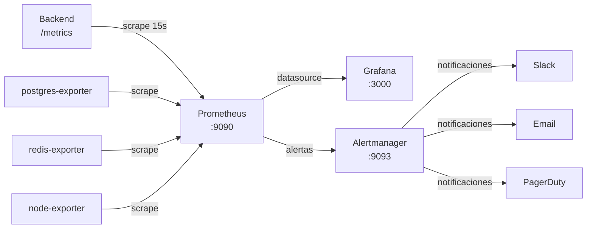

# Guía de Monitorización — RobenGate Sentinel

**Versión:** 2.0 | **Fecha:** Junio 2026

---

## Arquitectura de Monitorización



---

## Iniciar el Stack de Monitorización

```bash
# Iniciar Prometheus + Grafana + Alertmanager
docker compose -f monitoring/docker-compose.monitoring.yml up -d

# Verificar que están corriendo
docker compose -f monitoring/docker-compose.monitoring.yml ps
```

**Acceso:**
| Servicio | URL | Credenciales |
|---|---|---|
| Prometheus | http://localhost:9090 | Sin auth (cambiar en prod) |
| Grafana | http://localhost:3000 | admin / admin (cambiar en primer login) |
| Alertmanager | http://localhost:9093 | Sin auth |

---

## Prometheus — Guía de Uso

### Verificar que los targets están UP

1. Abrir http://localhost:9090
2. Ir a **Status → Targets**
3. Todos los targets deben mostrar estado **UP**

Si algún target está DOWN:
```bash
# Verificar conectividad al backend
curl http://localhost:5000/metrics | head -20

# Reiniciar prometheus si es necesario
docker compose -f monitoring/docker-compose.monitoring.yml restart prometheus
```

### Consultas PromQL Esenciales

```promql
# ─── API Health ────────────────────────────────────────────
# Requests por segundo (últimos 5min)
rate(http_requests_total[5m])

# Tasa de errores 5xx
rate(http_requests_total{status=~"5.."}[5m]) / rate(http_requests_total[5m]) * 100

# Latencia P50, P95, P99
histogram_quantile(0.50, rate(http_request_duration_seconds_bucket[5m]))
histogram_quantile(0.95, rate(http_request_duration_seconds_bucket[5m]))
histogram_quantile(0.99, rate(http_request_duration_seconds_bucket[5m]))

# ─── Seguridad ─────────────────────────────────────────────
# Intentos de login fallidos en los últimos 15 minutos
sum(increase(login_attempts_total{status="failed"}[15m]))

# IPs actualmente baneadas
banned_ips_total

# Eventos de seguridad críticos (últimas 24h)
sum(increase(security_events_total{severity="critical"}[24h]))

# Actividad honeypot (últimas 1h)
sum(increase(honeypot_events_total[1h]))

# ─── Sistema ────────────────────────────────────────────────
# Memoria heap Node.js en MB
nodejs_heap_used_bytes / 1024 / 1024

# CPU del proceso (%)
rate(process_cpu_seconds_total[1m]) * 100

# Conexiones de BD activas
pg_stat_activity_count

# Uso de memoria Redis
redis_memory_used_bytes / 1024 / 1024
```

---

## Grafana — Configuración de Dashboards

### Configurar Datasource Prometheus

1. Abrir Grafana (http://localhost:3000)
2. Ir a **Configuration → Data Sources → Add data source**
3. Seleccionar **Prometheus**
4. URL: `http://prometheus:9090`
5. Click **Save & Test** → debe mostrar "Data source is working"

### Importar Dashboards Predefinidos

```bash
# Los dashboards están en monitoring/grafana/dashboards/
# Importar via UI:
# 1. Grafana → Dashboards → Browse → Import
# 2. Upload JSON file → seleccionar archivo de monitoring/grafana/dashboards/
```

**Dashboards disponibles:**

#### Dashboard: Backend API
Paneles principales:
- **Requests/s** — tasa de peticiones totales y por endpoint
- **Error Rate** — porcentaje de errores 4xx y 5xx
- **Latencia P95** — tiempo de respuesta percentil 95
- **Requests In Flight** — peticiones simultáneas activas
- **Top Endpoints** — endpoints más lentos

#### Dashboard: Seguridad SOC
Paneles principales:
- **Login Attempts** — éxito vs fallo en timeline
- **Banned IPs** — contador en tiempo real
- **Security Events by Severity** — distribución crítico/alto/medio
- **Honeypot Activity** — eventos SSH y HTTP
- **Risk Score Distribution** — histograma de scores de riesgo
- **Active Sessions** — sesiones activas actuales

#### Dashboard: Base de Datos
Paneles principales:
- **PostgreSQL Connections** — pool utilización
- **Query Rate** — queries/segundo
- **MongoDB Operations** — reads/writes/commands
- **Redis Cache Hit Rate** — hits vs misses
- **Redis Memory** — uso actual vs máximo

### Configurar Alertas en Grafana

```bash
# Para alertas, configurar Alertmanager como notification channel:
# 1. Grafana → Alerting → Contact points → Add contact point
# 2. Type: Alertmanager
# 3. URL: http://alertmanager:9093
```

---

## Alertmanager — Configuración

### Configurar Notificaciones por Email

Editar `monitoring/alertmanager/alertmanager.yml`:

```yaml
global:
  smtp_smarthost: 'smtp.gmail.com:587'
  smtp_from: 'alerts@tudominio.com'
  smtp_auth_username: 'alerts@tudominio.com'
  smtp_auth_password: 'tu-contraseña-smtp'

route:
  group_by: ['alertname']
  group_wait: 10s
  group_interval: 5m
  repeat_interval: 12h
  receiver: 'soc-team'

receivers:
  - name: 'soc-team'
    email_configs:
      - to: 'soc@tudominio.com'
```

### Configurar Notificaciones Slack

```yaml
receivers:
  - name: 'slack-critical'
    slack_configs:
      - api_url: 'https://hooks.slack.com/services/TU/WEBHOOK/URL'
        channel: '#security-critical'
        title: '🔴 {{ .GroupLabels.alertname }}'
        text: '{{ range .Alerts }}{{ .Annotations.description }}{{ end }}'
        send_resolved: true
```

### Silenciar una Alerta

```bash
# Via UI: http://localhost:9093 → Silences → New Silence
# Via API:
curl -s -X POST http://localhost:9093/api/v1/silences \
  -H "Content-Type: application/json" \
  -d '{
    "matchers": [{"name": "alertname", "value": "HighLoginFailureRate", "isRegex": false}],
    "startsAt": "'$(date -u +%Y-%m-%dT%H:%M:%S.000Z)'",
    "endsAt": "'$(date -u -d '+2 hours' +%Y-%m-%dT%H:%M:%S.000Z)'",
    "comment": "Mantenimiento programado",
    "createdBy": "admin"
  }'
```

---

## Métricas Clave del SOC (KPIs)

### Panel de Control Operacional

| Métrica | Consulta PromQL | Umbral Alerta |
|---|---|---|
| Disponibilidad API | `up{job="robengate-backend"}` | < 1 = CRITICAL |
| Error Rate | `rate(http_requests{status=~"5.."}[5m])/rate(...)` | > 5% = CRITICAL |
| Latencia P95 login | `histogram_quantile(0.95, ...)` | > 2s = WARNING |
| IPs baneadas | `banned_ips_total` | > 50 = WARNING |
| Fallos de login/min | `rate(login_attempts{status="failed"}[1m])` | > 10/s = WARNING |
| Eventos CRITICAL/h | `increase(security_events{severity="critical"}[1h])` | > 5 = WARNING |
| Sesiones activas | `active_sessions` | Referencia tendencia |
| Heap memoria | `nodejs_heap_used_bytes/1024/1024` | > 400MB = WARNING |

---

## Monitorización en Producción

### Rotación de Logs de Contenedores

Configurado en `docker-compose.prod.yml`:
```yaml
logging:
  driver: "json-file"
  options:
    max-size: "10m"
    max-file: "5"
```

### Ver logs en tiempo real
```bash
# Todos los servicios
docker compose logs -f

# Solo backend
docker compose logs -f backend

# Últimas 100 líneas del backend
docker compose logs --tail 100 backend

# Filtrar errores
docker compose logs backend | grep -i error
docker compose logs backend | grep -i "CRITICAL\|ERROR"
```

### Health Monitoring con script

```bash
#!/bin/bash
# Guardar como monitor.sh y ejecutar cada 5 minutos con cron
BACKEND_URL="https://tudominio.com"

# Liveness check
STATUS=$(curl -s -o /dev/null -w "%{http_code}" $BACKEND_URL/health)
if [ "$STATUS" != "200" ]; then
  echo "⚠️  ALERTA: Backend no responde (HTTP $STATUS)" | \
    mail -s "RobenGate ALERT" soc@tudominio.com
fi

# Readiness check
READY=$(curl -s $BACKEND_URL/ready | python3 -c "import sys,json; d=json.load(sys.stdin); print('ok' if d.get('status')=='ready' else 'fail')")
if [ "$READY" != "ok" ]; then
  echo "⚠️  ALERTA: Backend no está listo (BD desconectada)" | \
    mail -s "RobenGate READINESS ALERT" soc@tudominio.com
fi
```
