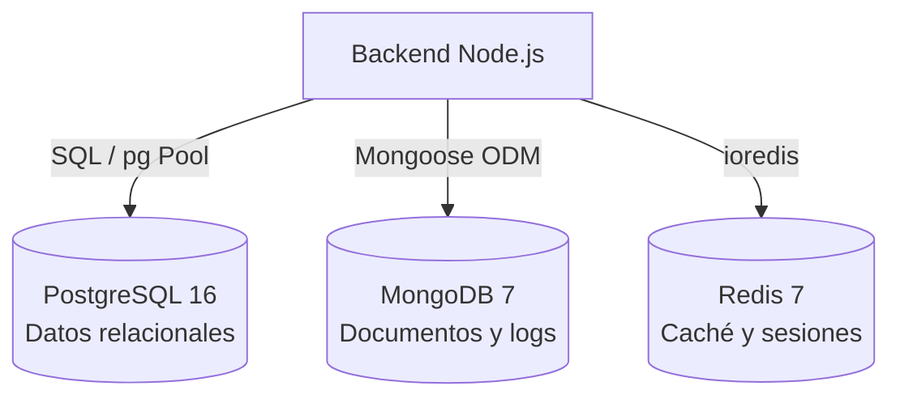
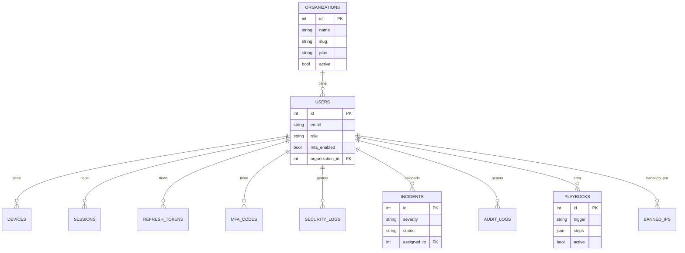

# Inventario del Proyecto — Base de Datos

**Proyecto:** RobenGate Sentinel  
**Versión:** 2.0  
**Fecha:** Junio 2026

---

## Arquitectura de Persistencia

RobenGate Sentinel utiliza una arquitectura **polyglot persistence** con tres sistemas de almacenamiento:



| Sistema | Rol | Puerto | Datos Almacenados |
|---|---|---|---|
| PostgreSQL 16 | BD relacional principal | 5432 | Usuarios, dispositivos, sesiones, logs, incidentes |
| MongoDB 7 | BD documental | 27017 | Logs de auditoría, indicadores de amenaza, eventos de seguridad |
| Redis 7 | Caché / Sessions / Blacklist | 6379 | Tokens, sesiones, IPs baneadas, rate limiting, MFA OTPs |

---

## PostgreSQL — Esquema Relacional

### Tabla: `users`

```sql
CREATE TABLE users (
  id            SERIAL PRIMARY KEY,
  name          VARCHAR(255),
  email         VARCHAR(255) UNIQUE NOT NULL,
  password_hash TEXT         NOT NULL,          -- bcrypt, work factor 12
  role          VARCHAR(32)  NOT NULL DEFAULT 'viewer',
  mfa_enabled   BOOLEAN      NOT NULL DEFAULT FALSE,
  mfa_channel   VARCHAR(10)  NOT NULL DEFAULT 'email',  -- 'email' | 'sms'
  phone         VARCHAR(30),
  totp_secret   TEXT,                           -- TOTP (Google Authenticator)
  active        BOOLEAN      NOT NULL DEFAULT TRUE,
  last_login_at TIMESTAMP,
  created_at    TIMESTAMP    NOT NULL DEFAULT NOW(),
  updated_at    TIMESTAMP,
  full_name     VARCHAR(255),
  company       VARCHAR(255),
  organization_id INT REFERENCES organizations(id)
);
```

**Roles válidos:** `admin` | `analyst` | `responder` | `viewer`

---

### Tabla: `devices`

```sql
CREATE TABLE devices (
  id               SERIAL PRIMARY KEY,
  user_id          INT     NOT NULL REFERENCES users(id) ON DELETE CASCADE,
  fingerprint_hash TEXT    NOT NULL,
  name             VARCHAR(255),
  trusted          BOOLEAN NOT NULL DEFAULT FALSE,
  last_seen_at     TIMESTAMP,
  created_at       TIMESTAMP NOT NULL DEFAULT NOW(),
  UNIQUE (user_id, fingerprint_hash)
);
```

---

### Tabla: `security_logs`

```sql
CREATE TABLE security_logs (
  id           BIGSERIAL PRIMARY KEY,
  user_id      INT          REFERENCES users(id) ON DELETE SET NULL,
  event_type   VARCHAR(120) NOT NULL,
  severity     VARCHAR(32)  NOT NULL,   -- 'critical' | 'warning' | 'info'
  ip_address   INET,
  country_code VARCHAR(10),
  metadata     JSONB,
  created_at   TIMESTAMP    NOT NULL DEFAULT NOW()
);
```

**Índices optimizados:**
- `idx_security_logs_created` — ordenación por fecha
- `idx_security_logs_severity` — filtrado por severidad
- `idx_security_logs_user` — logs por usuario
- `idx_security_logs_ip` — logs por IP

---

### Tabla: `sessions`

```sql
CREATE TABLE sessions (
  id            UUID        PRIMARY KEY DEFAULT gen_random_uuid(),
  user_id       INTEGER     NOT NULL REFERENCES users(id) ON DELETE CASCADE,
  session_token TEXT        NOT NULL UNIQUE,
  device_type   VARCHAR(32),
  user_agent    TEXT,
  ip_address    INET,
  last_active   TIMESTAMPTZ NOT NULL DEFAULT NOW(),
  created_at    TIMESTAMPTZ NOT NULL DEFAULT NOW(),
  revoked       BOOLEAN     NOT NULL DEFAULT FALSE,
  revoked_at    TIMESTAMPTZ
);
```

---

### Tabla: `refresh_tokens`

```sql
CREATE TABLE refresh_tokens (
  id          BIGSERIAL PRIMARY KEY,
  jti         UUID        NOT NULL UNIQUE,  -- JWT ID (para blacklist)
  user_id     INTEGER     NOT NULL REFERENCES users(id) ON DELETE CASCADE,
  expires_at  TIMESTAMPTZ NOT NULL,
  revoked     BOOLEAN     NOT NULL DEFAULT FALSE,
  created_at  TIMESTAMPTZ NOT NULL DEFAULT NOW()
);
```

---

### Tabla: `mfa_codes`

```sql
CREATE TABLE mfa_codes (
  id         BIGSERIAL PRIMARY KEY,
  user_id    INT       NOT NULL REFERENCES users(id) ON DELETE CASCADE,
  code       VARCHAR(10) NOT NULL,
  expires_at TIMESTAMP   NOT NULL,
  used       BOOLEAN     NOT NULL DEFAULT FALSE,
  created_at TIMESTAMP   NOT NULL DEFAULT NOW()
);
```

---

### Tabla: `banned_ips`

```sql
CREATE TABLE banned_ips (
  id         SERIAL PRIMARY KEY,
  ip_address INET   UNIQUE NOT NULL,
  reason     TEXT,
  banned_by  INT    REFERENCES users(id) ON DELETE SET NULL,
  expires_at TIMESTAMP,          -- NULL = ban permanente
  banned_at  TIMESTAMP NOT NULL DEFAULT NOW()
);
```

---

### Tabla: `incidents`

```sql
CREATE TABLE incidents (
  id          SERIAL PRIMARY KEY,
  title       VARCHAR(255) NOT NULL,
  description TEXT,
  severity    VARCHAR(32)  NOT NULL,   -- 'critical' | 'high' | 'medium' | 'low'
  status      VARCHAR(32)  NOT NULL DEFAULT 'open',
  assigned_to INT REFERENCES users(id),
  created_by  INT REFERENCES users(id),
  created_at  TIMESTAMP NOT NULL DEFAULT NOW(),
  updated_at  TIMESTAMP,
  closed_at   TIMESTAMP,
  metadata    JSONB
);
```

---

### Tabla: `vulnerabilities`

```sql
CREATE TABLE vulnerabilities (
  id          SERIAL PRIMARY KEY,
  cve_id      VARCHAR(32),
  title       VARCHAR(255) NOT NULL,
  description TEXT,
  severity    VARCHAR(32)  NOT NULL,
  cvss_score  DECIMAL(4,2),
  status      VARCHAR(32)  NOT NULL DEFAULT 'open',
  asset       VARCHAR(255),
  discovered_at TIMESTAMP,
  remediated_at TIMESTAMP,
  created_at  TIMESTAMP NOT NULL DEFAULT NOW()
);
```

---

### Tabla: `organizations` (Multi-Tenancy)

```sql
CREATE TABLE organizations (
  id         SERIAL PRIMARY KEY,
  name       VARCHAR(255) NOT NULL,
  slug       VARCHAR(100) UNIQUE NOT NULL,
  plan       VARCHAR(50)  NOT NULL DEFAULT 'free',
  active     BOOLEAN      NOT NULL DEFAULT TRUE,
  created_at TIMESTAMP    NOT NULL DEFAULT NOW(),
  settings   JSONB
);
```

---

### Tabla: `playbooks` (SOAR)

```sql
CREATE TABLE playbooks (
  id          SERIAL PRIMARY KEY,
  name        VARCHAR(255) NOT NULL,
  description TEXT,
  trigger     VARCHAR(120) NOT NULL,  -- tipo de alerta que activa el playbook
  steps       JSONB        NOT NULL,  -- pasos de automatización
  active      BOOLEAN      NOT NULL DEFAULT TRUE,
  created_by  INT REFERENCES users(id),
  created_at  TIMESTAMP    NOT NULL DEFAULT NOW(),
  updated_at  TIMESTAMP
);
```

---

### Tabla: `audit_logs` (PostgreSQL)

```sql
CREATE TABLE audit_logs (
  id          BIGSERIAL PRIMARY KEY,
  actor_id    INT REFERENCES users(id) ON DELETE SET NULL,
  actor_email VARCHAR(255),
  action      VARCHAR(120) NOT NULL,
  resource    VARCHAR(120),
  resource_id TEXT,
  changes     JSONB,
  ip_address  INET,
  created_at  TIMESTAMP NOT NULL DEFAULT NOW()
);
```

---

### Historial de Migraciones

| Migración | Descripción |
|---|---|
| `001_initial_schema.sql` | Tablas base: users, devices, security_logs, mfa_codes, banned_ips |
| `002_add_mfa_codes.sql` | Mejoras MFA, índices de códigos válidos |
| `003_add_phone_mfa.sql` | Soporte SMS MFA, columna phone |
| `004_add_sessions.sql` | Tabla sessions y refresh_tokens |
| `005_add_webauthn.sql` | Columnas WebAuthn en users |
| `006_backup_codes_and_risk.sql` | Códigos de recuperación y scoring de riesgo |
| `007_add_audit_logs.sql` | Tabla audit_logs en PostgreSQL |
| `008_add_company_to_users.sql` | Campo company en users |
| `009_add_full_name_updated_at.sql` | full_name y updated_at |
| `010_add_totp.sql` | Soporte TOTP (totp_secret) |
| `011_add_incidents_vulnerabilities.sql` | Tablas incidents y vulnerabilities |
| `012_add_multi_tenancy.sql` | Tabla organizations, org_id en users |
| `013_add_playbooks_soar.sql` | Tabla playbooks para SOAR |

---

## MongoDB — Colecciones

### Colección: `security_logs`

**Schema:**
```javascript
{
  _id: ObjectId,
  eventType: String,       // 'LOGIN_FAILED' | 'SUSPICIOUS_IP' | etc.
  severity: String,        // 'critical' | 'warning' | 'info'
  userId: Number,          // Referencia a PostgreSQL users.id
  ipAddress: String,
  countryCode: String,
  userAgent: String,
  metadata: Object,        // Datos adicionales del evento
  riskScore: Number,       // 0-100
  correlationId: String,   // Para agrupar eventos relacionados
  createdAt: Date
}
```

**Índices:**
- `createdAt: -1` (ordenación por fecha)
- `severity: 1` (filtrado por severidad)
- `userId: 1` (logs por usuario)
- `ipAddress: 1` (logs por IP)
- `eventType: 1` (filtrado por tipo)
- TTL index: `createdAt` con expiración configurable (90 días por defecto)

---

### Colección: `threat_indicators`

**Schema:**
```javascript
{
  _id: ObjectId,
  type: String,            // 'ip' | 'domain' | 'hash' | 'url' | 'email'
  value: String,           // El indicador (ej: IP address, hash)
  severity: String,        // 'critical' | 'high' | 'medium' | 'low'
  source: String,          // Fuente del indicador
  description: String,
  tags: [String],
  firstSeen: Date,
  lastSeen: Date,
  ttl: Date,               // Expiración del indicador
  active: Boolean,
  metadata: Object
}
```

**Índices:**
- `value: 1` (búsqueda rápida por indicador)
- `type: 1` (filtrado por tipo)
- `severity: 1` (filtrado por severidad)
- TTL index: `ttl` para expiración automática

---

### Colección: `audit_events` (MongoDB)

Los eventos de auditoría de alta criticidad también se escriben en MongoDB para:
- Persistencia a largo plazo
- Stream SSE en tiempo real
- Análisis de patrones

```javascript
{
  _id: ObjectId,
  actor: { id, email, role },
  action: String,
  resource: String,
  resourceId: String,
  severity: String,         // 'HIGH' | 'CRITICAL' emiten eventos SSE
  changes: Object,
  ipAddress: String,
  timestamp: Date
}
```

---

## Redis — Estructuras de Datos

| Clave / Patrón | Tipo | TTL | Descripción |
|---|---|---|---|
| `jwt:blacklist:<jti>` | String | Expiración del token | JTI invalidados (logout, refresh) |
| `session:<sessionId>` | Hash | Configurable | Datos de sesión activa |
| `mfa:<userId>` | String | 5 minutos | Código OTP de MFA |
| `ban:<ipAddress>` | String | Configurable | IP baneada automáticamente |
| `ratelimit:<ip>:<route>` | Counter | 1 minuto | Contador de rate limiting |
| `user:risk:<userId>` | Hash | 1 hora | Score de riesgo acumulado |
| `pending:mfa:<token>` | String | 10 minutos | Token pendiente de MFA (Zero-Trust) |
| `refresh:<jti>` | String | 7 días | Refresh token activo |

---

## Configuración de Conexiones

### PostgreSQL Pool (`db-sql/connection-pool.js`)
```javascript
{
  max: 20,                    // Máximo de conexiones en pool
  idleTimeoutMillis: 30000,   // 30s idle antes de cerrar
  connectionTimeoutMillis: 2000,  // Timeout de conexión
  ssl: process.env.DB_SSL === 'true'  // TLS opcional
}
```

### MongoDB (`backend/src/config/mongodb.js`)
- Conexión autenticada obligatoria en todos los entornos
- `authSource: admin`
- Índices TTL para expiración automática de logs

### Redis (`backend/src/lib/redis.js`)
- Autenticación con contraseña obligatoria
- `maxmemory: 256mb`
- `maxmemory-policy: allkeys-lru`
- `appendonly: yes` (persistencia)

---

## Diagrama Entidad-Relación (PostgreSQL)


