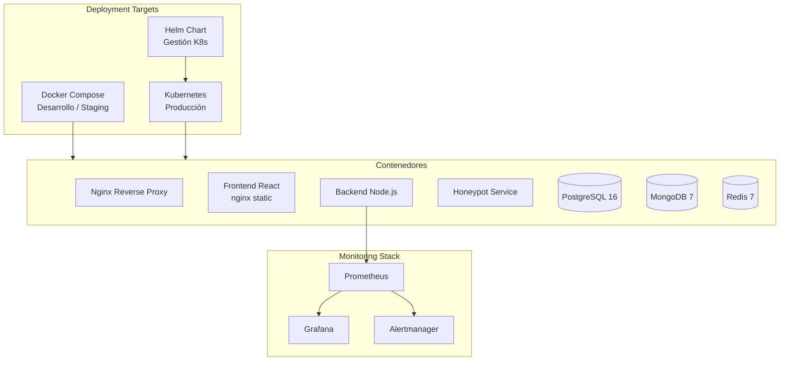

# Inventario del Proyecto — Infraestructura

**Proyecto:** RobenGate Sentinel  
**Versión:** 2.0  
**Fecha:** Junio 2026

---

## Stack de Infraestructura



---

## 1. Docker (`infra/docker/`)

### Servicios en `docker-compose.yml`

| Servicio | Imagen | Puerto Expuesto | Descripción |
|---|---|---|---|
| `nginx` | `nginx:1.25-alpine` | 80, 443 | Reverse proxy + TLS termination |
| `frontend` | Build local | Interno :80 | React app servida por nginx |
| `backend` | Build local | Interno :5000 | API Node.js |
| `honeypot` | Build local | 2222, 8080 | Honeypot SSH + HTTP |
| `postgres` | `postgres:16-alpine` | 5433 (host) | Base de datos relacional |
| `mongodb` | `mongo:7-jammy` | Interno :27017 | Base de datos documental |
| `redis` | `redis:7-alpine` | 6379 | Caché y sesiones |

### `docker-compose.dev.yml` — Modo Desarrollo
- Solo inicia `postgres`, `mongodb`, `redis`
- Expone puertos directos para desarrollo local
- Usa credenciales de desarrollo de `.env.dev`

### `docker-compose.prod.yml` — Modo Producción
- Resource limits para todos los servicios
- `restart: always`
- Logging `json-file` con rotación (max 10MB, 5 archivos)
- Sin exposición de puertos de BD al host

### Volúmenes Persistentes
| Volumen | Contenido |
|---|---|
| `postgres_data` | Datos PostgreSQL |
| `mongodb_data` | Datos MongoDB |
| `redis_data` | Datos Redis (appendonly) |

---

## 2. Dockerfiles

### `infra/Dockerfile.backend`
```
Stage 1 (deps):
  - node:20-alpine
  - npm ci --omit=dev (solo prod deps)

Stage 2 (runtime):
  - node:20-alpine
  - Usuario no-root: sentinel:sentinel
  - EXPOSE 5000
  - HEALTHCHECK: GET /health
  - CMD: node server.js
```

### `infra/Dockerfile.frontend`
```
Stage 1 (builder):
  - node:20-alpine
  - npm ci (deps completas)
  - npm run build → /app/dist

Stage 2 (serve):
  - nginx:1.25-alpine
  - Copia dist/ → /usr/share/nginx/html
  - Copia nginx.conf
  - EXPOSE 80
  - HEALTHCHECK: wget /
```

### `honeypot/Dockerfile`
- Basado en Node.js Alpine
- Usuario no-root
- Expone puertos 2222 (SSH) y 8080 (HTTP)

---

## 3. Nginx (`infra/nginx.conf`)

### Configuración de Producción

**HTTP → HTTPS Redirect:**
```nginx
server {
    listen 80;
    return 301 https://$host$request_uri;
}
```

**HTTPS Server:**
- TLS 1.2 + 1.3 (Mozilla Modern Profile)
- HSTS: 63072000s, includeSubDomains, preload
- OCSP Stapling habilitado
- Session tickets deshabilitados

**Routing:**
```
/internal/  → Backend (solo IPs internas 172.16.0.0/12, 10.0.0.0/8)
/api/       → Backend :5000
/           → Frontend :80
```

**TLS Certificates** (`infra/nginx/ssl/`):
- `fullchain.pem` — Certificado + cadena
- `privkey.pem` — Clave privada
- `dhparam.pem` — DH parameters 4096-bit

---

## 4. Kubernetes (`k8s/`)

### Estructura de Manifests

```
k8s/
├── base/
│   ├── kustomization.yaml
│   ├── namespace.yaml         ← Namespace: robengate-sentinel
│   ├── backend/
│   │   ├── deployment.yaml    ← 2 réplicas, Rolling Update
│   │   ├── service.yaml       ← ClusterIP :5000
│   │   ├── hpa.yaml           ← HPA: 2-10 réplicas
│   │   └── configmap.yaml     ← Variables de entorno
│   ├── frontend/
│   │   ├── deployment.yaml    ← 2 réplicas
│   │   └── service.yaml       ← ClusterIP :80
│   ├── postgres/
│   │   └── statefulset.yaml   ← StatefulSet + PVC
│   ├── mongo/
│   │   └── statefulset.yaml   ← StatefulSet + PVC
│   ├── redis/
│   │   └── deployment.yaml    ← Deployment + PVC
│   └── ingress/
│       └── ingress.yaml       ← Nginx Ingress con TLS
└── overlays/
    └── prod/
        └── kustomization.yaml ← Overrides de producción
```

### Backend Deployment — Características
| Parámetro | Valor |
|---|---|
| Réplicas base | 2 |
| Estrategia | RollingUpdate (maxSurge: 1, maxUnavailable: 0) |
| Usuario | No-root (uid: 1001) |
| Anotaciones Prometheus | `scrape: true, port: 5000, path: /metrics` |
| SecurityContext | runAsNonRoot, readOnlyRootFilesystem |
| Resource Limits | CPU: 500m, Memory: 512Mi |
| Resource Requests | CPU: 250m, Memory: 256Mi |
| Liveness Probe | GET /health |
| Readiness Probe | GET /ready |
| Graceful Shutdown | terminationGracePeriodSeconds: 30 |

### HPA (Horizontal Pod Autoscaler)
| Parámetro | Valor |
|---|---|
| Min réplicas | 2 |
| Max réplicas | 10 |
| CPU target | 70% |
| Memory target | 80% |

### Ingress
| Parámetro | Valor |
|---|---|
| Clase | nginx |
| TLS | Sí (cert-manager / Let's Encrypt) |
| Anotaciones | rate-limiting, SSL redirect, HSTS |

---

## 5. Helm Chart (`helm/robengate-sentinel/`)

### Estructura del Chart
```
helm/robengate-sentinel/
├── Chart.yaml            ← Metadata del chart
├── values.yaml           ← Valores por defecto
└── templates/
    ├── deployment.yaml
    ├── service.yaml
    ├── ingress.yaml
    ├── configmap.yaml
    ├── secret.yaml
    ├── hpa.yaml
    └── NOTES.txt
```

### `Chart.yaml`
```yaml
apiVersion: v2
name: robengate-sentinel
description: Enterprise Cybersecurity SIEM Platform
type: application
version: 1.0.0
appVersion: "2.0.0"
```

### Valores Configurables (`values.yaml`)
```yaml
backend:
  replicaCount: 2
  image:
    repository: ghcr.io/robensonl/robengate-sentinel/backend
    tag: latest
  resources:
    limits:
      cpu: 500m
      memory: 512Mi

frontend:
  replicaCount: 2
  image:
    repository: ghcr.io/robensonl/robengate-sentinel/frontend

ingress:
  enabled: true
  className: nginx
  hosts:
    - host: sentinel.example.com
      paths: [/]
  tls:
    - secretName: sentinel-tls
      hosts: [sentinel.example.com]
```

---

## 6. Scripts de Infraestructura

### `infra/scripts/backup.sh`
```bash
# Backup automático de PostgreSQL
# - Genera archivo .sql.gz con timestamp
# - Retención configurable (default: 30 días)
# - Purga automática de backups antiguos
```

### `infra/scripts/deploy.sh`
```bash
# Script de despliegue Docker Compose
# - Pull de imágenes actualizadas
# - Build sin caché
# - Deploy con --remove-orphans
# - Verificación de salud post-deploy
```

### `infra/scripts/restore.sh`
```bash
# Restauración de backup PostgreSQL
# - Verificación del archivo de backup
# - Advertencia con pausa de 5s (cancelable)
# - Restauración completa desde .sql.gz
```

### `scripts/generate-dev-certs.ps1`
```powershell
# Genera certificados TLS auto-firmados para desarrollo
# - Genera fullchain.pem, privkey.pem, dhparam.pem
# - Coloca en infra/nginx/ssl/
```

---

## 7. Monitorización Stack (`monitoring/`)

### `docker-compose.monitoring.yml`

| Servicio | Imagen | Puerto | Descripción |
|---|---|---|---|
| `prometheus` | `prom/prometheus` | 9090 | Recolección de métricas |
| `grafana` | `grafana/grafana` | 3000 | Dashboards y visualización |
| `alertmanager` | `prom/alertmanager` | 9093 | Gestión de alertas |

### Prometheus (`monitoring/prometheus/`)
- Scrape del backend en `/metrics` cada 15s
- Scrape de postgres-exporter
- Scrape de redis-exporter
- Reglas de alerta configurables

### Grafana (`monitoring/grafana/`)
- Datasource: Prometheus
- Dashboards predefinidos:
  - Sistema general (CPU, memoria, red)
  - Backend API (latencia, errores, throughput)
  - Base de datos (conexiones, queries)
  - Seguridad (intentos de login, IPs baneadas, alertas)

### Alertmanager (`monitoring/alertmanager/`)
- Canales de notificación: Email, Slack, PagerDuty
- Grouping de alertas
- Inhibición y silenciamiento
- Políticas de escalado

---

## 8. Ports Map Completo

| Servicio | Puerto Externo | Puerto Interno | Protocolo |
|---|---|---|---|
| Nginx (HTTP) | 80 | 80 | TCP |
| Nginx (HTTPS) | 443 | 443 | TCP |
| Honeypot SSH | 2222 | 2222 | TCP |
| Honeypot HTTP | 8080 | 8080 | TCP |
| PostgreSQL (dev) | 5432 | 5432 | TCP |
| MongoDB (dev) | 27017 | 27017 | TCP |
| Redis | 6379 | 6379 | TCP |
| Backend (dev) | 5000 | 5000 | TCP |
| Frontend (dev) | 5173 | 5173 | TCP |
| Prometheus | 9090 | 9090 | TCP |
| Grafana | 3000 | 3000 | TCP |
| Alertmanager | 9093 | 9093 | TCP |

---

## 9. Variables de Entorno — Infraestructura

| Variable | Descripción | Obligatoria |
|---|---|---|
| `DB_PASSWORD` | Contraseña PostgreSQL | ✅ |
| `MONGO_ROOT_USER` | Usuario root MongoDB | ✅ |
| `MONGO_ROOT_PASSWORD` | Contraseña root MongoDB | ✅ |
| `REDIS_PASSWORD` | Contraseña Redis | ✅ |
| `INTERNAL_API_SECRET` | Secreto servicios internos | ✅ |
| `SSH_HOST_KEY_PEM` | Clave host SSH para honeypot | ✅ |
| `JWT_SECRET` | Secreto JWT access tokens | ✅ |
| `JWT_REFRESH_SECRET` | Secreto JWT refresh tokens | ✅ |
| `OTP_HMAC_KEY` | Clave HMAC para TOTP | ✅ |
| `CLIENT_URL` | URL frontend (CORS) | ✅ |
| `DB_NAME` | Nombre base de datos | No (default: robengate_sentinel) |
| `DB_USER` | Usuario PostgreSQL | No (default: postgres) |
