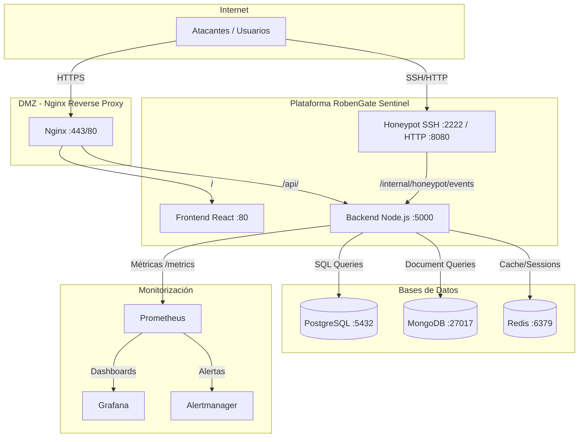
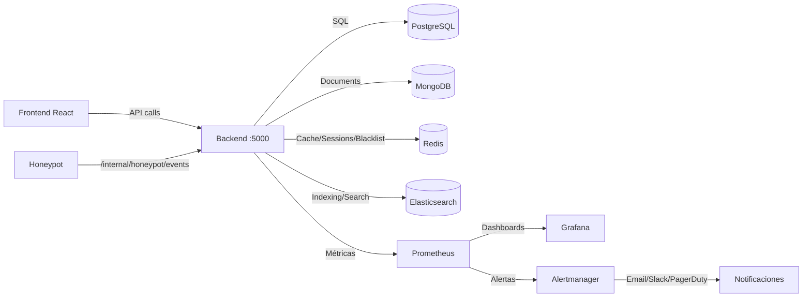

# Inventario del Proyecto — Visión General del Sistema

**Proyecto:** RobenGate Sentinel  
**Versión:** 2.0  
**Fecha:** Junio 2026  
**Tipo:** Plataforma de Ciberseguridad Enterprise (SIEM + SOC + Honeypot)

---

## ¿Qué es RobenGate Sentinel?

RobenGate Sentinel es una plataforma de ciberseguridad enterprise de código abierto que combina capacidades de:

- **SIEM** (Security Information and Event Management)
- **SOC** (Security Operations Center) 
- **Honeypot** (trampa para atacantes)
- **SOAR** (Security Orchestration, Automation and Response)
- **Threat Intelligence** (inteligencia de amenazas)
- **Risk Engine** (motor de evaluación de riesgo adaptativo)
- **AI Correlation** (correlación de eventos con IA)

La plataforma está diseñada para organizaciones que necesitan visibilidad completa de su postura de seguridad, detección de amenazas en tiempo real y respuesta automatizada ante incidentes.

---

## Stack Tecnológico

### Backend
| Tecnología | Versión | Rol |
|---|---|---|
| Node.js | 20 LTS | Runtime de servidor |
| Express.js | 4.x | Framework web |
| PostgreSQL | 16 | Base de datos relacional principal |
| MongoDB | 7 | Base de datos de documentos (logs, indicadores) |
| Redis | 7 | Caché, sesiones, blacklist JWT, rate limiting |
| Elasticsearch | Opcional | Búsqueda full-text de eventos |

### Frontend
| Tecnología | Versión | Rol |
|---|---|---|
| React | 19 | Framework de UI |
| Vite | 5 | Build tool |
| Tailwind CSS | 4 | Estilos utilitarios |
| Zustand | 5 | Gestión de estado global |
| React Router | 7 | Enrutamiento SPA |
| Recharts | 3 | Visualización de datos |
| D3-Geo | 3 | Mapa de ataques geolocalizado |

### Infraestructura
| Tecnología | Versión | Rol |
|---|---|---|
| Docker | 24+ | Containerización |
| Docker Compose | 2.x | Orquestación local |
| Kubernetes | 1.29+ | Orquestación en producción |
| Helm | 3.x | Gestión de charts K8s |
| Nginx | 1.25 | Reverse proxy, TLS termination |
| Prometheus | Latest | Métricas y monitorización |
| Grafana | Latest | Dashboards y visualización |
| Alertmanager | Latest | Gestión de alertas |

---

## Arquitectura de Alto Nivel

---

## Módulos Principales

### 1. Autenticación y Autorización
**Estado:** ✅ Real implementado  
**Tecnologías:** JWT (access + refresh), WebAuthn/FIDO2, TOTP/MFA, bcrypt  
**Archivos clave:**
- `backend/src/services/authService.js`
- `backend/src/services/webAuthnService.js`
- `backend/src/middleware/authenticate.js`
- `backend/src/middleware/authorize.js`
- `frontend/src/shared/contexts/AuthContext.jsx`

### 2. RBAC (Control de Acceso Basado en Roles)
**Estado:** ✅ Real implementado  
**Roles:** admin > analyst > responder > viewer  
**Archivos clave:**
- `backend/src/middleware/authorize.js`
- `frontend/src/shared/config/permissions.js`
- `frontend/src/shared/hooks/usePermission.js`
- `frontend/src/shared/components/PermissionGate.jsx`

### 3. SIEM — Logs y Correlación
**Estado:** ✅ Real implementado  
**Archivos clave:**
- `backend/src/services/correlationEngine.js`
- `backend/src/services/detectionEngine.js`
- `backend/src/routes/logs.js`
- `frontend/src/features/security/pages/SecurityLogs.jsx`

### 4. Motor de Riesgo Adaptativo
**Estado:** ✅ Real implementado  
**Señales:** 10+ incluyendo IP, dispositivo, hora, geolocalización  
**Archivos clave:**
- `backend/src/services/riskEngine.js`

### 5. Motor de IA y Correlación
**Estado:** ✅ Real implementado (heurístico + correlación)  
**Archivos clave:**
- `backend/src/services/aiCorrelationEngine.js`
- `frontend/src/features/ai/pages/AIAnalysis.jsx`

### 6. Honeypot (SSH + HTTP)
**Estado:** ✅ Real implementado  
**Archivos clave:**
- `honeypot/src/ssh/sshServer.js`
- `honeypot/src/http/httpServer.js`
- `honeypot/src/capture/payloadCapture.js`
- `honeypot/api-integration.js`

### 7. Gestión de Incidentes + SOAR
**Estado:** ✅ Real implementado  
**Archivos clave:**
- `backend/src/services/soarEngine.js`
- `backend/src/routes/incidents.js`
- `backend/src/routes/playbooks.js`
- `frontend/src/features/incidents/pages/Incidents.jsx`

### 8. Mapa de Ataques
**Estado:** ✅ Real implementado (geolocalización de IPs)  
**Archivos clave:**
- `backend/src/routes/attackmap.js`
- `backend/src/controllers/attackMapController.js`
- `frontend/src/features/attackmap/pages/AttackMap.jsx`

### 9. Threat Intelligence
**Estado:** ✅ Real implementado  
**Archivos clave:**
- `backend/src/routes/threats.js`
- `backend/src/models/ThreatIndicator.js`
- `frontend/src/features/security/pages/ThreatIntelligence.jsx`

### 10. Pipeline de Ingesta de Eventos
**Estado:** ✅ Real implementado  
**Archivos clave:**
- `backend/src/services/ingestion/pipeline.js`
- `backend/src/services/ingestion/normalizer.js`
- `backend/src/services/ingestion/enricher.js`
- `backend/src/services/ingestion/parser.js`

### 11. Gestión de Organizaciones (Multi-Tenancy)
**Estado:** ✅ Real implementado (migraciones SQL)  
**Archivos clave:**
- `backend/src/routes/organizations.js`

### 12. Agentes EDR
**Estado:** ⚠️ Implementado parcialmente  
**Archivos clave:**
- `backend/src/services/endpointAgentService.js`
- `backend/src/routes/agents.js`

### 13. Monitorización (Prometheus + Grafana)
**Estado:** ✅ Configurado  
**Archivos clave:**
- `monitoring/docker-compose.monitoring.yml`
- `monitoring/prometheus/`
- `monitoring/grafana/`

### 14. Dashboard SOC
**Estado:** ⚠️ Métricas parcialmente simuladas  
**Archivos clave:**
- `frontend/src/features/dashboard/pages/Dashboard.jsx`
- `backend/src/routes/stats.js`

---

## Estado de Features: Real vs Simulado

### ✅ Features Reales (Implementadas)
- Autenticación JWT con rotación de tokens
- WebAuthn / FIDO2 biométrico
- MFA por email (OTP en Redis con TTL)
- TOTP (Google Authenticator)
- RBAC con 4 roles
- Risk engine con señales comportamentales
- Correlación de eventos
- Motor de detección
- IP banning automático con Redis
- Honeypot SSH + HTTP
- Gestión de incidentes
- Playbooks SOAR
- Threat Intelligence
- Elasticsearch para búsqueda
- Audit logging en MongoDB
- Multi-tenancy
- Agentes EDR (básico)
- Pipeline de ingesta de eventos
- Mapa de ataques con geolocalización
- SSE (Server-Sent Events) en tiempo real
- Métricas Prometheus

### ⚠️ Features Parcialmente Simuladas
- Dashboard de métricas (algunas estadísticas son estáticas)
- Attack Simulator (fallback cuando no hay datos reales)
- Análisis de IA (heurístico, no modelo ML real)
- SMS MFA (parcial — Twilio no configurado en dev)

### 📋 Features Planeadas (Roadmap)
- Integración con VirusTotal / Shodan APIs
- SOAR con webhooks externos
- ML real para detección de anomalías
- Active Directory / LDAP integration
- SOC 2 / ISO 27001 compliance reporting
- Mobile app para alertas

---

## Diagrama de Dependencias de Servicios

---

## Números del Sistema

| Métrica | Valor |
|---|---|
| Rutas de API (backend) | 23 archivos de rutas |
| Endpoints totales aprox. | 70+ endpoints |
| Controladores | 18 controladores |
| Servicios | 17 servicios + 5 en ingestion/ |
| Middleware | 10 middleware |
| Modelos de BD | 6 modelos Mongoose + tablas SQL |
| Migraciones SQL | 13 migraciones |
| Páginas Frontend | 26 páginas |
| Componentes compartidos | 14 componentes shared |
| Hooks personalizados | 5 hooks |
| Servicios Frontend | 4 servicios |
| Contextos React | 3 contextos (Auth, Theme, Toast) |
| Contenedores Docker | 6 (postgres, mongodb, redis, backend, frontend, honeypot) + nginx |

---

## Información del Repositorio

| Campo | Valor |
|---|---|
| Repositorio | `Robensonl/robengate-sentinel` |
| Branch principal | `develop` |
| Licencia | Ver `LICENSE` |
| Lenguajes | JavaScript (Node.js + React) |
| Linter | ESLint |
| Tests | Jest (configurado, en desarrollo) |
