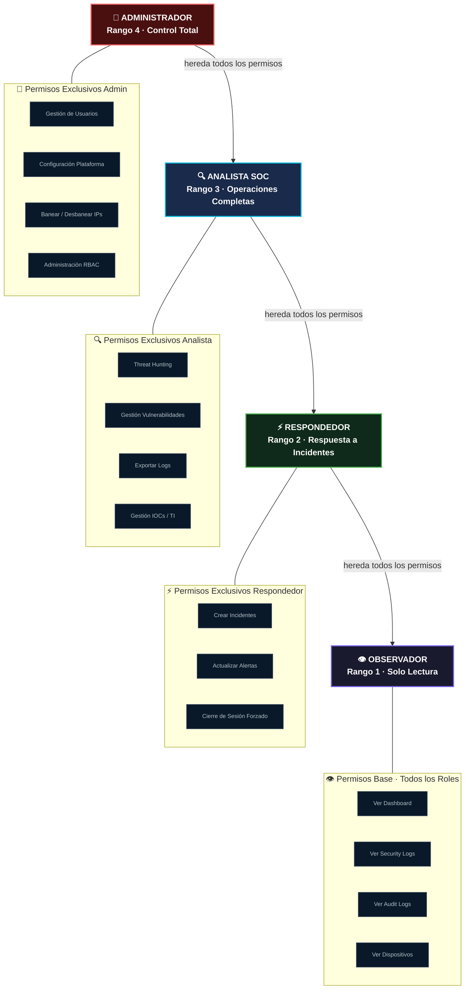
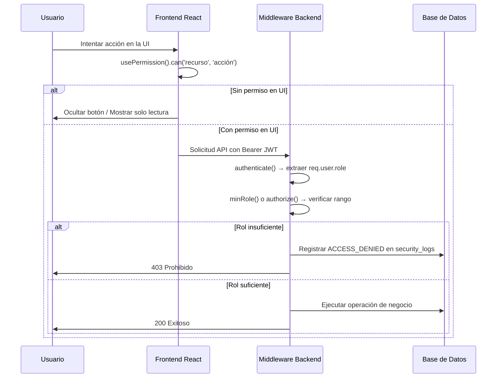

# Control de Acceso Basado en Roles (RBAC) — RobenGate Sentinel

> **Clasificación:** INTERNO | **Modelo:** RBAC Jerárquico (H-RBAC)

---

## Resumen Ejecutivo

RobenGate Sentinel implementa un **Control de Acceso Basado en Roles Jerárquico (H-RBAC)** con cuatro roles ordenados. Los roles de mayor rango heredan todos los permisos de los roles de menor rango, siguiendo el principio del **mínimo privilegio**. El control de acceso se aplica en **cuatro capas independientes**: enrutamiento, renderizado de UI, middleware de API y consultas de base de datos, garantizando que ninguna vulnerabilidad en una capa pueda bypass el sistema de autorización completo.

Esta arquitectura cumple con los requisitos de control de acceso de **ISO 27001 Annex A.9**, **NIST SP 800-53 AC-2** y **SOC 2 CC6.3**.

---

## 1. Visión General

RobenGate Sentinel usa un modelo **H-RBAC** con cuatro roles ordenados. Los roles de mayor rango heredan todos los permisos de los de menor rango. El acceso se aplica en cuatro capas independientes: enrutamiento, renderizado de UI, middleware de API y consultas de base de datos.

---

## 2. Jerarquía de Roles



| Rol | Rango | Descripción | Usuario Típico |
|-----|-------|-------------|----------------|
| **admin** | 4 | Control total de la plataforma — gestión de usuarios, configuración, todas las operaciones SOC | CISO, Propietario de la Plataforma de Seguridad |
| **analyst** | 3 | Operaciones SOC completas — investigar, cazar amenazas, crear incidentes, gestionar vulnerabilidades | Analista SOC, Ingeniero de Seguridad |
| **responder** | 2 | Respuesta a incidentes — reconocer alertas, crear/actualizar incidentes, responder a amenazas | Respondedor de Incidentes, Operaciones de Seguridad |
| **viewer** | 1 | Vista SOC de solo lectura — monitorizar todos los paneles, logs y alertas en modo lectura | Ejecutivo, Auditor, Analista Junior |

---

## Descripción Técnica

### 3. Matriz de Permisos

#### 3.1 Permisos por Recurso

| Recurso | Acción | Observador | Respondedor | Analista | Admin |
|---------|--------|------------|-------------|----------|-------|
| **panel** | leer | ✅ | ✅ | ✅ | ✅ |
| **logs-seguridad** | leer | ✅ | ✅ | ✅ | ✅ |
| **logs-seguridad** | exportar | ❌ | ❌ | ✅ | ✅ |
| **logs-auditoria** | leer | ✅ | ✅ | ✅ | ✅ |
| **alertas** | leer | ✅ | ✅ | ✅ | ✅ |
| **alertas** | actualizar-estado | ❌ | ✅ | ✅ | ✅ |
| **alertas** | eliminar | ❌ | ❌ | ❌ | ✅ |
| **incidentes** | leer | ✅ | ✅ | ✅ | ✅ |
| **incidentes** | escribir | ❌ | ✅ | ✅ | ✅ |
| **incidentes** | asignar | ❌ | ✅ | ✅ | ✅ |
| **vulnerabilidades** | leer | ✅ | ✅ | ✅ | ✅ |
| **vulnerabilidades** | escribir | ❌ | ❌ | ✅ | ✅ |
| **intel-amenazas** | leer | ✅ | ✅ | ✅ | ✅ |
| **intel-amenazas** | reportar | ❌ | ❌ | ✅ | ✅ |
| **honeypot** | leer | ✅ | ✅ | ✅ | ✅ |
| **mapa-ataques** | leer | ✅ | ✅ | ✅ | ✅ |
| **analisis-ia** | leer | ✅ | ✅ | ✅ | ✅ |
| **analisis-ia** | ejecutar-analisis | ❌ | ❌ | ✅ | ✅ |
| **caza-amenazas** | leer | ✅ | ✅ | ✅ | ✅ |
| **dispositivos** | leer | ✅ | ✅ | ✅ | ✅ |
| **dispositivos** | confiar | ❌ | ❌ | ✅ | ✅ |
| **sesiones** | gestionar-propias | ✅ | ✅ | ✅ | ✅ |
| **sesiones** | gestionar-todas | ❌ | ❌ | ❌ | ✅ |
| **usuarios** | leer | ❌ | ❌ | ❌ | ✅ |
| **usuarios** | escribir | ❌ | ❌ | ❌ | ✅ |
| **usuarios** | cambiar-rol | ❌ | ❌ | ❌ | ✅ |
| **configuracion** | gestionar-propia | ✅ | ✅ | ✅ | ✅ |
| **configuracion** | gestionar-todas | ❌ | ❌ | ❌ | ✅ |

#### 3.2 Visibilidad de Datos

| Tipo de Dato | Observador | Respondedor | Analista | Admin |
|--------------|------------|-------------|----------|-------|
| Direcciones IP | Enmascarada (`18X.X.X.42`) | Enmascarada | **Completa** | **Completa** |
| Direcciones email | Enmascarada (`aXXXX@XXXX.io`) | Enmascarada | **Completa** | **Completa** |
| Números de teléfono | Enmascarada (`+12XXXXXXX34`) | Enmascarada | **Completa** | **Completa** |
| Gestión de usuarios | ❌ | ❌ | ❌ | ✅ |
| Puntuaciones de riesgo | Leer | Leer | Leer + Escribir | Completo |

---

## Arquitectura

### 4. Aplicación RBAC en el Backend

#### 4.1 Middleware (`authorize.js`)

Tres fábricas de middleware exportadas:

```javascript
// 1. Coincidencia exacta de rol
authorize(['admin', 'analyst'])
// → Solo permite roles admin o analyst

// 2. Umbral mínimo de rol (con conciencia de jerarquía)
minRole('viewer')
// → Permite viewer (rango ≥ 1): viewer, responder, analyst, admin

minRole('analyst')
// → Permite analyst (rango ≥ 3): analyst, admin

// 3. Aplicación de solo lectura para viewers
readOnly()
// → Bloquea POST, PUT, PATCH, DELETE para viewers
// → Permite GET, HEAD, OPTIONS para viewers
// → Roles superiores pasan directamente
```

#### 4.2 Valores de Rango de Rol

```javascript
const RANGO_ROL = {
  viewer:    1,
  responder: 2,
  analyst:   3,
  admin:     4,
};
```

#### 4.3 Registro de Denegaciones de Acceso

Cada rechazo RBAC se registra en MongoDB `SecurityLog` con:
- `category: 'ACCESS'`
- `action: 'ACCESS_DENIED'`
- `severity: 'MEDIUM'`
- `metadata: { rolRequerido, rolUsuario, endpoint, method }`

---

### 5. Aplicación RBAC en el Frontend

#### 5.1 Protección a Nivel de Ruta (`routes.jsx`)

```jsx
// Rutas para Observador+
<Route path="/mapa-ataques" element={
  <ProtectedRoute>
    <MapaAtaques />
  </ProtectedRoute>
} />

// Rutas solo para Admin
<Route path="/usuarios" element={
  <ProtectedRoute requiredRole="admin">
    <ListaUsuarios />
  </ProtectedRoute>
} />
```

`ProtectedRoute` evalúa:
1. ¿Está el usuario autenticado? → Si no: redirigir a `/login`
2. ¿Cumple el usuario el `requiredRole`? → Si no: redirigir a `/acceso-denegado`

#### 5.2 Puertas a Nivel de Componente (`PermissionGate.jsx`)

```jsx
// Puerta básica — ocultar si permisos insuficientes
<PermissionGate resource="incidentes" action="escribir">
  <Button>Crear Incidente</Button>
</PermissionGate>

// Puerta con alternativa — mostrar insignia de solo lectura
<PermissionGate
  resource="alertas"
  action="actualizar-estado"
  fallback={<InsigniaLectura />}
>
  <SelectorEstado />
</PermissionGate>
```

#### 5.3 Hook `usePermission()`

```javascript
const { can, canRead, canWrite, isAtLeast, isAdmin, isViewer } = usePermission();

// Verificación de recurso + acción
if (can('incidentes', 'escribir')) { /* mostrar botón de creación */ }

// Verificación de rol mínimo
if (isAtLeast('analyst')) { /* mostrar herramientas avanzadas */ }

// Verificaciones de rol simples
if (isAdmin) { /* mostrar panel admin */ }
if (isViewer) { /* mostrar indicador de solo lectura */ }
```

#### 5.4 Insignia "Solo Vista" para Observadores

Cuando un Observador accede a una página, `PageLayout.jsx` renderiza una insignia "Solo Vista" en la cabecera, dejando visualmente claro que la sesión actual está en modo de solo lectura.

---

## Flujo Operacional

### 6. Flujo de Verificación de Acceso



---

## Casos de Uso

### Caso 1: Observador Ejecutivo

El CFO necesita verificar el estado de seguridad de la empresa. Con rol `viewer`, puede:
- Ver todos los paneles SOC en tiempo real
- Ver logs de seguridad (con IPs/emails enmascarados)
- Ver el estado de alertas e incidentes activos
- Ver la puntuación de anomalía y métricas de riesgo

No puede modificar ningún dato ni exportar información sensible.

### Caso 2: Analista SOC en Turno

Un Analista SOC en turno nocturno recibe una alerta de fuerza bruta:
- Puede ver todos los detalles del incidente con IPs/emails completos
- Puede crear y actualizar incidentes
- Puede ejecutar cacerías de amenazas
- Puede reportar nuevos IOC
- No puede gestionar usuarios ni cambiar roles

### Caso 3: Incorporación de Respondedor de Incidentes

Un nuevo respondedor de incidentes se une al equipo. Con rol `responder`:
- Puede reconocer y actualizar el estado de alertas
- Puede crear incidentes manuales
- No puede realizar cacerías de amenazas o exportar logs
- No puede ver datos sensibles completos (IPs/emails enmascarados)

---

## Beneficios para una Empresa

| Beneficio | Descripción |
|-----------|-------------|
| **Mínimo Privilegio** | Cada usuario solo accede a lo necesario para su función |
| **Segregación de Funciones** | Diferentes operaciones requieren diferentes roles |
| **Cumplimiento** | Cumple ISO 27001 A.9, SOC 2 CC6.3, NIST AC-2 |
| **Enmascaramiento de Datos** | Viewers no ven datos PII completos |
| **Auditoría de Acceso** | Todas las denegaciones quedan registradas |

---

## Seguridad

- **Doble aplicación**: Frontend oculta UI + Backend rechaza solicitudes
- **Sin bypass de UI**: Las verificaciones de permiso del backend son independientes del frontend
- **Auditoría completa**: Cada denegación de acceso genera un evento de auditoría
- **Jerarquía de herencia**: Los roles superiores heredan automáticamente todos los permisos inferiores

---

## Roadmap

| Capacidad | Estado |
|-----------|--------|
| **Roles personalizados** por organización | Planificado |
| **RBAC basado en atributos** (ABAC) | Planificado |
| **Roles temporales** con expiración | Planificado |
| **Delegación de permisos** | Futuro |
| **Separación de RBAC multi-tenant** | Futuro |

---

*Ver también: [../security/resumen.md](../security/resumen.md) | [../audit-system/resumen.md](../audit-system/resumen.md) | [../backend/resumen.md](../backend/resumen.md)*
