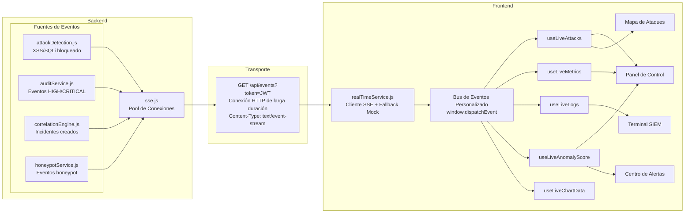
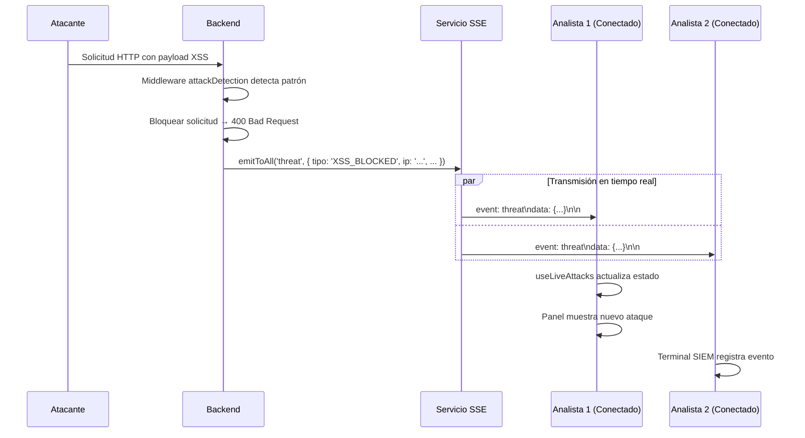

# Sistema de Eventos en Tiempo Real — RobenGate Sentinel

> **Clasificación:** INTERNO | **Protocolo:** Server-Sent Events (SSE)

---

## Resumen Ejecutivo

RobenGate Sentinel implementa un **pipeline de eventos de seguridad en tiempo real** utilizando Server-Sent Events (SSE), que transmite alertas de amenazas, métricas de riesgo, incidentes, eventos de honeypot y puntuaciones de anomalía a todos los analistas SOC conectados sin latencia perceptible. A diferencia de WebSockets, SSE es unidireccional (servidor→cliente), compatible con HTTP/1.1 y no requiere configuración especial de proxy o firewall.

Este sistema de tiempo real transforma la experiencia SOC de una revisión periódica de logs a una **monitorización de seguridad en tiempo real**, permitiendo tiempos de respuesta a incidentes medidos en segundos en lugar de minutos.

---

## 1. Visión General

RobenGate Sentinel usa **Server-Sent Events (SSE)** como protocolo de comunicación en tiempo real entre el backend y el frontend. SSE fue elegido sobre WebSockets por:

- **Simplicidad:** Compatible con HTTP/1.1, sin handshake de actualización WebSocket
- **Compatibilidad con firewalls:** Usa HTTP estándar — sin configuración especial de proxy requerida
- **Reconexión automática:** Integrada en la API EventSource
- **Unidireccional:** Los eventos de seguridad solo fluyen servidor → cliente (no se necesita canal bidireccional)
- **Compatible con JWT:** Puede pasar token de autenticación como parámetro de consulta

---

## 2. Arquitectura SSE



---

## Descripción Técnica

### 3. Implementación SSE del Backend (`sse.js`)

#### 3.1 Gestión de Conexiones

```javascript
// Registro de conexiones
conexiones: Map<userId, Map<connectionId, { res, role, connectedAt }>>

// Añadir nueva conexión SSE
addConnection(userId, role, res)
  → Establecer cabeceras: Content-Type: text/event-stream, Cache-Control: no-cache
  → Enviar comentario keepalive inicial (: keepalive\n\n)
  → Registrar en mapa de conexiones
  → Programar ping keepalive cada 20s
  → Al cerrar: eliminar del mapa de conexiones

// Eliminar conexión
removeConnection(userId, connectionId)
  → Eliminar del mapa de conexiones
```

#### 3.2 Emisión de Eventos

```javascript
// Transmitir a todas las conexiones analyst+
emitToAll(evento, datos)
  → Iterar mapa de conexiones
  → Filtrar: rango de rol ≥ analyst (rango 3)
  → Escribir frame SSE a cada conexión

// Apuntar a usuario específico
emitToUser(userId, evento, datos)
  → Encontrar conexión por userId
  → Escribir frame SSE a esa conexión

// Formato de frame SSE:
event: amenaza\n
data: {"tipo":"XSS_BLOCKED","ip":"185.220.101.42","severidad":"HIGH",...}\n\n
```

#### 3.3 Mecanismo Keep-Alive

Cada 20 segundos, se envía un comentario keep-alive a cada conexión:
```
: keepalive\n\n
```

Esto previene que proxies (Nginx, balanceadores de carga) cierren conexiones inactivas por timeout.

#### 3.4 Endpoint SSE (`GET /api/events`)

```
Autenticación: JWT pasado como parámetro de consulta (?token=...)
  → No se puede usar cabecera Authorization en la API EventSource (limitación del navegador)
  → El middleware authenticate() acepta parámetro de consulta solo para este endpoint

Cabeceras de respuesta:
  Content-Type: text/event-stream
  Cache-Control: no-cache, no-transform
  X-Accel-Buffering: no  (Nginx: deshabilitar buffering de respuesta)
  Connection: keep-alive
```

---

## 4. Tipos de Eventos

### 4.1 Referencia de Canal de Eventos

| Nombre del Evento | Campo `event:` | Emitido Por | Audiencia |
|------------------|---------------|-----------|---------|
| `amenaza` | `threat` | attackDetection, auditService | Todos analyst+ |
| `metrica` | `metric` | loggingService, authService | Todos analyst+ |
| `incidente` | `incident` | correlationEngine | Todos analyst+ |
| `honeypot` | `honeypot` | honeypotService | Todos analyst+ |
| `siem` | `siem` | auditService | Todos analyst+ |
| `anomalia` | `anomaly` | riskEngine | Todos analyst+ |
| `fuerza_bruta` | `brute_force` | correlationEngine | Todos analyst+ |
| `prohibicion` | `ban` | banService | Todos analyst+ |

### 4.2 Esquemas de Payload de Eventos

#### Evento `amenaza`
```json
{
  "id": "uuid",
  "tipo": "XSS_BLOCKED",
  "ip": "185.220.101.42",
  "pais": "RU",
  "severidad": "HIGH",
  "endpoint": "/api/auth/login",
  "metodo": "POST",
  "payload": "<script>...",
  "timestamp": "2026-05-28T12:34:56.789Z",
  "tacticaMitre": "Acceso Inicial",
  "tecnicaMitre": "T1190"
}
```

#### Evento `metrica`
```json
{
  "totalAtaques": 1247,
  "bloqueados": 1182,
  "sesionesActivas": 8,
  "puntuacionRiesgo": 42,
  "timestamp": "2026-05-28T12:34:56.789Z"
}
```

#### Evento `incidente`
```json
{
  "id": 15,
  "titulo": "Ataque de Fuerza Bruta desde 185.220.101.42",
  "severidad": "HIGH",
  "estado": "nuevo",
  "etiquetas": ["Fuerza Bruta", "AUTH"],
  "creadoEn": "2026-05-28T12:34:56.789Z"
}
```

#### Evento `anomalia`
```json
{
  "puntuacion": 72,
  "nivel": "HIGH",
  "componentes": {
    "tasaAtaques": 0.35,
    "riesgoPromedio": 0.42,
    "tasaFallos": 0.28
  },
  "timestamp": "2026-05-28T12:34:56.789Z"
}
```

---

## Flujo Operacional

### 5. Flujo de Evento End-to-End



---

## Casos de Uso

### Caso 1: Monitorización SOC 24/7

Tres analistas están conectados al panel. Un ataque de fuerza bruta comienza a las 03:17 UTC. En menos de 1 segundo, todos los paneles de analistas muestran el nuevo evento de ataque, la puntuación de anomalía sube, y el Terminal SIEM muestra el stream en vivo. Sin necesidad de actualizar la página o polling manual.

### Caso 2: Alerta Crítica Inmediata

El motor de correlación detecta un patrón de ataque multivector (honeypot + auth). Crea un incidente CRITICAL y emite un evento SSE. Todos los analistas conectados reciben la notificación en tiempo real con el título del incidente, severidad y IP de origen, permitiendo respuesta inmediata.

### Caso 3: Panel de Puntuación de Anomalía en Vivo

El indicador de riesgo del panel de control muestra la puntuación de anomalía actualizada cada 30 segundos via SSE. Durante una campaña de ataque activa, el indicador sube de BAJO (15) a ALTO (72) en tiempo real, alertando al equipo SOC sin necesidad de intervención manual.

---

## Beneficios para una Empresa

| Beneficio | Descripción |
|-----------|-------------|
| **Tiempo de Detección <1 seg** | Los eventos se transmiten en tiempo real a todos los analistas |
| **Sin Polling** | Elimina el overhead de refresh periódico de la página |
| **Escalable** | SSE usa conexiones HTTP estándar, compatible con cualquier balanceador |
| **Contexto Completo** | Cada evento incluye detalles completos de ataque y contexto MITRE |
| **Colaboración SOC** | Todos los analistas ven los mismos eventos simultáneamente |

---

## Seguridad

- **Autenticación JWT**: Todas las conexiones SSE requieren token válido
- **Autorización por rol**: Solo analyst+ recibe transmisiones de eventos
- **Keep-alive seguro**: Los comentarios SSE no exponen datos
- **Rotación de conexión**: Las conexiones se cierran limpiamente en logout/expiración de token

---

## Integraciones

- **Motor de Detección de Ataques** → Emite eventos `threat` en tiempo real
- **Servicio de Auditoría** → Emite eventos HIGH/CRITICAL como `siem`
- **Motor de Correlación** → Emite nuevos incidentes como eventos `incident`
- **Servicio Honeypot** → Emite capturas de honeypot como eventos `honeypot`
- **Motor de Riesgo** → Emite actualizaciones de puntuación de anomalía cada 30s

---

## Roadmap

| Capacidad | Estado |
|-----------|--------|
| **Notificaciones push del navegador** para eventos críticos | Planificado |
| **Integración con Slack/Teams** para alertas SSE | Planificado |
| **WebSocket** para canales bidireccionales futuros | Futuro |
| **Persistencia de eventos** en Service Worker | Futuro |

---

*Ver también: [../siem/resumen.md](../siem/resumen.md) | [../backend/resumen.md](../backend/resumen.md) | [../incident-management/resumen.md](../incident-management/resumen.md)*
