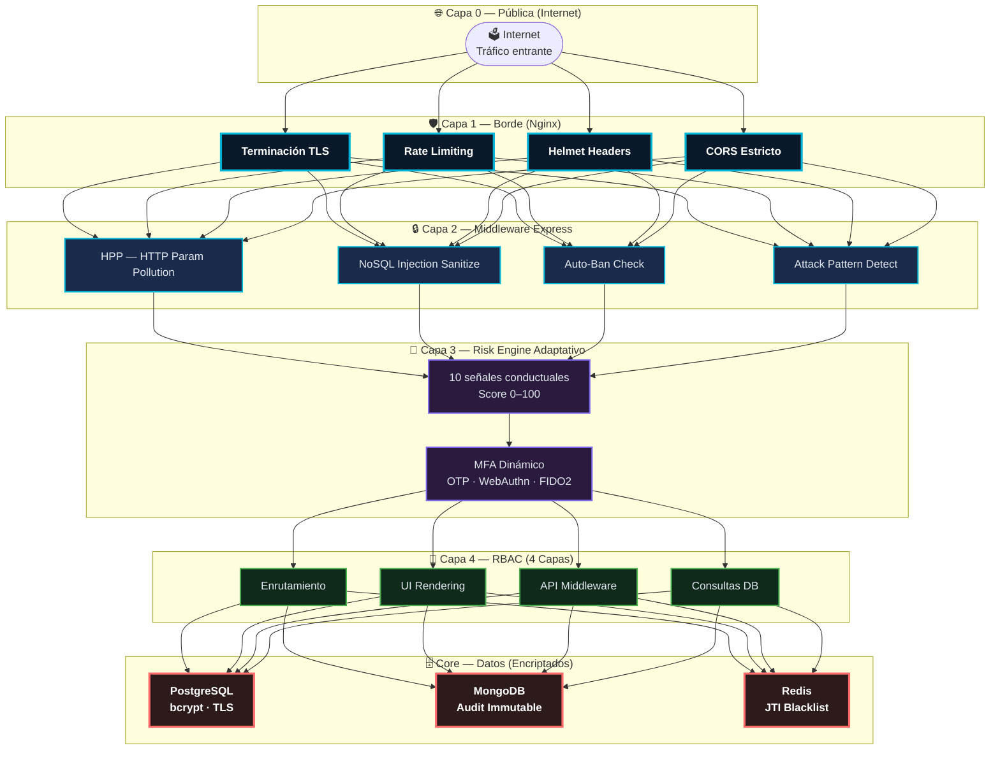
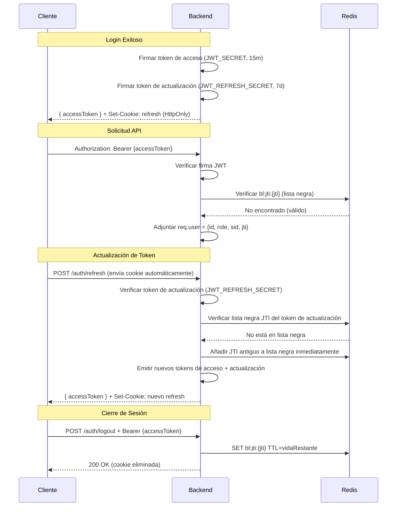
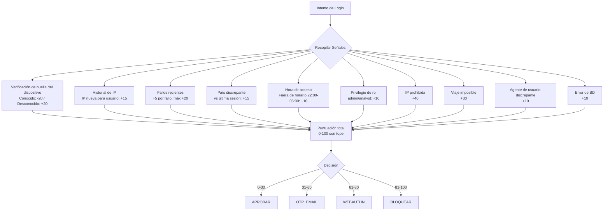
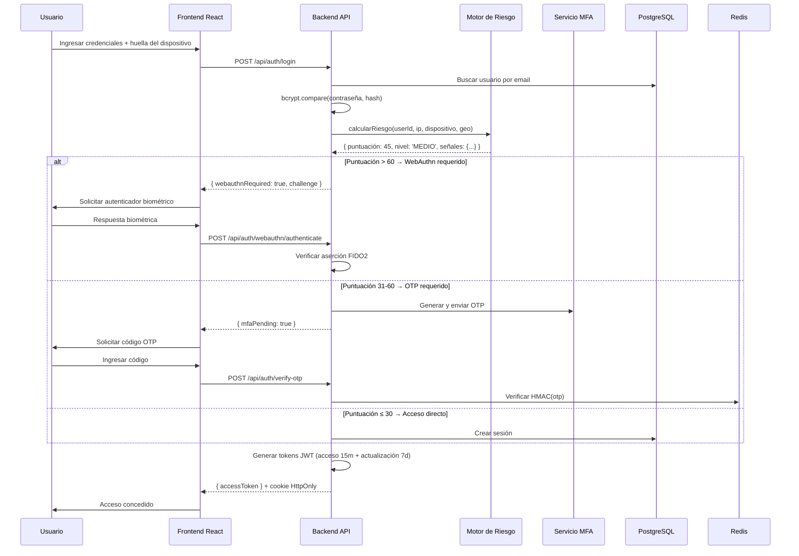

# Seguridad y Autenticación — RobenGate Sentinel

> **Clasificación:** INTERNO | **Cumplimiento:** OWASP Top 10, NIST SP 800-63B

---

## Resumen Ejecutivo

RobenGate Sentinel implementa una arquitectura de seguridad **Confianza Cero con Defensa en Profundidad** que supera los requisitos de autenticación de nivel empresarial. La plataforma soporta **cuatro factores de autenticación** (contraseña, OTP por email/SMS, TOTP, WebAuthn/Passkey FIDO2), gestión de sesiones con tokens de doble rotación, y un Motor de Riesgo adaptativo con 10 señales conductuales que ajusta dinámicamente los requisitos de autenticación según el nivel de amenaza detectado.

Esta arquitectura cumple o supera los controles requeridos por **SOC 2 Tipo II**, **ISO 27001 Annex A**, **NIST SP 800-63B** y **GDPR**.

---

## 1. Visión General de la Arquitectura de Seguridad

RobenGate Sentinel implementa una arquitectura de seguridad de **Confianza Cero y Defensa en Profundidad**. Cada solicitud se trata como potencialmente hostil hasta que es autenticada y autorizada. Los controles de seguridad operan en múltiples capas independientes, de modo que el fallo de cualquier capa individual no compromete el sistema.



---

## Descripción Técnica

### 2. Sistema de Autenticación

#### 2.1 Seguridad de Contraseñas

- **Algoritmo:** bcrypt con factor de trabajo configurable (predeterminado: 12 rondas)
- **Mínimo en producción:** 12 rondas ≈ 300ms de tiempo de hash
- **Comparación en tiempo constante:** Incluso cuando el usuario no existe, se realiza una comparación ficticia para prevenir enumeración de usuarios por timing
- **Requisitos de contraseña** (aplicados por `validate.js`):
  - Mínimo 12 caracteres
  - Al menos 1 letra mayúscula
  - Al menos 1 letra minúscula
  - Al menos 1 dígito
  - Al menos 1 carácter especial (`!@#$%^&*()_+-=[]{}|;':",.<>?`)

#### 2.2 Arquitectura de Token JWT



**Reclamaciones JWT:**
```json
{
  "sub": "42",
  "role": "analyst",
  "sid": "uuid-sesion-id",
  "jti": "uuid-token-id",
  "type": "access",
  "iss": "robengate-sentinel",
  "iat": 1716900000,
  "exp": 1716900900
}
```

**Requisitos de seguridad:**
- `JWT_SECRET` y `JWT_REFRESH_SECRET` **deben ser valores diferentes** (ALTO-01)
- Los secretos deben tener al menos 32 bytes de aleatoriedad criptográfica en producción
- La reclamación `type` impide que los tokens de actualización se usen como tokens de acceso

#### 2.3 Autenticación Multifactor (MFA)

RobenGate Sentinel soporta cuatro canales MFA:

##### OTP por Email

```
1. Generar código de 6 dígitos mediante crypto.randomInt(100000, 999999)
2. Calcular HMAC-SHA256(código, OTP_HMAC_KEY) → almacenar en Redis (TTL 300s)
3. Enviar código en texto plano por email (dispara y olvida)
4. Verificar: calcular HMAC del código enviado, comparar con crypto.timingSafeEqual
5. Eliminar clave Redis atómicamente en éxito (previene doble gasto)
```

**Seguridad:** El OTP real nunca se almacena — solo su HMAC. La comparación segura en tiempo previene ataques de oráculo.

##### OTP por SMS

- Mismo flujo que OTP por email
- Entrega vía API REST de Twilio (opcional — recurre al email si no está configurado)
- Número de teléfono almacenado en perfil del usuario (formato E.164 normalizado)

##### TOTP (Aplicaciones Autenticadoras)

```
1. Generar secreto TOTP base32 mediante otplib.authenticator.generateSecret()
2. Crear URI de clave RFC 6238: otpauth://totp/RobenGate:{email}?secret=...
3. Mostrar código QR al usuario (frontend renderiza QR desde URI)
4. Usuario escanea con app Autenticadora (Google Auth, Authy, 1Password, etc.)
5. Usuario confirma con código actual de 6 dígitos
6. Almacenar totp_secret en tabla users tras confirmación
7. Verificación: otplib.authenticator.verify({token, secret, window: 1})
   → Tolerancia ±30s (1 paso de tiempo) para deriva de reloj
```

##### WebAuthn / Passkey (FIDO2)

```
Registro:
  1. Backend genera desafío (32 bytes aleatorios, base64url)
  2. Cachear desafío en Redis (clave usuario, TTL 120s)
  3. Frontend llama navigator.credentials.create(registrationOptions)
  4. Autenticador de plataforma (Face ID, Windows Hello, YubiKey)
     firma el desafío con clave privada
  5. Backend verifica atestación con @simplewebauthn/server
  6. Almacenar credential_id + clave_pública + sign_count en webauthn_credentials

Autenticación:
  1. Backend genera desafío + lista IDs de credenciales permitidas para el usuario
  2. Cachear desafío en Redis (TTL 120s)
  3. Frontend llama navigator.credentials.get(authOptions)
  4. Autenticador de plataforma firma el desafío
  5. Backend verifica aserción: firma + incremento de sign_count
  6. Detección de clonación: si nuevo_sign_count <= sign_count_almacenado → alertar + rechazar
  7. Actualizar sign_count en base de datos
```

**Tipos de transporte soportados:** USB (YubiKey), NFC, BLE, Interno (plataforma: Face ID, Windows Hello, Touch ID)

##### Códigos de Respaldo

```
Generación:
  8 códigos × hex de 10 caracteres (formato XXXXX-XXXXX)
  Cada código hasheado con bcrypt (factor 10 — ALTO-04)
  Almacenados en mfa_backup_codes, mostrados UNA VEZ al usuario, nunca más

Verificación:
  Iterar los 8 códigos no usados, bcrypt.compare cada uno (O(8) acotado)
  Marcar código coincidente como usado atómicamente
  Advertir al usuario cuando quedan < 3 códigos
```

---

## Arquitectura

### 3. Motor de Riesgo

#### 3.1 Puntuación de Señales

El motor de riesgo evalúa **10 señales conductuales** para calcular una puntuación de riesgo (0–100) para cada intento de login:



---

## Flujo Operacional

### Flujo de Autenticación Completo



---

## Casos de Uso

| Escenario | Señales Activadas | Decisión | Resultado |
|-----------|------------------|---------|-----------|
| Login normal desde dispositivo conocido, horario laboral | Ninguna | APROBAR (0) | Acceso inmediato |
| Login desde IP nueva, fuera de horario | IP Nueva +15, Fuera de Horario +10 | OTP_EMAIL (25) | Requiere código email |
| Admin desde país diferente, dispositivo nuevo | País +15, Dispositivo +20, Admin +10 | WEBAUTHN (45) | Requiere biometría |
| Login con 6 fallos previos + IP prohibida | Fallos +20, IP Prohibida +40 | BLOQUEAR (60+) | Acceso denegado + alerta |
| Viaje imposible detectado | Viaje Imposible +30 + otras | BLOQUEAR | Incidente auto-creado |

---

## Seguridad

### Controles de Seguridad Implementados

| Control | Implementación | Estándar |
|---------|---------------|----------|
| **Almacenamiento de Contraseñas** | bcrypt rondas 12 | NIST 800-63B |
| **Tokens Seguros** | JWT con JTI + lista negra Redis | OWASP JWT |
| **MFA Resistente a Phishing** | WebAuthn FIDO2 | NIST AAL3 |
| **Protección contra Timing** | crypto.timingSafeEqual en todos los flujos | OWASP |
| **Fijación de Sesión** | Nueva JTI en cada actualización de token | OWASP |
| **Seguridad de Transporte** | TLS 1.3, HSTS, cabeceras seguras | OWASP |
| **Limitación de Tasa** | 200 req/15min por IP (Redis) | NIST |
| **Huella de Dispositivo** | SHA-256 de 12 señales del navegador | Defensa en Profundidad |

---

## Integraciones

- **Redis** — Lista negra de JTI para invalidación inmediata de tokens
- **PostgreSQL** — Almacenamiento de sesiones, dispositivos, credenciales WebAuthn
- **MaxMind GeoLite2** — Geolocalización de IP para señales de riesgo
- **Twilio** — Entrega de SMS MFA
- **SMTP** — Entrega de email OTP
- **Motor de Riesgo** — Evaluación de riesgo en tiempo real en cada login

---

## Escalabilidad

| Componente | Estrategia |
|-----------|-----------|
| Servicio JWT | Sin estado → escala horizontal ilimitada |
| Lista Negra de Tokens | Redis Cluster para alta disponibilidad |
| Sesiones | Almacenadas en PostgreSQL con índices optimizados |
| Motor de Riesgo | Sin estado → paralelizable |

---

## Roadmap

| Capacidad | Estado |
|-----------|--------|
| Política de contraseñas configurable por organización | Planificado |
| Inicio de sesión único (SSO) SAML 2.0 / OIDC | Planificado |
| Análisis de riesgo continuo post-login | Planificado |
| Autenticación sin contraseña completa (solo Passkey) | Futuro |
| Integración con proveedores de identidad empresariales | Futuro |

---

*Ver también: [../ai-analysis/resumen.md](../ai-analysis/resumen.md) | [../rbac/resumen.md](../rbac/resumen.md) | [../audit-system/resumen.md](../audit-system/resumen.md)*
