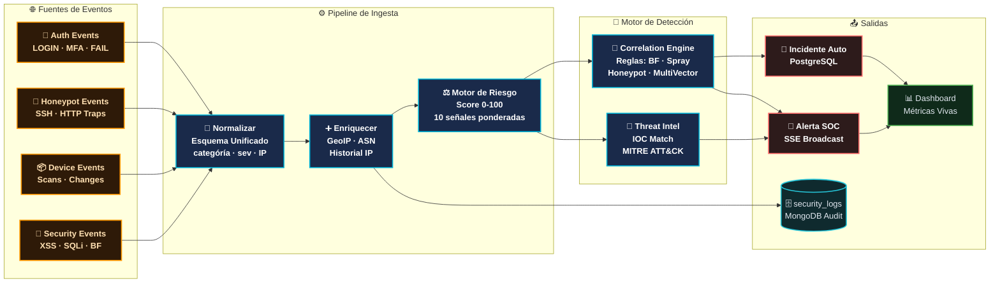

# Motor de Detección y Correlación — RobenGate Sentinel

**Módulos:** `backend/src/services/detectionEngine.js`, `correlationEngine.js`  
**Versión:** 2.0 | **Fecha:** Junio 2026

---

## Motor de Detección

El **Detection Engine** aplica reglas predefinidas contra el stream de eventos normalizados para generar alertas en tiempo real.

### Categorías de Reglas

| Categoría | Descripción | Severidad Base |
|---|---|---|
| `auth.brute_force` | >5 intentos fallidos/min/IP | HIGH |
| `auth.off_hours` | Login fuera del horario histórico | MEDIUM |
| `auth.impossible_travel` | Mismo usuario, IPs geográficamente imposibles | CRITICAL |
| `network.port_scan` | >20 puertos únicos en <1min | MEDIUM |
| `network.known_bad_ip` | IP en blacklist de threat intel | HIGH |
| `injection.sql` | Patrón SQL injection en parámetros | CRITICAL |
| `injection.nosql` | Operadores MongoDB en input | HIGH |
| `injection.command` | Shell metacaracteres detectados | CRITICAL |
| `data.bulk_access` | >100 registros en <5min | HIGH |
| `data.sensitive_access` | Acceso a rutas restringidas | HIGH |
| `privilege.escalation` | Cambio de rol de usuario | HIGH |
| `honeypot.attack` | Cualquier conexión al honeypot | Variable |

### Estructura de una Regla

```javascript
const rules = {
  'auth.brute_force': {
    name: 'Brute Force Authentication',
    description: 'Multiple failed login attempts from same IP',
    
    // Condición de disparo
    condition: async (event, context) => {
      const failures = await redis.get(`failures:${event.ip}`);
      return parseInt(failures || 0) >= 5;
    },
    
    // Datos de la alerta generada
    alert: (event) => ({
      title: `Brute force desde ${event.ip}`,
      severity: 'high',
      category: 'auth.brute_force',
      recommendation: 'Revisar y banear IP si continúa'
    }),
    
    // Acción automática
    action: async (event, alertId) => {
      await soarEngine.triggerPlaybook('brute_force_response', event);
    }
  }
};
```

---

## Motor de Correlación

El **Correlation Engine** agrupa alertas relacionadas para identificar ataques coordinados y reducir el ruido de alertas individuales.

### Estrategias de Correlación



### Ventanas de Correlación

| Ventana | Duración | Descripción |
|---|---|---|
| Short | 1 min | Correlación muy rápida (ráfagas) |
| Standard | 15 min | Correlación estándar |
| Long | 1 hora | Ataques lentos y sigilosos |
| Session | Duración sesión | Durante toda la sesión del atacante |

---

## Métricas Expuestas (Prometheus)

```promql
# Total de alertas por severidad
sentinel_alerts_total{severity="critical"}

# Tasa de creación de incidentes
rate(sentinel_incidents_created_total[5m])

# Correlaciones activas
sentinel_correlation_windows_active

# Reglas evaluadas por segundo
rate(sentinel_detection_rules_evaluated_total[1m])

# Falsos positivos marcados
sentinel_false_positives_total
```

---

## Configuración de Umbrales

Los umbrales son configurables por organización en la tabla `organization_settings`:

```sql
-- Ver umbrales actuales
SELECT key, value FROM organization_settings 
WHERE key LIKE 'detection.%';

-- Ejemplos de configuración
-- detection.brute_force.threshold = 5  (intentos)
-- detection.brute_force.window = 60    (segundos)
-- detection.correlation.min_alerts = 3 (para crear incidente)
-- detection.correlation.window = 900   (segundos = 15min)
```
