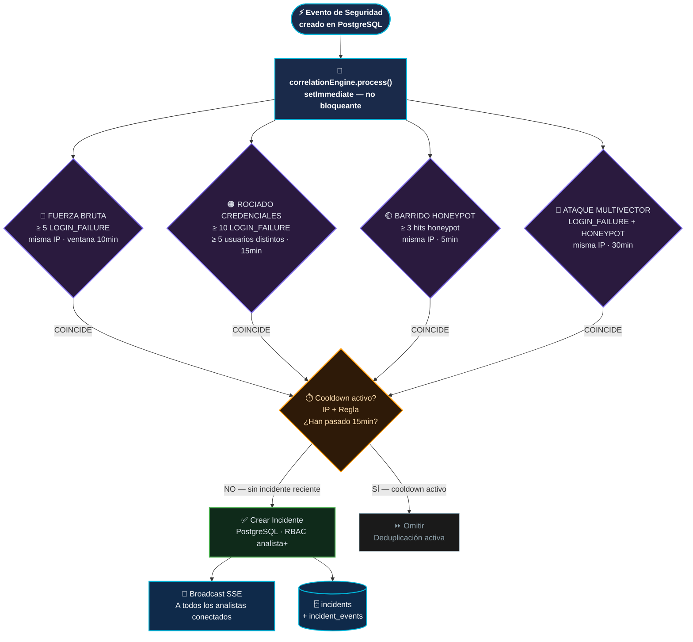

# SIEM y Operaciones SOC — RobenGate Sentinel

> **Clasificación:** INTERNO | **Nivel de Capacidad:** Plataforma SOC Nivel 2

---

## Resumen Ejecutivo

RobenGate Sentinel funciona como una plataforma **SIEM (Security Information and Event Management)** de nivel empresarial que unifica la recopilación de eventos de seguridad, correlación, análisis, caza de amenazas y respuesta a incidentes en una única interfaz. La plataforma está alineada con el **Marco de Ciberseguridad NIST CSF** y proporciona capacidades SOC comparables a soluciones comerciales como Microsoft Sentinel, Splunk y Elastic Security.

A diferencia de las soluciones SIEM tradicionales que requieren agentes complejos y pipelines de ingesta costosos, RobenGate Sentinel integra la recopilación de eventos directamente en la pila de la aplicación, proporcionando visibilidad inmediata sin overhead de instrumentación adicional.

---

## 1. Plataforma como Centro de Operaciones de Seguridad (SOC)

RobenGate Sentinel funciona como una plataforma **SOC** que consolida la recopilación de eventos de seguridad, correlación, análisis, caza de amenazas y respuesta a incidentes en una única interfaz. La plataforma proporciona capacidades comparables a soluciones SIEM comerciales:

| Función SOC | Implementación |
|------------|----------------|
| **Recopilación de Eventos** | PostgreSQL security_logs + registro de auditoría MongoDB |
| **Normalización de Eventos** | Esquema estructurado con categoría/acción/severidad |
| **Monitorización en Tiempo Real** | Flujo de eventos en vivo SSE hacia paneles de analistas |
| **Correlación** | `correlationEngine.js` — coincidencia de patrones multi-regla |
| **Alertas** | Eventos de seguridad convertidos automáticamente → cola de alertas |
| **Gestión de Incidentes** | Ciclo de vida completo: nuevo → en_progreso → contenido → resuelto |
| **Inteligencia de Amenazas** | Base de datos IOC MongoDB con mapeo MITRE ATT&CK |
| **Caza de Amenazas** | Herramientas de investigación orientadas por hipótesis |
| **Análisis Forense** | Registro de auditoría inmutable, reproducción de sesión, visualización geo |
| **Informes** | KPIs del panel, endpoints de estadísticas, logs exportables |

---

## 2. Alineación con el Marco NIST CSF


---

## Descripción Técnica

### 3. Recopilación y Normalización de Eventos

#### 3.1 Esquema de Eventos de Seguridad

Todos los eventos de seguridad se normalizan en un esquema consistente antes del almacenamiento:

```json
{
  "category":       "THREAT",
  "action":         "XSS_BLOQUEADO",
  "severity":       "HIGH",
  "userId":         "42",
  "userEmail":      "analyst@corp.io",
  "ipAddress":      "185.220.101.42",
  "countryCode":    "RU",
  "userAgent":      "Mozilla/5.0...",
  "endpoint":       "/api/auth/login",
  "method":         "POST",
  "statusCode":     400,
  "mitreTactic":    "Acceso Inicial",
  "mitreTechnique": "T1190",
  "ioc":            "185.220.101.42",
  "metadata": {
    "payload":    "<script>alert(1)</script>",
    "blockedAt":  "input.body.username"
  },
  "timestamp": "2026-05-28T12:34:56.789Z"
}
```

#### 3.2 Categorías de Eventos

| Categoría | Descripción | Acciones de Ejemplo |
|-----------|-------------|---------------------|
| `AUTH` | Eventos de autenticación | `LOGIN_SUCCESS`, `LOGIN_FAILURE`, `MFA_FAILED`, `OTP_VERIFIED`, `LOGOUT` |
| `ACCESS` | Eventos de autorización | `ACCESS_DENIED`, `RATE_LIMITED`, `IP_BANNED`, `READONLY_BLOCKED` |
| `THREAT` | Eventos de ataque activo | `XSS_BLOCKED`, `SQLI_BLOCKED`, `ATTACK_PATTERN_SUSPICIOUS` |
| `HONEYPOT` | Eventos de la capa de engaño | `HONEYPOT_SSH_AUTH`, `HONEYPOT_HTTP_TRAP`, `HONEYPOT_HTTP_PROBE` |
| `ADMIN` | Acciones administrativas | `USER_ROLE_CHANGED`, `ACCOUNT_LOCKED`, `USER_DELETED` |
| `DATA` | Eventos de acceso a datos | `EXPORT_PERFORMED`, `BULK_QUERY`, `REPORT_GENERATED` |
| `SYSTEM` | Eventos de salud de la plataforma | `SERVER_START`, `DB_CONNECTION_FAILED` |

#### 3.3 Niveles de Severidad

| Severidad | Puntuación | Criterios | Respuesta |
|-----------|-----------|---------|-----------|
| `CRITICAL` | 5 | Explotación activa, compromiso de cuenta, acceso desde IP prohibida | Alerta SOC inmediata |
| `HIGH` | 4 | Ataque bloqueado, hit de honeypot, pico de fallos MFA | Revisión del analista en 15min |
| `MEDIUM` | 3 | Login fallido, acceso denegado, patrón sospechoso | Revisión en 1 hora |
| `LOW` | 2 | Limitado por tasa, patrón de acceso inusual | Revisión diaria |
| `INFO` | 1 | Autenticación exitosa, operaciones rutinarias | Solo registro |

---

## Arquitectura

### 4. Motor de Correlación de Eventos SIEM

#### 4.1 Reglas de Correlación

El `correlationEngine.js` procesa eventos de seguridad y aplica reglas de detección para crear incidentes automáticamente:



#### 4.2 Detalles de Reglas de Correlación

##### Regla 1: Detección de Fuerza Bruta
```
Disparador: ≥5 eventos LOGIN_FAILURE de la misma IP en 10 minutos
Severidad: HIGH (5-9 eventos) o CRITICAL (10+ eventos)
Título del incidente: "Ataque de Fuerza Bruta desde {IP}"
Etiquetas: ["Fuerza Bruta", "AUTH"]
MITRE: Técnica T1110 (Fuerza Bruta)
```

##### Regla 2: Rociado de Credenciales
```
Disparador: ≥10 eventos LOGIN_FAILURE dirigidos a ≥5 cuentas de usuario distintas en 15 minutos
Severidad: CRITICAL
Título del incidente: "Rociado de Credenciales Detectado"
Etiquetas: ["Rociado de Credenciales", "AUTH", "Múltiples Objetivos"]
MITRE: Técnica T1110.003 (Rociado de Contraseñas)
```

##### Regla 3: Barrido de Honeypot
```
Disparador: ≥3 eventos honeypot (intentos SSH o hits de trampa HTTP) de la misma IP en 5 minutos
Severidad: HIGH
Título del incidente: "Barrido de Honeypot desde {IP}"
Etiquetas: ["Honeypot", "Reconocimiento"]
MITRE: Táctica TA0043 (Reconocimiento)
```

##### Regla 4: Ataque Multivector
```
Disparador: Eventos LOGIN_FAILURE + eventos HONEYPOT de la misma IP en 30 minutos
Severidad: CRITICAL
Título del incidente: "Ataque Multivector desde {IP}"
Etiquetas: ["Multivector", "Ataque Auth", "Honeypot"]
MITRE: Múltiples tácticas
```

---

## Flujo Operacional

### 5. Flujo de Trabajo del Analista SOC

```mermaid
flowchart LR
    classDef step fill:#1A2A4A,stroke:#00B4D8,stroke-width:2px,color:#FFFFFF,font-weight:bold
    classDef crit fill:#2D1B1B,stroke:#FF6B6B,stroke-width:2px,color:#FFE0B2,font-weight:bold
    classDef done fill:#0F2A1A,stroke:#4CAF50,stroke-width:2px,color:#E2E8F0

    MON["📡 MONITORIZAR\nDashboard SSE\nAlertas en vivo"]:::step
    TRI["🔍 TRIAJE\nEvaluar señales\nContexto de riesgo"]:::step
    INV["🕵️ INVESTIGAR\nThreat Hunting\nPivote IOC"]:::crit
    CON["🚫 CONTENER\nIP Ban\nRevocar sesión"]:::crit
    DOC["📝 DOCUMENTAR\nTimeline incidente\nEvidencia forense"]:::step
    CLO["✅ CERRAR\nActualizar IOC DB\nAjustar reglas SIEM"]:::done

    MON -->|"alerta detectada"| TRI
    TRI -->|"confirmar amenaza"| INV
    INV -->|"amenaza real"| CON
    CON -->|"amenaza neutralizada"| DOC
    DOC -->|"lecciones aprendidas"| CLO
    CLO -.->|"mejora continua"| MON
```



---

## Casos de Uso

### Caso 1: Respuesta a Ataque de Fuerza Bruta (Tiempo Medio de Detección < 1 min)

1. Múltiples fallos de login desde 185.220.101.42 comienzan a las 02:14 UTC
2. Motor de correlación detecta patrón FUERZA_BRUTA a los 5 fallos (02:17 UTC)
3. Incidente auto-creado: severidad HIGH, etiqueta T1110
4. Alerta transmitida vía SSE a todos los analistas conectados
5. Motor de riesgo sube puntuación para esa IP → próximos intentos BLOQUEADOS
6. IP auto-prohibida tras alcanzar umbral de prohibición

### Caso 2: Detección de Rociado de Credenciales

1. IP china (203.0.113.42) intenta login con diferentes usuarios (1-2 intentos por cuenta)
2. Motor de correlación detecta ROCIADO_CREDENCIALES: 10 fallos, 6 usuarios distintos en 12 min
3. Incidente CRITICAL creado automáticamente
4. SOC recibe alerta en tiempo real
5. Analista investiga: sin logins exitosos, IP añadida a IOC DB
6. Respuesta: prohibición permanente de IP + revisión de cuentas objetivo

### Caso 3: Investigación Forense Post-Incidente

1. Incidente cerrado: "Acceso no Autorizado"
2. Analista usa Caza de Amenazas para reconstruir timeline
3. Pivote de IOC: todas las actividades de la IP atacante durante 7 días
4. Timeline reconstruido: reconocimiento honeypot → fuerza bruta → login exitoso → acceso a datos
5. Evidencia forense exportada para informe de auditoría

---

## Beneficios para una Empresa

| Beneficio | Descripción |
|-----------|-------------|
| **Reducción del Tiempo de Detección** | Detección automatizada en <1 min vs horas en revisión manual |
| **Cobertura 24/7** | Alertas en tiempo real independientemente del horario del analista |
| **Cumplimiento Normativo** | Logs inmutables con TTL 365 días para auditorías SOC 2/ISO 27001 |
| **Escalado de Respuestas** | Reglas de correlación escalan decisiones de nivel 1 |
| **Visibilidad Completa** | Panel unificado de todo el estado de seguridad |

---

## Seguridad

- **Logs inmutables**: Los registros MongoDB solo pueden insertarse, nunca modificarse (hook pre-save)
- **Correlación no bloqueante**: `setImmediate()` asegura que el procesamiento de eventos no bloquea la API
- **Deduplicación**: Período de enfriamiento de 15 min previene tormenta de incidentes
- **Acceso basado en roles**: Viewers pueden ver logs, solo Analyst+ puede exportar

---

## Integraciones

| Sistema | Integración | Tipo |
|---------|-------------|------|
| PostgreSQL | Almacenamiento de incidentes y alertas | Bidireccional |
| MongoDB | Almacenamiento de logs de seguridad (solo lectura desde SIEM) | Lectura |
| Redis | Caché de reglas de correlación y contadores | Lectura/Escritura |
| SSE | Transmisión en tiempo real a paneles de analistas | Emisión |
| Motor de Riesgo | Señales de riesgo alimentan el pipeline de eventos | Entrada |
| Honeypot | Eventos de engaño hacia pipeline SIEM | Entrada |

---

## Roadmap

| Capacidad | Estado |
|-----------|--------|
| **Reglas de correlación personalizables** | Planificado |
| **Integración con AbuseIPDB** para enriquecimiento de IP | Planificado |
| **Exportación de alertas a JIRA/ServiceNow** | Planificado |
| **Playbooks SOAR automatizados** | Futuro |
| **Federación de logs de otros SIEMs** | Futuro |
| **Motor de detección basado en ML** | Futuro |

---

*Ver también: [../threat-intelligence/resumen.md](../threat-intelligence/resumen.md) | [../incident-management/resumen.md](../incident-management/resumen.md) | [../threat-hunting/resumen.md](../threat-hunting/resumen.md)*
