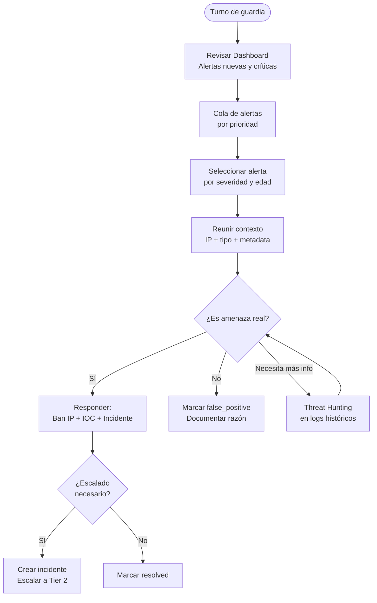

# Guía SOC — Investigación de Alertas

**Rol mínimo:** `viewer` (lectura) / `responder` (actualización)  

---

## Flujo de Trabajo del Analista SOC



---

## Priorización de Alertas

Atender siempre en este orden:

| Prioridad | Criterio | Tiempo máximo de respuesta |
|---|---|---|
| 🔴 P1 | critical + new | < 15 minutos |
| 🟠 P2 | high + new | < 1 hora |
| 🟡 P3 | critical/high + investigating | < 4 horas |
| 🟢 P4 | medium + new | < 24 horas |
| ⚪ P5 | low/info | Best effort |

---

## Investigación de una Alerta — Pasos Detallados

### 1. Leer la alerta

```bash
# Ver detalle de una alerta específica
GET /api/logs/58432
# O desde la lista con filtros
GET /api/alerts?severity=critical&status=new
```

Campos clave a revisar:
- **event_type** — ¿Qué tipo de ataque?
- **ip_address** — ¿De dónde viene?
- **country_code** — ¿País esperado?
- **metadata** — Payload, endpoint objetivo, user_agent
- **created_at** — ¿Cuándo?

### 2. Investigar la IP

```bash
# Lookup IOC — ¿IP conocida en amenazas?
GET /api/search/ioc/185.220.101.44

# Historial de eventos de esa IP
GET /api/logs?ip=185.220.101.44&from=<6h_ago>

# ¿Está baneada?
GET /api/logs?ip=185.220.101.44&event_type=IP_BANNED
```

**Señales de peligro:**
- IP en MongoDB ThreatIndicator → mayor confianza que es amenaza real
- Múltiples tipos de ataque en corto tiempo → actor avanzado
- User-agent de herramienta conocida (sqlmap, nuclei, python-requests)
- IP de país inusual para la organización

### 3. Determinar el impacto

```bash
# ¿La IP tuvo acceso exitoso?
GET /api/logs?ip=185.220.101.44&event_type=LOGIN_SUCCESS

# ¿Qué endpoints visitó?
GET /api/logs?ip=185.220.101.44&limit=100
# Ver metadata.endpoint en cada log
```

### 4. Tomar acción

**Falso positivo (IP legítima):**
```bash
PATCH /api/alerts/58432/status
{"status": "false_positive"}
```

**Amenaza real — containment:**
```bash
# 1. Marcar como investigating
PATCH /api/alerts/58432/status {"status": "investigating"}

# 2. Banear IP
POST /internal/ban
{"ip": "185.220.101.44", "reason": "Confirmed attacker - SQLi campaign"}

# 3. Reportar IOC
POST /api/threats/report
{"type": "IP", "value": "185.220.101.44", "severity": "HIGH", ...}

# 4. Marcar como resolved (o crear incidente)
PATCH /api/alerts/58432/status {"status": "resolved"}
```

---

## Investigación por Tipo de Alerta

### BRUTE_FORCE_DETECTED

**Preguntas a responder:**
1. ¿Cuántos intentos en qué ventana de tiempo?
2. ¿Qué cuentas fueron objetivo?
3. ¿Tuvo éxito algún intento? (`event_type=LOGIN_SUCCESS` desde esa IP)
4. ¿La IP ya estaba en IOCs?

**Respuesta estándar:**
```bash
# Verificar éxito
GET /api/logs?ip=<ip>&event_type=LOGIN_SUCCESS

# Si hubo éxito → cuenta comprometida
# 1. Bloquear cuenta afectada
PATCH /api/users/<id>/lock {"locked": true}

# 2. Revisar qué hizo después del login
GET /api/audit?userId=<id>&from=<login_time>
```

### SQL_INJECTION_ATTEMPT

**Preguntas a responder:**
1. ¿Qué endpoint fue objetivo?
2. ¿Cuál fue el payload exacto?
3. ¿El status code fue 200 (éxito) o 403/500 (bloqueado)?
4. ¿Es el primer intento o hay historia de escaneo?

```bash
# Ver payload completo
GET /api/logs/58432
# metadata.payload, metadata.endpoint, metadata.status_code

# Escaneo previo desde la IP
GET /api/logs?ip=<ip>&from=<24h_ago>&limit=200
```

**Si el ataque tuvo éxito (status 200):**
→ Crear incidente CRÍTICO inmediatamente
→ Escalar a Tier 2
→ Iniciar forensia en el endpoint objetivo

### SUSPICIOUS_LOGIN

**Preguntas a responder:**
1. ¿El usuario reconoce este acceso? (llamar/email)
2. ¿La IP es un VPN o proxy conocido?
3. ¿El dispositivo es reconocido?

```bash
# Ver detalles del login
GET /api/logs/58432
# metadata.email, metadata.ip, metadata.country, metadata.device_fingerprint

# Historial del usuario
GET /api/audit?userId=<id>&category=AUTH&limit=20
```

### XSS_ATTEMPT

**Preguntas a responder:**
1. ¿Es XSS reflejado o almacenado?
2. ¿En qué parámetro/campo fue el intento?
3. ¿El WAF/sanitización lo bloqueó? (status != 200)

---

## Dashboard SOC — Lectura Eficiente

### Métricas Clave a Vigilar

| Métrica | Normal | Alerta |
|---|---|---|
| Events/min | < 100/min | > 500/min |
| Critical alerts new | 0 | > 0 |
| Risk score | < 50 | > 75 |
| Banned IPs (24h) | < 10 | > 50 |
| Failed logins (15min) | < 20 | > 100 |

### Indicadores de Campaña de Ataque

- Múltiples IPs del mismo /24 o /16 atacando → ataque coordinado
- Mismo user-agent en múltiples IPs → herramienta automatizada
- Patrón temporal regular (cada X segundos) → bot/script
- Múltiples tipos de ataques de misma IP → reconocimiento agresivo

---

## Atajos de Teclado (Frontend)

| Atajo | Acción |
|---|---|
| `Ctrl/Cmd + K` | Command Palette — búsqueda rápida |
| `Alt + A` | Ir a Alerts |
| `Alt + L` | Ir a Security Logs |
| `Alt + I` | Ir a Incidents |
| `Alt + T` | Ir a Threat Intelligence |
