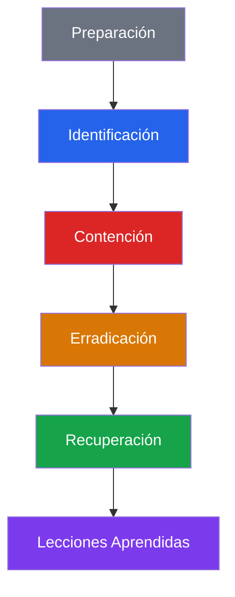

# Guía SOC — Investigación de Incidentes

**Rol requerido:** `responder+` (respuesta) / `analyst+` (creación)  

---

## Fases de Respuesta a Incidentes



---

## Fase 1: Identificación

### Fuentes de Identificación

| Fuente | Cómo detectar |
|---|---|
| Alertas automáticas | Dashboard → Alerts (severity=critical, status=new) |
| SSE real-time | Notificación en tiempo real en el frontend |
| Correlación IA | Dashboard → AI Analysis → Anomaly Stream |
| Honeypot | Dashboard → Honeypot → Eventos masivos |
| Playbook SOAR | El motor SOAR puede crear incidentes automáticamente |
| Reporte manual | Usuario informa de comportamiento sospechoso |

### Criterios para Crear un Incidente

Crear incidente cuando:
- ✅ Múltiples alertas correlacionadas del mismo origen
- ✅ SQLi exitoso (status 200)
- ✅ Cuenta comprometida confirmada
- ✅ Servicio de producción degradado
- ✅ Exfiltración de datos sospechada
- ✅ Malware detectado en endpoint
- ❌ Alerta única de baja severidad → triaje en Alerts, no incidente

---

## Fase 2: Contención

### Contención Inmediata (< 30 minutos)

**Bloquear IP atacante:**
```bash
POST /internal/ban
X-Internal-Secret: <secret>
{"ip": "185.220.101.44", "reason": "Active attack - Incident #24"}
```

**Bloquear cuenta comprometida:**
```bash
PATCH /api/users/42/lock {"locked": true}
```

**Aislar endpoint (EDR):**
```bash
POST /api/agents/agent-abc123/isolate
{"isolate": true, "reason": "Malware detected - Incident #24"}
```

**Revocar sesiones activas:**
```bash
# El usuario o admin revoca desde la UI
DELETE /api/sessions/all  # Revoca todas las sesiones del usuario
```

### Actualizar Estado del Incidente

```bash
PATCH /api/incidents/24
{
  "status": "contained",
  "summary": "UPDATED [14:30]: Source IP 185.220.101.44 blocked. Affected account user#42 locked. Endpoint laptop-01 isolated."
}
```

---

## Fase 3: Erradicación

### Verificar Que La Amenaza Está Eliminada

```bash
# Verificar que no hay más eventos de la IP
GET /api/logs?ip=185.220.101.44&from=<containment_time>&limit=10
# Si hay eventos post-contención → la contención no fue efectiva

# Verificar que el endpoint está aislado
GET /api/agents/agent-abc123
# {"isolated": true, "status": "offline"}
```

### Erradicación Específica por Tipo

**Credential compromise:**
- Forzar reset de contraseña del usuario
- Revocar todos los refresh tokens
- Revocar credenciales WebAuthn si sospecha de phishing

**Malware:**
- Aislar endpoint via EDR
- Imagen forense antes de remediar
- Reinstalar sistema operativo si es necesario
- Cambiar credenciales usadas desde ese endpoint

**SQLi:**
- Parchear el endpoint vulnerable
- Verificar logs de BD por queries no autorizados
- Restaurar datos si hubo modificación

---

## Fase 4: Recuperación

### Restaurar Servicios

```bash
# Desbloquear usuario tras verificar que está limpio
PATCH /api/users/42/lock {"locked": false}

# Restaurar agente del aislamiento
POST /api/agents/agent-abc123/isolate {"isolate": false}

# Desbanear IP si era legítima (false positive de contención)
DELETE /internal/ban/185.220.101.44
```

### Verificación Post-Recuperación

```bash
# Verificar que el sistema está operativo
GET /health

# Verificar que no hay nuevas alertas desde la amenaza
GET /api/alerts?severity=critical&status=new

# Monitorizar 24-48h después de la recuperación
```

### Actualizar Incidente

```bash
PATCH /api/incidents/24
{
  "status": "resolved",
  "summary": "RESOLVED [16:00]: Threat eliminated. Account unlocked after password reset. Endpoint restored after malware removal. No further indicators of compromise."
}
```

---

## Fase 5: Lecciones Aprendidas

### Mover a Post-Review

```bash
PATCH /api/incidents/24
{"status": "post_review"}
```

### Template de Post-Mortem

```markdown
# Post-Incident Review — Incidente #24

## Resumen
- Fecha: 2026-06-01
- Duración: 2 horas (14:00 - 16:00)
- Tipo: SQL Injection Campaign
- Severidad: Critical
- Impacto: Endpoint comprometido, 0 registros exfiltrados

## Timeline
- 14:00 — Primera alerta SQL_INJECTION_ATTEMPT detectada
- 14:05 — Analista Ana García investiga la alerta
- 14:15 — Confirmado SQLi exitoso (status 200)
- 14:30 — IP bloqueada, cuenta aislada
- 14:45 — Incidente creado, Tier 2 notificado
- 15:00 — Root cause identificada: endpoint sin validación en param 'id'
- 15:30 — Parche desplegado
- 16:00 — Servicio restaurado y monitorizado

## Root Cause
Parámetro 'id' en /api/users no sanitizado correctamente. Validación Zod no aplicada en este endpoint específico.

## Acciones Tomadas
1. Bloqueada IP atacante 45.148.10.22
2. Parche desplegado en endpoint /api/users
3. IOC reportado en Threat Intelligence

## Lecciones Aprendidas
1. Verificar que TODOS los endpoints tienen validación Zod aplicada
2. Implementar test de integración para SQL injection en CI/CD
3. El playbook de auto-ban necesita threshold menor para SQLi

## Mejoras de Detección
- Añadir regla: cualquier SQLi exitoso (status 200) crea incidente automáticamente
- Reducir tiempo de respuesta para alertas SQL_INJECTION de 30min a 5min
```

---

## Métricas de Respuesta a Incidentes

| Métrica | Definición | Objetivo |
|---|---|---|
| MTTI (Mean Time to Identify) | Tiempo hasta crear el incidente | < 30 min |
| MTTC (Mean Time to Contain) | Tiempo hasta contener la amenaza | < 2h |
| MTTR (Mean Time to Resolve) | Tiempo total hasta resolución | < 24h |
| MTTPR (Post-Review) | Tiempo hasta completar post-review | < 1 semana |
| Dwell Time | Tiempo que el atacante estuvo activo | < 1h (objetivo) |
